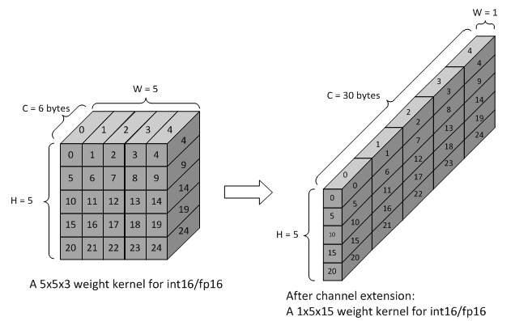
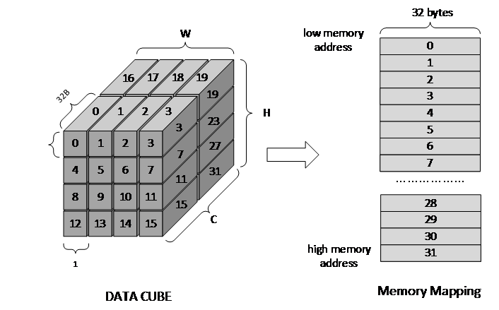

Data Formats
============

Overview
--------

DLA engine supports various types of CNN layers like convolution layer,
pooling, ReLU, LRN, etc. To improve the performance DLA engine also
applies some options like Winograd, weight compression and multi-batch
mode. To support these layers DLA engine uses specified input and output
data formats.

There are two main types of input formats. They are weight data and
activation data. The weight formats include below branches:

-  weight for direct convolution

-  weight for image input

-  weight for Winograd convolution

Two options for weight formats:

-  channel post-extension for image input mode

-  sparse compression

The activation formats supported by DLA engine includes:

-  feature data format

-  pixel format (ROI input)

The output formats supported by DLA engine includes:

-  feature data format

Besides, DLA engine will fetch below auxiliary formats from external
memory

-  bias data

-  PReLU data

-  batch-normalization data

-  element-wise data

Channel extension refers to a set of mapping rule for both weight data
and activation data to fit with accelerator. It includes:

-  Channel extension for Winograd convolution

-  Channel pre-extension for image input mode

-  Channel post-extension for image input mode

The channel post-extension for image input mode is an option for
performance. Other two are mandatory for their working mode. HW handles
all channel extension on feature/pixel data, while SW shall do channel
extension to weight data accordingly.

All data formats should be mapping in memory with rules.

Precision Type
~~~~~~~~~~~~~~

NVDLA engine pipeline support three types of data precision. They are
int8, int16 and fp16. For int8, one element of data refers to an 8-bit
signed integer. For int16, one element refers to a 16-bit signed
integer. For fp16, one element refers to a 16-bit floating point data,
which is also named as half-precision floating-point format.

All input feature data should belong to one of three precision types.
And all image input data will be converted to one precision type before
calculation. For example, DLA engine can take a T_R10G10B10A2 image as
input (for first layer) and convert the component to int8, int16 or
fp16.

Feature Data Format
-------------------

DLA engine maintains a private data format for all supported HW-layers.
The data format is called feature data format. This format is only
generated by DLA engine itself.

All elements of feature data for one layer are organized as a 3D data
cube. Three dimensions are width (W), height (H) and channel size (C).
The memory mapping rules are:

-  Adding data into end of channel if the original data is not 32byte
   aligned in C direction.

-  The attached data can be any value except NaN when it’s fp16.

-  Split the data cube into 1x1x32byte small atom cubes.

-  Reordering atom cubes in by progressively scanning the data cube.
   Scanning order: W (line) -> H (height) -> C (channel).

-  Map all atom cubes into memory by scanning sequence.

-  All atom cubes in the same line are mapped compactly.

-  Atom cube mapping at line boundary and/or surface boundary can be
   either adjacently or incompactly. But they are always 32-byte
   aligned.

-  In conclusion, mapping in memory follows pitch linear format. The
   order is C’ (32byte) -> W -> H -> C (surfaces). Here C’ changes
   fastest and C changes slowest.

:numref:`fig_packed_feature_diagram` is a case of feature data that all small cubes are mapped
compactly. This is called packed feature data. If the line or surface of
small cubes is not mapped compactly, it is called unpacked. See :numref:`fig_unpacked_feature_diagram`.

**Line stride and surface stride of feature data shall always align to
32bytes. Start address has same alignment as well. This is mandatory
requirement.**

..
  image1

.. _fig_packed_feature_diagram:

.. figure:: format_packed_feature_diagram.svg
  :align: center

  Packed feature data

..
  image2

.. _fig_unpacked_feature_diagram:

.. figure:: format_unpacked_feature_diagram.svg
  :align: center

  Unpacked feature data

If a 1x1xC feature data cube maps as surface-packed, NVDLA can treat it
like (C/32) x1x 32 cube to save bandwidth.

Mapping of feature data cube is done by NVDLA core logic. Falcon does
not involve in mapping procedures.

Pixel Format
------------

DLA engine supports pixel data for ROI. The pixel data comes from a part
or a whole image. The pixel formats are listed in table :numref:`tab_pixel_formats`.

When NVDLA takes image as input data, there are some limits of
configuration.

-  Channel size. The valid channel size highly depends on each format.
   Please see table :numref:`tab_pixel_formats`.

-  Input precision. The input precision highly depends on pixel each
   format. Please see table :numref:`tab_pixel_formats`. DMA logic will turn unsigned integer
   value to signed integer value automatically.

-  **Both start address and line stride of pitch linear shall aligned to
   32 bytes. This is mandatory requirement.**

-  It may have redundant data between 32-byte aligned address and first
   element. NVDLA use x offset to indicate how many redundant data are.
   The unit of offset is pixel.

.. table:: Pixel formats and valid setting
 :name: tab_pixel_formats

 +-------------+-------------+-------------+-------------+-------------+
 | Format Name | # of planar | Valid       | Valid input | Valid X     |
 |             |             | channel     | precision   | offset      |
 |             |             | size        | setting     | range       |
 |             |             | setting     |             |             |
 +=============+=============+=============+=============+=============+
 | T_R8        | 1           | 1           | int8        | 0~31        |
 +-------------+-------------+-------------+-------------+-------------+
 | T_R10       | 1           | 1           | int16       | 0~15        |
 +-------------+-------------+-------------+-------------+-------------+
 | T_R12       | 1           | 1           | int16       | 0~15        |
 +-------------+-------------+-------------+-------------+-------------+
 | T_R16       | 1           | 1           | int16       | 0~15        |
 +-------------+-------------+-------------+-------------+-------------+
 | T_R16_I     | 1           | 1           | int16       | 0~15        |
 +-------------+-------------+-------------+-------------+-------------+
 | T_R16_F     | 1           | 1           | int16       | 0~15        |
 +-------------+-------------+-------------+-------------+-------------+
 | T_A16B16G16 | 1           | 4           | int16       | 0~3         |
 | R16         |             |             |             |             |
 +-------------+-------------+-------------+-------------+-------------+
 | T_X16B16G16 | 1           | 4           | int16       | 0~3         |
 | R16         |             |             |             |             |
 +-------------+-------------+-------------+-------------+-------------+
 | T_A16B16G16 | 1           | 4           | fp16        | 0~3         |
 | R16_F       |             |             |             |             |
 +-------------+-------------+-------------+-------------+-------------+
 | T_A16Y16U16 | 1           | 4           | int16       | 0~3         |
 | V16         |             |             |             |             |
 +-------------+-------------+-------------+-------------+-------------+
 | T_V16U16Y16 | 1           | 4           | int16       | 0~3         |
 | A16         |             |             |             |             |
 +-------------+-------------+-------------+-------------+-------------+
 | T_A16Y16U16 | 1           | 4           | fp16        | 0~3         |
 | V16_F       |             |             |             |             |
 +-------------+-------------+-------------+-------------+-------------+
 | T_A8B8G8R8  | 1           | 4           | int8        | 0~7         |
 +-------------+-------------+-------------+-------------+-------------+
 | T_A8R8G8B8  | 1           | 4           | int8        | 0~7         |
 +-------------+-------------+-------------+-------------+-------------+
 | T_B8G8R8A8  | 1           | 4           | int8        | 0~7         |
 +-------------+-------------+-------------+-------------+-------------+
 | T_R8G8B8A8  | 1           | 4           | int8        | 0~7         |
 +-------------+-------------+-------------+-------------+-------------+
 | T_X8B8G8R8  | 1           | 4           | int8        | 0~7         |
 +-------------+-------------+-------------+-------------+-------------+
 | T_X8R8G8B8  | 1           | 4           | int8        | 0~7         |
 +-------------+-------------+-------------+-------------+-------------+
 | T_B8G8R8X8  | 1           | 4           | int8        | 0~7         |
 +-------------+-------------+-------------+-------------+-------------+
 | T_R8G8B8X8  | 1           | 4           | int8        | 0~7         |
 +-------------+-------------+-------------+-------------+-------------+
 | T_A2B10G10R | 1           | 4           | int16       | 0~7         |
 | 10          |             |             |             |             |
 +-------------+-------------+-------------+-------------+-------------+
 | T_A2R10G10B | 1           | 4           | int16       | 0~7         |
 | 10          |             |             |             |             |
 +-------------+-------------+-------------+-------------+-------------+
 | T_B10G10R10 | 1           | 4           | int16       | 0~7         |
 | A2          |             |             |             |             |
 +-------------+-------------+-------------+-------------+-------------+
 | T_R10G10B10 | 1           | 4           | int16       | 0~7         |
 | A2          |             |             |             |             |
 +-------------+-------------+-------------+-------------+-------------+
 | T_A2Y10U10V | 1           | 4           | int16       | 0~7         |
 | 10          |             |             |             |             |
 +-------------+-------------+-------------+-------------+-------------+
 | T_V10U10Y10 | 1           | 4           | int16       | 0~7         |
 | A2          |             |             |             |             |
 +-------------+-------------+-------------+-------------+-------------+
 | T_A8Y8U8V8  | 1           | 4           | int8        | 0~7         |
 +-------------+-------------+-------------+-------------+-------------+
 | T_V8U8Y8A8  | 1           | 4           | int8        | 0~7         |
 +-------------+-------------+-------------+-------------+-------------+
 | T_Y8___U8V8 | 2           | 3           | int8        | 0~31        |
 | _N444       |             |             |             |             |
 +-------------+-------------+-------------+-------------+-------------+
 | T_Y8___V8U8 | 2           | 3           | int8        | 0~31        |
 | _N444       |             |             |             |             |
 +-------------+-------------+-------------+-------------+-------------+
 | T_Y10___U10 | 2           | 3           | int16       | 0~15        |
 | V10_N444    |             |             |             |             |
 +-------------+-------------+-------------+-------------+-------------+
 | T_Y10___V10 | 2           | 3           | int16       | 0~15        |
 | U10_N444    |             |             |             |             |
 +-------------+-------------+-------------+-------------+-------------+
 | T_Y12___U12 | 2           | 3           | int16       | 0~15        |
 | V12_N444    |             |             |             |             |
 +-------------+-------------+-------------+-------------+-------------+
 | T_Y12___V12 | 2           | 3           | int16       | 0~15        |
 | U12_N444    |             |             |             |             |
 +-------------+-------------+-------------+-------------+-------------+
 | T_Y16___U16 | 2           | 3           | int16       | 0~15        |
 | V16_N444    |             |             |             |             |
 +-------------+-------------+-------------+-------------+-------------+
 | T_Y16___V16 | 2           | 3           | int16       | 0~15        |
 | U16_N444    |             |             |             |             |
 +-------------+-------------+-------------+-------------+-------------+

Weight Format
-------------

Unlike pixel data or feature data, weight data are generated long before
convolution operation. And DLA engine never changes them during
operation. Software should map weight data with property rules to fit
with the calculation sequence in DLA.

The original weight data has 4 dimensions: width, height, channel and
number of kernels. They can construct as a group of 3D data cubes. One
data cube is called a kernel. See :numref:`fig_original_weight_data`.

DLA engine support 4 types of weight data. They are weight for direct
convolution, weight for Winograd convolution, weight for image input and
weight for deconvolution. There are two options for weight to improve
DLA performance: sparse compression and channel post-extension.

DLA engine support 4 basic formats of weight data for different
operation mode:

-  weight for direct convolution

-  weight for image input

-  weight for deconvolution

-  weight for Winograd convolution

There are some mandatory requirements for some formats:

-  channel pre-extension for image input

-  channel extension for Winograd

-  Set split for deconvolution

And two options for weight formats:

-  channel post-extension

-  sparse compressing

.. table:: Weight formats and options
 :name: tab_weight_formats

 +--------------------------+---------------------------+-----------------------+
 | Weight types             | Sparse compression option | Post-extension option |
 +==========================+===========================+=======================+
 | Weight for DC            | Support                   | **NOT support**       |
 +--------------------------+---------------------------+-----------------------+
 | Weight for Winograd      | Support                   | **NOT support**       |
 +--------------------------+---------------------------+-----------------------+
 | Weight for image input   | Support                   | Support               |
 +--------------------------+---------------------------+-----------------------+
 | Weight for deconvolution | Support                   | **NOT support**       |
 +--------------------------+---------------------------+-----------------------+

..
  image3

.. _fig_original_weight_data:

.. figure:: format_original_weight_data.svg
  :scale: 55%
  :align: center

  Original weight data

Basic Weight for Direct Convolution
~~~~~~~~~~~~~~~~~~~~~~~~~~~~~~~~~~~

Basic weight for direct convolution is the most basic and common weight
format. Other weight formats are all extended from this format.

The mapping rules of uncompressed weight for direct convolution are:

-  Distribute the kernels into groups. For int16 and fp16 weight, one
   group has 16 kernels. For int8, one group has 32 kernels. Last group
   can have fewer kernels.

-  Divide each kernel to 1x1x64-element small cubes. For int16/fp16 the
   small cube is 128 bytes each; and for int8 the small cube is 64 bytes
   each. Do not append 0 if channel size is not divisible by 128/64.

-  After division, all weights are stored in 1x1xC’ small cubes, where
   C’ is no more than 128 bytes.

-  Scan the 1x1xC’ small cubes in a group with C’->K->W->H->C sequence.
   Here C’ changes fastest and C changes slowest. And map them compactly
   as scanning sequence.

-  Map the weight groups compactly. Do not append any 0s between group
   boundaries.

-  Append 0s at end of all mapped weight for 128-byte alignment.

Diagram below shows how a group of 3x3x192Byte kernel maps for direct
convolution.

..
  image4

.. _fig_dc_weight_mapping:

.. figure:: format_dc_weight_mapping.svg
  :scale: 55%
  :align: center

  Weight mapping for direct convolution inside one group

Basic Weight for image input
~~~~~~~~~~~~~~~~~~~~~~~~~~~~

Weight mapping for image input is like weight for direct convolution.
The main difference is that image weight needs an additional channel
extension step ahead of mapping steps for direct convolution weight.

The channel pre-extension for image weight is a mandatory requirement,
while channel post-extension is an option to improve performance.

**Notice: Channel pre-extension for image weight is different from
channel extension for Winograd convolution.**

The key idea of per-extension is to turn all weights in same line to a
single channel. :numref:`fig_dc_channel_extension_for_image_for_weight` 
is a case for an int16 image input whose channel size is 3.

..
  image5

.. _fig_dc_channel_extension_for_image_for_weight:

  Channel extension for image weight

Channel pre-extension is the first step for image weight. Then all
extended kernels follow the same steps of weight for direct convolution.
That is, SW still need to do group and channel distribution after
channel extension.

Basic Weight for Winograd Convolution
~~~~~~~~~~~~~~~~~~~~~~~~~~~~~~~~~~~~~

The memory mapping of Winograd weight is very different from direct
convolution. There are two phases to process the weights. Phase 1 is to
do channel extension and conversion for each kernel. Phase 2 is to group
the kernels and map small cubes in memory.

Steps of phase 1:

-  Divide kernels to 1x1x32Byte small cubes. If the channel size is not
   divisible by 32, append 0s.

-  Do channel extension in if convolution stride is not 1. The new width
   and height of a kernel should be 3 after extension.

-  Convert the kernel from 3x3xC cube to a 4x4xC cube. The equation is
   GWGT. Here W is each 4x4x1 of weight cube, G is a 4 x 3 matrix and GT
   is transpose matrix.

-  During conversion, a scaling factor may involve. Please see section
   7.1.4 for reference.

-  The width and height of a kernel should be 4 after conversion.

.. math::

   G = \begin{bmatrix}
   1 & 0 & 0 \\
   0.5 & 0.5 & 0.5 \\
   0.5 & - 0.5 & 0.5 \\
   0 & 0 & 1 \\
   \end{bmatrix}

Matrix for weight transfer for Winograd

Steps of phase 2:

-  Distribute the converted kernels into groups. For int16 and fp16
   weight, one group has 16 kernels. For int8, one group has 32 kernels.

-  Divide converted kernels to 4x4x4 elements small cubes. For
   int16/fp16 small cube is 128 bytes each. For int8 small cube is 64
   bytes each. The channel size should always divisible by 4.

-  Scan the 4x4x4 elements small cubes in a group with K->C sequence.
   Take int16 for example, the scan order is small cube 0 of K0, small
   cube 0 of K1, small cube 0 of K2, …, small cube 0 of K15, small cube
   1 of K0, small cube 1 of K1, …, small cube 1 of K15, …, small cube N
   of K15.

-  Maps the 4x4x4 elements small cubes closely with scanning order

-  Maps the weight groups one by one closely

The phase 2 is similar to weight for direct convolution except the small
cube size is 4x4x4 elements.

Figure below shows how to do channel extension to one kernel and map the
data.

..
  image6

.. _fig_channel_extension_and_conversion_for_wingorad:

.. figure:: format_channel_extension_and_conversion_for_wingorad.svg
  :align: center

  Channel extension and conversion for Winograd

Weight Channel Post-extension for image input
~~~~~~~~~~~~~~~~~~~~~~~~~~~~~~~~~~~~~~~~~~~~~

Weight channel post-extension is an option to enhance MAC efficiency
when channel size is less than 32. It is available for image input mode
only.

Key idea of channel post-extension is to combine two neighbor lines to
saving the efficiency. It allows two-line (C<=32) or four-line (C<=16)
combination. 1, 2 and 4 parameters are available.

If this option is enabled, NVDLA manage to post-extend input feature (or
image) data in CSC sub units. And SW needs to adjust weight mapping
order.

The channel post-extension is done after pre-extension. Figure below
shows one case which parameter is 2.

..
  image7

.. _fig_weight_channel_post_extension_2:

.. figure:: format_weight_channel_post_extension_2.svg
  :align: center

  Weight channel post-extension, parameter = 2

Flow of pre-extension, post-extension, mapping and compression option
for image weight:

-  Do pre-extension

-  Do post-extension

-  Remap weight data

-  Do weight compression.

Some tips for post-extension:

-  Channel post-extension cannot be used in Winograd convolution

-  Channel post-extension only support 2-line and 4-line.

-  If weight height is not divisible by 2 (2-lines) or 4 (4-lines), do
   NOT append 0s. This is unlike channel extension for Winograd.

Sparse Compression option
~~~~~~~~~~~~~~~~~~~~~~~~~

To reduce the bandwidth and power consumption on memory interface, NVDLA
engine support weight sparse compression option. All four weight formats
can support sparse compression. This option requires additional steps
after basic mapping and post-extension option.

Sparse algorithm uses one-bit tag to indicate a weight element is zero
or not. Bit tags of one kernel group compose a weight mask bit group, or
WMB. WMBs reside in a dedicate memory surface. Since 0 values are marked
by bit tags (assign 0 to corresponding bit), they can be removed from
original weight memory surface. A third memory surface recodes remaining
byte number of each kernel group (WGS).

The steps of weight compression are:

-  Always use 1 bit to indicate 1 element of weight. For int16 and fp16,
   1 bit represents 2 bytes of weight data; for int8, 1 bit represents 1
   byte of weight data.

-  Compress weight group by group. Assembly of bits for one weight group
   is called WMB. The bits in WMB are stored as little-endian.

-  Align WMB surface to 128-byte by adding 0 bits in the end

-  Remove all 0 weights in original surface and pack them compactly.

-  Align compressed weight surface to 128-byte by adding 0s in the end.

-  Calculate the byte number of each compressed group. The remaining
   byte number of each group is called weight group size or WGS. One WGS
   is of 32-bit wise.

-  Store WGS, WMB and compressed weight into three separated memory
   surfaces.

The diagram below shows the memory mapping of compressed weight format.

..
  image8

.. _fig_memory_mapping_of_compressed_weight:

.. figure:: format_memory_mapping_of_compressed_weight.svg
  :align: center

  Memory mapping of compressed weight

Bias Data Format
----------------

Bias data is another optional input data for convolution layers. When
this option is enabled, DLA engine will add the bias data to result of
convolution before writing back to memory.

There are three types of bias data,

-  Per layer bias data

-  Per channel bias data

-  Per element bias data

They both store in memory for DLA engine to fetch.

If the output feature data cube is WxHxC, check below table for the
corresponding bias cube size:

+-------------+------------------+
| Per Layer   | 1x1x1 (Register) |
+=============+==================+
| Per Channel | 1x1xC            |
+-------------+------------------+
| Per Element | WxHxC            |
+-------------+------------------+

For INT pipeline, bias data can be either INT8 or INT16, and FP16 type
of bias data is in16-bit fp16 format. They are generated along with CNN
network.

The memory mapping of bias data is described as below:

**Per Channel:**

-  Two bytes per element with INT16/FP16 or 1 byte per element with INT8

..
  image9 Memory Mapping of Per Channel Bias Data (Case 1)

.. _fig_memory_mapping_of_per_channel_bias_data_case1:

.. figure:: format_memory_mapping_of_per_channel_bias_data_case1.svg
  :align: center

  Memory Mapping of Per Channel Bias Data (Case 1)

-  2 bytes per element with INT8:

..
  image10 Memory Mapping of Per Channel Bias Data (Case 2)

.. _fig_memory_mapping_of_per_channel_bias_data_case2:

.. figure:: format_memory_mapping_of_per_channel_bias_data_case2.svg
  :align: center

  Memory Mapping of Per Channel Bias Data (Case 2)

-  2 bytes per element with INT8:

**Per Element:**

-  Two bytes per element with INT16/FP16 or 1 byte per element with INT8

..
  image11 Memory Mapping of Per Element Bias Data (Case 1)

.. _fig_memory_mapping_of_per_element_bias_data_case1:

  Memory Mapping of Per Element Bias Data (Case 1)

-  2 bytes per element with INT8:

..
  image12 Memory Mapping of Per Element Bias Data (Case 2)

.. _fig_memory_mapping_of_per_element_bias_data_case2:

.. figure:: format_memory_mapping_of_per_element_bias_data_case2.svg
  :align: center

  Memory Mapping of Per Element Bias Data (Case 2)

PReLU Data Format
-----------------

Each PReLU data just have one component and it will be fed into
multiplier of SDP.

PReLU always operated per-channel thus there is only one type of PReLU
data:

-  Per channel PReLU data

Per channel PReLU data is stored in memory in a continuous 1x1xC space.
Be noted that C is in unit of channel.

-  For INT8/16, each channel can occupy 1 or 2 bytes depending on B/N/E
   RDMA_DATA_SIZE

-  In FP16 types, each channel need 2 bytes data

The memory mapping of PRelu data is described as below:

-  Two bytes per element with INT16/FP16 or 1 byte per element with INT8

..
  image13 Memory Mapping of Per Channel PReLU Data (Case 1)

.. _fig_memory_mapping_of_per_channel_prelu_data_case1:

.. figure:: format_memory_mapping_of_per_channel_prelu_data_case1.svg
  :align: center

  Memory Mapping of Per Channel PReLU Data (Case 1)

-  2 bytes per element with INT8:

..
  image14 Memory Mapping of Per Channel PReLU Data (Case 2)

.. _fig_memory_mapping_of_per_channel_prelu_data_case2:

.. figure:: format_memory_mapping_of_per_channel_prelu_data_case2.svg
  :align: center

  Memory Mapping of Per Channel PReLU Data (Case 2)

Batch Normalization Data Format
-------------------------------

Batch Normalization data is another optional input data for batch
normalization layers.

Each normalization data consists of two parts, one is to add onto the
feature data and the other is to multiple with the result after
addition.

There are two types of batch normalization data

-  Per channel batch normalization data

-  Per layer batch normalization data

Per channel batch normalization data is stored in memory in a continuous
1x1xC space. Be noted that C is in unit of channel.

-  In INT8/16 types, each of the two parts of normalization data can be
   either 1 byte or 2 bytes, so each channel need 2*1 or 2*2 bytes data

-  In FP16 types, each of the two parts of normalization data is 2 byte,
   so each channel need 4 bytes data

The pair data of each element are always packed together in memory. The
memory mapping of data is described as below:

-  Two bytes per element with INT16/FP16 or 1 byte per element with INT8

..
  image15 Memory Mapping of Batch Normalization Data (Case 1)

.. _fig_memory_mapping_of_batch_normalization_data_case1:

.. figure:: format_memory_mapping_of_batch_normalization_data_case1.svg
  :align: center

  Memory Mapping of Batch Normalization Data (Case 1)

-  2 bytes per element with INT8:

..
  image16 Memory Mapping of Batch Normalization Data (Case 2)

.. _fig_memory_mapping_of_batch_normalization_data_case2:

.. figure:: format_memory_mapping_of_batch_normalization_data_case2.svg
  :align: center

  Memory Mapping of Batch Normalization Data (Case 2)

Per layer batch normalization data is stored in register.

Be noted that INT8 and INT16 here means the processing precision, so
when the layer is running from INT16 to INT8 or INT8 to INT16 precision
conversion, batch normalization data need set to processing precision
which is always INT8.

Element-Wise Data Format
------------------------

Element-Wise data is another optional input data for Element-Wise
layers.

Each Element-Wise data consists of just one part and either for ALU or
multiplier.

There are one type of element-wise data

-  Per element Element-Wise data

Per element Element-Wise data is stored in memory with size of W x H x
C.

-  In INT8 /16types, each of the two parts of element-wise data can be
   either 1 byte or 2 bytes, so each element need 1/2 bytes data

-  In FP16 types, each of the two parts of element-wise data is 2 bytes,
   so each element need 2 bytes data

From algorithm perspective, element-wise employs ALU or MUL only but
never both, however, DLA hardware support employ both operations for
per-element operation, in this case, each element size should be x2 of
description above;

The memory mapping of data is described as below:

-  Two bytes per element with INT16/FP16 or 1 byte per element with INT8

..
  image17 Memory Mapping of Element-Wise Data (Case 1)

.. _fig_memory_mapping_of_element_wise_data_case1:

  Memory Mapping of Element Wise Data (Case 1)

-  2 bytes per element with INT8:

..
  image18 Memory Mapping of Element-Wise Data (Case 2)

.. _fig_memory_mapping_of_element_wise_data_case2:

.. figure:: format_memory_mapping_of_element_wise_data_case2.svg
  :align: center

  Memory Mapping of Element Wise Data (Case 2)

Be noted that INT8 and INT16 here means the processing precision, so
when the layer is running from INT16 to INT8 or INT8 to INT16 precision
conversion, Element-Wise data need set to processing precision which is
always INT8.

Normally, one atom contains 1x1x32Bytes data, but it’s no longer true
for:

-  Bias data format;

-  PReLU data format;

-  Batch normalization data format;

-  Element-wise data format

The bytes-per-atom for those formats should be computed by:

BytesPerAtom=ElementPerAtom \* ComponentsPerElement \* BytesPerComponent

Where ElementPerAtom is decided by PROC_PRECISION of SDP data pipeline:

+----------------+----------------+
| PROC_PRECISION | ElementPerAtom |
+================+================+
| INT8           | 32             |
+----------------+----------------+
| INT16/FP16     | 16             |
+----------------+----------------+

ComponentsPerElement is decided by use case (or DATA_USE register):

+-----------------------------------------+----------------------+
| Use case                                | ComponentsPerElement |
+=========================================+======================+
| Bias                                    | 1                    |
+-----------------------------------------+----------------------+
| PReLU                                   | 1                    |
+-----------------------------------------+----------------------+
| BatchNormalization                      | 2                    |
+-----------------------------------------+----------------------+
| Element-wise (Only ALU or MUL enabled)  | 1                    |
+-----------------------------------------+----------------------+
| Element-wise (Both ALU/MUL are enabled) | 2                    |
+-----------------------------------------+----------------------+

BytesPerComponent is decided by precision (or DATA_SIZE register)

+-----------+-------------------+
| DATA_SIZE | BytesPerComponent |
+===========+===================+
| ONE_BYTE  | 1                 |
+-----------+-------------------+
| TWO_BYTE  | 2                 |
+-----------+-------------------+

Alignment of Start Address and Stride
-------------------------------------

Here is the conclusion of requirements of alignment:

.. table:: Requirements of alignment
 :name: tab_requirements_of_alignment

 +----------+----------+----------+----------+----------+----------+
 | Data     | Alignmen | Alignmen | Alignmen | Alignmen | Alignmen |
 | format   | t        | t        | t        | t        | t        |
 |          | of start | of line  | of       | of       | of data  |
 |          | address  | stride   | surface  | planar/  | size     |
 |          |          |          | stride   | cube     |          |
 |          |          |          |          | stride   |          |
 +==========+==========+==========+==========+==========+==========+
 | Feature  | 32 bytes | 32 bytes | 32 bytes | 32 bytes | NA       |
 | data     |          |          |          |          |          |
 | cube     |          |          |          |          |          |
 +----------+----------+----------+----------+----------+----------+
 | uncompre | 256      | NA       | NA       | NA       | 128      |
 | ssed/    | bytes    |          |          |          | bytes    |
 | compress |          |          |          |          |          |
 | ed       |          |          |          |          |          |
 | weight   |          |          |          |          |          |
 +----------+----------+----------+----------+----------+----------+
 | WMB      | 256      | NA       | NA       | NA       | 128      |
 |          | bytes    |          |          |          | bytes    |
 +----------+----------+----------+----------+----------+----------+
 | WGS      | 256      | NA       | NA       | NA       | 128      |
 |          | bytes    |          |          |          | bytes    |
 +----------+----------+----------+----------+----------+----------+
 | Pitch    | 32 bytes | 32 bytes |          | NA       | NA       |
 | linear   |          |          |          |          |          |
 | pixel    |          |          |          |          |          |
 +----------+----------+----------+----------+----------+----------+
 | Bias     | 32 bytes | 32 bytes | 32 bytes | NA       | NA       |
 +----------+----------+----------+----------+----------+----------+
 | PReLU    | 32 bytes | N/A      | N/A      | NA       | NA       |
 +----------+----------+----------+----------+----------+----------+
 | Batch    | 32 bytes | NA       | NA       | NA       | NA       |
 | Normaliz |          |          |          |          |          |
 | ation    |          |          |          |          |          |
 +----------+----------+----------+----------+----------+----------+
 | Element- | 32 bytes | 32 bytes | NA       | NA       | 32bytes  |
 | wise     |          |          |          |          |          |
 +----------+----------+----------+----------+----------+----------+

Data file format
================

Feature data file (input_feature_map.dat)
-----------------------------------------

This data file contains input feature data or image for one HW layer.
Please refer to Section 1.1.2 for the format of 2D data.

Below table describes the fields in the header. The fields are optional
and informative.

+-----------------------------------+-----------------------------------+
| **Field**                         | **Description**                   |
+===================================+===================================+
| Data_size                         | Number of bytes of data in this   |
|                                   | data file.                        |
+-----------------------------------+-----------------------------------+
| Data_type                         | 0x25 (indicates feature data)     |
|                                   |                                   |
|                                   | Any value may be filled in the    |
|                                   | gap of adjacent lines or surfaces |
|                                   | if lines or surfaces are not      |
|                                   | packed.                           |
+-----------------------------------+-----------------------------------+
| Kernel_num                        | Can be ignored for feature data   |
|                                   | file.                             |
+-----------------------------------+-----------------------------------+
| W                                 | Cube width in element unit        |
+-----------------------------------+-----------------------------------+
| H                                 | Cube height in element unit       |
+-----------------------------------+-----------------------------------+
| C                                 | Cube channel number in element    |
|                                   | unit                              |
+-----------------------------------+-----------------------------------+
| Line_stride                       | Line stride, in bytes.            |
+-----------------------------------+-----------------------------------+
| Surface_stride                    | Surface stride, in bytes.         |
+-----------------------------------+-----------------------------------+
| Precision                         | Input data cube’s precision: one  |
|                                   | of INT8/INT16/FP16                |
+-----------------------------------+-----------------------------------+
| CRC                               | Can be ignored                    |
+-----------------------------------+-----------------------------------+

Weight/WGS/WMB data file
------------------------

This data file contains weight, wgs or wmb data. Please refer to Section
1.2 for the formats of them.

Below table describes the fields in the header. The fields are optional
and informative.

+------------+--------------------------------------------------+
| **Field**  | **Description**                                  |
+============+==================================================+
| Data_size  | Number of bytes of data in this data file        |
+------------+--------------------------------------------------+
| Data_type  | 0x2 (indicates weight data)                      |
+------------+--------------------------------------------------+
| Kernel_num | Number of kernels                                |
+------------+--------------------------------------------------+
| W          | Width in element unit of each kernel             |
+------------+--------------------------------------------------+
| H          | Height in element unit of each kernel            |
+------------+--------------------------------------------------+
| C          | Channel number in element unit of each kernel    |
+------------+--------------------------------------------------+
| Precision  | Input weight’s precision: one of INT8/INT16/FP16 |
+------------+--------------------------------------------------+
| CRC        | Can be ingored                                   |
+------------+--------------------------------------------------+

output_feature_map.dat
----------------------

Plain data dumped byte by byte from memory.

Endianness
----------

The data’s endianness is little-endian for INT16 and FP16.

Example:

    | Precision is INT16.
    | A line in input_feature_map.dat:
    |   Low
      address------------------------------------------------------------------------------------------High
      address
    |   0x02 0x00 0x04 0x00 0x02 0x00 0x04 0x00 0x02 0x00 0x04 0x00 0x02 0x00 0x04 0x00...
    | The values of the int16 elements: 0x0002, 0x0004, 0x0002, 0x0004, 0x0002, 0x0004, 0x0002, 0x0004...
