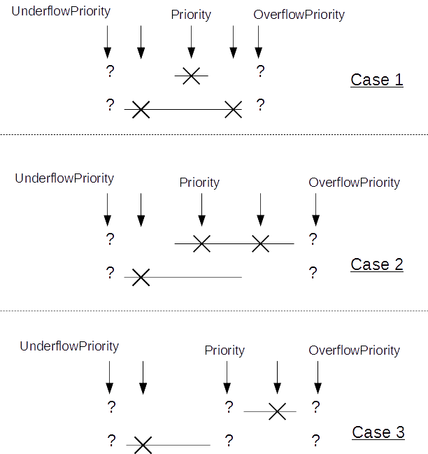

LUT programming
~~~~~~~~~~~~~~~

LUT are instanced in SDP/CDP in NVDLA, it’s used to mimic the non-linear
functions (Sigmoid/TanH/LRN, etc.) of a network. As we know, the LUT
precision is highly depends on LUT entries and slope variation of the
curve: The more LUT entries, the higher precision. On the other hand,
the strong slope variation of the curve, the hard to mimic.

It’s worth to mention SDP/CDP shares the same LUT logic, the only
difference between them are the bit-depth as SDP pipeline is 32bits but
CDP pipeline is 37bits.

We proposed an innovated 2 level hybrid LUT architecture to keep very
high precision by limited LUT entries:

There’re 2 highlights of this implementation:

-  2 level:

.. _fig_image85_lut_architecture:

.. figure:: ias_image85_lut_architecture.svg
  :align: center

  LUT architecture

There’re 2 tables (X/Y table), the typical configuration is use one of
them as raw table to cover entire dynamic range and the other work as
density table to cover a small portion of the dynamic range. Due to the
coverage difference, raw table has low sample rate but density table has
relative high sample rate, this is inspired by the attribute of
LRN/Sigmoid/TanH curve:

.. _fig_image86_non_linear_lrn:

.. figure:: ias_image86_non_linear_lrn.png
  :align: center

  Non-linear function: LRN

.. _fig_image87_non_linear:

.. figure:: ias_image87_non_linear_sigmoid.svg
  :align: center

  Non-linear function: Sigmoid

We can see from figures above, for those functions, only a small portion
has significant slope variation and the others portion almost without
too much change thus 2 level LUT is an economy option to mimic those
functions.

As there might be overlap between density/raw table, we have a
programmable register: “priority” (pri) to allow software control which
LUT table output should be taken as final output when one sample fits to
both tables. Of course, the suggestion is to use density output all the
time.

-  Hybrid working mode

We noticed for LRN, the input dynamic range is very high (0~10^8), but
most of the samples are within a small data range:

.. _fig_image88_histogram_of_lrn_lut_input:

.. figure:: ias_image88_histogram_of_lrn_lut_input.png
  :align: center

  Histogram of LRN LUT input

Histogram above are collected from “pool1/norm1” layer of GoogleNet, we
viewed the same data by different x-axis coordinate system (linear and
exponential).

We can see the linear view merges >50% samples to one point in histogram
while exponential view distinguishes those samples to different
histogram points which gives much better resolution. Same strategy can
be adopted to LUT: If the LUT is working on exponential mode, we have a
very high sample rate on low range values and low sample rate on high
range values (it’s fair since they have low frequency in histogram).
This is the idea of “exponential” mode. Currently, only X table is able
to work on exponential mode and when this mode is enabled, the coverage
is fixed as :math:`2^{exp\_start} ~ 2^{exp\_start + tlb\_entry}`

Table below summarized the LUT attributes of NVDLA (The X/Y are used to
denote different table, when mapping to hardware, X corresponding to
LE(Linear/Exponent) while Y corresponding to LO(Linear only)):

+---------------------------+----------------------+
| Attributes                | Description          |
+===========================+======================+
| X table entries           | 65                   |
+---------------------------+----------------------+
| Y table entries           | 257                  |
+---------------------------+----------------------+
| Bits per entry            | 16                   |
+---------------------------+----------------------+
| X supported working modes | Exponential/Linear   |
+---------------------------+----------------------+
| Y supported working modes | Linear               |
+---------------------------+----------------------+
| Interpolation methods     | Linear interpolation |
+---------------------------+----------------------+
| Out-of-range behavior     | Linear interpolation |
+---------------------------+----------------------+

Recommended LUT configuration for typical use scenarios:

+-----------------------------------+-----------------------------------+
| Use scenario                      | Configuration                     |
+===================================+===================================+
| LRN                               | X – Exponential mode (worked as   |
|                                   | raw table)                        |
|                                   |                                   |
|                                   | Y – Linear mode (worked as        |
|                                   | density table)                    |
+-----------------------------------+-----------------------------------+
| Activation (Sigmoid/TanH, etc.)   | X – Linear mode (worked as        |
|                                   | density table)                    |
|                                   |                                   |
|                                   | Y – Linear mode (worked as raw    |
|                                   | table)                            |
+-----------------------------------+-----------------------------------+

However, this is not mandatory, software can program LUT work as any of
cases below (X/Y can be reversed, which means totally 6 cases):

.. _fig_image90_lut_coverage:

.. figure:: ias_image90_lut_coverage.svg
  :align: center

  LUT coverage

As shown in :numref:`fig_image85_lut_architecture`, there’re couple parameters for LUT, let’s
discuss how to configure them based on different modes.

Exponential mode
^^^^^^^^^^^^^^^^

If LUT is working on exponential mode and LUT storage has example below
(actually, exp_start is programmable):

+----------------------------------------------------+
| exp_start=-32                                      |
|                                                    |
| LUT[0]=f(2\ :sup:`exp_start`)=f(2\ :sup:`-32`)     |
|                                                    |
| LUT[1]=f(2\ :sup:`exp_start+1`)=f(2\ :sup:`-31`)   |
|                                                    |
| …                                                  |
|                                                    |
| LUT[64]= f(2\ :sup:`exp_start+64`)=f(2\ :sup:`32`) |
+----------------------------------------------------+

Suppose LUT input is: :math:`x' = (x - O_{in}) * SF_{in}`, per LUT storage, the index should be:

.. math:: index = (log_2(x - linear\_start)) - exp\_start = log_2 (\frac{x'}{SF_{in}} + O_{in} - linear\_start) - exp\_start

SF\ :sub:`in` must be 2\ :sup:`M`, then, formula above changed as:
.. math:: index = log_2 (\frac{x'}{SF_{in}} + O_{in} - linear\_start) - exp\_start = log_2 (x' - SF_{in}(linear\_start - O_{in})) - (M + exp\_start)

*exp_start* is a value related to LUT storage (in our example, we use
-32 here) while *M* is related to upstream convertor setting.

The mapping between register and symbols above are lists below (only X
table supports exponential mode):

+-------------------------+---------------------------------------------------+
| Register                | Symbol                                            |
+=========================+===================================================+
| LE_INDEX_OFFSET         | M+exp_start                                       |
+-------------------------+---------------------------------------------------+
| LUT_LE_INDEX_SELECT     | Not used                                          |
+-------------------------+---------------------------------------------------+
| S_LUT_LE_START_LOW/HIGH | :math:`SF_{in}(linear\_start - O_{in})`           |
+-------------------------+---------------------------------------------------+

Linear mode
^^^^^^^^^^^

If LUT is working on linear mode and LUT is supposed to cover min~max,
then, LUT entry storage should be (suppose entry_num=257):

+-----------------------------------+
| step=(max-min)/(entry_num-1)      |
|                                   |
| LUT[0]=f(0*step + min)            |
|                                   |
| LUT[1]=f(1*step + min)            |
|                                   |
| …                                 |
|                                   |
| LUT[256]=f(256*step + min)=f(max) |
+-----------------------------------+

Suppose LUT input is: :math:`x' = (x - O_{in}) * SF_{in}`, per LUT storage, the index should be:

.. math:: index=\frac{x-min}{step}=\frac{\frac{x'}{SF_{in}}+O_{in}-min}{step}=\frac{x'+O{in}*SF_{in}-min*SF_{in}}{(max-min)*SF_{in}}*(entry\_num-1)

Denote:

.. math:: SF_{lut}=\frac{entry_num-1}{(max-min)*SF_{in}},\ O_{lut}=min*SF_{in}-O_{in}*SF_{in},\ index=(x'-O_{lut})*SF_{lut}

This requires multiplier, in order to make hardware simpler, we require:

.. math:: SF_{lut} = 2^M

Then, hardware just need to right/left shifter to get correct index,
however, this implies:

.. math:: (max - min) * SF_{in} = 2^{C-M}, where\ C=log_2(entry\_num - 1)

This can be guaranteed by the convertor before LUT (cdp_in_cvt in CDP;
X/X/Y multiplier in SDP).

The mapping between symbols above and the actual registers are (X could
be LE/LO):

+------------------------+-------------------------+
| Register               | Symbol                  |
+========================+=========================+
| LUT_LE/LO_INDEX_SELECT | -M                      |
+------------------------+-------------------------+
| X_START_LOW/HIGH       | :math:`O_{lut}`         |
+------------------------+-------------------------+
| LE_INDEX_OFFSET        | Not used                |
+------------------------+-------------------------+

Out-of-range control
^^^^^^^^^^^^^^^^^^^^

Suppose one LUT has coverage between [min, max]. If one input sample
bigger than max or smaller than min, we call it out-of-range sample.

NVDLA supports linear interpolation of those out-of-range samples. The
mathematic formula for the interpolation is (x is the input sample
value):

.. math:: \begin{equation}\begin{cases}
   y_0+(x-min)*k_{underflow},&\text{x<min}\\
   y_n+(x-max)*k_{overflow},&\text{x>max}\\
   \end{cases}\end{equation}

From hardware perspective, the interpolation is:

.. math:: \begin{equation}\begin{cases}
   LUT[0]+(X-START)*UFLOW_{SCALE}/UFLOW_{SHIFT},&\text{X<START}\\
   LUT[N]+(X-END)*OFLOW_{SCALE}/OFLOW_{SHIFT},&\text{X>END}\\
   \end{cases}\end{equation}

Take underflow as an example, given (:math:`2^M` is the scaling applied on LUT
input, SF is the scaling applied on LUT entries):

.. math:: X = x * 2^M
.. math:: START = min * 2^M
.. math:: LUT[0] = y_0 * SF

Hardware output:

.. math:: \begin{align*}
   LUT[0] + (X-START)*UFLOW\_SCALE/UFLOW\_SHIFT & = y_0 * SF + (x-min) * 2^M * UFLOW\_SCALE/UFLOW\_SHIFT \\
   & = SF*(y_0 + \frac{(x-min) * 2^M * UFLOW\_SCALE/UFLOW\_SHIFT}{SF})
   \end{align*}

Thus:

.. math:: \frac{2^M * UFLOW\_SCALE/UFLOW\_SHIFT}{SF} = k_{underflow}

The mapping between the symbols in above formula and registers are:

+----------------------+--------------------------------+----------------------+
| Register             | Symbol                         | NOTE                 |
+======================+================================+======================+
| LUT[0]               | :math:`y_0`                    | No register,         |
|                      |                                | directly use LUT     |
|                      |                                | content              |
+----------------------+--------------------------------+----------------------+
| LUT[N], (N is the    | :math:`y_n`                    | No register,         |
| last entry of the    |                                | directly use LUT     |
| LUT)                 |                                | content              |
+----------------------+--------------------------------+----------------------+
| X_START_LOW/HIGH     | Min*2\ :sup:`M`                | Same bits/encoding   |
|                      |                                | as the pipeline.     |
|                      |                                | (i.e.: for INT, it   |
|                      |                                | will be treat as INT |
|                      |                                | and for FP16, it     |
|                      |                                | will be treated as   |
|                      |                                | FP16)                |
+----------------------+--------------------------------+----------------------+
| X_END_LOW/HIGH       | Max*2\ :sup:`M`                | Same bits/encoding   |
|                      |                                | as the pipeline.     |
+----------------------+--------------------------------+----------------------+
| SLOPE_UNDERFLOW_SCAL | :math:`SF*k_{underflow}*2^{-M}`| 16bits for SCALE     |
| E                    |                                | will be treated as   |
|                      |                                | INT/FP16 for         |
| SLOPE_UNDERFLOW_SHIF |                                | INT/FP16 pipeline    |
| T                    |                                | respectively;        |
|                      |                                |                      |
|                      |                                | SHIFT is 5 bit       |
|                      |                                | signed int, won’t be |
|                      |                                | used for FP16 pipe;  |
|                      |                                |                      |
|                      |                                | (if shift > 0,       |
|                      |                                | k=SCALE>>SHIFT;      |
|                      |                                | otherwise,           |
|                      |                                | k=SCALE<<SHIFT)      |
+----------------------+--------------------------------+----------------------+
| SLOPE_OVERFLOW_SCALE | :math:`SF*k_{overflow}*2^{-M}` | Same as UNDERFLOW    |
|                      |                                |                      |
| SLOPE_OVERFLOW_SHIFT |                                |                      |
+----------------------+--------------------------------+----------------------+

LUT storage programming
^^^^^^^^^^^^^^^^^^^^^^^

Traditionally, in order to program an LUT entry, you have to specify
both LUT entry address and its value, this requires 2 register write
operation. NVDLA simplifies this process by introducing hardware
automatic address incremental mechanism, which means, when you need to
program an LUT table, you just have to write your code as below (take LE
table program for example):

.. code:: c

  /\* program raw table \*/                                    
  reg = (FIELD_ENUM(S_LUT_ACCESS_CFG, LUT_TABLE_ID, LE)        
        << SHIFT(S_LUT_ACCESS_CFG, LUT_TABLE_ID)) \|           
        (FIELD_ENUM(S_LUT_ACCESS_CFG, LUT_ACCESS_TYPE, WRITE)  
        << SHIFT(S_LUT_ACCESS_CFG, LUT_ACCESS_TYPE));          
  reg_write(S_LUT_ACCESS_CFG, reg);                            
  for(i = 0; i < LUT_LE_TABLE_ENTRIES; i\+\+) {                
      reg_write(S_LUT_ACCESS_DATA, lut->le_table[i]);          
  }                                                            
                                                               

If the address beyond the total LUT entry (e.g.: The
LUT_RAW_TABLE_ENTRIES in pseudo code above exceed the actual LUT entry),
the hardware behavior is undefined.

NVDLA supports read back the programmed LUT entries from arbitrary
entry. The S_LUT_ACCESS_CFG just need program once then the address will
increase automatically. **Please be noticed that programming of
S_LUT_ACCESS_CFG has to be non-post write for LUT read case;**

There’re 2 constrains for LUT programming:

-  Make sure always write LUT from first entry and update entire table;

-  There’s only one LUT storage shared for both register groups, make
   sure update LUT are happened when corresponding sub-unit is IDLE;

Hit/Miss behavior
^^^^^^^^^^^^^^^^^

For a given input sample, if only one table is hit, the final output
will be the output of hit table; However, the X/Y table programming is
so flexible then leads to different hit/miss cases:

.. _fig_image109_lut_hit_miss:

a) One input sample might be hit in both table; (Case 1)

b) One input sample might miss in both table due to overflow; (Case1, 2,
   3)

c) One input sample might miss in both table due to underflow; (Case 1,
   2, 3)

d) One input sample might miss in both table due to one table overflow
   while the other underflow (Case 3)

For all the cases above, hardware need a way to choose how to get
the final output thus we expose programmable registers below to
allow software program the priority:

+-----------------------------------+-----------------------------------+
| Register Name                     | Description                       |
+===================================+===================================+
| Priority                          | One bit register to indicate      |
|                                   | which table output should be      |
|                                   | selected as the final output when |
|                                   | both hit or hybrid miss happens   |
|                                   | (case a, d);                      |
|                                   |                                   |
|                                   | 0 means X table is selected;      |
|                                   |                                   |
|                                   | 1 means Y table is selected;      |
+-----------------------------------+-----------------------------------+
| OverflowPriority                  | One bit register to indicate      |
|                                   | which table output should be      |
|                                   | selected as final output when     |
|                                   | overflow for both table happens.  |
|                                   | (case b)                          |
|                                   |                                   |
|                                   | 0 means X table is selected;      |
|                                   |                                   |
|                                   | 1 means Y table is selected;      |
+-----------------------------------+-----------------------------------+
| UnderflowPriority                 | One bit register to indicate      |
|                                   | which table output should be      |
|                                   | selected as final output when     |
|                                   | underflow for both table happens  |
|                                   | (case c)                          |
|                                   |                                   |
|                                   | 0 means X table is selected;      |
|                                   |                                   |
|                                   | 1 means Y table is selected;      |
+-----------------------------------+-----------------------------------+

.. _lut-statistics:

LUT Statistics
^^^^^^^^^^^^^^

When one hardware layer completes, hardware will report statistics below
to help software understand whether the LUT table is reasonably
programmed.

+-----------------------------------+-----------------------------------+
| Statistic register                | Description                       |
+===================================+===================================+
| XHitNum                           | Number of samples hit on X only   |
+-----------------------------------+-----------------------------------+
| YHitNum                           | Number of samples hit on Y only   |
+-----------------------------------+-----------------------------------+
| UnderflowNum                      | Number of samples underflow for   |
|                                   | both X and Y table                |
+-----------------------------------+-----------------------------------+
| OverflowNum                       | Number of samples overflow for    |
|                                   | both X and Y table                |
+-----------------------------------+-----------------------------------+
| PriorityNum                       | Number of samples both hit on X/Y |
|                                   | table or Hybrid miss on X/Y table |
|                                   | (Actually, this counter has 2     |
|                                   | different meanings which          |
|                                   | corresponding to a and d case in  |
|                                   | above section, but since they’re  |
|                                   | mutual exclusive, we just use one |
|                                   | register for them. Software is    |
|                                   | able to distinguish the different |
|                                   | meanings since it knows each LUT  |
|                                   | coverage)                         |
+-----------------------------------+-----------------------------------+

For each register group, we have dedicated statistic registers above,
those counters will be available for read when one hardware completes
(by set the producer pointer to this register group). Those statistics
won’t be erased until the corresponding register group is enabled (op_en
be set)
