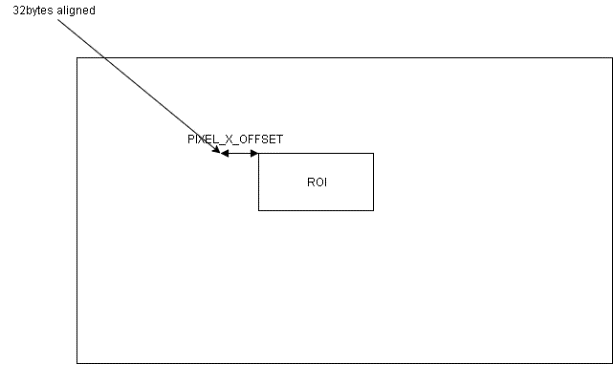

=================
Programming Guide
=================

(Notice: This version of *Unit Description* is only for nvdlav1 release. 
Please refer to *Scalability parameters and ConfigROM* for other configurations)

BDMA programming
----------------

Background
~~~~~~~~~~

We suggest NVDLA memory accesses are based on internal SRAM to achieve best
performance and we designed BDMA for this purpose.

The supported memory transfers are:

+---------------+------------------+
| Source type   | Destination type |
+===============+==================+
| External DRAM | Internal SRAM    |
+---------------+------------------+
| External DRAM | External DRAM    |
+---------------+------------------+
| Internal SRAM | External DRAM    |
+---------------+------------------+
| Internal SRAM | Internal SRAM    |
+---------------+------------------+

Programming
~~~~~~~~~~~

The programming model for BDMA is different from others due to special
use scenario on BDMA. Take convolution as an example, in order to make a
convolution layer operation happen, BDMA has to transfer
input_feature/weight/mean/bias into internal SRAM. If BDMA also uses the
traditional programming model, CPU will act as:

Issue setting for single transfer of input feature

Wait for interrupt

Issue setting for single transfer for weight

Wait for interrupt

…

The total time is:

4(Weight/Image/Mean/Bias) \* CPU_ISR_Time + 4*TransactionTime;

This process is boring and many interactions between CPU and BDMA are
needed. In order to improve the efficiency, a new programming model for
BDMA is listed as below:

1. CPU issue setting for single transfer of input feature (set interrupt
   flag as false)

2. Pooling BDMA if there’s empty slot for program (BDMA support 20
   register entries thus most of time, polling always return true)

3. CPU issue setting for single transfer of weight (set interrupt flag
   as false, if it’s not the last transfer request)

4. Repeat 2~3 until all data transfer request are done and set interrupt
   flag as true for last request

5. Wait for interrupt

The total time for outstanding based programming model is:

1*CPU_ISR_Time + 4*Transaction_Time;

We introduce 2 terminologies to describe procedure above:

-  Operation: Each individual BDMA transaction is called as operation.
   One operation may or may not trigger interrupt depending on software
   setting. take example above, transfer of activation, weight, mean,
   bias are 4 different BDMA operation.

-  Group: group is consisted by one or more BDMA operations depending on
   software configuration. Set GRP<0|1>_LAUNCH as YES is treated as end
   of a group.

During one BDMA group register programming, hardware acts as:

-  Software program one BDMA operation then set the EN bit

-  Hardware “cache” the corresponding BDMA registers to its internal
   slot, no actual memory transaction carried out. There’re totally 20
   slots thus we can support 20 BDMA operations in one group as maximum;

-  Software poll the free slots by read STATUS.FREE_SLOTS, if it’s
   bigger than 0, it means software is allowed to program the next BDMA
   operation;

-  For the last BDMA operation in one group, software has to set
   CFG_LAUNCH<0|1>.GRP<0|1>_LAUNCH = YES;

-  Hardware will actually kick of all the “cached” BDMA operations in
   this group (by detect INTERRUPT=YES).

-  After all BDMA operation done, corresponding interrupt will be
   generated.

For below section, if there’s no special declaration, all address refers
to data address in SRAM.

Buffer allocation
~~~~~~~~~~~~~~~~~

Before introduce buffer allocation formula, we need to understand the
related register definition:

+-----------------------------------+-----------------------------------+
| Register                          | Description                       |
+===================================+===================================+
| CFG_LINE                          | Indicate the valid data size per  |
|                                   | line. This register should be     |
|                                   | configured as:                    |
|                                   |                                   |
|                                   | valid_bytes_per_line/32-1         |
+-----------------------------------+-----------------------------------+
| CFG_LINE_REPEAT                   | Number of lines per surface. This |
|                                   | register should be configured as: |
|                                   |                                   |
|                                   | surface_height-1                  |
+-----------------------------------+-----------------------------------+
| CFG_SRC/DST_LINE                  | Number of bytes per src/dst line  |
|                                   | (padding are included). It should |
|                                   | be configured as:                 |
|                                   |                                   |
|                                   | total_bytes_per_line              |
+-----------------------------------+-----------------------------------+
| CFG_SURF_REPEAT                   | Number of surfaces in one data    |
|                                   | cube                              |
+-----------------------------------+-----------------------------------+
| CFG_SRC/DST_SURF                  | Number of bytes per surface (line |
|                                   | padding are included). It should  |
|                                   | be configured as:                 |
|                                   |                                   |
|                                   | total_bytes_per_surface           |
+-----------------------------------+-----------------------------------+

Given the register definition above, the formula for buffer allocation
are:

.. math:: src\_cube\_size = CFG\_SRC\_SURF * CFG\_SRC\_REPEAT
.. math:: dst\_cube\_size = CFG\_DST\_SURF * CFG\_DST\_REPEAT

The formula for actual bytes transferred is:
.. math:: actual\_size = (CFG\_LINE - 1) * 32 * CFG\_LINE\_REPEAT * CFG\_SURF\_REPEAT

Rubik programming
-----------------

Features
~~~~~~~~

+-----------------------------------+-----------------------------------+
| Mode                              | Description                       |
+===================================+===================================+
| Contract                          | Worked as final phase of          |
|                                   | deconvolution to reorder the      |
|                                   | output layout;                    |
+-----------------------------------+-----------------------------------+
| Split                             | Convert the feature format to     |
|                                   | M-planar format                   |
+-----------------------------------+-----------------------------------+
| Merge                             | Convert the M-planar format to    |
|                                   | feature format.                   |
+-----------------------------------+-----------------------------------+

.. programming-1:

Programming
~~~~~~~~~~~

.. contract-1:

Contract
^^^^^^^^

1) Config the RUBIK_MODE= CONTRACT

2) Configure the input cube information:

   D_DAIN_RAM_TYPE: The input memory type;
   
   D_DATAIN_SIZE_0/1: The input W/H/C;
   
   D_DAIN_ADDR_HIGH/LOW: The input cube start address;
   
   D_DAIN_LINE/SURF_STRIDE: The input cube line/surface stride;

3) Configure the output cube information:

+-----------------------------------+-----------------------------------+
| Register                          | Value                             |
+===================================+===================================+
| D_DATAOUT_SIZE_1                  | (DATAIN_CHANNEL+1)/((             |
|                                   | DECONV_X_STRIDE+1)*(              |
|                                   | DECONV_Y_STRIDE+1))-1             |
+-----------------------------------+-----------------------------------+
| D_DAOUT_ADDR_HIGH/LOW             | The output cube start address     |
+-----------------------------------+-----------------------------------+
| D_DAOUT_LINE/SURFACE_STRIDE       | The output cube line/surface      |
|                                   | stride                            |
+-----------------------------------+-----------------------------------+
| D_CONTRACT_STRIDE_0               | Ceil((DATAOUT_CHANNEL+1) \* BPE / |
|                                   | 32) \* DAIN_SURF_STRIDE           |
+-----------------------------------+-----------------------------------+
| D_CONTRACT_STRIDE_1               | (DECONV_Y_STRIDE+1) \*            |
|                                   | DAOUT_LINE_STRIDE                 |
+-----------------------------------+-----------------------------------+

4) Configure the stride information:

   D_DECONV_STRIDE: The x/y stride relationship between input/output
   cube. It’s not necessary to configure those values the same as
   deconvolution stride.

5) Configure the op_en to kick-off the hardware layer;

Split/Merge
^^^^^^^^^^^

Most of the configurations are the same as Contract mode except:

1) RUBIK_MODE should be SPLIT/MERGE;

2) D_DAIN_PLANAR_STRIDE has to be configured for merge mode;

3) Registers below are not necessary to program for split mode:

   D_CONTRACT_STRIDE_0/1

   D_DAIN_PLANAR_STRIDE

   D_DAOUT_SURF_STRIDE

   D_DECONV_STRIDE

4) Registers below are not necessary to program for merge mode:

   D_CONTRACT_STRIDE_0/1

   D_DAIN_SURF_STRIDE

   D_DAOUT_PLANAR_STRIDE

   D_DECONV_STRIDE

For split mode, DATAOUT_CHANNEL is used to specify number of channels
needs to split thus it equals to output planar number.

Convolution pipeline programming
--------------------------------

.. features-1:

Features
~~~~~~~~

From algorithm wise, convolution pipeline in NVDLA supports algorithm
features below:

.. table:: List of algorithm features supported by convolution pipeline
 :name: tab_algorithm_features_cc

 +-----------------------------------+-----------------------------------+
 | Feature                           | Description                       |
 +===================================+===================================+
 | Convolution                       | Convolution layer functionality.  |
 |                                   | It supports image input and       |
 |                                   | feature input                     |
 +-----------------------------------+-----------------------------------+
 | Deconvolution                     | Deconvolution layer               |
 |                                   | functionality; It supports        |
 |                                   | feature input only.               |
 |                                   | (Actually, deconvolution is a     |
 |                                   | NVDLA software feature instead of |
 |                                   | hardware)                         |
 +-----------------------------------+-----------------------------------+
 | Dilation                          | A technology to expand kernel     |
 |                                   | coverage without introduce more   |
 |                                   | network parameters.               |
 +-----------------------------------+-----------------------------------+
 | Padding                           | Padding size on the               |
 |                                   | left/right/top/bottom of input    |
 |                                   | data cube                         |
 +-----------------------------------+-----------------------------------+
 | conv_stride                       | The number of input element       |
 |                                   | should be skipped in x/y          |
 |                                   | direction after one output        |
 |                                   | element be calculated             |
 +-----------------------------------+-----------------------------------+

From performance wise, convolution pipeline implements features below to
accelerate convolution process:

.. table:: List of performance features supported by convolution pipeline
 :name: tab_performance_features_cc

 +-----------------------------------+-----------------------------------+
 | Feature                           | Description                       |
 +===================================+===================================+
 | Winograd                          | A fast convolution method (2.25x  |
 |                                   | throughput than direct            |
 |                                   | convolution), NVDLA support       |
 |                                   | equivalent kernel size = 3x3 only |
 |                                   | (equivalent means kernel after    |
 |                                   | channel extension)                |
 +-----------------------------------+-----------------------------------+
 | Channel Post-extension            | A method to improve MAC           |
 |                                   | efficiency when channel size is   |
 |                                   | too small (For image input only). |
 +-----------------------------------+-----------------------------------+
 | Multi-Batch mode                  | A method to improve MAC           |
 |                                   | efficiency when atomic number in  |
 |                                   | one stripe operation is too small |
 |                                   | (e.g.: InnerProduct layer).       |
 +-----------------------------------+-----------------------------------+
 | Weight compression                | A method to save weight data      |
 |                                   | loading bandwidth.                |
 +-----------------------------------+-----------------------------------+

Besides hardware features, different working modes will impact
performance as well:

.. table:: List of working modes supported by convolution pipeline
 :name: tab_working_modes_cc

 +-----------------------------------+-----------------------------------+
 | Working mode                      | Description                       |
 +===================================+===================================+
 | Full input & weight               | If both weight/feature can be     |
 |                                   | fitted to CONV_BUF, this mode     |
 |                                   | delivers best performance         |
 +-----------------------------------+-----------------------------------+
 | Full input, partial weight        | If feature can be fitted to       |
 |                                   | CONV_BUF while only part of       |
 |                                   | weight can be fitted to CONV_BUF  |
 |                                   |                                   |
 |                                   | Comparing with full feature &     |
 |                                   | weight, it has the same           |
 |                                   | performance for single hardware   |
 |                                   | layer, but weight can’t be        |
 |                                   | re-used.                          |
 +-----------------------------------+-----------------------------------+
 | Split H                           | A software feature which utilize  |
 |                                   | multiple HWLs to process an input |
 |                                   | data cube. It will be used when   |
 |                                   | above cases are failed to match.  |
 +-----------------------------------+-----------------------------------+

Here’s the detailed explanation about those working modes:

-  \ **Full input & weight mode**

Condition: Both input feature and weight cube can be fitted in CONV_BUF

Fit case: small sized input/weight data

Data refetch: No

Weight refetch: No

Output sequence: K’(32 or 16)W HK

In this mode, entire input/weight will be loaded to CONV_BUF which means
CONV_BUF should be large enough to store W*H*C+R*S*C*K data elements
thus:

.. math:: banks\_for\_data = ceil(\frac{entry\_per\_slice*H}{256})
.. math:: banks\_for\_weight = ceil(\frac{R * S * C * K * BPE}{256*128})

-  \ **Full input, partial weight mode**

Condition: Entire input feature data and part of weight data
(2*kernel_per_group) can be filled in CONV_BUF

Fit case: small sized input and small/middle sized weight data

Data refetch: No

Weight refetch: No

Output sequence: K’(32 or 16)W HK

Full input feature mode is a most common case for many networks. Because
the output sequence goes at K direction at last phase, it can be easily
connected to pooling logic without big buffering requirement. Below
formula should be satisfied when planning CONV_BUF layout:

.. math:: banks\_for\_data = ceil(\frac{entry\_per\_slice*H}{256})
.. math:: banks\_for\_weight >= ceil(\frac{R * S * C * 2 * kernel_per_group * BPE}{256*128})

The reason for 2*kernel_per_group is to keep CDMA and CMAC working at
the same time to hide kernel loading latency, however,
1*kernel_per_group also workable but the performance is reduced.

-  **Split H**

We can see only full mode is supported by convolution pipeline. If one
network layer has large input which exceed the CONV_BUF capacity,
software has to split the big input cube into smaller cubes in vertical
direction. This mechanism called “Split H mode”.

Be noticed that there must be max(R-stride_y, 0) overlapped lines between 2 consecutive
cube to make sure the convolution results are expected.

Strategy selection
~~~~~~~~~~~~~~~~~~

Convolution pipeline has different features/working modes, we should
follow the rule below to mapping the network parameter into hardware
layers:

1. Decide the algorithm features (:numref:`tab_algorithm_features_cc`) from network definition;

2. Select the hardware performance optimization features (:numref:`tab_performance_features_cc`):

a) If this is the first layer (image input) and any item in :numref:`tab_limits_of_channel_post_extension`
is satisfied, channel post extension should be used.

b) If this is the feature input and *ceil(R/stride_y) == 3 &&
ceil(S/stride_x) == 3* is true, winograd mode should be used;

c) If this is inner product layer and CONV_BUF is big enough to maintain
BATCH_NUMBER input cubes, multi-batch mode should be chosen. “Big
enough” here means:

.. math:: ceil(BATCH\_NUMBER * entry\_per\_slice * H / 256) <= BANKS\_FOR\_DATA

d) If *(compressed_weight_size+wmb_size+wgs_size) < weight_size* and
there’s no conflict with :numref:`tab_weight_formats`, weight compress should be used;

3. Decide the working modes by comparing actual data/weight size with
available CONV_BUF banks. The priority is: “Full weight&input” > “Full
input & Partial weight” > “Split H”. When split H mode used, it’s better
split H into smaller one to make sure weight are all kept in CONV_BUF
thus weight can be re-used.

.. programming-2:

Programming
~~~~~~~~~~~

Register definition
^^^^^^^^^^^^^^^^^^^

Before introduce the convolution pipeline programming, it’s necessary to
explain the meaning of the registers and how they’re calculated.

CC has 5 pipelines, each pipeline stage has its own registers. For any
register, if it has the same name across pipeline stage, it means they
have the same value.

Most of the registers in those groups are straightforward thus we just
highlight the registers which might confuse people in this section:

-  *<CDMA|CSC>.WEIGHT/DATA_SKIP_RELEASE:* Indicate whether or not skip
   release of the slices in CONV_BUF. If SKIP_RELEASE=false, different
   strategy are applied on feature/weight:

   -  For feature release, software is able to control how much slices
      should be released by specify D_RELEASE;

   -  For weight release, only release all or release none is supported;

-  *<CDMA|CSC>.WEIGHT/DATA_REUSE*: Indicate whether or not re-use the
   weight/data from previous hardware-layer. If this flag is set, CDMA
   fetch will be fully(partially) skipped (depending on CDMA_HEIGHT of
   Nth layer and D_RELEASE/CSC_HEIGHT of N-1th layer: if
   CDMA_HEIGHT\ :sub:`N` <= (CSC_HEIGHT-D_RELEASE):sub:`N-1`, the
   N\ :sup:`th` CDMA fetch will be skipped).

-  CDMA.LINE_STRIDE/LINE_STRIDE_UV: Those 2 registers are used for
   PITCH_LINEAR only, the value of those registers should be larger than
   the actual data per line.

Actual data per line is different according to different input format
and pixel format, please refer to: LINE_STRIDE/LINE_STRIDE_UV about its
calculation.

Besides, the requirement of alignment in :numref:`tab_requirements_of_alignment`
should also be satisfied.

-  CDMA.PIXEL_SIGN_OVERRIDE:

This field take effect for image input only.

The override field does not directly change the sign bit of input
values. It co-works with CDMA convertor. When convertor in CDMA is
enabled, original values will be extended to int17 and then be
calculated with offset and scaling factor.

For example, if input format is R_8 and override field is UNSIGNED, the
input value 0x87 will be extended as 0x00087 and sent into convertor.
And if input format is R_8 and override field is SIGNED, the input value
0x87 will be extended as 0x1ff87 and sent into convertor.

In conclusion:

-  Sign override register field only affects INT/UINT pixel formats.

-  Sign override register field should co-work with CDMA convertor.

-  If CDMA convertor is not enabled, all values are treated as
   int8/int16/fp16, no matter how sign override is set.

-  CDMA.D_DAIN_MAP:

   -  If LINE_STRIDE equals to bytes_per_line, it means this data cube
      is “LINE_PACKED”

   -  If D_SURF_STRIDE equals to LINE_STRIDE*H, it means the data cube
      is “SURF_PACKED”

-  <CDMA|CSC>.D_BANK: Indicate number of banks allocated for
   data/weight. Please refer to: 10.1.3 about the calculation.

-  <CDMA|CSC>.D_ENTRY_PER_SLICE: Entry per slice means how many CONV_BUF
   entries a slice occupied, it’s decided by multiple factors:
   convolution mode, width, channel size, stride, etc. Please refer to:
   ENTRY_PER_SLICE for detail.

-  *CDMA.FETCH_GRAIN*: This is the threshold to trigger CDMA working:
   CDMA won’t work until the empty entries in CONV_BUF reaches
   (fetch_grain+1)*ENTRY_PER_SLICE. The values of this register is a
   trade-off of fetch efficiency and fetch delay: a large value will
   benefit fetch efficiency since CDMA have larger room when sending
   request, however, if this value is too large, CDMA will wait for a
   quite long time to wait CONV_BUF release enough entries.

For LINE_UNPACKED mode, this register will be ignored by hardware and
behaves as this register set to 0.

-  *<CDMA|CSC>.WEIGHT_BYTES*: It should be configured as:
   weight_size=R*S*C*BPE*K. Regardless of weight compress mode or
   uncompressed mode.

-  *CDMA.PIXEL_X/Y_OFFSET*: Configuration of those 2 registers is
   depending on PIXEL_MAPPING:

   -  *PITCH_LINEAR*: The address configured to D_DAIN_ADDR_HIGH/LOW_0
      should be 32bytes aligned, however, the start address of an ROI
      might not aligned to that address. Then, PIXEL_X_OFFSET is
      introduced.

+-----------------------------------------------------------------------+
| D_DAIN_ADDR_HIGH/LOW_0 = roi_address &(~0x1F); // The nearest 32bytes |
| aligned address;                                                      |
|                                                                       |
| PIXEL_X_OFFSET=(roi_address&0x1F)/bytes_per_pixel // The offset in    |
| unit of pixel                                                         |
|                                                                       |
| PIXEL_Y_OFFSET = 0; // The 32bytes aligned address and roi address    |
| should be in the same line                                            |
+-----------------------------------------------------------------------+

.. _fig_image116_pitch_linear_roi:

-  CSC.WEIGHT/DATAIN_SIZE_EXT: The input weight/feature cube size seen
   from CSC. SW should configure those values based on formula below:

DATAIN_SIZE_EXT: (W/H/C is the width/height/channel of input data cube)

+-----------------+-----------------+-----------------+-----------------+
| Mode            | Width           | Height          | Channel         |
+=================+=================+=================+=================+
| Winograd        | ceil((W+(PL+PR) | ceil((H+PT+PB)/ | C*stride_x*stri |
|                 | )/stride_x)     | stride_y)       | de_y            |
+-----------------+-----------------+-----------------+-----------------+
| Image input     | W               | H               | C               |
+-----------------+-----------------+-----------------+-----------------+
| Direct          | W               | H               | C               |
+-----------------+-----------------+-----------------+-----------------+

WEIGHT_SIZE_EXT (S/R/C is the width/height/channel of input weight cube
and let C’ be 32bytes aligned version of C, which means: C’=ceil(C, 16)
for INT/FP16 and C’=ceil(C, 32)):

+-----------------+-----------------+-----------------+-------------------+
| Mode            | Width           | Height          | Channel           |
+=================+=================+=================+===================+
| Winograd        | 4 (The size     | 4 (The size     | C’\*stride_x\*str |
|                 | after           | after           | ide_y             |
|                 | pre-transform)  | pre-transform)  |                   |
+-----------------+-----------------+-----------------+-------------------+
| Image input     | 1               | R               | C\*S              |
+-----------------+-----------------+-----------------+-------------------+
| Direct_CONV     | S               | R               | C                 |
+-----------------+-----------------+-----------------+-------------------+

-  CSC.CONV_STRIDE_X/Y_EXT: The stride size seen from CSC. (SX/SY is the
   stride size configured for CDMA: D_CONV_STRIDE)

+-------------+----------+----------+
| Mode        | Stride_X | Stride_Y |
+=============+==========+==========+
| Winograd    | 1        | 1        |
+-------------+----------+----------+
| Image input | SX       | SY       |
+-------------+----------+----------+
| Direct_CONV | SX       | SY       |
+-------------+----------+----------+

-  CSC.D_ATOMICS: Hardware uses this register to decide stripe size:

.. code:: c

  int calc_stripe_size(int atomics, int processed)     
  {                                                    
      int stripe_size;                                     
      int remain_atomics = atomics - processed;            
      if ( remain_atomics < 32 && remain_atomics >= 16 ) { 
          stripe_size = remain_atomics;                        
      } else {                                             
          assert(remain_atomics > 16);                         
          stripe_size = 16;                                    
      }                                                    
                                                           
      return stripe_size;                                  
  }                                                    

The register value of D_ATOMICS itself is calculated by:

.. code:: c

  int calc_atomics(int out_width, int out_height) 
  {                                               
      return out_width*out_height-1;                  
  }                                               

-  CSC.D_RELEASE: Hardware uses this field to decide how many input
   slices should be released after current hardware layer.

-  <CDMA|CSC>.ZERO_PADDING_VALUE: see :ref:`convolution-convertors`. Be noticed both CDMA
   and CSC has this register, but they has different meaning:

For CDMA, the padding value in register will be operated w/ CDMA input
convertor, the convert output is the actual padding value applied;

For CSC, the padding value in register will be directly applied w/o any
more operation;

-  CACC.D_DATAOUT_MAP:

This register is used to control the data reordering logic in CACC,
the configuration of this register should follow the table
below:

+--------------------+-------------+-------------+
| Configure          | Line_Packed | Surf_Packed |
+====================+=============+=============+
| 1x1                | True        | True        |
+--------------------+-------------+-------------+
| Multi-Batch mode   | False       | False       |
+--------------------+-------------+-------------+
| Direct convolution | False       | False       |
+--------------------+-------------+-------------+
| Winograd           | False       | False       |
+--------------------+-------------+-------------+

-  CACC. D_DATAOUT_SIZE_0

   This register is used to set the output size of convolution:

+-----------+--------------------------+---------------------------+
| CONV_MODE | DATAOUT_WIDTH            | DATAOUT_HEIGHT            |
+===========+==========================+===========================+
| DC        | S’=(S-1)*dilation_x + 1  | R’=(R-1)*dilation_y + 1   |
|           |                          |                           |
|           | (LP+RP-S’)/stride_x + 1  | (TP+H+BP-R’)/stride_y + 1 |
+-----------+--------------------------+---------------------------+
| IMG       | (LP+W+RP-S)/stride_x + 1 | (TP+H+BP-R)/stride_y + 1  |
+-----------+--------------------------+---------------------------+
| Winograd  | CSC.WIDTH_EXT – 4        | CSC.HEIGHT_EXT - 4        |
+-----------+--------------------------+---------------------------+

.. deconvolution-1:

Deconvolution
~~~~~~~~~~~~~

Deconvolution is a software feature, but it’s necessary to mention the
basic flow here to help user understand how it’s supported.

There’re 2 phases:

-  Convolution:

This phase includes conv_stride_x \* conv_stride_y hardware layers.

1) Software should split the kernels to conv_stride_x*conv_stride_y sets.
   Suppose the original kernel size is:
   RxSxC, the splitted kernel size is:

   S’=ceil(S/stride_x)

   R’=ceil(R/stride_y)

   C’=C

   K’=K

2) Kick-off convolution hardware layers based on different kernel set.
   The output cube size of each hardware layer is:

   W’ = (W-S’)+1

   H’=(H-R’)+1

   C’=K

-  Reorder:

The output cube from phase I is not the order we want, Rubik engine
should be employed to reorder it.

There’re 2 options about how those hardware layers should be scheduled:

a) Finish all stride_x*stride_y hardware layers then start rubik, total
   hardware layers is: stride_x*stride_y (convolution) + 1 (rubik);

b) Finish stride_x convolution hardware layers then start rubik, total
   hardware layers is: (stride_x + 1)*stride_y;

Generally, b) is the suggested scheduling strategy because:

1) It has better performance, here’s a timeline diagram which shows
   method a) vs b). It shows b) is (stride_x*stride_y-1)*t1 quicker than
   a).

.. _fig_image117_deconv_scheduling:

.. figure:: ias_image117_deconv_schedluing.svg
  :align: center

2) Method b) has smaller memory footprint requirement (W’, H’ are the
   output width/height of each convolution hardware layer).

+-----------------+--------------------+--------------------+--------------------+
| Method          | Convolution        | Rubik output       | Total              |
|                 | output buffer      | buffer             |                    |
+=================+====================+====================+====================+
| Method a)       | W’\*H’\*K\*stride_ | W’\*H’\*K\*stride_ | 2\*W’\*H’\*K\*strid|
|                 | x\*stride_y        | x\*stride_y        | e_x\*stride_y      |
+-----------------+--------------------+--------------------+--------------------+
| Method b)       | W’\*H’\*K\*stride_ | W’\*H’\*K\*stride_ | W’\*H’\*K\*stride_ |
|                 | x\*2               | x\*stride_y        | x\*(stride_y+2)    |
|                 |                    |                    |                    |
|                 | (x2 is not         |                    |                    |
|                 | mandatory but      |                    |                    |
|                 | suggested for      |                    |                    |
|                 | performance)       |                    |                    |
+-----------------+--------------------+--------------------+--------------------+

For most case, stride_y>2 thus method b) has smaller memory requirement.

SDP programming
---------------

Not all the use scenarios in :numref:`tab_sdp_supported_use_scenarios` are necessary to explain, we’ll
discuss bias addition/batch-norm/element-wise operations below (other
features are precision related which already covered by :doc:`precision`):

.. bias-addition-2:

Bias addition
~~~~~~~~~~~~~

As mentioned in :numref:`tab_sdp_supported_use_scenarios`, bias addition can be done by any of SDP
sub-module, let’s take using X1 sub-module for bias addition as an
example to explain the programming sequence:

-  Software has to prepare bias data cube, it has to be INT16 for
   INT8/16 pipeline and FP16 for FP16 pipeline.

-  Configure the SDP RDMA (most of the registers are intuitional, will
   highlights bias specific registers only ):

   a. We use bias addition, so, BRDMA_DATA_USE=ALU should be configured

   b. BRDMA_DATA_MODE configuration is based on bias mode

-  Configure the SDP BS sub-module:

   a. D_DP_BS_CFG

      BS_BYPASS=NO

      BS_ALU_BYPASS=NO

      BS_ALU_ALGO = SUM

      BS_MUL_BYPASS = YES

   b. D_DP_BS_ALU_CFG

      For per-element/kernel bias, operands should come from MC:

      BS_ALU_SRC = MEM

      For per cube bias, operands should come from register:

      BS_ALU_SRC = REG

      BS_ALU_SRC_VALUE = ?? (The value you want)

      BS_ALU_SHIFT_VALUE: Based on precision study results

.. batch-normalization-2:

Batch normalization
~~~~~~~~~~~~~~~~~~~

Batch normalization can be realized by any of X/Y, let’s still use
X1 sub-module as an example to show the steps to program batch
normalization:

-  Software has to tightly pack mean/variance into one data cube
   (M0V0M1V1…), if mean/variance are 2 bytes per element there’ll be 4
   bytes for a mean/variance pair. Those 2 bytes will be interpreted as
   INT16 for INT8/16 pipe and FP16 for FP16 pipe.

-  Configure the SDP RDMA (most of the registers are intuitional, will
   highlights batch-norm specific registers only ):

   a. Both ALU/MUL will be used for batch normalization, so,
      BRDMA_DATA_USE=BOTH should be configured

   b. BRDMA_DATA_MODE configuration is based on batch normalization mode

-  Configure the SDP BS sub-module:

   a. D_DP_BS_CFG

      BS_BYPASS=NO

      BS_ALU_BYPASS=NO

      BS_ALU_ALGO = SUM

      BS_MUL_BYPASS = NO

   b. D_DP_BS_ALU_CFG

      BS_ALU_SRC = MEM (Bias data always from MC regardless of
      per-kernel/element)

      BS_ALU_SHIFT_VALUE: Based on precision study results

   c. D_DP_BS_MUL_CFG

      BS_MUL_SRC=MEM

      BS_MUL_SHIFT_VALUE: Based on precision study results

For any case when both MUL/ALU are used, we can support combinations
below:

+-----------------+-----------------+
| ALU             | MUL             |
+=================+=================+
| REG             | MC              |
+-----------------+-----------------+
| MC              | REG             |
+-----------------+-----------------+
| MC, Per-channel | MC, Per-channel |
+-----------------+-----------------+
| MC, Per-element | MC, Per-element |
+-----------------+-----------------+
| REG             | REG             |
+-----------------+-----------------+

.. element-wise-1:

Element-wise
~~~~~~~~~~~~

Element-wise can be realized by any of SDP sub-unit, again, let’s still
use X1 module as an example about the element-wise configuration steps:

-  Different from bias/batch-norm, the element-wise input cube is from
   upstream hardware layer thus software didn’t need do anything to
   prepare surface

-  Configure the SDP RDMA (most of the registers are intuitional, will
   highlights element-wise specific registers only ):

   a. BRDMA_DATA_USE=? Is based on element-wise type. For PROD eltwise
      operation, it should be MUL, otherwise, use ALU;

   b. BRDMA_DATA_MODE= PER_ELEMENT

-  Configure the SDP BS sub-module:

   a. D_DP_BS_CFG

      BS_BYPASS=NO

      BS_ALU_BYPASS=? (For eltwise=MAX/SUM)

      BS_ALU_ALGO : Based on element-wise operation type

      BS_MUL_BYPASS = ? (No, For eltwise=PROD)

   b. D_DP_BS_ALU_CFG

      BS_ALU_SRC = MEM

      BS_ALU_SHIFT_VALUE: Based on precision study results

   c. D_DP_BS_MUL_CFG

      BS_MUL_SRC = MEM

      BS_MUL_SHIFT_VALUE: Based on precision study results

Compare mode
~~~~~~~~~~~~

Normal comparision
^^^^^^^^^^^^^^^^^^

SDP implemented compare mode in Y module to support software based
redundant computing.

+-----------------------------------+-----------------------------------+
| Use scenarios                     | Description                       |
+===================================+===================================+
| Offline vs offline                | Both of the 2 data stream are     |
|                                   | come from MC/SRAM                 |
|                                   |                                   |
|                                   | The is used to support            |
|                                   | postprocessor modules (CDP/PDP)   |
|                                   | redundant computing               |
+-----------------------------------+-----------------------------------+

In this mode, SW will schedule 3 HWLs:

1\ :sup:`st` HWL to run any module then output result to addr0;

2\ :sup:`nd` HWL to run exact the same setting as 1\ :sup:`st` layer
then output to addr1;

3\ :sup:`rd` HWL to run SDP_Y in compare mode which has configuration
as:

D_SRC_BASE_ADDR_LOW/HIGH = addr0

D_EW_BASE_ADDR_LOW/HIGH = addr1

D_DP_BS_CFG.BS_BYPASS=YES

D_DP_BN_CFG.BN_BYPASS=YES

D_DP_EW_CFG. EW_BYPASS = NO

D_DP_EW_CFG. EW_ALU_BYPASS=NO

D_DP_EW_CFG. EW_ALU_ALGO=EQL

After 3\ :sup:`rd` HWL execution done, SW should check D_STATUS to see
whether difference found.

**NOTE: When SDP EQL mode is enabled, D_FEATURE_MODE_CFG.WINOGAD has to
be OFF and D_FEATURE_MODE_CFG.BATCH_NUMBER has to be 0**

Batch mode comparison
^^^^^^^^^^^^^^^^^^^^^

Batch mode is a special case of offline/offline comparison, as SDP_Y
RDMA doesn’t support load multiple data cubes in one HWL, batch mode has
to be handled in a special way. There’re 2 cases: In order to facilitate
further discussion, we denote symbols below:

*Dimension: WxHxC*

*Batch_Num: N*

*Batch stride: BATCH_STRIDE*

There’re 2 cases depending on the attributes of each data cube:

-  If the data cube are line packed and surface packed:

For thise case, we’ll treat N data cubes as one super cube:

W’= ceil(C/KPG)*W*H, KPG= is_int8 ? 32:16;

H’=N

C’=KPG

line_stride: BATCH_STRIDE

surface_stride: BATCH_STRIDE*N

-  Otherwise:

As there’re bubbles between each data cube and the contents of those
bubbles are un-determistic, we have to compare those cube one by one
thus N HWL are necessary.

PDP programming
---------------

The most complex logic for PDP programming is deciding which working
mode can be used. PDP supports 3 different working modes:

+-----------------------------------+-----------------------------------+
| Mode                              | Attribute                         |
+===================================+===================================+
| On-the-fly                        | Input data comes from SDP,        |
|                                   | recommended whenever possible     |
+-----------------------------------+-----------------------------------+
| Offline - No split width          | Comparing with on-the-fly, this   |
|                                   | mode need one SDP write and one   |
|                                   | PDP read, this increased the      |
|                                   | memory traffic                    |
+-----------------------------------+-----------------------------------+
| Offline – split width             | Comparing with “no split width”,  |
|                                   | this mode need over-fetch between |
|                                   | overlapped region thus bandwidth  |
|                                   | further increased                 |
+-----------------------------------+-----------------------------------+

The working mode selection strategy is:

-  As mentioned in Section "Planar Data Processor" of Unit Description document, PDP has 7KB internal buffer to save
   intermediate results during pooling, thus the maximum supported
   output width is a fixed number. (Refer to: 10.1.4:
   calculate_pdp_max_width)

-  Calculate the actual pooling output:

.. code:: c

  pooled_width = static_cast<int>(ceil(static_cast<float>(width + pad_left + pad_right - kernel_w) / stride_w)) + 1;
  if ((pooled_width - 1) \* stride_w >= width + pad_left) {       
      --pooled_width;                                                 
  }                                                               

-  Decide working mode

.. code:: c

  typedef enum {                                                        
      PDP_FLYING_MODE,                                                      
      PDP_OFFLINE_MODE,                                                     
  } pdp_mode;                                                           
  static pdp_mode get_pdp_mode( int width_output, int max_fly_width, bool is_full_conv )
  {
      // convolution mode should also be taking into consideration: If software split
      // convolution layer into different hardware layers, PDP can't working on-the-fly
      return (width_output <= max_fly_width) && is_full_conv ? PDP_FLYING_MODE : PDP_OFFLINE_MODE;                                   
  }                                                                     

-  If PDP working offline mode, we need to calculate splitted width and
   split number as well (please see: 10.1.4 for detail)

   Be noticed: The pseudo code in: 10.1.3 just configured to make
   hardware work, if possible, software should try to make sure the
   starting address (in/out or both) of each splitted band be 256 align,
   this will greatly improve NVDLA memory throughput.

On-the-fly processing
~~~~~~~~~~~~~~~~~~~~~

The programming sequence for on-the-fly PDP mode is (most of the
registers are intuitional, will highlights on-the-fly mode specific
registers only):

-  PDP-RDMA is not necessary to config because our input is from SDP;

-  D_OPERATION_MODE_CFG

   POOLING_METHOD: Based on pooling method used in algorithm

   FLYING_MODE= ON_FLYING

   SPLIT_NUM=0

Offline processing without split width
~~~~~~~~~~~~~~~~~~~~~~~~~~~~~~~~~~~~~~

The programming sequence for this mode is:

-  Appropriate address/memory type should be set to PDP-RDMA;

-  D_OPERATION_MODE_CFG

   POOLING_METHOD: Based on pooling method used in algorithm

   FLYING_MODE= OFF_FLYING

   SPLIT_NUM=0

-  D_PARTIAL_WIDTH_IN

   PARTIAL_WIDTH_IN_FIRST=info->first_in_width

-  D_PARTIAL_WIDTH_OUT

   PARTIAL_WIDTH_OUT_FIRST=info->first_out_width

Offline processing with split width
~~~~~~~~~~~~~~~~~~~~~~~~~~~~~~~~~~~

The programming sequence for this mode is:

-  Appropriate address/memory type should be set to PDP-RDMA;

-  D_OPERATION_MODE_CFG

   POOLING_METHOD: Based on pooling method used in algorithm

   FLYING_MODE= OFF_FLYING

   SPLIT_NUM=info->split_num

-  D_PARTIAL_WIDTH_IN

   PARTIAL_WIDTH_IN_FIRST=info->first_in_width

   PARTIAL_WIDTH_IN_MID=info->split_num==1 ? 0:info->mid_in_width

   PARTIAL_WIDTH_IN_LAST= info->last_in_width

-  D_PARTIAL_WIDTH_OUT

   PARTIAL_WIDTH_OUT_FIRST=info->first_out_width

   PARTIAL_WIDTH_OUT_MID= info->split_num==1 ? 0:info->mid_out_width

   PARTIAL_WIDTH_OUT_LAST= info->last_out_width

When hardware processing done, there’ll be interrupt fired from PDP
submodule to inform CPU that PDP hardware layer is done for any of above
mode.

.. register-definition-1:

Register definition
~~~~~~~~~~~~~~~~~~~

Beside working modes, it’s also necessary to mention some of the
interested registers:

a. D_POOLING_PADDING_CFG: The padding size on left/right/top/bottom. If
   greater than 0, D_POOLING_PADDING_VALUE_*_CFG will be appended to
   input data. This register will be take into account for AVE/MAX/MIN
   mode;

b. D_POOLING_PADDING_VALUE_*_CFG: The padded value. This register will
   be took into account for AVE mode only;

CDP programming
---------------

CDP always working on offline, there’s no special mode for CDP and the
precision related configuration already discussed.
So, skip the CDP programming here.

After hardware layer processing done, there’ll be interrupt fired to
CPU.

Debug features
--------------

NVDLA implemented debug registers to facilitate silicon debug. Those
registers are dedicated per register group and won’t be cleared until
the corresponding group starts. It will be incremented by 1 when certain
condition meets.

Those registers can be classified as 2 groups below:

Precision debug
~~~~~~~~~~~~~~~

If saturation counter (see :ref:`convertor-statistics`) exceed threshold (defined by
software), this means convertor parameters (scaling, offset) are
in-properly set;

If LUT overflow/underflow counter (:ref:`lut-statistics`) exceed threshold (defined
by software), this means LUT is in-properly set;

Performance debug
~~~~~~~~~~~~~~~~~

NVDLA is a fix function engine, the latency is predictable inside each
sub-unit, but the read/write response from out-side is not deterministic
thus we implemented performance registers below to help SW analysis the
bottleneck of un-expected performance drop.

+----------------------+----------------------+----------------------+
| Sub unit             | Register name        | Description          |
+======================+======================+======================+
| CDMA                 | D_PERF_ENABLE        | Control register to  |
|                      |                      | enable/disable perf  |
|                      |                      | Counter              |
+----------------------+----------------------+----------------------+
|                      | D_PERF_DAT_READ_STAL | Count stall cycles   |
|                      | L                    | of data read DMA for |
|                      |                      | one layer            |
+----------------------+----------------------+----------------------+
|                      | D_PERF_WT_READ_STALL | Count total latency  |
|                      |                      | of data read DMA for |
|                      |                      | one layer            |
+----------------------+----------------------+----------------------+
|                      | D_PERF_DAT_READ_LATE | Count stall cycles   |
|                      | NCY                  | of weight read DMA   |
|                      |                      | for one layer        |
+----------------------+----------------------+----------------------+
|                      | D_PERF_WT_READ_LATEN | Count total latency  |
|                      | CY                   | of weight read DMA   |
|                      |                      | for one layer        |
+----------------------+----------------------+----------------------+
| SDP                  | D_PERF_ENABLE        | Control register to  |
|                      |                      | enable/disable perf  |
|                      |                      | Counter              |
+----------------------+----------------------+----------------------+
|                      | D_PERF_MRDMA_READ_ST | Count stall cycles   |
|                      | ALL                  | of M read DMA for    |
|                      |                      | one layer            |
+----------------------+----------------------+----------------------+
|                      | D_PERF_BRDMA_READ_ST | Count stall cycles   |
|                      | ALL                  | of B read DMA for    |
|                      |                      | one layer            |
+----------------------+----------------------+----------------------+
|                      | D_PERF_NRDMA_READ_ST | Count stall cycles   |
|                      | ALL                  | of N read DMA for    |
|                      |                      | one layer            |
+----------------------+----------------------+----------------------+
|                      | D_PERF_ERDMA_READ_ST | Count stall cycles   |
|                      | ALL                  | of E read DMA for    |
|                      |                      | one layer            |
+----------------------+----------------------+----------------------+
|                      | D_PERF_WDMA_WRITE_ST | Count stall cycles   |
|                      | ALL                  | of write DMA for one |
|                      |                      | layer                |
+----------------------+----------------------+----------------------+
| CDP                  | D_PERF_ENABLE        | Control register to  |
|                      |                      | enable/disable perf  |
|                      |                      | Counter              |
+----------------------+----------------------+----------------------+
|                      | D_PERF_READ_STALL    | Count stall cycles   |
|                      |                      | of read DMA for one  |
|                      |                      | layer                |
+----------------------+----------------------+----------------------+
|                      | D_PERF_WRITE_STALL   | Count stall cycles   |
|                      |                      | of wirte DMA for one |
|                      |                      | layer                |
+----------------------+----------------------+----------------------+
| PDP                  | D_PERF_ENABLE        | Control register to  |
|                      |                      | enable/disable perf  |
|                      |                      | Counter              |
+----------------------+----------------------+----------------------+
|                      | D_PERF_READ_STALL    | Count stall cycles   |
|                      |                      | of read DMA for one  |
|                      |                      | layer                |
+----------------------+----------------------+----------------------+
|                      | D_PERF_WRITE_STALL   | Count stall cycles   |
|                      |                      | of wirte DMA for one |
|                      |                      | layer                |
+----------------------+----------------------+----------------------+
| RUBIK                | D_PERF_ENABLE        | Control register to  |
|                      |                      | enable/disable perf  |
|                      |                      | Counter              |
+----------------------+----------------------+----------------------+
|                      | D_PERF_READ_STALL    | Count stall cycles   |
|                      |                      | of read DMA for one  |
|                      |                      | layer                |
+----------------------+----------------------+----------------------+
|                      | D_PERF_WRITE_STALL   | Count stall cycles   |
|                      |                      | of wirte DMA for one |
|                      |                      | layer                |
+----------------------+----------------------+----------------------+
| BDMA                 | CFG_STATUS_PERF_STAL | Control register to  |
|                      | L_COUNT_EN           | enable/disable perf  |
|                      |                      | Counter              |
+----------------------+----------------------+----------------------+
|                      | STATUS_PERF_GRP0_REA | Count stall cycles   |
|                      | D_STALL              | of read DMA for      |
|                      |                      | group0               |
+----------------------+----------------------+----------------------+
|                      | STATUS_PERF_GRP0_WRI | Count stall cycles   |
|                      | TE_STALL             | of wirte DMA for     |
|                      |                      | group0               |
+----------------------+----------------------+----------------------+
|                      | STATUS_PERF_GRP1_REA | Count stall cycles   |
|                      | D_STALL              | of read DMA for      |
|                      |                      | group1               |
+----------------------+----------------------+----------------------+
|                      | STATUS_PERF_GRP1_WRI | Count stall cycles   |
|                      | TE_STALL             | of read DMA for      |
|                      |                      | group1               |
+----------------------+----------------------+----------------------+

For each sub-unit, we have “EN” register to allow software
enable/disable those counting register to save power.

Limitation
----------

Though we’ve already highlight hardware restrictions in the chapters
above, but we’d like to centralize the limitations here to facilitate
users quick check illegal settings.

Data Format
~~~~~~~~~~~

-  The “Invalid case” in :numref:`tab_precision_conversion_conv` to :numref:`tab_precision_conversion_poolong` are not allowed;

-  The alignment for address/line_stride/surf_stride in ::numref:`tab_requirements_of_alignment` should
   be satisfied when allocating buffer;

-  LINE_STRIDE: line stide has to bigger than the actual size per line,
   please refer to: 10.1.1 for minimal line_stride calculation;

-  For 1x1xC cube, it should always be line_packed and surf_packed.

CSB_MASTER
~~~~~~~~~~

-  Any read access or write access to reserved register address
   (0x14000~0x3FFFF) is forbidden. CSB master do not
   support for these addresses. Any access to these addresses may cause
   unknow result.

BDMA
~~~~

-  When both group0 and group1 are both busy, no more command is allowed
   even if there are free slot

-  All operations in one BDMA HWL should has the same destination memory
   type (DST_RAM_TYPE)

.. convolution-pipeline-1:

Convolution
~~~~~~~~~~~~~~~~~~~~

General
^^^^^^^

-  There’re multiple pipeline stages in convolution pipeline, the
   op_enable programming sequence has to be in reverse order, e.g.:
   CONV_ACCUCONV_MACCONV_SCCONV_BUFCONV_DMA

-  WMB and weight data MUST has the same RAM type.

-  If weight_format=compressed, banks_for_data+banks_for_weight must be
   less than 16 (Bank 15 is reserved for WMB).

-  WEIGHT_BANK should be allocated large enough to store one kernel
   group weight plus 128Bytes; For compression mode, BANK for WMB is
   fixed as 1, this means WMB for one kernel group should always less
   than 32KB-128B so that additional 128Bytes can be stored in that
   bank.

-  CSC:: RLS_SLICES: This register should never exceed
   DATAIN_HEIGHT_EXT, Even with the partial release in pervious layer,
   the unreleased slices will be counted into datain_height_ext of CSC
   register (but not in datain_height of CDMA register).

   For example, in first layer we input 10 slices and release 6 slices,
   there are 4 slices remain in CBUF.

And with second layer we fetch new 7 slices from CDMA and combined with
remain slices to do convolution. The setting of CDMA datain_height
should be 7 and CSC datain_height_ext should be (7+4) = 11. And at this
time rls_slices should not more than 11.

-  The right/bottom padding should be carefully configured to make sure
   all the data will be used for convolution, which means:

.. math:: (Output\_Width - 1) * stride\_x + S == PL + Input\_Width + PR
.. math:: (Output\_height - 1) * stride\_y + R == PT + Input\_Height + PB

Where, PL/PT are the left/top padding which are get from network
definition; PR/PB are the right/bottom padding which are configured by
user;

-  Data re-use can be take effect when all conditions below are meet:

   -  Skip_rls is set as true for previous layer;

   -  Conv_mode and DATA_BANK are kept unchanged comparing with previous
      layer;

-  Left/Right padding should be less than S, Top/Bottom padding should
   be less than R

Image
^^^^^

-  For image input, pixel_y_offset should be set as 0 for pitch linear;

-  If channel post extension enabled, the limitations in :numref:`tab_limits_of_channel_post_extension`  has
   to be meet;

-  Dilation is not supported

DC
^^

-  No special limitation;

Winograd
^^^^^^^^

-  Output width and height must be 4 divisible and >= 8;

-  The equivalent kernel size should be 3x3;

Multi-batch
^^^^^^^^^^^

-  The start address of each input feature cube has to be carefully
   arranged to make sure their offset is a fixed number as BATCH_STRIDE.

Supported feature crossing:

+---------+---------+---------+---------+---------+---------+---------+
|         | Channel | Multi-b | Deconv  | Image   | Dilatio | Winogra |
|         | -post   | atch    |         | Input   | n       | d       |
|         | extensi |         |         |         |         |         |
|         | on      |         |         |         |         |         |
+=========+=========+=========+=========+=========+=========+=========+
| Channel |         | N       | N       | Y       | N       | N       |
| -post   |         |         |         |         |         |         |
| extensi |         |         |         |         |         |         |
| on      |         |         |         |         |         |         |
+---------+---------+---------+---------+---------+---------+---------+
| Multi-b | N       |         | Y       | N       | Y       | N       |
| atch    |         |         |         |         |         |         |
+---------+---------+---------+---------+---------+---------+---------+
| Deconv  | N       | Y       |         | N       | N       | N       |
+---------+---------+---------+---------+---------+---------+---------+
| Image   | Y       | N       | N       |         | N       | N       |
| In      |         |         |         |         |         |         |
+---------+---------+---------+---------+---------+---------+---------+
| Dilatio | N       | Y       | N       | N       |         | N       |
| n       |         |         |         |         |         |         |
+---------+---------+---------+---------+---------+---------+---------+
| Winogra | N       | N       | N       | N       | N       |         |
| d       |         |         |         |         |         |         |
+---------+---------+---------+---------+---------+---------+---------+

LUT
~~~

-  For linear mode, the table start/end should meet the requirements
   below:

   LE_END-LE_START == 1<<(LE_INDEX_SELECT+6)

   LO_END-LO_START == 1<<(LO_INDEX_SELECT+8)

-  For linear mode, the “select” field shouldn’t exceed the bit-depth of
   hardware thus we have limitations below:

+-------+-----------------+-----------------+
|       | SDP             | CDP             |
+=======+=================+=================+
| INT8  | LE: [-6~25]     | LE: [-6~15]     |
|       |                 |                 |
|       | LO: [-8~23]     | LO: [-8~13]     |
+-------+-----------------+-----------------+
| INT16 | LE: [-6~25]     | LE: [-6~31]     |
|       |                 |                 |
|       | LO: [-8~23]     | LO: [-8~29]     |
+-------+-----------------+-----------------+
| FP16  | LO: [-128, 119] | LO: [-128, 119] |
|       |                 |                 |
|       | LE: [-128, 121] | LE: [-128, 121] |
+-------+-----------------+-----------------+

For FP16 above, another constrain should take into consideration:
LX_START/END registers are FP32 and:

LE_END = LE_START + pow(2, LE_INDEX_SELECT +6)

In order to make sure LE_END larger than LE_START, constrain below
should be satisfied:

LE_START/pow(2, LE_INDEX_SELECT +6) < pow(2, 24), thus:

LE_START < pow(2, LE_INDEX_SELECT+30)

For the same reason, LO_START < pow(2, LO_INDEX_SELECT+32)

-  For exponential mode, the table start/end should meet the
   requirements below:

   LE_END-LE_START==(1<<(LE_INDEX_OFFSET+64)).

If the value calculated by formula below exceed the INT32/FP32
representable, use INT32_MAX or FP32_MAX instead.

-  For exponential mode, we also have constrain on LE_INDEX_OFFSET:

+-------+-------------+-------------+
|       | SDP         | CDP         |
+=======+=============+=============+
| INT8  | [-64, 31]   | [-64, 20]   |
+-------+-------------+-------------+
| INT16 | [-64, 31]   | [-64, 36]   |
+-------+-------------+-------------+
| FP16  | [-126, 127] | [-126, 127] |
+-------+-------------+-------------+

SDP
~~~

General
^^^^^^^

-  When SRC is configured as REG, corresponding RDMA shouldn’t be
   enabled.

-  If EQL mode is enabled, Y ALU convertor must be bypassed (except
   FP16) and all the operations after ALU should be bypassed.

-  If PReLU is enabled for one sub-unit, the ALU in that unit MUST be
   bypassed.

-  For PROC_PRECISION==FP16:

   If EW_ALU_BYPASS==NO && D_DP_EW_ALU_CFG. EW_ALU_SRC==MEM, then,
   EW_ALU_CVT_BYPASS must be NO;
   
   If EW_MUL_BYPASS==NO && D_DP_EW_MUL_CFG. EW_MUL_SRC==MEM, then,
   EW_MUL_CVT_BYPASS must be NO;

DC
^^

-  Precision conversion is not allowed if SDP output to PDP or EQL mode;

-  For INT16INT8, HW has no requirement on channel size configuration,
   but if C is not 32 elements aligned, HW will read/write the
   additional memory thus SW has to guarantee the allocated src/dst data
   cube is big enough;

Winograd/Batch
^^^^^^^^^^^^^^

-  SDP has to work on the fly with CC

-  SDP_Y can’t work at EQL mode (EW_ALU_ALGO != EQL)

-  If multi-batch is enabled, registers below has to be 64 bytes
   aligned:

   | DST_BASE_ADDR
   | DST_LINE_STRIDE
   | DST_SURFACE_STRIDE

   BS/BN/EW_BS_BASE_ADDR_LOW/HIGH

CDP
~~~

-  Maximum supported local_size is 9.

PDP
~~~

-  PL/PR should be carefully programmed to make sure each input sample
   are used:

   (PL+W+PR-Kernel_W)%stride_x == 0

-  PL/PR should be less than kernel_width;

-  For any mode, first/mid/last_out_width should be less than maximum
   flying width (see 10.1.4)

-  For non-split mode, CUBE_IN_WIDTH + PL should be equals to
   (CUBE_OUT_WIDTH-1)*stride_x + kernel_width;

-  For split mode:

For split_num =2:

-  First_out_width + last_out_width should be equals to CUBE_OUT_WIDTH;

-  First_in_width + PL should be equals to (first_out_width-1)*stride_x
   + kernel_width;

-  Last_in_width + PR + overlap should be equals to
   (last_out_width-1)*stride_x + kernel_width;

-  if kernel >=kernel_stride, kernel_w – stride_x should be <=
   first_in_width; Otherwise, stride_x – kernel_w < last_in_width;

For split_num > 2:

-  first_out_width + last_out_width + mid_out_width*(split_num-2) should
   be equals to CUBE_OUT_WIDTH;

-  first_in_width + PL should be equals to (first_out_width-1)*stride_x
   + kernel_w;

-  mid_in_width + overlap should be equals to (mid_out_width-1)*stride_x
   + kernel_w;

-  last_in_width + PR + overlap should be equals to
   (last_out_width-1)*stride_x + kernel_w;

-  if kernel_w >=kernel_stride, kernel_w – stride_x should be <=
   <first|mid>_in_width; Otherwise, stride_x – kernel_w should be <
   <last|mid>_in_width;

-  Maximum supported pooling kernel size is 8

.. rubik-1:

Rubik
~~~~~

-  For contract mode, the address/line_stride for both input/output
   should be 32bytes aligned;

-  For split/merge mode, the address/line_stride should be 64bytes
   aligned for planar data(output of split mode, input of merge mode)

-  deconv_x_stride \* datain_width should be <=8192

