================
Unit Description
================

(Notice: This version of *Unit Description* describes the NVDLA
design as it exists in the nvdlav1 release.  The other releases and
configurations are similar but won't contain all features and sizes
of hardware elements may differ.)

Bridge DMA
----------

.. overview-1:

Overview
~~~~~~~~

Input images and processed results are stored in external DRAM, but
external DRAM bandwidth and latency are generally insufficient to
allow NVDLA to fully utilize it's MAC arrays.  Therefore NVDLA
is configured with a secondary memory interface to on-chip SRAM.

To utilize the on-chip SRAM, NVDLA needs to move data between external DRAM
and SRAM.  Bridge DMA is proposed to full-fill this purpose. There are two
independent paths, one is copies data from external DRAM to internal
SRAM , and the other one is copies data from internal SRAM to external
DRAM. Both directions cannot work simultaneously. BDMA can also move data
from external DRAM to external DRAM, or from internal SRAM to internal
SRAM.

Bridge DMA has two DMA interfaces, one connects to external DRAM, and
the other connects to internal SRAM. Both two interfaces support read
and write requests. The data widths of both interfaces are 512 bits, and
the maximum burst length is 4.

In order to move all data in a cube, BDMA support line repeat which can
fetch multiple lines with address jumps between lines, reflect a
surface. And also, BDMA will support one more layer of repeat, that
fetch of multiple lines can be repeated, which reflect multiple
surfaces, reflect a cube.

.. _fig_image3_bdma_block:

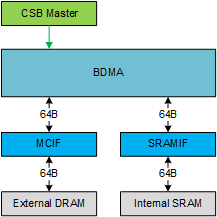

  Bridge DMA

Convolution Pipeline
--------------------

.. overview-2:

Overview
~~~~~~~~

The Convolution Pipeline is one of pipelines within the NVDLA core logic. 
It is used to accelerate the convolution algorithm. It supports comprehensive
programmable parameters for variable convolution sizes. Some features
like Winograd and multi-batch are applied within the convolution pipeline to
improve the performance and increase MAC efficiency.

The Convolution Pipeline has five stages, which are: Convolution DMA,
Convolution Buffer, Convolution Sequence Controller, Convolution MAC and
Convolution Accumulator. They are also called CDMA, CBUF, CSC, CMAC and
CACC respectively. Each stage has its own CSB slave port to receive configuration
data from the controlling CPU. A single synchronization mechanism is used 
by all stages.

The Convolution Pipeline supports three types of operations. They are:

-  Direct convolution for feature data, or DC mode

-  Convolution of image input, or image input mode

-  Winograd convolution, or Winograd mode

The convolution pipeline contains 1024 MACs for int16 or fp16, along with
a 32 element accumulator array for partial sum storage.  The 
MAC resources can also be configured to provide 2048 MACs for int8.
Additionally, there is 512KB of SRAM in convolution buffer, providing 
input weight and activation storage. These units are described in detail later 
in this document.

Below is the diagram of convolution pipeline.

.. _fig_image4_convolution_pipeline:

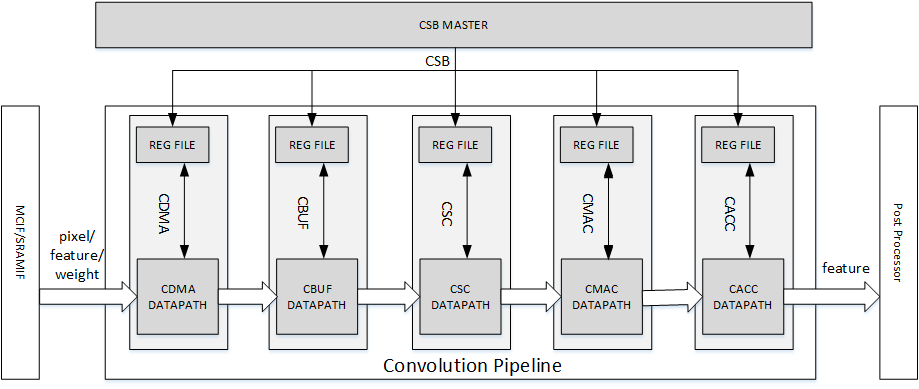

  Convolution Pipeline

Direct Convolution
~~~~~~~~~~~~~~~~~~

The convolution pipeline always has two parts of input data. One is input
activation data, the other is weight data. Suppose NVDLA engine has such
input parameters:

-  Size of feature data cube: *W*\ x\ *H*\ x\ *C*

-  Size of one weight kernel: *R*\ x\ *S*\ x\ *C*

-  Total kernel number: *K*

-  Zero padding size: *LP* at left boundary, *RP* at right boundary,
   *TP* at top boundary, *BP* at bottom boundary.

-  Convolution stride: *SX* in X dimension, *SY* in Y dimension

-  Dilation: *DX* in X dimension, *DY* in Y dimension

-  Size of output data cube: *W’*\ x\ *H’*\ x\ *C’*

.. _fig_image5_convolution_operation:

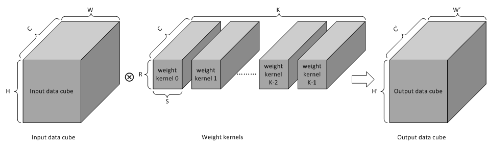

  Convolution operation

Figure below shows the convolution stride and zero padding.

.. _fig_image6_convolution_stride_and_pad:

.. figure:: ias_image6_convolution_stride_and_pad.svg
  :align: center

  Convolution stride and zero padding

Then the equations of these parameters are:

.. math:: S^{'} = \left( S - 1 \right) \times DX + 1

.. math:: R^{'} = \left( R - 1 \right) \times DY + 1

.. math:: W^{'} = \frac{LP + W + RP - S'}{\text{SX}} + 1

.. math:: H^{'} = \frac{TP + H + BP - R'}{\text{SY}} + 1

.. math:: C^{'} = K

.. equation of convolution parameters

The relationship of each element *y* in output data cube, element *x* in
input feature data cube and element *wt* in weight kernels is:

.. math:: y_{w,\ h,\ k} = \ \sum_{r = 0}^{R - 1}{\sum_{s = 0}^{S - 1}{\sum_{c = 0}^{C - 1}{x_{(w*SX - LP + r),(h*SY - TP + s),\ c}*\text{wt}_{r,s,\ c,k}}}}

.. equation of convolution

The coordinate *w,h,c,k* in above equations are all start from zero.

To accomplish the convolution operation in the above equation, the 
convolution pipeline uses a method called **direct convolution**. The key 
idea of direct convolution is to split the multiplication oerations from
each convolution kernel into groups such that each group contains 64 
multiplications. The basic rules are:

1. Distribute all MACs hardware into 16 sub units. One sub unit 
   is called MAC Cell, and has hardware for 64 int16/fp16 MACs, or
   for 128 int8 MACs.

2. The assembly of MAC Cells is called MAC Cell Array.

3. Divide all input data cubes into 1x1x64 element small cubes for
   int16, fp16 and int8.

4. Divide all weight data cubes into 1x1x64 element small cubes for
   int16, fp16 and int8.

5. Multiply one small input data cube by one small weight data cube, and
   add products together. These multiplications and additions are
   performed within one MAC cell.

6. Combine these compute operations into 4 operation levels, which are atomic
   operation, stripe operation, block operation and channel operation.

The four operations are described below using int6 percision mode as an example.

Atomic Operation
^^^^^^^^^^^^^^^^

Atomic Operation is the base step for direct convolution. In one atomic
operation, each MAC cell caches one 1x1x64 weight cubes from an
individual weight kernel. The 16 MAC cells therefor cache weights from 16 
int16/fp16 kernels or 32 int8 kernels.
One 1x1x64 atomic cube of feature
data is shared by all MAC cells. The MAC cells perform computing mentioned in
rule 5 above. The output of each MAC cell is called a **partial sum**. This
operation takes 1 cycle to complete, resulting in 16 partial
sums per cycle. Partial sums are sent to the convolution accumulator module for
further calculation.

The equation for the partial sum is:

.. math:: \text{PS}_{w,\ h,k,r,s,\ c} = \ \sum_{i = c}^{min(c + 63,\ C - 1)}{x_{(w*SX - LP + r),(h*SY - TP + s),\ i}*\text{wt}_{r,\ s,\ i,k}}

..  equation of atomic operation

In the equation, *PS* refers to partial sum. Variable *c* is always
divisible by 64.

A diagram showing the Atomic Operation is as below.

.. _fig_image7_atomic_operation:

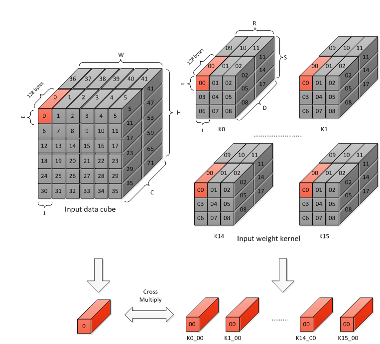

  Atomic operation

Stripe Operation
^^^^^^^^^^^^^^^^

A stripe operation combines a group of atomic operations from several
convolutions. During one stripe operation the weight data in MAC cell
array is kept unchanged. Input data slides along input data cube.

Notice the partial sums in one stripe operation cannot be added
together as the correspond to different points in the output cube.

The length of stripe operation has limitations. The lower limit 16 is
due to internal bandwidth to fetch weights for next stripe operation.
The upper limit is 32 due to buffer size in the accumulator. The 
length may be less than lower limit in some extreme cases.

The figure below shows an example of stripe operation which contains 16
atomic operations. The padding size is 0 in this case. Notice it’s not a
progressive scanning of input data cube.  Though generally, a stripe
does scan along the w dimension first.  The figure below shows an example
with no padding so the last two columns aren't part of the first stripe
(with a 3x3 kernel, no padding, and an input with w=6, the output will
have a w of 4).

.. _fig_image8_stripe_operation:

.. figure:: ias_image8_stripe_operation.svg
  :align: center

  Stripe operation

Block operation
^^^^^^^^^^^^^^^

A Block Operation is a higher level operation consisting of multiple 
stripe operations. During Block
Operation, each kernel in a kernel group uses RxSx64 
weight elements, along with
a small cube of input feature data sized properly to ensure that the
results can add together across stripe operations and accumulated into
the 16-32 element accumulator.

.. _fig_image9_block_operation:

.. figure:: ias_image9_block_operation.svg
  :align: center

  Block operation

All stripe operations in one block operation have the same atomic
operation number. The partial sums from the same block operation are
added together per stripe operation in the convolution accumulator. 
These results are called accumulative sum.

The equation of accumulative sum is:

.. math:: \text{AS}_{w,\ h,k,c} = \ \sum_{r = 0}^{R - 1}{\sum_{s = 0}^{S - 1}{\sum_{i = c}^{min(c + 63,\ C - 1)}{x_{(w*SX - LP + r),(h*SY - TP + s),\ i}*\text{wt}_{r,\ s,\ i,k}}}}

..  equation of block operation

In the equation, *AS* refers to accumulative sum. Variable *c* is always
divisible by 64.

Channel Operation
^^^^^^^^^^^^^^^^^

Channel operation is an even higher-level operation. It includes
(C+63)/64 block operations. The block operations in one channel
operation are similar, except the coordinate of channel direction is
different, showing as below

.. _fig_image10_channel_operation:

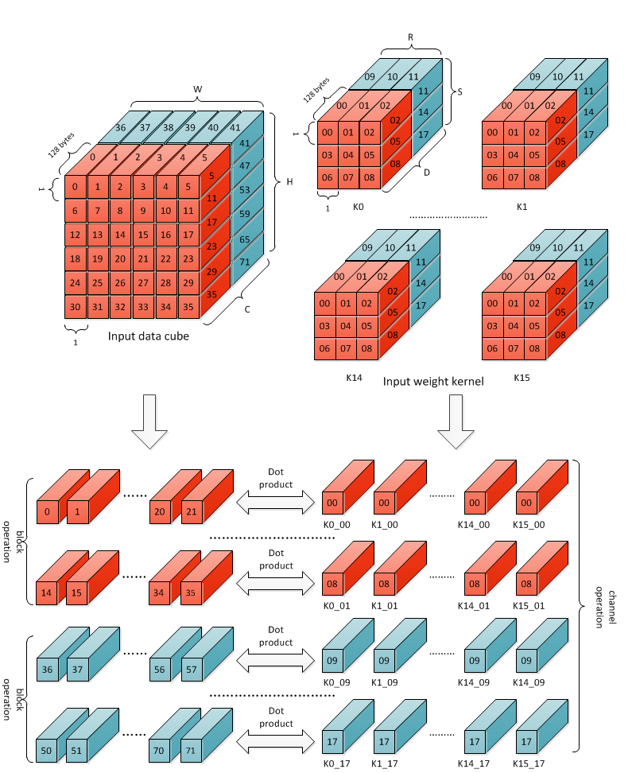

  Channel operation

All partial sums of one channel operation can be added together by
stripe operation. After a channel operation, the result in convolution
accumulator is exactly the convolution result.

The equation for the result of a channel operation s:

.. math:: y_{w,\ h,k} = \ \sum_{i = 0}^{\left\lfloor C/64 \right\rfloor - 1}{\sum_{r = 0}^{R - 1}{\sum_{s = 0}^{S - 1}{\sum_{j = c}^{min(c + 63,\ C - 1)}{x_{(w*SX - LP + r),(h*SY - TP + s),\ (i*64 + j)}*\text{wt}_{r,\ s,\ (i*64 + j),k}}}}}

..  equation of channel operation

This equation is identically equal to the original convolution equation
for a stripe of 16-32 output points.  After one channel operation, the
accumulator is unloaded and sent to the post-processor, making room for 
the next channel operation.

Group Operation
^^^^^^^^^^^^^^^

Group operation is a higher-level operation than channel operation. It
includes about int((dataout_height \* dataout_width) / stripe_size)
channel operations. After a group operation, the output data composes a W
x H x K’ output surface. Here K’ refers to kernel size in a kernel
group, with one kernel group being the number of kernels processed at a time, 
one per MAC Cell.

Output Sequence
^^^^^^^^^^^^^^^

The sequence mentioned in each operation is mainly for input feature
data and weight data, but not the output sequence. The output data
sequence is quite simple. It follows the order of C’(K’)->W->H->C(K).
Here C’ or K’ refers to kernel group size, which is 16 for int16/fp16
and 32 for int8.

The output order of direct convolution is consistent with feature memory
mapping order.

.. _fig_image11_output_sequence:

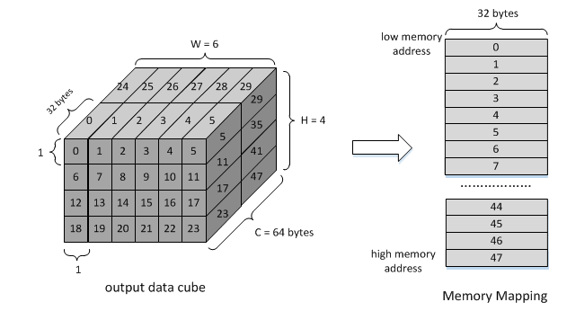

  Output sequence of a partition

Operation for Int8 and fp16
^^^^^^^^^^^^^^^^^^^^^^^^^^^

The operations mentioned above reflect int16 precision.  Fp16 is
handled identically.  However, int8 is handled a bit differently.

In convolution pipeline, each multiply-accumulate primitive for 
int16/fp16 is split into two MACs for int8.  
The element throughput of int8 is
therefore double the int16 element throughput.  

The table below records parameters of one atomic operation.

.. table:: Precision parameters of atomic operation
 :name: tab_precision_atomic_operation

 +-------------+-------------+-------------+-------------+-------------+
 | Convolution | Input Data  | Weights per | Kernels     | Output      |
 | Precision   | Elements    | Kernel      |             | Elements    |
 +=============+=============+=============+=============+=============+
 | int16       | 64          | 1024        | 16          | 16          |
 +-------------+-------------+-------------+-------------+-------------+
 | fp16        | 64          | 1024        | 16          | 16          |
 +-------------+-------------+-------------+-------------+-------------+
 | int8        | 64          | 2048        | 32          | 32          |
 +-------------+-------------+-------------+-------------+-------------+

Winograd Convolution
~~~~~~~~~~~~~~~~~~~~

Winograd convolution refers to an optional algorithm to optimize the
performance of direct convolution. The Convolution Pipeline supports
Winograd only for 3x3xC size kernels.

The motivation for the Winograd convolution is to reduce the number of
multiplications required, resulting in drastically increased performance for
a given number of MAC hardware elements.

Winograd requires some additional adders to perform the Winograd transform
on input and output activation data.

The equation for the Winograd Convolution used in the Convolution
Pipeline is:

.. math:: S = \ A^{T}\left\lbrack \left( \text{Gg}G^{T} \right) \odot \left( C^{T}\text{dC} \right) \right\rbrack A

..  equation of Winograd convolution

Here symbol ⊙ indicates element-wise multiplication. Symbol *g* is a 3x3
kernel and *d* is a 4x4 tile of input data cube. Symbol *S* is the
convolution result of *g* and *d.* It’s a 2x2 matrix.

.. math::

   g = \begin{bmatrix}
   \text{wt}_{0,0} & \text{wt}_{0,1} & \text{wt}_{0,2} \\
   \text{wt}_{1,0} & \text{wt}_{1,1} & \text{wt}_{1,2} \\
   \text{wt}_{2,0} & \text{wt}_{2,1} & \text{wt}_{2,2} \\
   \end{bmatrix}

.. math::

   d = \begin{bmatrix}
   x_{0,0} & x_{0,1} & x_{0,2} & x_{0,3} \\
   x_{1,0} & x_{1,1} & x_{1,2} & x_{1,3} \\
   x_{2,0} & x_{2,1} & x_{2,2} & x_{2,3} \\
   x_{3,0} & x_{3,1} & x_{3,2} & x_{3,3} \\
   \end{bmatrix}

..  matrices of oprand

*A*, *G* and *C* are matrices to transform the weight and input feature
data.

.. math::

   C = \begin{bmatrix}
   1 & 0 & 0 & 0 \\
   0 & 1 & - 1 & 1 \\
    - 1 & 1 & 1 & 0 \\
   0 & 0 & 0 & - 1 \\
   \end{bmatrix}

.. math::

   G = \begin{bmatrix}
   1 & 0 & 0 \\
   0.5 & 0.5 & 0.5 \\
   0.5 & - 0.5 & 0.5 \\
   0 & 0 & 1 \\
   \end{bmatrix}

.. math::

   A^{T} = \begin{bmatrix}
   1 & 1 & 1 & 0 \\
   0 & 1 & - 1 & - 1 \\
   \end{bmatrix}

..  matrices of transform

Suppose :math:`U=GgG^{T}` and :math:`V=C^{T}dC`, then the equation
is:

.. math:: S = \ A^{T}\left\lbrack U \odot V \right\rbrack A

..  equation of Winograd convolution

According to the equation, the multiplication with *A*, *G* and *C* can
be implemented with adders. Only 16 multiplications are required to
calculate 4 results for a 3x3 kernel, while in direct convolution mode
36 multiplications are required. Winograd is therefore 2.25 times the 
performance of Direct Convolution.

Step :math:`U=GgG^{T}` converts 3x3 kernel to 4x4 kernel used for a point-wise
multiplication against a 4x4 patch of the input activation cube. 
Software should
convert weight kernel before NVDLA engine is running. The Convolution
Pipeline handles the conversion of input feature data and the result of
multiplications.

Unlike in Direct Convolution, the Winograd Convolution Pipeline 
will divide kernels and input
feature data into 4x4x4 element small data cubes. Before the MAC Cell,
extra adders are used to convert these cubes with matrix :math:`C^{T}`
and *C*. This step is called PRA.

In one Winograd atomic operation, 64 products in one MAC cell are not 
simply added together as in Direct Convolution. The addition has three phases:

-  Phase 1, each of 4 products in the channel direction are added together. The
   output of phase 1 is 16 partial sums, representing a 4x4 matrix.

-  Phase 2, each 4x4 partial sum matrix is multiplied with matrix :math:`A^{T}`.
   The output of phase 2 is 8 partial sums, or a 4x2 matrix.

-  Phase 3, each 4x2 partial sum matrix from phase 2 is multiplied 
   with matrix *A*. The output is 4 partial sums.

Then 4 partial sums are stored in accumulator for further calculation.
Both phase 2 and phase 3 are called POA.

Winograd mode also has five operations. The comparing of parameters is
listed in table below.

.. table:: Parameters of operation modes
 :name: tab_cc_operation modes

 +-------------+-------------+-------------+-------------+-------------+
 | mode        | direct      | direct      | Winograd    | Winograd    |
 |             | convolution | convolution |             |             |
 +=============+=============+=============+=============+=============+
 | formats     | int16/fp16  | int8        | int16/fp16  | int8        |
 +-------------+-------------+-------------+-------------+-------------+
 | small data  | 1x1x64      | 1x1x64      | 4x4x4       | 4x4x4       |
 | cube per    |             |             |             |             |
 | MAC cell    |             |             |             |             |
 +-------------+-------------+-------------+-------------+-------------+
 | kernels per | 16          | 32          | 16          | 32          |
 | atomic      |             |             |             |             |
 | operation   |             |             |             |             |
 +-------------+-------------+-------------+-------------+-------------+
 | atomics     | 16~32       | 16~32       | 16~32       | 16~32       |
 | operation   |             |             |             |             |
 | per stripe  |             |             |             |             |
 | operation   |             |             |             |             |
 +-------------+-------------+-------------+-------------+-------------+
 | strips      | R*S         | R*S         | 1           | 1           |
 | operation   |             |             |             |             |
 | per block   |             |             |             |             |
 | operation   |             |             |             |             |
 +-------------+-------------+-------------+-------------+-------------+
 | blocks      | C/64        | C/64        | C/4         | C/4         |
 | operation   |             |             |             |             |
 | per channel |             |             |             |             |
 | operation   |             |             |             |             |
 +-------------+-------------+-------------+-------------+-------------+

The output sequence of Winograd convolution is similar to direct
convolution.  Some differences of Winograd:

-  For Winograd operation, the output width and height shall be
   divisible by 4. It’s a mandatory requirement. It’s for special scan
   order.

-  The scan order of stripe operation in Winograd convolution is
   different from direct convolution. Please see figure below.

-  The block operation always has only one stripe operation.

-  Winograd layer always outputs 4 lines in parallel. SDP will guarantee
   the correction of memory mapping of output data cube.

.. _fig_image12_scan_order_wino:

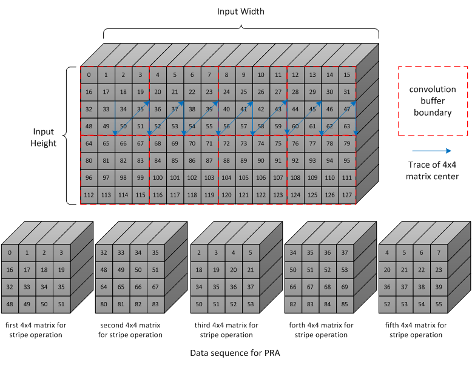

  Scan order of stripe operation in Winograd (W-H projection)

Deconvolution
~~~~~~~~~~~~~

Deconvolution is a type of special convolution. It is some kind of
inverse operation of normal convolution. Unlike normal convolution case,
deconvolution layer always enlarges the data cube after calculation.

In the NVDLA architecture, deconvolution is a SW feature. From HW
perspective, a SW deconvolution layer consists of a serial convolution
layer and a contract layer supported by the RUBIK unit.

:numref:`fig_image13_1d_deconvolution` is an example of a one-dimensional 
deconvolution layer. The Input data cube has dimensions W x 1 x 1 and 
kernel dimensions are 3 x 1 x 1. Though the
calculation flow is different from convolution, the result formula is:

.. math:: DAOUT_{i} = \sum_{j = 0}^{2}{DAIN_{i + j - 2}*W_{2 - j}}

.. Formula for one-dimension deconvolution

The formula is very similar to convolution formula, except weight R/S
order is reversed. More generally, the formula of a WxHxC input data
cube with K SxRxC kernels is:

.. math:: DAOUT_{(w,\ h,\ k)} = \sum_{x = 0}^{S - 1}{\sum_{y = 0}^{R - 1}{\sum_{z = 0}^{C - 1}{DAIN_{(w + x + 1 - S,h + y + 1 - R,\ z)}*W_{(S - 1 - x,R - 1 - y,z,k)}}}}

..  Formula for 3D deconvolution

According to equation, the 3D deconvolution is equal to a convolution
with (S-1) and (R-1) zero padding and reversed R/S weight order

.. _fig_image13_1d_deconvolution:

.. figure:: ias_image13_1d_deconvolution.svg
  :align: center

  One-dimensional deconvolution, x stride = 1

If the deconvolution X stride or Y stride is not 1, the calculation flow is
a bit different. The weight kernels are split into smaller kernel sets. Each
set of kernels operates as a convolution layer where X and Y strides are
equal to 1. Several convolution layers are therefore used to generate a 
deconvolution layer result.

After a serial convolution layer, all deconvolution result values are
ready but the mapping order is not expected result. If we append the
convolutional output cube one after another in C direction, then the
total output data cube is the Winograd channel-extended data cube. The
extension parameter is deconv_x_stride and deconv_y_stride.

So, NVDLA uses a special layer contract layer (performed by Rubik) 
to reorder these output values to get the desired deconvolutional output cube.

In conclusion, NVDLA supports deconvolution layer by below strategy:

-  NVDLA use two steps to perform a deconvolution layer which stride is
   bigger than 1

-  The first step is a serial convolution layers with order-reversed
   kernels.

-  The output of first step forms a Winograd channel-extended output
   data cube. Extension parameter is deconvolution x stride and
   deconvolution y stride.

-  The second step is running on RUBIK units.

-  Rubik unit does an inverse operation to Winograd channel-extended
   data cube.

-  After the second HW-layer, the output data cube is formated as per the expected result.

Convolution with Image Input
~~~~~~~~~~~~~~~~~~~~~~~~~~~~

NVDLA supports convolution with image data with a special mode to 
improve MAC utilization. Here image data could be a
part or whole image surface. However, NVDLA can only support it for
direct convolution. **DC**, **Winograd and deconvolution layer cannot
use pixel formats**. Multi-batch option is also not supported for
image input.

Comparing to DC, image input case has some difference:

-  Channel pre-extension. The weight kernel should do channel
   pre-extension. It is unlike DC mode or Winograd mode.

-  Data mapping in convolution buffer. The image data mapping in the
   convolution buffer is different from DC and Winograd mode. 
   All elements of left and right
   padding and input pixel line are compactly residing in CBUF entries.
   See figure below. If channel size is 4, the element mapping order is
   R(Y)->G(U)->B(V)->A(X). If channel size is 3, the order is
   R(Y)->G(U)->B(V).

-  Distribution of stripe operation. The stripe operation length is
   fixed to 64. And stripe operation shall never across lines. So that
   every stripe operation is started from first byte of a CBUF entry.

-  Use channel post-extension for speedup. Even with channel
   pre-extension, usually kernel channel size is less than 32.
   Therefore, channel post-extension is very useful for image input
   convolution layer.

.. _fig_image14_pixel_mapping_in_cbuf:

.. figure:: ias_image14_pixel_mapping_in_cbuf.svg
  :align: center

  Pixel mapping in convolution buffer

Channel Post-Extension
~~~~~~~~~~~~~~~~~~~~~~

Channel post-extension is an option for improving MAC utilization for
convolution with image input.

In the Convolution Pipeline, one atomic operation requires 64 elements in
channel dimension (excluding Winograd mode). If the channel size of the input
data cube is less than 64, MACs are not 100% utilized in each cycle.
Thus, MAC efficiency depends on channel size in DC mode and image input
mode.

The basic idea of channel post-extension is doing a vertical extension
to enlarge the channel size during runtime.

For example, an image input layer has 4x4x4 kernel size. If
post-extension is not enabled, the pre-extended channel size is 16 and
efficiency of MACs drops to 25%. However, if post-extension parameter is
set to 4, every atomic cycle convolution pipeline will fetch 4 neighboring
lines and combine them as a C=64 line. Then MAC efficiency rise back to
100%.

Some limitation of channel post-extension:

-  Channel post-extension is only for image input convolution.

-  Channel post-extension only supports 2-line extending and 4-line extending.

-  Channel post-extension is limited by pre-extended channel size and
   convolution x stride

.. table:: Limits of channel post-extension
 :name: tab_limits_of_channel_post_extension

 +----------------------+----------------------+----------------------+
 | Channel              | conv_x_stride limit  | pre-extended channel |
 | post-extension       |                      | size limit           |
 +======================+======================+======================+
 | 1-line               | No                   | No                   |
 +----------------------+----------------------+----------------------+
 | 2-lines              | (conv_x_stride \*    | <=32                 |
 |                      | ori_channel_size)    |                      |
 |                      | <=32                 |                      |
 +----------------------+----------------------+----------------------+
 | 4-lines              | (conv_x_stride \*    | <=16                 |
 |                      | ori_channel_size)    |                      |
 |                      | <=16                 |                      |
 +----------------------+----------------------+----------------------+

It’s necessary to mention that the channel post-extension number (N)
doesn’t need to be less than kernel height (R).  Hardware can
automatically tailor the redundant lines to avoid them be involved in
computation. However, this also means the user shouldn’t expect N times
of MAC efficiency improvements for this case.

Multi-Batch Mode
~~~~~~~~~~~~~~~~

NVDLA engine also supports multi-batch to enhance the performance and
reduce the bandwidth, especially for Fully-Connected (FC) layers. The
output of one FC layer is a 1x1xC data cube. That means all weights in
one FC layer are used only once. One stripe operation in FC layer has
only one atomic operation. But the convolution pipeline needs 16 cycles to
load weight for next atomic operation. This introduces a lot of bubbles in
the pipeline and MAC efficiency falls to 6.25%. To save the efficiency,
the NVDLA engine can apply multi-batch mode.

The multi-batch is a special option for DC mode with multiple input
feature data cubes being processed at once. The Convolution pipeline 
will fetch multiple input data
cubes for one set of weight kernels. This also changes the atomic
operation. Small cubes from different input data cubes are loaded
interlaced for atomic operation one after another. The stripe operation
then contains atomic operations for multiple batches. Since weights are reused
accross a stripe weight loading cycles are hidden and the efficiency increases.

The length of stripe operation with different batch size are:

.. table:: Stripe length of different batch size
 :name: tab_stripe_length_multi_batch_mode

 +---------------+------+------+------+-------+------+------+
 | Batch Size    | 1    | 2    | 3    | 4     | 5    | 6    |
 +===============+======+======+======+=======+======+======+
 | Normal length | 16   | 8x2  | 8x3  | 4x4   | 4x5  | 4x6  |
 +---------------+------+------+------+-------+------+------+
 | Max length    | 32   | 16x2 | 16x3 | 8x4   | 8x5  | 8x6  |
 +---------------+------+------+------+-------+------+------+
 | Batch Size    | 7    | 8    | 9    | 10    | 11   | 12   |
 +---------------+------+------+------+-------+------+------+
 | Normal length | 4x7  | 2x8  | 2x9  | 2x10  | 2x11 | 2x12 |
 +---------------+------+------+------+-------+------+------+
 | Max length    | 8x7  | 4x8  | 4x9  | 4x10  | 4x11 | 4x12 |
 +---------------+------+------+------+-------+------+------+
 | Batch Size    | 13   | 14   | 15   | 16~32 |      |      |
 +---------------+------+------+------+-------+------+------+
 | Normal length | 2x13 | 2x14 | 2x15 | 1xN   |      |      |
 +---------------+------+------+------+-------+------+------+
 | Max length    | 4x13 | 4x14 | 4x15 | 1xN   |      |      |
 +---------------+------+------+------+-------+------+------+

.. _fig_image15_multi_batch:

.. figure:: ias_image15_multi_batch.svg
  :align: center

  Multi-batch mode

Dilation
~~~~~~~~

Dilation is an option that enlarges the kernel in R and S dimensions
with zero values. This function can be enabled by SW according as needed.

The diagram below shows a case with the dilation parameter = 3.

.. _fig_image16_weight_dilation:

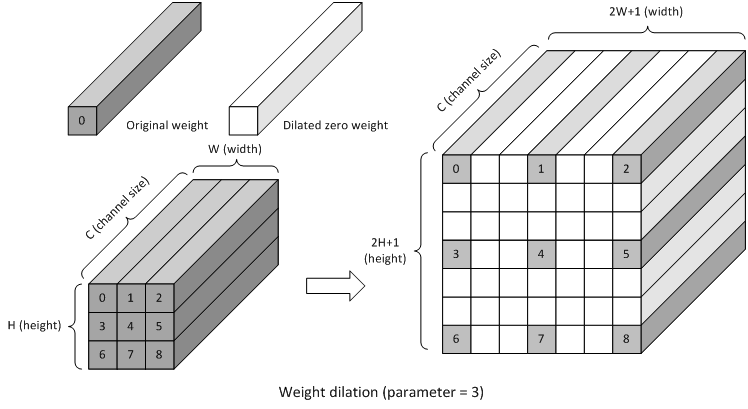

  Weight dilation

NVDLA supports dilation in both R and S dimensions.

Limits of dilation:

-  Dilation is available for DC mode only.

-  Dilation is not available for Winograd or image input mode.

Power Consideration
~~~~~~~~~~~~~~~~~~~

Convolution pipeline supports clock gating for each major pipeline stage. If the
pipeline stage is idle and no valid HW-layer is available, the data path
of pipeline stage will be clock gated. 

Convolution DMA
---------------

.. overview-3:

Overview
~~~~~~~~

Convolution DMA (CDMA) is a pipeline stage in the convolution pipeline. It
fetches data from SRAM/DRAM for the convolution operation and stores it
into a buffer (Convolution Buffer or CBUF) in the order needed for the 
convolution engine. Supported input formats are:

-  Pixel data

-  Feature data

-  Uncompressed/compressed weight

-  WMB

-  WGS

Two read channels connect from CDMA to the AXI interface.  These are the
weight read channel, and data read channel. To fetch the input formats
listed above, the channels are configured for that format formats. The table
below records the input data format to read channel mapping.

.. table:: Channel sharing in CDMA
 :name: tab_channel_sharing_in_cdma

 +--------------+-------------+-------------+-------------+-------------+
 | Input        | Image Case  | Uncompressed| Uncompressed| Compressed  |
 | Format       |             | Feature     | Weight Case | Weight Case |
 |              |             | Case        |             |             |
 |              |             |             |             |             |
 +==============+=============+=============+=============+=============+
 | Pixel data   | data        | NA          | NA          | NA          |
 |              | channel     |             |             |             |
 +--------------+-------------+-------------+-------------+-------------+
 | Uncompressed | NA          | data        | NA          | NA          |
 | feature      |             | channel     |             |             |
 | data         |             |             |             |             |
 +--------------+-------------+-------------+-------------+-------------+
 | Uncompressed | NA          | NA          | weight      | NA          |
 | weight       |             |             | channel     |             |
 +--------------+-------------+-------------+-------------+-------------+
 | Sparse       | NA          | NA          | NA          | weight      |
 | compressed   |             |             |             | channel     |
 | weight       |             |             |             |             |
 +--------------+-------------+-------------+-------------+-------------+
 | WMB          | NA          | NA          | NA          | weight      |
 |              |             |             |             | channel     |
 +--------------+-------------+-------------+-------------+-------------+
 | WGS          | NA          | NA          | NA          | weight      |
 |              |             |             |             | channel     |
 +--------------+-------------+-------------+-------------+-------------+

Convolution DMA sends memory read requests only. All memory read requests sent by
Convolution DMA are 64-byte aligned.

.. _fig_image17_cdma:

.. figure:: ias_image17_cdma.png
  :align: center

  Convolution DMA

CDMA consists of three sub-modules to
fetch pixel data or feature data for convolution: CDMA_DC, CDMA_WG 
and CDMA_IMG. The procedures of
these sub modules are similar, but differ in how they order the data
into the CBUF RAM. At any time, only one of the sub modules
is activated to fetch pixel/feature data.

Take CDMA_DC as an example to introduce the procedures:

-  Check status of convolution buffer for enough free space.

-  Generate read transactions

-  Cache feature data in shared buffers

-  Reshape feature cubes into proper order

-  Generate convolution buffer write address

-  Write feature data into convolution buffer

-  Update status of convolution buffer in the CDMA_STATUS sub-module

Convolution DMA uses a dedicated engine to handle the
requirements of Winograd. CDMA_WG has very similar structure and
functionality to CDMA_DC. However, the resulting feature data 
orginization in the convolution
buffer is different. Thus CDMA_WG has a special fetching sequence.
Additionally, CDMA_WG always performs Winograd channel extension.

The CDMA_IMG engine fetches pixel data from external memory. It
generates the address according to the data format, reorders the pixel
elements, and writes them into the proper entry of the convolution
buffer. The basic behavior of CDMA_IMG is like CDMA_DC, but it
operates on pixel data.

Only the CDMA_DC engine supports multi-batch mode. That is, fetching more
than one input feature data cube in one HW-layer to improve the
performance. The max batch size can be up to 32.

CDMA also use a dedicated engine for weight fetching: CDMA_WT. 
CDMA_WT is simple compared to other DMA engines, except
that it can support three read steams at a time. If the input weight
format is uncompressed, it only fetches weight data. If the input weight
format is compressed, weight, WMB, and WGS are all fetched. 
Please see `Data Formats
<http://nvdla.org/hw/format.html>`_ for more details of weight formats.

If the input weight data is compressed, two arbiters are enabled for
order of read streams. First a weighted round-robin arbiter grants a
request from the weight stream or the WMB stream. Then the winner competes with
the WGS request steam with a static priority arbitration. WGS always has priority.
The final winning request is sent to weight channel for data fetching.

CDMA_WT always tries to fill the convolution buffer as much as possible,
until the free entries runs out or weight fetching is complete.

CDMA maintains and communicates status of both the weight buffer and input
data buffer in CBUF. There are two copies of status in CDMA and CSC. Two
modules exchange the update/release information to decide when to fetch 
new feature/pixel/weight data and when to release these data elements.

.. power-consideration-1:

Power Consideration
~~~~~~~~~~~~~~~~~~~

Convolution DMA applies clock gating in the data path. The clock of data path of
convolution DMA is gated when it is idle and no hardware layer is
configured in the programmable registers. The regfile sub module inside 
convolution DMA is not clock gated so that new commands can be programmed.

Convolution Buffer
------------------

.. overview-4:

Overview
~~~~~~~~

The Convolution Buffer (CBUF) is a stage in convolution pipeline. It 
contains a total of 512KB of SRAM. The SRAMs cache input pixel data, 
input feature
data, weight data and WMB data from CDMA module, and are read by
convolution sequence generator module. CBUF has two write ports and
three read ports.

CBUF contains of 16 32KB banks. Each bank consists of two 512-bit-wide,
256-entry two-port SRAMs. These banks act as three logical circular
buffers:

-  Input data buffer

-  Weight buffer

-  WMB buffer

If the weight format is compressed, bank15 is assigned for WMB buffer,
while two other buffers can use bank0~bank14. If weight format is
uncompressed, WMB buffer is not assigned with any bank. In this case
data buffer and weight buffer can fully use all 16 banks. If total
required banks are less than 16, the remaining banks are unused.

Each buffer acts as circular buffers. New input data/weight/WMB has
incremental entry address. If the address reaches the max, it wraps to
zero and then starts increasing again.

.. _fig_image18_cbuf:

.. figure:: ias_image18_cbuf.png
  :align: center

  Convolution buffer

.. power-consideration-2:

Power Consideration
~~~~~~~~~~~~~~~~~~~

The Convolution Buffer applies clock gating for registers in the data path 
beyond the SRAMs.
The clock of Convolution Buffer data path is gated by SLCG when it is
idle and no HW-layer is available from the programmable registers. 
The configuration register block inside the convolution buffer is not 
clock gated so that a new configuration can be programmed.

Convolution Sequence Controller
-------------------------------

.. overview-5:

Overview
~~~~~~~~

The Convolution Sequence Controller (CSC) is responsible for loading input
feature data, pixel data, and weight data from CBUF and sending it to the
Convolution MAC unit. It’s the key module 
computing and controlling the convolution sequence descrbied in the
`Convolution Pipeline`_ seciton.

The Convolution Sequence Controller (CSC) includes three sub modules:
CSC_SG, CSC_WL and CSC_DL. See :numref:`fig_image19_csc`.

CSC_SG is the convolution sequence generator. This module generates
the sequence to control convolution operation.

The working flow of CSC_SG is as below:

1. Poll for enough data and weights in CBUF

2. Generate a pair of sequence package, including weight loading package
   and data loading package. Each package represents one stripe
   operation.

3. Push the two packages into two FIFOs

4. Two counters for weight and feature/pixel are both down counting

5. When the counters reach zero, check signals from the convolution accumulator
   for any back pressure

6. If all conditions are ready, send weight and data packages in proper
   time to CSC_WL and CSC_DL.

.. _fig_image19_csc:

.. figure:: ias_image19_csc.png
  :align: center

  Convolution sequence controller

CSC_DL is the convolution data loader. This module contains the logic to
execute the feature/pixel loading sequence. It receives packages from
sequence generator, loads feature/pixel data from CBUF and sends them to
the Convolution MAC. It also maintains the data buffer status and
communicates with CDMA to keep the status up to date. For winograd mode,
it also performs PRA (pre-addition) to transform the input feature data.

CSC_WL is short of convolution weight loader. This module contains the logic
to execute the weight loading sequence. It receives packages from the sequence
generator, loads weights from CBUF, and does necessary decompression and
sends them to convolution MAC. It maintains the weight buffer status
and communicates with CDMA_WT to keep the status up to date.

.. power-consideration-3:

Power Consideration
~~~~~~~~~~~~~~~~~~~

The Convolution Sequence Controller applies clock gating for registers 
in the data path.
The clock of data path for the convolution sequence controller is gated when 
idle and no HW-layer is available from the programmable
registers. The register file sub module inside
convolution sequence controller is not clock gated so that new 

Convolution MAC
---------------

.. overview-6:

Overview
~~~~~~~~

The Convolution MAC (CMAC) module is one stage of the convolution pipeline for
convolution operation. It receives input data and weight from the
convolution sequence controller (CSC), performs multiplication and addition,
and outputs the result to the convolution accumulator. When working in
Winograd mode the Convolution MAC performs POA (post addition) on the ouptut
to transform the result back to standard activation format.

CMAC has 16 identical sub modules called MAC cells. Each MAC cell contains 64
16-bit multipliers for int16/fp16. It also contains 72 adders for
int16/fp16 which are for Winograd POA. Each multiplier and adder can split into
two calculation units for int8 format. The throughput of int8 is twice
of int16 in any mode. The output result is called partial sum. The
pipeline depth is 7 cycles.

One bypassed pipeline in Convolution MAC is used to deliver status. The
status includes start and end operation flags. It takes status 4
cycles to go through pipeline, which is 3 cycles ahead of partial sum to
prefetch assembly buffer in CACC.

.. _fig_image20_cmac:

.. figure:: ias_image20_cmac.png
  :align: center

  Convolution MAC

For physical design optimization the CMAC is divided into two parts, CMAC_A and
CMAC_B. Each part has an individual CSB interface and register file. But they are
considered as one pipeline stage in usage.

.. power-consideration-4:

Power Consideration
~~~~~~~~~~~~~~~~~~~

The clock of data path
of the Convolution MAC is gated when it is idle and no hardware layer is
available from the programmable registers. The 
the programmable registers are not clock gated in the Convolution MAC so 
that software can program 

Besides, convolution MAC can clock gate the MAC cells individually. When
the number of kernels is not enough to fill all the MAC cells, the empty
ones will be automatically clock gated.

Convolution Accumulator
-----------------------

.. overview-7:

Overview
~~~~~~~~

The Convolution Accumulator (CACC) is the stage of the convolution pipeline
after CMAC.  It is used to accumulate partial sums from Convolution MAC, and
round/saturate the result before sending to SDP.  Additionally, the large
buffer in the convolution accumulator can smooth the peak throughput of the convolution pipeline.

The final result of accumulator in CACC is 48bits for INT16 and 34bits for INT8. 
The bit width between CACC and SDP is 32.
For precisions INT8 and INT16, there is a round and saturation operation before sending the result to SDP.
The precision of rounding is configured by field CLIP_TRUNCATE in register D_CLIP_CFG.
For FP16, the value is just converted from FP48 to FP32.

The components in CACC include assembly SRAM group, delivery SRAM group,
adder array, truncating array, valid-credit controller and a checker.

Here is the CACC working flow:

1. Prefetch accumulative sums from the assembly SRAM group.

2. When partial sums arrive, send them to adder array along with
   accumulative sums. If the partial sums are from the first stripe
   operation, the accumulative sums should be 0.

3. Gather new accumulative sums from output side of adder array.

4. Store into assembly SRAM group

5. Repeat step1~ step3 in terms of stripe operation until a channel
   operation is done.

6. If a channel operation is done, the output of adders is rounded and saturated.

7. Gather results of previous step and store them into delivery SRAM group.

8. Load results from delivery buffer group and send them to
   SDP

.. _fig_image21_cacc:

.. figure:: ias_image21_cacc.png
  :align: center

  Convolution accumulator

The assembly SRAM group contains 4 96Bx32 SRAMs and 4 64Bx32 SRAMs. The
buffer group is used to cache accumulative sums with high precision. For
direct convolution, assembly SRAM group acts as one 96Bx128 buffers for
int16/fp16 or one 136Bx128 buffer for int8. For Winograd convolution,
assembly SRAM acts as one 384Bx32 buffer for int16/fp16 or one 544Bx32
buffer for int8. It takes at least 11 cycles to do a read-store circle
for assembly group.

The delivery SRAM group contains 8 64Bx32 SRAMs. The buffer group is
used to cache the result to be delivered to SDP. The input varies
from 16 elements to 128 elements per cycle, while the output is always
16 elements per cycle.

The precision of accumulative sum is as below.

.. table:: CACC precision
 :name: tab_cacc_precision

 +----------------------+----------------------+----------------------+
 | Input Format         | Accumulative Sum     | Truncated Result     |
 +======================+======================+======================+
 | INT8                 | INT34                | INT32                |
 +----------------------+----------------------+----------------------+
 | INT16                | INT48                | INT32                |
 +----------------------+----------------------+----------------------+
 | FP16                 | FP44 (8b exponent,   | FP32 (IEEE754        |
 |                      | 38b signed decimal)  | standard)            |
 +----------------------+----------------------+----------------------+

In adder array, there are 64 INT48 adders, 64 INT34 adders and 64 FP48
adders. Part of them are activated in different mode

.. table:: Activated adders for different precision and mode
 :name: tab_adder_cacc

 +-----------------+-----------------+-----------------+-----------------+
 | Input Format    | Activated INT48 | Activated INT34 | Activated FP44  |
 | and Mode        | Adders          | Adders          | Adders          |
 +=================+=================+=================+=================+
 | INT8 DC/Image   | Adder 0~15      | Adder 0~15      | NA              |
 +-----------------+-----------------+-----------------+-----------------+
 | INT8 Winograd   | Adder 0~63      | Adder 0~63      | NA              |
 +-----------------+-----------------+-----------------+-----------------+
 | INT16 DC/Image  | Adder 0~15      | NA              | NA              |
 +-----------------+-----------------+-----------------+-----------------+
 | INT16 Winograd  | Adder 0~63      | NA              | NA              |
 +-----------------+-----------------+-----------------+-----------------+
 | FP16 DC/Image   | NA              | NA              | Adder 0~15      |
 +-----------------+-----------------+-----------------+-----------------+
 | FP16 Winograd   | NA              | NA              | Adder 0~63      |
 +-----------------+-----------------+-----------------+-----------------+

To support multi-batch option in DC mode, CACC applies data remapping
function in delivery SRAM group. That means when multi-batch is enabled,
the data ordering in delivery SRAM group may not match the sequence from
assembly SRAM group. Write controller of delivery SRAM will combine
atomic cubes if they will be in same 64 bytes package after further
calculation in SDP. This function allows SDP to send 64B aligned write
requests as many as possible when multi-batch is enabled. Below diagram
shows a case with batch size of 2.

.. _fig_image22_data_remapping_in_cacc:

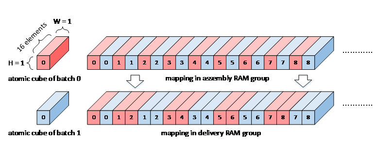

  Data remapping in CACC

The protocol between CMAC and CACC is valid-only protocol. In case of
overflow, CACC uses valid-credit protocol to back pressure CSC.

.. power-consideration-5:

Power Consideration
~~~~~~~~~~~~~~~~~~~

The Convolution Accumulator applies clock gating in the data path. 
The clock of data
path of Convolution Accumulator is gated when it is idle and no
HW-layer is available from programmable registers. 
The programmable registers within CACC aren't clock gated to allow 
for new instructions to be programmed.

Single Point Data Processor
---------------------------

.. overview-8:

Overview
~~~~~~~~

The Single Point Data Processor (SDP) is performs post processing
operations at the single data element level. In NVDLA version 
1.0, point processing is designed to accomplish following operations.

Bias Addition
~~~~~~~~~~~~~

For a convolutional layer, there’re always a bias addition after convolution.
In NVDLA, we implement bias addition in SDP.

The mathematic formula for bias addition is:

..
  image23, image24, image25

.. math:: y = x + bias

x is the input data can either come from Convolution Pipeline or SDP
M-RDMA;

bias is a pre-trained parameter which can be one of 3 options:

a) Register: If bias is unique for entire data cube;

b) SDP B/N/E-RDMA per-channel mode: If bias is shared for all elements
   in the same channel;

c) SDP B/N/E-RDMA per-element mode: If bias is different
   element-by-element;

Non-Linear Function
~~~~~~~~~~~~~~~~~~~

The Non-Linear function hardware in SDP is used to accomplish activation 
layer operations.

Based on current network analysis, there are three activation functions
are commonly used:

-  ReLU, for an input :math:`x`, the output is :math:`max(x,0)`.

-  Sigmoid, for an input :math:`x`, the output is
   :math:`\frac{1}{1 + e^{- x}}`.

.. _fig_image26_sigmoid:

.. figure:: ias_image26_sigmoid.png
  :align: center

  Sigmoid Function

-  Hyperbolic tangent, for an input :math:`x`, the output is
   :math:`\frac{1 - e^{- 2x}}{1 + e^{- 2x}}`.

.. _fig_image27_hyperbolic:

.. figure:: ias_image27_hyperbolic.png
  :align: center

  Hyperbolic Tangent Function

In the case of the ReLU activation function, it could be implemented directly by hardware
logic. Sigmoid and hyperbolic tangent functions are
non-linear functions, so they are expected to be implemented through a look-up
table which can be loaded with a function as needed. (see the Section "LUT programming" 
of Programming Guide document for details).

Batch Normalization
~~~~~~~~~~~~~~~~~~~

Batch normalization a is widely used layer. It can be descripted by
formula below:

.. math:: x^{'} = \frac{x - \mu}{\theta}

Where, :math:`\mu` is the mean and :math:`\theta` is the standard variance and x is element of
feature data cubes.

SDP support batch normalization with given mean/standard variance
parameters. The parameters are obtained from training.

SDP can support per layer parameter or per channel parameter to do batch
normalization operation. When the parameter is per channel, they are
interleaved in memory (see `Data Formats <http://nvdla.org/hw/format.html>`_). 
And a DMA in SDP will fetch the
parameter and calculate the feature data cube from the convolution pipeline.

Element-Wise Layer
~~~~~~~~~~~~~~~~~~

An Element-Wise layer refers to a type of operation between two feature
data cubes which have the same W, H and C size. These two W x H x C
feature data cubes do element-wise addition, multiplication or max/min
comparison operation and output one W x H x C feature data cube.

.. _fig_image31_element_wise:

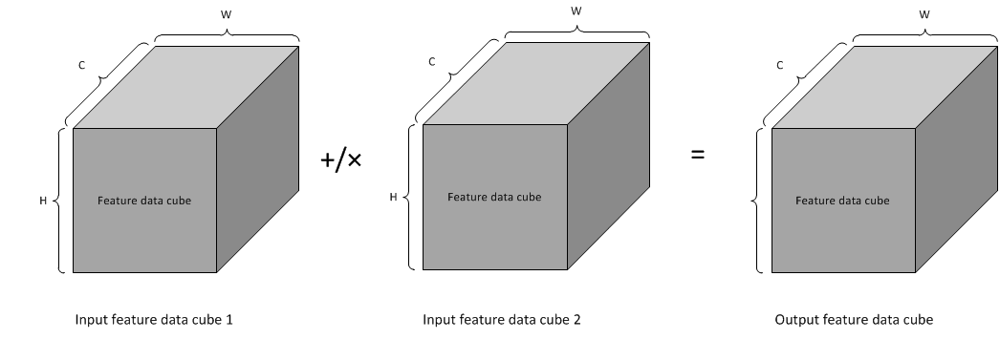

  Element-wise operation

The SDP unit can support element-wise layers for all 3 types of data
precisions. Every element-wise layer on SDP is configured to do addition
or multiplication.

SDP supports both online mode and offline mode for element-wise layer.
When online mode, one data cube comes from convolution pipeline, and the
other input data cube is fetched from memory. When offline mode, SDP
fetches both input data cubes from memory.

PReLU
~~~~~

Different from ReLU which clip negative values to 0, PReLU acts as:

.. _fig_image32_prelu:

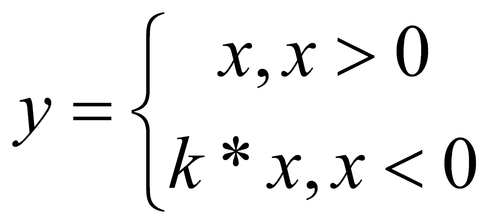

  PReLU

The scaling factor k can be either per cube constant or per-channel
variant.

SDP supports it by update the multiplier behavior: If PReLU mode is
selected, multiplier will bypass the positive value and apply scaling on
negative values only. PReLU mode is supported by a multiplier in all the 3
sub-modules.

Note that:

1. BatchNorm and PReLU feature are exclusive for a specific sub-unit,
this is due to only one multiplier is available for a subunit;

2. If PReLU is enabled for one sub-unit, the ALU in that unit MUST be
bypassed. This is due to there’s only one truncate for a sub-unit and
negative/positive requires different truncate here.

Format conversion
~~~~~~~~~~~~~~~~~

NVDLA supports INT8, INT16, and FP16 precisions.  Lower precision delivers higher
performance, while higher precision provides better inference results.

It’s possible that software requires different precision for different
hardware layers thus precision conversion is necessary.

SDP is responsible for precision conversion. The supported conversions
in one hardware layer are listed in :numref:`tab_precision_conversion_sdp`, "precision conversion for
SDP layer (offline)". If SDP sources data from the convolution core, 
the supported format conversion is listed in :numref:`tab_precision_conversion_conv`.

Precision conversion and normal SDP function are independent, which
means SDP is able to do conversion and operation (e.g.: Bias addition,
BatchNorm, EW, etc) at the same time.

Comparison
~~~~~~~~~~

Comparison mode in SDP_Y takes 2 inputs then compares them. If any element pair from
the input data cubes mismatches, a status register is updated after the hardware layer
is complete.

To save bandwidth, there won’t be any output write to external
memory in comparison mode.

Function Description
~~~~~~~~~~~~~~~~~~~~

Following diagram shows the internal blocks of the point processing sub-unit and
connections to other sub-units.

.. _fig_image33_sdp:

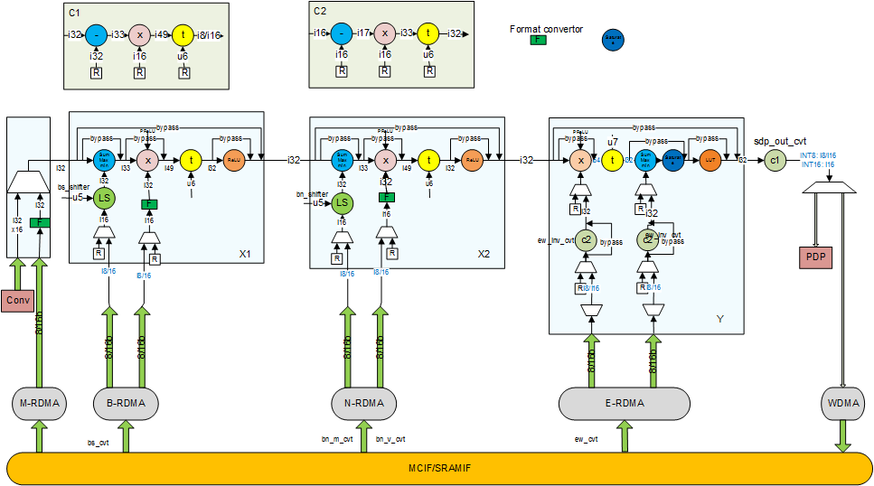

  Single point Data Processing block diagram

Function Blocks:

There are several function blocks, each of which targets a different
purpose:

-  Block M is used to select input data from MEM or Conv Core, which can be
   set from register

-  Block X1/X2 have the same architecture and supports: Bias addition,
   BatchNorm, PReLU, ReLU, Eltwise.

-  Block Y is primarily designed for element-wise, but it’s also able to
   support Bias addition, PReLU. An extra LUT operation which can be selected
   before output to implement any non-linear operation.

-  Block C1/C2 is for additional scaling and offset to save bits while
   keeping accuracy high.

-  A Demux on the very end to send the output data to either WDMA for
   writing back to memory, or to PDP for a subsequent pooling operation.

Most of function units have a configurable bypass mode so SW can
choose full function or partial to match all the operations needed in
one hardware layer.

The throughput for each sub-unit is:

+----------+-------------------+
| Sub-unit | Throughput        |
+==========+===================+
| X1/X2    | 16 elements/cycle |
+----------+-------------------+
| Y        | 4 elements/cycle  |
+----------+-------------------+

1. Working Mode: Flying:

   a. On-flying: source data is from Conv-Core

   b. Off-flying: source data is from Memory, which is read by M-RDMA

2. Bias Addition:

   a. Operand data can be per element, per channel or per cube, the
      actual operation can be performed at any of X1/X2/Y based on
      software configuration

      i.  Bias data will be fetched from MEM if per element/channel. If
          truncate is enabled, all elements shares a same truncate value

      ii. Bias data will be set by register if per cube

   b. Multiplier will be bypassed

3. Batch Normalization

   a. Operand data can be per element, per channel or per cube, the
      actual operation can be performed in X1/X2/Y based on the software
      configuration.

      i.  Operand data will be fetched from MEM if per element/channel.
          If truncate is enabled, all elements shares a same truncate
          value.

      ii. Operand data will be set through a software configuration 
          register if per cube.

   b. Operand data for the adder and multiplier should be packed
      together and in same format of per element, per channel or per
      cube.  See `Data Formats <http://nvdla.org/hw/format.html>`_ for details.

   c. ReLU can be bypassed or enabled.

4. Element-Wise

   a. Operand data can be per element, per channel or per cube

      i.  Operand data will be fetched from MEM if per element/channel,
          if truncate is enabled, all elements shares a same truncate
          value

      ii. Operand data will be set by software configuration register if per cube

   b. Operand data should be either for max/min/sum, or for the multiplier

   c. LUT can be bypassed or enabled

5. PReLU:

   a. Operand data can be per channel or per cube

      i.  Operand data will be fetched from MEM if per channel, if
          truncate is enabled, all elements shares a same truncate value

      ii. Operand data will be set by register if per cube;

   b. PReLU mode bit should be set as true for multiplier.  After this bit 
      is set, hardware will bypass positive input samples, and the scaling will be 
      applied on negative iputs.

   c. LUT can be bypassed or enabled

6. Hybrid Mode (SW feature)

   Bias addition/BatchNorm operations are linear operations. This means
   software can fuse those operation into one sub-module to optimize
   power/perf. Take BiasAddition + BatchNorm for example, if they’re
   working on separated submodule, the formula is: :math:`x^{'} = x + bias`,
   :math:`y = \frac{x^{'} - \mu}{\theta}`.

   If we fuse those 2 formulas as one: :math:`y = \frac{x + bias - \mu}{\theta} = \frac{x - (\mu - bias)}{\theta}`.

   As :math:`\mu, \theta, bias` are pre-trained parameters, software can fuse them into one cube
   thus it’s doable;

As a summary, the features supported by each sub-unit are listed in
table below:

.. table:: SDP supported use scenarios
 :name: tab_sdp_supported_use_scenarios

 +-----------------------+----+----+---+
 | Feature\Module        | X1 | X2 | Y |
 +=======================+====+====+===+
 | Bias addition         | Y  | Y  | Y |
 +-----------------------+----+----+---+
 | BatchNorm             | Y  | Y  | Y |
 +-----------------------+----+----+---+
 | Eltwise               | Y  | Y  | Y |
 +-----------------------+----+----+---+
 | PReLU                 | Y  | Y  | Y |
 +-----------------------+----+----+---+
 | ReLU                  | Y  | Y  | Y |
 +-----------------------+----+----+---+
 | Non-linear activation | N  | N  | Y |
 +-----------------------+----+----+---+

Data Sequence:

Take BIAS addition as an example, If BIAS/Operand Data is per element:

Point processing input/output sequence is determined by the convolution
output sequence. In most of cases, input and output sequence orders in
all input/output interfaces are the same, and it is exactly the
convolution output sequence which is shown in the following diagram.

.. _fig_image37_sdp_sequence:

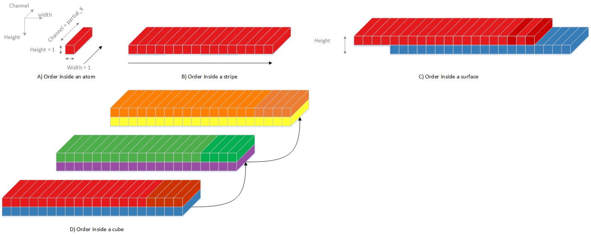

  Point processing input/output sequences

Bias/Operand Data is Per Channel:

Data will be fetched from memory, and maintain one value for multiple
cycles when feature data is processing on the same surface.  It will then
update to the value of the next surface when feature data changes to the next
surface.

Bias/Operand Data is Per Cube:

Data will be set in a software configuration register, and will not change 
throughout the execution time for a hardware layer.

Buffer Size Estimation
~~~~~~~~~~~~~~~~~~~~~~

There are three major buffers in the single data processing subunit: LUT in
the activation block, read DMA buffer, and write DMA buffer. LUT size is
(65+ 257) \*2(BPE) = 644Bytes.

For feature read DMA buffer in the M block there are two constraints to
consider to determine its size. One is covering internal SRAM access latency.
The latency is expected to be about 128 cycles. The other is access bandwidth.
Each partial feature data element is 16 bits, and SDP needs to process
16 elements per cycle, so the required bandwidth is 32 bytes. The read
DMA buffer size is therefore\ :math:`128 \times 32 = 4\ KBytes`.

Unlinke feature data, if BS/BN/EW has to support BatchNorm mode
which has 32bits per element.  Thus the read DMA buffer size for those 2
modules are: 32(bits)*128(cycles)*16(elements)/8=8Kbytes.

.. power-consideration-6:

Power Consideration
~~~~~~~~~~~~~~~~~~~

Element-Wise/BatchNorm operation are not always included in a given network.
So for uch of the operations, BS/BN/EW are not fully running thus clock
gating is utilized.

Planar Data Processor
---------------------

.. overview-9:

Overview
~~~~~~~~

The Planar Data Processor (PDP) executes operations along the width x
height plane. In NVDLA version 1.0, the PDPD is designed to
accomplish pooling layers. Max, min, and mean pooling
methods are supported. Several neighboring input elements within a plane
will be sent to a non-linear function to compute one output element.
The following diagram shows an example for max-pooling.  The maximum value
among 3x2 neighboring elements is the pooling result value.

.. _fig_image38_max_pooling:

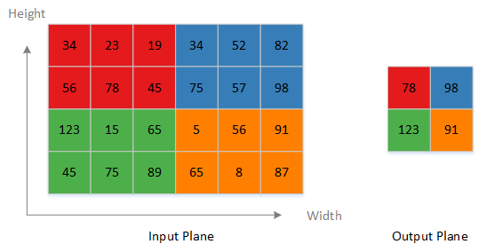

  Max-pooling example

The following diagram shows the internal blocks of the PDP sub-unit,
along with connections to other units and sub-units. The diagram is 
captures the functionality conceptually and 
is does not show the actual RTL modules and hierarchies. The planar data
processing sub-unit receives data from SDP or MCIF/SRAMIF, and sends
data to MCIF/SRAMIF.

.. _fig_image39_pdp:

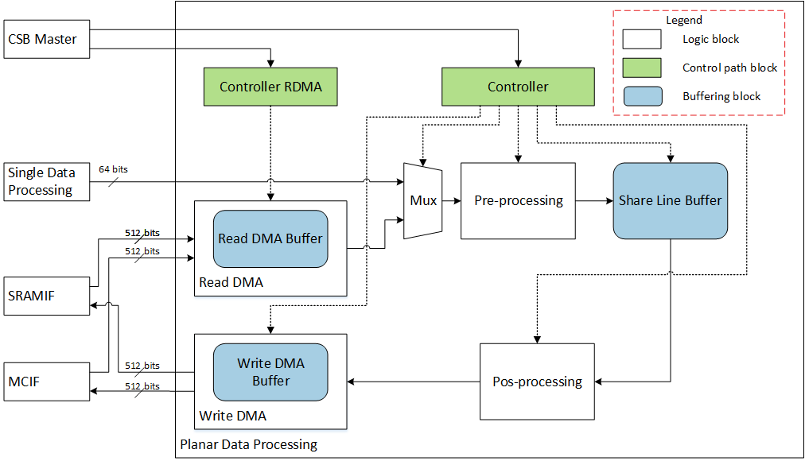

  Planar processing block diagram

.. _fig_image40_pdp:

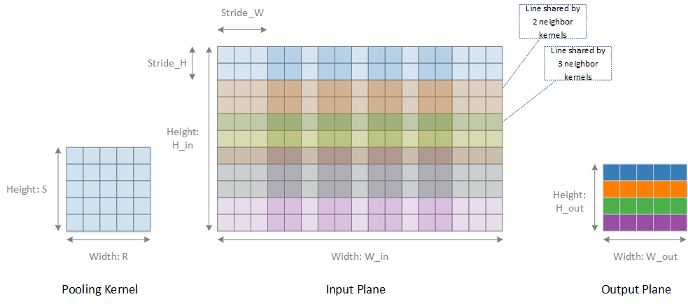

  Processing flow in one plane

Pooling operations are done within a plane. There is no interference
between different planes. :numref:`fig_image41_pdp_in_mode0` shows a complete scheme of
pooling in one plane. The offset of two neighboring kernels is called
stride. When stride is less than *R* and *S* of a kernel, there are
overlapped lines. Some line may be used by more than two neighboring
kernels. Input data is streamed in raster-scan order. For each pooling
kernel, the operated data is also streaming in raster scan order.

If an input data element is the first element of a kernel, it will be
stored to the share line buffer.  Data in the share line buffer is referred 
to as the partial result. If an input data element is neither the first element
nor the last element of a kernel, it will be operated on with the existed
partial result from share buffer, and the result will be stored to the
same entry of the original partial result. Partial result calculation is
done in the pre-processing block.

1. In cases of max/min pooling schemes, the partial result is the
   maximum/minimum value of the input element and the original partial
   result.

2. In case of mean pooling scheme, the partial result is the sum of the
   input element and the original partial result.

If an input data element is the last element of a kernel, it will be
operated with the existed partial result from the share line buffer to
generate a pre-final result. The post-processing block will fetch pre-final
results from share line buffer, and after proper operations it generates
the final result.  This final result is sent out to SRAMIF or MCIF.

1. In cases of max/min pooling schemes, the pre-final result is the
   final result, no extra operation is needed.

2. In case of mean pooling scheme, the final result could be calculated
   by
   :math:`pre\_ final\_ result \times \frac{1}{\text{Kerne}l_{\text{width}} \times Kernel_{\text{height}}} = pre\_ final\_ result \times scale\_ factor\_ width \times scale\_ factor\_ height`.
   Division is expensive for a hardware implementation, so a pair of
   :math:`scale\_ factors` are used to transform division into
   multiplication.

The greatest number of kernels which share the same line of data is
determined by
:math:`\text{ceiling}\left( \frac{Kernel\_ Height}{Stride\_ H} \right)`.
The total buffer entry number needed within a plane
is :math:`width\_ out \times ceiling\left( \frac{Kernel\_ Height}{Stride\_ H} \right)`
, and in the RTL design the assigned total buffer entry number
:math:`total\_ buf\_ entry` within one plane is as below, and 112 bits
for each entry:

(a) if
    :math:`\text{ceiling}\left( \frac{Kernel\_ Height}{Stride\_ H} \right)`
    = 1, :math:`total\_ buf\_ entry`\ =16*4*8=512;

(b) if
    :math:`\text{ceiling}\left( \frac{Kernel\_ Height}{Stride\_ H} \right)`
    = 2, :math:`total\_ buf\_ entry`\ =16*4*4=256;

(c) if
    :math:`\text{ceiling}\left( \frac{Kernel\_ Height}{Stride\_ H} \right)`
    = 3 or 4, :math:`total\_ buf\_ entry`\ =16*4*2=128;

(d) if
    :math:`\text{ceiling}\left( \frac{Kernel\_ Height}{Stride\_ H} \right)`
    > 4, :math:`total\_ buf\_ entry`\ =16*4*1=64;

Since the pooling operation is a down sampling method, there is a
significant amount of information are discarded.  Pooling in a large
kernel is too destructive. In current analyzed networks, there are
three most common cases, one is pooling size 3x3, with
stride 2x2. The other is pooling
size 2x2, with stride 2x2, and the last
is pooling size is 3x3, with stride 1x1.
There are two other less used cases: one is pooling
size 3x3, with stride 3x3. And the other
is pooling size 7x7, with stride 1x1.

.. table:: Pooling Kernel Type Summary
 :name: tab_pooling_kerne_type

 +---------+---------+---------+---------+---------+---------+---------+
 | Network | Total   | size 3x3| size 2x2| size 3x3| Other   | Other   |
 |         | Pooling | stride  | stride  | stride  | Layer   | Layer   |
 |         | Layer   | 2x2     | 2x2     | 1x1     | Number  | Pooling |
 |         | Number  | Number  | Number  | Number  |         | Format  |
 +=========+=========+=========+=========+=========+=========+=========+
 | AlexNet | 3       | 3       | 0       | 0       | 0       | NA      |
 +---------+---------+---------+---------+---------+---------+---------+
 | Overfea | 3       | 0       | 1       | 0       | 2       | size 3x3|
 | t-Accur |         |         |         |         |         | stride  |
 | ate     |         |         |         |         |         | 3x3     |
 +---------+---------+---------+---------+---------+---------+---------+
 | VGG 19  | 5       | 0       | 5       | 0       | 0       | NA      |
 +---------+---------+---------+---------+---------+---------+---------+
 | GoogLeN | 14      | 4       | 0       | 9       | 1       | size 7x7|
 | et      |         |         |         |         |         | stride  |
 |         |         |         |         |         |         | 1x1     |
 +---------+---------+---------+---------+---------+---------+---------+
 | NVDrive | 12      | 3       | 0       | 9       | 0       | NA      |
 | Net@960 |         |         |         |         |         |         |
 | x540    |         |         |         |         |         |         |
 +---------+---------+---------+---------+---------+---------+---------+

So 2 ~ 8 pooling kernel size (both in width and height) range and 1~8
stride range is enough for normal usage. In the RTL design, we set the
pooling kernel size range to 1~8, and set the stride range to 1 ~ 16.

There are two input paths for the planar data processing sub-unit.  One is
the single point data processing sub-unit, and the other is external RAM
(MC/SRAM). There is one output data path for planar processing
sub-unit.  Output data is always sent to RAM outside PDP (MC/SRAM). In
common practice, a pooling layer is inserted after a convolutional
layer. To save memory accessing consumptions, the planar data processing
sub-unit shall directly receive data from point processing unit if
following condition is met. Suppose output width is
:math:`\text{Width}_{\text{output}}`, total buffer size in byte is
:math:`\text{Size}_{\text{buffer}}`, overlapped line number
:math:`\text{Num}_{overlapped\_ line}`, Data width in byte is
:math:`\text{Data}_{\text{width}}`, the number of spatial plane is
called ongoing channel number :math:`\text{Num}_{ongoing\_ channels}`,
normally, :math:`\text{Num}_{ongoing\_ channels}` should be equals to
kernel_per_group (16 for INT16/FP16, 32 for INT8 pipe). Below is the
planar processing on-fly operation condition.

.. math:: Width_{output} \leq \frac{{Size}_{{buffer}}}{{Data}_{{width}} \times {Num}_{ongoing\_ channels} \times {Num}_{overlapped\_ line}} = \frac{{Size}_{{buffer}}}{{Data}_{{width}} \times {Num}_{ongoing\_ channels} \times f(ceil\left( \frac{{Height}_{{poolin}g_{{kernel}}}}{{Strid}e_{h}} \right))}

.. Planar processing on-the-fly operation condition

If
:math:`\text{ceil}\left( \frac{\text{Height}_{\text{poolin}g_{\text{kernel}}}}{\text{Strid}e_{h}} \right) = 1`
,
:math:`f\left( \text{ceil}\left( \frac{\text{Height}_{\text{poolin}g_{\text{kernel}}}}{\text{Strid}e_{h}} \right) \right) = 1`

If
:math:`\text{ceil}\left( \frac{\text{Height}_{\text{poolin}g_{\text{kernel}}}}{\text{Strid}e_{h}} \right) = 2`
,
:math:`f\left( \text{ceil}\left( \frac{\text{Height}_{\text{poolin}g_{\text{kernel}}}}{\text{Strid}e_{h}} \right) \right) = 2`

If
:math:`\text{ceil}\left( \frac{\text{Height}_{\text{poolin}g_{\text{kernel}}}}{\text{Strid}e_{h}} \right) = 3\ or\ 4`
,
:math:`f\left( \text{ceil}\left( \frac{\text{Height}_{\text{poolin}g_{\text{kernel}}}}{\text{Strid}e_{h}} \right) \right) = 4`

If
:math:`\text{ceil}\left( \frac{\text{Height}_{\text{poolin}g_{\text{kernel}}}}{\text{Strid}e_{h}} \right) > 4`
,
:math:`f\left( \text{ceil}\left( \frac{\text{Height}_{\text{poolin}g_{\text{kernel}}}}{\text{Strid}e_{h}} \right) \right) = 8`

When input data is sourced from the point processing sub-unit, the input data sequence is the
same as convolution output sequences which is shown in following
diagram.

.. _fig_image41_pdp_in_mode0:

.. figure:: ias_image41_pdp_in_mode0.png
  :align: center

  Planar processing input sequence, mode 0

And output sequence is shown in following diagram.

.. _fig_image42_pdp_out_mode0:

.. figure:: ias_image42_pdp_out_mode0.png
  :align: center

  Planar processing output sequence, mode 0

If planar processing on-the-fly operation condition is not meet, planar processing shall work in off-fly
mode, it receives data from PDMA, and the ongoing channel number is
always 16. There are two sub-cases, one is non-split-width, and the
other is split-width. The input data sequence is shown in following diagram.

.. _fig_image43_pdp_in_mode1_2:

.. figure:: ias_image43_pdp_in_mode1_2.png
  :align: center

  Planar processing input sequence, mode 1 and 2

The output data sequence is shown in following diagram.

.. _fig_image44_pdp_out_mode1_2:

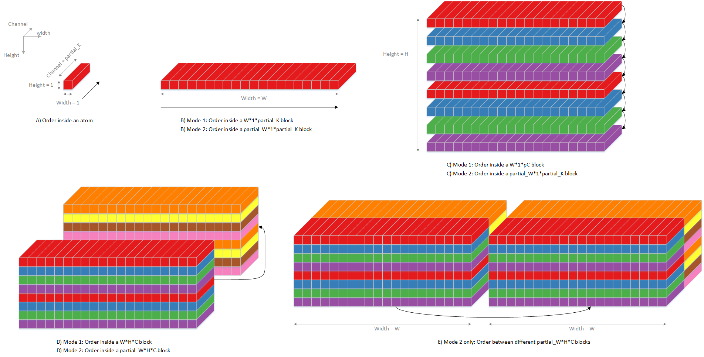

  Planar processing output sequence, mode 1 and 2

+----------------+------------------------------+-------------+
| Operation mode | Data Source                  | Split-Width |
+================+==============================+=============+
| Mode 0         | Single-point Data Processing | No          |
+----------------+------------------------------+-------------+
| Mode 1         | MC/SRAM                      | No          |
+----------------+------------------------------+-------------+
| Mode 2         | MC/SRAM                      | Yes         |
+----------------+------------------------------+-------------+

.. buffer-size-estimation-1:

Buffer Size Estimation
~~~~~~~~~~~~~~~~~~~~~~

There are three major buffers in planar data processing subunit: share
line buffer, read DMA buffer, and write DMA buffer. For share line
buffer, its size determines whether PDP could work directly on data from
SDP or not.
Based on input data cube
height :math:`\text{Height}_{\text{input data cube}}`, pooling kernel
height :math:`\text{Height}_{\text{pooling kernel}}`, pooling kernel
stride in height
direction :math:`\text{stride}_{\text{pooling kernel}}`, output data
cube width :math:`\text{Width}_{\text{output data cube}}`, group size
(16 elements of int16/FP16 or 32 elements of int8, ~32
byte) :math:`\ \text{Group}_{\text{size}}` and bytes_per_element(14/8
for INT8, 28/8 for INT16, 28/8 for FP16).

.. math:: Buffer\ Size = \text{Width}_{\text{output data cube}}*\frac{\text{Height}_{\text{pooling kernel}}}{\text{stride}_{\text{pooling kernel}}}*\text{Group}_{\text{size}}*bytes\_ per\_ element

If the share line buffer capacity is less than the required  consumption size, PDP
have to work in off-fly mode, so there will be a performance drop since
extra-time is needed to store data to MC/SRAM, and then fetch back to
PDP for pooling processing.

.. table:: Pooling Share Line Buffer Consumption Summary
 :name: tab_pooling_buffer_size

 +---------+---------+---------+---------+---------+---------+---------+
 | Layer   | Channel | Kernel  | Kernel  | Output  | Minimum | Maximum |
 |         | Number  | Size    | Stride  | Width   | Size    | Size    |
 +=========+=========+=========+=========+=========+=========+=========+
 | AlexNet | 96      | 3       | 2       | 27      | 1728    | 5184    |
 | – pool1 |         |         |         |         |         |         |
 +---------+---------+---------+---------+---------+---------+---------+
 | AlexNet | 128     | 3       | 2       | 13      | 832     | 3328    |
 | – pool2 |         |         |         |         |         |         |
 +---------+---------+---------+---------+---------+---------+---------+
 | AlexNet | 128     | 3       | 2       | 6       | 384     | 1536    |
 | – pool5 |         |         |         |         |         |         |
 +---------+---------+---------+---------+---------+---------+---------+
 | Overfea | 96      | 3       | 3       | 36      | 1152    | 6912    |
 | t-Accur |         |         |         |         |         |         |
 | ate     |         |         |         |         |         |         |
 | – layer |         |         |         |         |         |         |
 | 3       |         |         |         |         |         |         |
 +---------+---------+---------+---------+---------+---------+---------+
 | Overfea | 256     | 2       | 2       | 15      | 480     | 7680    |
 | t-Accur |         |         |         |         |         |         |
 | ate     |         |         |         |         |         |         |
 | – layer |         |         |         |         |         |         |
 | 6       |         |         |         |         |         |         |
 +---------+---------+---------+---------+---------+---------+---------+
 | Overfea | 1024    | 3       | 3       | 5       | 160     | 10240   |
 | t-Accur |         |         |         |         |         |         |
 | ate     |         |         |         |         |         |         |
 | – layer |         |         |         |         |         |         |
 | 19      |         |         |         |         |         |         |
 +---------+---------+---------+---------+---------+---------+---------+
 | VGG 19  | 64      | 2       | 2       | 112     | 3584    | 14336   |
 | – pool1 |         |         |         |         |         |         |
 +---------+---------+---------+---------+---------+---------+---------+
 | VGG 19  | 128     | 2       | 2       | 56      | 1792    |   14336 |
 | – pool2 |         |         |         |         |         |         |
 +---------+---------+---------+---------+---------+---------+---------+
 | VGG 19  | 256     | 2       | 2       | 28      | 896     |   14336 |
 | – pool3 |         |         |         |         |         |         |
 +---------+---------+---------+---------+---------+---------+---------+
 | VGG 19  | 512     | 2       | 2       | 14      | 448     |   14336 |
 | – pool4 |         |         |         |         |         |         |
 +---------+---------+---------+---------+---------+---------+---------+
 | VGG 19  | 512     | 2       | 2       | 7       | 224     | 7168    |
 | – pool5 |         |         |         |         |         |         |
 +---------+---------+---------+---------+---------+---------+---------+
 | GoogLeN | 64      | 3       | 2       | 56      | 3584    | 7168    |
 | et      |         |         |         |         |         |         |
 | -       |         |         |         |         |         |         |
 | pool1/3 |         |         |         |         |         |         |
 | x3_s2   |         |         |         |         |         |         |
 +---------+---------+---------+---------+---------+---------+---------+
 | GoogLeN | 192     | 3       | 2       | 56      | 3584    |   21504 |
 | et      |         |         |         |         |         |         |
 | -       |         |         |         |         |         |         |
 | pool2/3 |         |         |         |         |         |         |
 | x3_s2   |         |         |         |         |         |         |
 +---------+---------+---------+---------+---------+---------+---------+
 | GoogLeN | 192     | 3       | 1       | 28      | 2688    |   32256 |
 | et      |         |         |         |         |         |         |
 | -       |         |         |         |         |         |         |
 | incepti |         |         |         |         |         |         |
 | on_3a/p |         |         |         |         |         |         |
 | ool     |         |         |         |         |         |         |
 +---------+---------+---------+---------+---------+---------+---------+
 | GoogLeN | 256     | 3       | 1       | 28      | 2688    |   43008 |
 | et      |         |         |         |         |         |         |
 | -       |         |         |         |         |         |         |
 | incepti |         |         |         |         |         |         |
 | on_3b/p |         |         |         |         |         |         |
 | ool     |         |         |         |         |         |         |
 +---------+---------+---------+---------+---------+---------+---------+
 | GoogLeN | 480     | 3       | 2       | 14      | 896     |   13440 |
 | et      |         |         |         |         |         |         |
 | -       |         |         |         |         |         |         |
 | pool3/3 |         |         |         |         |         |         |
 | x3_s2   |         |         |         |         |         |         |
 +---------+---------+---------+---------+---------+---------+---------+
 | GoogLeN | 480     | 3       | 1       | 14      | 1344    |   40320 |
 | et      |         |         |         |         |         |         |
 | -       |         |         |         |         |         |         |
 | incepti |         |         |         |         |         |         |
 | on_4a/p |         |         |         |         |         |         |
 | ool     |         |         |         |         |         |         |
 +---------+---------+---------+---------+---------+---------+---------+
 | GoogLeN | 512     | 3       | 1       | 14      | 1344    |   43008 |
 | et      |         |         |         |         |         |         |
 | -       |         |         |         |         |         |         |
 | incepti |         |         |         |         |         |         |
 | on_4b/p |         |         |         |         |         |         |
 | ool     |         |         |         |         |         |         |
 +---------+---------+---------+---------+---------+---------+---------+
 | GoogLeN | 512     | 3       | 1       | 14      | 1344    |   43008 |
 | et      |         |         |         |         |         |         |
 | -       |         |         |         |         |         |         |
 | incepti |         |         |         |         |         |         |
 | on_4c/p |         |         |         |         |         |         |
 | ool     |         |         |         |         |         |         |
 +---------+---------+---------+---------+---------+---------+---------+
 | GoogLeN | 512     | 3       | 1       | 14      | 1344    |   43008 |
 | et      |         |         |         |         |         |         |
 | -       |         |         |         |         |         |         |
 | incepti |         |         |         |         |         |         |
 | on_4d/p |         |         |         |         |         |         |
 | ool     |         |         |         |         |         |         |
 +---------+---------+---------+---------+---------+---------+---------+
 | GoogLeN | 528     | 3       | 1       | 14      | 1344    |   44352 |
 | et      |         |         |         |         |         |         |
 | -       |         |         |         |         |         |         |
 | incepti |         |         |         |         |         |         |
 | on_4e/p |         |         |         |         |         |         |
 | ool     |         |         |         |         |         |         |
 +---------+---------+---------+---------+---------+---------+---------+
 | GoogLeN | 832     | 3       | 2       | 7       | 448     |   11648 |
 | et      |         |         |         |         |         |         |
 | -       |         |         |         |         |         |         |
 | pool4/3 |         |         |         |         |         |         |
 | x3_s2   |         |         |         |         |         |         |
 +---------+---------+---------+---------+---------+---------+---------+
 | GoogLeN | 832     | 3       | 1       | 7       | 672     |   34944 |
 | et      |         |         |         |         |         |         |
 | -       |         |         |         |         |         |         |
 | incepti |         |         |         |         |         |         |
 | on_5a/p |         |         |         |         |         |         |
 | ool     |         |         |         |         |         |         |
 +---------+---------+---------+---------+---------+---------+---------+
 | GoogLeN | 832     | 3       | 1       | 7       | 672     |   34944 |
 | et      |         |         |         |         |         |         |
 | -       |         |         |         |         |         |         |
 | incepti |         |         |         |         |         |         |
 | on_5b/p |         |         |         |         |         |         |
 | ool     |         |         |         |         |         |         |
 +---------+---------+---------+---------+---------+---------+---------+
 | GoogLeN | 1024    | 7       | 1       | 1       | 224     |   14336 |
 | et      |         |         |         |         |         |         |
 | -       |         |         |         |         |         |         |
 | pool5/7 |         |         |         |         |         |         |
 | x7_s1   |         |         |         |         |         |         |
 +---------+---------+---------+---------+---------+---------+---------+

In the above table, most of the
minimum cases are less than 7Kbytes. So as a result of balancing
performance and the share line buffer size is set as 7Kbyte.

For read DMA buffer, there are two constraints for determining its size.
One is covering MC accessing latency, assumed to be 128
cycles. The other is access bandwidth.  The peak performance case is 8
Bytes per cycle (8 elements in int8, 4 elements in int16/fp16). So the read
DMA buffer size is\ :math:`128 \times 8 = 1KBytes`.

.. power-consideration-7:

Power Consideration
~~~~~~~~~~~~~~~~~~~

Planar processing sub-unit targets for pooling layer in NVDLA 1.0, based
on analysis on current networks, planar processing usage is not 
expected to be high.

.. table:: Pooling Layer Percentage Summary
 :name: tab_pooling_layer_percentage

 +-------------------+-----------------+-----------------+-----------------+
 | Network           | Total Pooling   | Total Layer     | Percentage      |
 |                   | Layer Number    | Number\*        |                 |
 +===================+=================+=================+=================+
 | AlexNet           | 3               | 13              | 23%             |
 +-------------------+-----------------+-----------------+-----------------+
 | Overfeat-Accurate | 3               | 12              | 25%             |
 +-------------------+-----------------+-----------------+-----------------+
 | VGG 19            | 5               | 24              | 21%             |
 +-------------------+-----------------+-----------------+-----------------+
 | GoogLeNet         | 14              | 74              | 19%             |
 +-------------------+-----------------+-----------------+-----------------+

\* Total Layer Number = Convolution (including FC) + Pooling + LRN

Based on the pooling layer number percentage it’s highly likely that the
planar processing sub-unit is idle most of the time. Sub-unit level clock gating 
is therefore important.

Cross Channel Data Processor
----------------------------

.. overview-10:

Overview
~~~~~~~~

Cross Channel Data Processor (CDP) executes operations along channel
direction. In NVDLA version 1.0, channel processing is designed to
address local response normalization (LRN) layers. Local response
normalization performs a kind of lateral inhibition by normalizing over
local input region along the channel direction. The normalization function
is shown as follow

.. math:: \text{Result}_{w,h,c} = \frac{\text{Source}_{w,h,c}}{{(j + \frac{\alpha}{n}\sum_{i = max(0,c - \frac{n}{2})}^{min(C - 1,\ c + \frac{n}{2})}\text{Source}_{w,h,i}^{2})}^{\beta}}

.. 19 Local response normalization formula

Local region shape is always :math:`1 \times 1 \times n`. Number
:math:`n` is configurable, and its range
is :math:`\lbrack 3,5,7,9\rbrack`. Arithmetic functions such as division and
fractional exponents are expensive to implement with hard-wired gates. The above equation
could be decomposed into

.. math:: \text{Result}_{w,h,c} = \text{Source}_{w,h,c} \times f(\sum_{i = max(0,c - \frac{n}{2})}^{min(C - 1,\ c + \frac{n}{2})}\text{Source}_{w,h,i}^{2})

.. math:: f\left( x \right) = \frac{1}{{(j + \frac{\alpha}{n} \times x)}^{\beta}}

..  RESMO Function in Local Response Normalization Formula

Be noticed the
:math:`\sum_{i = max(0,c - \frac{n}{2})}^{min(C - 1,\ c + \frac{n}{2})}\text{Source}_{w,h,i}^{2}`
and :math:`\text{Source}_{w,h,c} \times f(x)` can be bypassed by
programming corresponding registers so that CDP can be treated as a
standalone lookup table (LUT) function.

The Look-up table approach is adopted for the RESMO
(reciprocation-exponent-sum-multi operation)\ :math:`f\left( x \right)`.

.. _fig_image45_cdp_curve:

.. figure:: ias_image45_cdp_curve.svg
  :align: center

  Curve for reciprocation-exponent-sum-multi operation

The following diagram shows internal blocks of the channel data processing
sub-unit and connections to other sub-units. The diagram is just for
capturing ideas and does not represent the actual RTL modules boundaries and hierarchies.

.. _fig_image46_cdp:

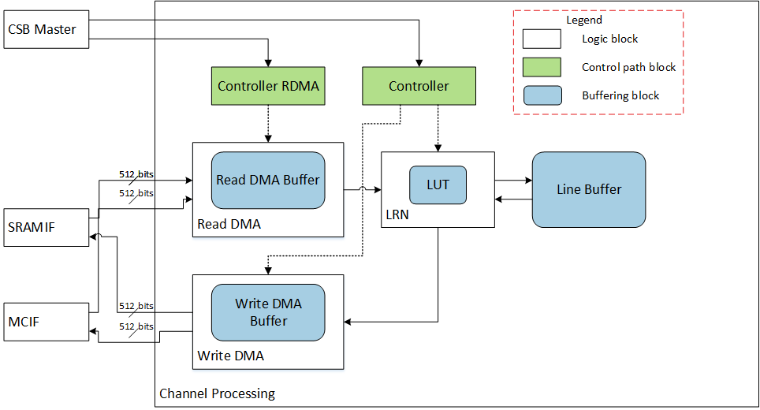

  Cross Channel Data Processing Block diagram

Channel processing sub-unit always works independently with other
processing sub-units. It receives input data from and send output data
to PDMA. Due to memory accessing constraint, the input data sequence is
in a particular orders. The input sequence is shown in following
diagram, and output sequence is the same as input sequence.

.. _fig_image47_cdp_seq:

.. figure:: ias_image47_cdp_seq.png
  :align: center

  Channel Processing input/output sequence

The following table shows LRN layers parameters in current well know networks.

.. table:: LRN Layer Parameter Summary
 :name: tab_lrn_layer

 +-------------------+------------------------+-------------------+--------+------+
 | Network           | Total LRN Layer Number | Local Size Number | Alpha  | beta |
 +===================+========================+===================+========+======+
 | AlexNet           | 2                      | 5                 | 0.0001 | 0.75 |
 +-------------------+------------------------+-------------------+--------+------+
 | Overfeat-Accurate | 0                      | NA                | 0.0001 | 0.75 |
 +-------------------+------------------------+-------------------+--------+------+
 | VGG-19            | 0                      | NA                | 0.0001 | 0.75 |
 +-------------------+------------------------+-------------------+--------+------+
 | GoogLeNet         | 2                      | 5                 | 0.0001 | 0.75 |
 +-------------------+------------------------+-------------------+--------+------+

Data elements on stripe edge may be used by to neighboring stripes.
Those data needs to be buffered, buffer entry number shall
be :math:`\left\lbrack \text{Max}\left( \text{loca}l_{\text{regio}n_{\text{size}}} \right) - 1 \right\rbrack \times 8 = 7 \times 8 = 56\ byte`.

.. buffer-size-estimation-2:

Buffer Size Estimation
~~~~~~~~~~~~~~~~~~~~~~

There are three major buffers in the cross-channel data processing subunit:
LUT in the activation block, read DMA buffer, and write DMA buffer. The LUT size
is the same as SDP (644Bytes).

For the read DMA buffer, there are two constraints for determining its size.
The first is to cover memory system access latency.  The assumption is
128 cycles. The other is access bandwidth.  The peak performance case is 8
Bytes per cycle (8 elements in int8, 4 elements in int16/fp16), so the read
DMA buffer size is :math:`128 \times 8 = 1KBytes`.

.. power-consideration-8:

Power Consideration
~~~~~~~~~~~~~~~~~~~

The channel data processing sub-unit targets for LRN layer in NVDLA 1.0. Based on
analysis of current networks, the channel processing usage is low.

.. table:: Local Response Layer Percentage
 :name: tab_lrn_percentage

 +-------------------+------------------------+----------------------+------------+
 | Network           | Total LRN Layer Number | Total Layer Number\* | Percentage |
 +===================+========================+======================+============+
 | AlexNet           | 2                      | 13                   | 15%        |
 +-------------------+------------------------+----------------------+------------+
 | Overfeat-Accurate | 0                      | 12                   | 0%         |
 +-------------------+------------------------+----------------------+------------+
 | VGG 19            | 0                      | 24                   | 0%         |
 +-------------------+------------------------+----------------------+------------+
 | GoogLeNet         | 2                      | 74                   | 3%         |
 +-------------------+------------------------+----------------------+------------+

\* Total Layer Number = Convolution (including FC) + Pooling + LRN

Based on local response normalization layer number percentage
the channel data processing sub-unit will be idle most of the time.  Therefore,
the design supports clock gating of the unit.

RUBIK
-----

.. overview-11:

Overview
~~~~~~~~

RUBIK module is similar to BDMA. It transforms data mapping format
without any data calculation. RUBIK has 3 working modes, they are:

-  contract data cube

-  split feature data cube into multi-planar formats

-  merge multi-planar formats to data cube

Since the module's function is to transform feature data cubes, we call it RUBIK
unit.

.. _fig_image48_cdp:

.. figure:: ias_image48_cdp.png
  :align: center

  RUBIK

Contract
~~~~~~~~

A software deconvolution layer always uses several HW-layers or two phases.
Phase I is generate result by convolution pipeline. And phase II is
contract mode by RUBIK.

Normally, a SW deconvolution layer has deconvolution x stride and y
stride that are greater than 1. And with these strides the output of
phase I HW-layer is a channel-extended data cube. Contract mode in RUBIK
transforms mapping format to de-extend the cube. The figure below shows a
remapping example where the x stride is 2 and the y stride is 3.

.. _fig_image49_rubik_contract:

.. figure:: ias_image49_rubik_contract.svg
  :align: center

  Contract mode in RUBIK

The formula of input cube size and output size are:

.. math:: W^{'} = W*deconv\_ x\_ stride

.. math:: H^{'} = H*deconv\_ y\_ stride

.. math:: C^{'} = \frac{C}{deconv\_ x\_ stride*deconv\_ y\_ stride\ }

..  Formula of data cube size in contract mode

The RUBIK engine does contract slice by slice. It takes one Wx1xC input slice
and converts it to a W’xH’xC’ output sub cube. Then it continues to the next input slice.
It never sends a request across a line boundary.

When doing contract, the input/output start address and line stride
shall align to 32 bytes. It always tries to send 256 byte requests. The
memory efficiency is between 80%~100% which is affected by start
address. If all address stride and start address are 256 byte aligned,
the memory efficiency reaches 100%.

Requirement of contract mode:

-  The channel size shall be divisible by deconvolution x stride, y
   stride and 32 bytes. As formula below:

.. math:: C\ \%\ \left( \text{decon}v_{x_{\text{stride}}}*deconv_{y_{\text{stride}}}*32 \right) == 0

-  Each dimension of input and output data cube, like input data width,
   output data width, input channel size, should not exceed 8192 in one
   contract layer.

Split and Merge
~~~~~~~~~~~~~~~

Split and merge are two opposite operation modes in RUBIK. Split
transforms a data cube into M-planar formats (NCHW). The number of planes
is equal to channel size. The merge mode transforms a serial of planes to a
feature data cube. The transform is showed in figure below.

.. _fig_image50_rubik_split_and_merge:

.. figure:: ias_image50_rubik_split_and_merge.svg
  :align: center

  Split and merge modes in RUBIK

The M-planar format is similar to image formats. It’s a pitch linear
format which contains T_R16_I, T_R8_I or T_R16_F data. Each plane
contains only 1 channel data or single element. The line stride and
planar stride of all planes(M-planar) shall align to 64 bytes. It’s
unlike other data formats for NVDLA.

.. power-consideration-9:

Power Consideration
~~~~~~~~~~~~~~~~~~~

The RUBIK unit applies clock gating in the data path. The clock of data 
path of RUBIK is
gated when the unit is idle and no HW-layer is available from the 
programmable registers. 

MCIF 
-----

MCIF is used to arbitrate requests from several internal sub modules and
convert to AXI protocol to connect to external DRAM. 

.. _fig_image51_mcif:

.. figure:: ias_image51_mcif.png
  :align: center

  MCIF

MCIF will support both a read and write channels, but some NVDLA
sub-module will only have read requirement, so the interface between
sub-module and MCIF will support read, write or both. CDMA0 and CDMA1 in
the above diagram will need read only, and other 5 will need both read and
write.

SRAMIF 
-------

The SRAMIF moduile is used to connect several internal
sub-modules to on-chip SRAM.  It's similar to the MCIF but the bus
latency is expected to be lower.

.. _fig_image52_sramif:

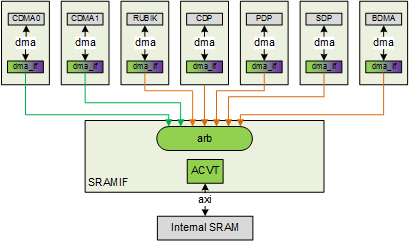

  SRAMIF

SRAMIF will support both read and write channels, but some NVDLA
sub-modules will only have a read requirement, so the interface between
DMA engines and SRAMIF will support read, write or both. CMDA0~1 will
need read channel only, while the other 5 will need both read and write.

Result Statistics
-----------------

To perform better calculation accuracy with limited precision data type
like int8, NVDLA engine involved a large number of converters in many
pipeline stages. Please see Section "Precision programming" of Programming Guide 
document for more detail.

In the runtime software, conversion parameters can be either a static value or a
dynamic value. To support the latter ones, software requires NVDLA hardware to 
provide rough statistics of output feature data cube and calculate the parameters
accordingly.

To achieve that, NVDLA implements result statistic registers in most
pipeline stages. These registers record:

-  Number of results that is equals to max non-infinity values.

-  Number of INF/NaN on input port

-  Number of INF on output port

Based on these statistic record, SW can tell rough situation of output
feature data cube and figure out proper parameters for next layer.

The pipeline stages involved in result statistic are:

-  Convolution DMA

-  Convolution accumulator

-  Single data processor

-  Planar data processor

-  Cross channel data processor

Here’s a list of statistic counting registers and its valid condition:

+----------------------------------+-------------------------------------+
| Register                         | Valid condition                     |
+==================================+=====================================+
| CDMA. D_INF_INPUT_DATA_NUM       | CDMA. IN_PRECISION==FP16            |
|                                  |                                     |
| CDMA. D_INF_INPUT_WEIGHT_NUM     |                                     |
+----------------------------------+-------------------------------------+
| CDMA. D_NAN_INPUT_DATA_NUM       | CDMA. IN_PRECISION==FP16            |
|                                  |                                     |
| CDMA. D_NAN_INPUT_WEIGHT_NUM     |                                     |
+----------------------------------+-------------------------------------+
| SDP_RDMA.D_STATUS_NAN_INPUT_NUM  | SDP_RDMA.IN_PRECISION==FP16 &&      |
| SDP_RDMA. D_STATUS_INF_INPUT_NUM |                                     |
|                                  | SDP_RDMA.PERF_NAN_INF_COUNT_EN==YES |
+----------------------------------+-------------------------------------+
| SDP. D_STATUS_NAN_INPUT_NUM      | Not used                            |
|                                  |                                     |
| SDP. D_STATUS_INF_INPUT_NUM      |                                     |
+----------------------------------+-------------------------------------+
| SDP. D_STATUS_NAN_OUTPUT_NUM     | SDP.OUT_PRECISION==FP16 &&          |
|                                  |                                     |
|                                  | SDP. PERF_NAN_INF_COUNT_EN=YES      |
+----------------------------------+-------------------------------------+
| CDP. D_INF_INPUT_NUM             | CDP. INPUT_DATA_TYPE=FP16           |
|                                  |                                     |
| CDP. D_NAN_INPUT_NUM             |                                     |
|                                  |                                     |
| CDP. D_NAN_OUTPUT_NUM            |                                     |
+----------------------------------+-------------------------------------+
| PDP. D_INF_INPUT_NUM             | PDP. INPUT_DATA =FP16               |
|                                  |                                     |
| PDP. D_NAN_INPUT_NUM             |                                     |
|                                  |                                     |
| PDP. D_NAN_OUTPUT_NUM            |                                     |
+----------------------------------+-------------------------------------+

Pipelines of NVDLA core
-----------------------

All sub units in NVDLA core logic is introduced in sections above. Some
sub units are combined as one pipeline; some are working as individual
pipelines. All of possible pipeline working modes are summarized in
table below.

.. table:: pipeline working mode of NVDLA core
 :name: tab_pipelines_nvdla_core

 +-----------------+-----------------+-----------------+-----------------+
 | Pipeline        | Sub Units       | Interface       | Support Layers  |
 | Working Mode    |                 |                 |                 |
 +=================+=================+=================+=================+
 | Convolution     | CDMA, CBUF,     | MCIF/SRAMIF     | direct          |
 | pipeline        | CSC, CMAC,      |                 | convolution,    |
 |                 | CACC, SDP       |                 | Winograd, image |
 |                 |                 |                 | input layer,    |
 |                 |                 |                 | element-wise    |
 |                 |                 |                 | layer,          |
 |                 |                 |                 | batch-normaliza |
 |                 |                 |                 | tion,           |
 |                 |                 |                 | activation      |
 |                 |                 |                 | (relu, prelu,   |
 |                 |                 |                 | sigmoid, etc.)  |
 |                 |                 |                 | layer           |
 +-----------------+-----------------+-----------------+-----------------+
 | Convolution &   | CDMA, CBUF,     | MCIF/SRAMIF     | direct          |
 | pooling         | CSC, CMAC,      |                 | convolution \+  |
 | pipeline        | CACC, SDP, PDP  |                 | pooling layer   |
 |                 |                 |                 |                 |
 |                 |                 |                 | (multi-batch    |
 |                 |                 |                 | mode is not     |
 |                 |                 |                 | supported)      |
 +-----------------+-----------------+-----------------+-----------------+
 | Offline SDP     | SDP             | MCIF/SRAMIF     | activation      |
 | pipeline        |                 |                 | layer,          |
 |                 |                 |                 | element-wise    |
 |                 |                 |                 | layer,          |
 |                 |                 |                 | batch-normaliza |
 |                 |                 |                 | tion            |
 |                 |                 |                 | layer, format   |
 |                 |                 |                 | conversion      |
 |                 |                 |                 | layer,          |
 |                 |                 |                 | comparison      |
 |                 |                 |                 | layer           |
 +-----------------+-----------------+-----------------+-----------------+
 | Offline PDP     | PDP             | MCIF/SRAMIF     | Pooling layer   |
 | pipeline        |                 |                 |                 |
 +-----------------+-----------------+-----------------+-----------------+
 | CDP pipeline    | CDP             | MCIF/SRAMIF     | LRN layer       |
 +-----------------+-----------------+-----------------+-----------------+
 | BDMA pipeline   | BDMA            | MCIF/SRAMIF     | Data            |
 |                 |                 |                 | transmission    |
 |                 |                 |                 | layer           |
 +-----------------+-----------------+-----------------+-----------------+
 | Rubik pipeline  | Rubik           | MCIF/SRAMIF     | Data transform  |
 |                 |                 |                 | layers          |
 +-----------------+-----------------+-----------------+-----------------+
