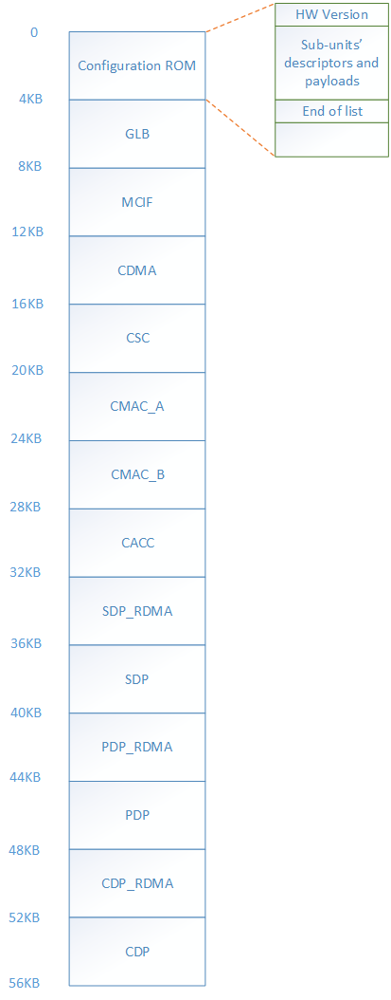
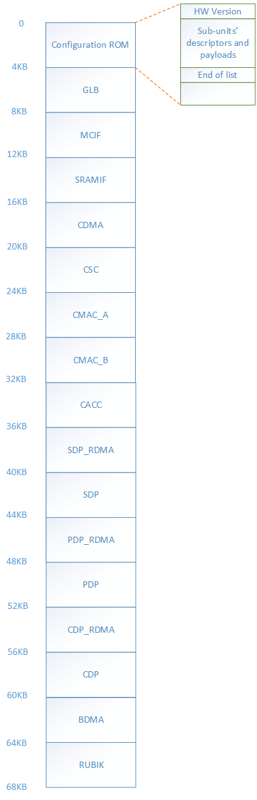

Scalability parameters and ConfigROM
************************************

Scalability parameters
======================

+-----------------+-----------------+-----------------+-----------------+
| **Scalability   | **Description** | **INT8 Large    | **INT8 Small    |
| Parameter**     |                 | Config(nv_large | Config(nv_small |
|                 |                 | )**             | )**             |
+=================+=================+=================+=================+
| NVDLA_FEATURE_D | Identify the    | INT8            | INT8            |
| ATA_TYPE_BINARY | data type of    |                 |                 |
| /INT4/INT8/INT16| input feature   |                 |                 |
| INT32/FP16/FP32 | data            |                 |                 |
| /FP64           |                 |                 |                 |
+-----------------+-----------------+-----------------+-----------------+
| NVDLA_WEIGHT_D  | Identify the    | INT8            | INT8            |
| ATA_TYPE_BINARY | data type of    |                 |                 |
| /INT4/INT8/INT16| input weight    |                 |                 |
| INT32/FP16/FP32 | data            |                 |                 |
| /FP64           |                 |                 |                 |
+-----------------+-----------------+-----------------+-----------------+
| NVDLA_WEIGHT_CO | Support of the  | YES             | NO              |
| MPRESSION_ENABL | feature of      |                 |                 |
| E               | weight          |                 |                 |
|                 | compression.    |                 |                 |
|                 | Disable this    |                 |                 |
|                 | can save area   |                 |                 |
|                 | in CBUF         |                 |                 |
+-----------------+-----------------+-----------------+-----------------+
| NVDLA_WINOG     | Support of the  | YES             | NO              |
| RAD_ENABLE      | optimization    |                 |                 |
|                 | feature of      |                 |                 |
|                 | weight          |                 |                 |
|                 | compression.    |                 |                 |
|                 | Disable this    |                 |                 |
|                 | can save area   |                 |                 |
|                 | of              |                 |                 |
|                 | CSC/CMAC/CACC   |                 |                 |
+-----------------+-----------------+-----------------+-----------------+
| NVDLA_MAC_ATOMI | MAC atomic size | 64              | 8               |
| C_C_SIZE        | of input        |                 |                 |
|                 | channel number  |                 |                 |
+-----------------+-----------------+-----------------+-----------------+
| NVDLA_MAC_ATOMI | MAC atomic size | 32              | 8               |
| C_K_SIZE        | of output       |                 |                 |
|                 | kernel number   |                 |                 |
+-----------------+-----------------+-----------------+-----------------+
| NVDLA_MEMORY_A  | Memory smallest | 32              | 8               |
| TOMIC_SIZE      | access size,    |                 |                 |
|                 | also the data   |                 |                 |
|                 | cube is aligned |                 |                 |
|                 | with this size. |                 |                 |
|                 | Note: the size  |                 |                 |
|                 | is # of feature |                 |                 |
|                 | data type       |                 |                 |
+-----------------+-----------------+-----------------+-----------------+
| NVDLA_BATCH_ENA | Support of      | YES             | No              |
| BLE             | optimization    |                 |                 |
|                 | feature of      |                 |                 |
|                 | batch.          |                 |                 |
|                 |                 |                 |                 |
|                 | Disable this    |                 |                 |
|                 | can save area   |                 |                 |
|                 | in              |                 |                 |
|                 | SDP/CACC/CSC/CD |                 |                 |
|                 | MA              |                 |                 |
+-----------------+-----------------+-----------------+-----------------+
| NVDLA_MAX_BATCH | Maximum batch   | 32              | -               |
| _SIZE           | size, this will |                 |                 |
|                 | directly impact |                 |                 |
|                 | the local       |                 |                 |
|                 | buffer size     |                 |                 |
+-----------------+-----------------+-----------------+-----------------+
| NVDLA_CBUF_BANK | Convolutional   | 16              | 32              |
| _NUMBER         | buffer bank     |                 |                 |
|                 | number          |                 |                 |
+-----------------+-----------------+-----------------+-----------------+
| NVDLA_CBUF_BANK | Convolutional   | 64B             | 8B              |
| _WIDTH          | buffer bank     |                 |                 |
|                 | data width      |                 |                 |
+-----------------+-----------------+-----------------+-----------------+
| NVDLA_CBUF_BANK | Convolutional   | 512             | 512             |
| _DEPTH          | buffer          |                 |                 |
|                 | bank depth      |                 |                 |
+-----------------+-----------------+-----------------+-----------------+
| NVDLA_SECONDARY | Support the     | Yes             | No              |
| _MEMIF_ENABLE   | secondary       |                 |                 |
|                 | memory          |                 |                 |
|                 | interface       |                 |                 |
+-----------------+-----------------+-----------------+-----------------+
| NVDLA_SDP_LUT_E | SDP support     | Yes             | No              |
| NABLE           | Look-up-Table   |                 |                 |
|                 | for non-linear  |                 |                 |
|                 | function        |                 |                 |
+-----------------+-----------------+-----------------+-----------------+
| NVDLA_SDP_BS_E  | SDP support     | Yes             | Yes             |
| NABLE           | Bias/Scaling    |                 |                 |
|                 | function        |                 |                 |
+-----------------+-----------------+-----------------+-----------------+
| NVDLA_SDP_BN_E  | SDP support     | Yes             | Yes             |
| NABLE           | Batch-Normaliza |                 |                 |
|                 | tion            |                 |                 |
|                 | function        |                 |                 |
+-----------------+-----------------+-----------------+-----------------+
| NVDLA_SDP_EW_E  | SDP support     | Yes             | No              |
| NABLE           | Element-wise-op |                 |                 |
|                 | eration         |                 |                 |
|                 | function        |                 |                 |
+-----------------+-----------------+-----------------+-----------------+
| NVDLA_SDP_BS_TH | Throughput of   | 16              | 1               |
| ROUGHPUT        | SDP             |                 |                 |
|                 | Bias/Scaling    |                 |                 |
|                 | function        |                 |                 |
+-----------------+-----------------+-----------------+-----------------+
| NVDLA_SDP_BN_TH | Throughput of   | 16              | 1               |
| ROUGHPUT        | SDP             |                 |                 |
|                 | Batch-Normaliza |                 |                 |
|                 | tion            |                 |                 |
|                 | function        |                 |                 |
+-----------------+-----------------+-----------------+-----------------+
| NVDLA_SDP_EW_TH | Throughput of   | 4               | -               |
| ROUGHPUT        | SDP             |                 |                 |
|                 | Element-wise-op |                 |                 |
|                 | eration         |                 |                 |
|                 | function        |                 |                 |
+-----------------+-----------------+-----------------+-----------------+
| NVDLA_BDMA_ENA  | Support         | Yes             | No              |
| BLE             | the bridge      |                 |                 |
|                 | DMA engine      |                 |                 |
|                 | function        |                 |                 |
+-----------------+-----------------+-----------------+-----------------+
| NVDLA_RUBIK_ENA | Support the     | Yes             | No              |
| BLE             | rubik engine    |                 |                 |
|                 | function        |                 |                 |
+-----------------+-----------------+-----------------+-----------------+
| NVDLA_PDP_ENABL | Support PDP     | Yes             | Yes             |
| E               | engine function |                 |                 |
+-----------------+-----------------+-----------------+-----------------+
| NVDLA_PDP_THROU | Throughput      | 8               | 1               |
| GHPUT           | of PDP engine   |                 |                 |
|                 | function        |                 |                 |
+-----------------+-----------------+-----------------+-----------------+
| NVDLA_CDP_ENAB  | Support CDP     | Yes             | Yes             |
| LE              | engine function |                 |                 |
+-----------------+-----------------+-----------------+-----------------+
| NVDLA_CDP_THROU | Throughput of   | 8               | 1               |
| GHPUT           | CDP engine      |                 |                 |
|                 | function        |                 |                 |
+-----------------+-----------------+-----------------+-----------------+
| NVDLA_PRIMARY_M | Primary memory  | 1               | 4               |
| EMIF_MAX_BURST  | interface       |                 |                 |
| _LENGTH         | maximum burst   |                 |                 |
|                 | length number   |                 |                 |
+-----------------+-----------------+-----------------+-----------------+
| NVDLA_PRIMARY_M | Primary memory  | 64B             | 8B              |
| EMIF_WIDTH      | interface data  |                 |                 |
|                 | width           |                 |                 |
+-----------------+-----------------+-----------------+-----------------+
| NVDLA_PRIMARY_M | Primary memory  | 1200            | 50              |
| EMIF_LATENCY    | interface data  |                 |                 |
|                 | return latency  |                 |                 |
|                 | cycles for read |                 |                 |
|                 | access          |                 |                 |
+-----------------+-----------------+-----------------+-----------------+
| NVDLA_SECONDARY | Secondary       | 4               | -               |
| _MEMIF_MAX_BURS | memory          |                 |                 |
| T_LENGTH        | interface       |                 |                 |
|                 | (SRAMIF)        |                 |                 |
|                 | maximum burst   |                 |                 |
|                 | length number   |                 |                 |
+-----------------+-----------------+-----------------+-----------------+
| NVDLA_SECONDARY | Secondary       | 64B             | -               |
| _MEMIF_WIDTH    | memory          |                 |                 |
|                 | interface       |                 |                 |
|                 | (SRAMIF) data   |                 |                 |
|                 | width           |                 |                 |
+-----------------+-----------------+-----------------+-----------------+
| NVDLA_SECONDARY | Secondary       | 128             | -               |
| _MEMIF_LATENCY  | memory          |                 |                 |
|                 | interface       |                 |                 |
|                 | (SRAMIF) data   |                 |                 |
|                 | return latency  |                 |                 |
|                 | cycles for read |                 |                 |
|                 | access          |                 |                 |
+-----------------+-----------------+-----------------+-----------------+
| NVDLA_MEMIF_ADD | Address bit     | 64              | 32              |
| RESS_WIDTH      | width           |                 |                 |
|                 | for external    |                 |                 |
|                 | memory          |                 |                 |
|                 | interface       |                 |                 |
+-----------------+-----------------+-----------------+-----------------+

Sub-unit identifier table
=========================

+-------------------------+-------------------+
| **Sub-unit Identifier** | **Sub-unit Name** |
+=========================+===================+
| 0x0000                  | End of list       |
+-------------------------+-------------------+
| 0x0001                  | GLB               |
+-------------------------+-------------------+
| 0x0002                  | CIF               |
+-------------------------+-------------------+
| 0x0003                  | CDMA              |
+-------------------------+-------------------+
| 0x0004                  | CBUF              |
+-------------------------+-------------------+
| 0x0005                  | CSC               |
+-------------------------+-------------------+
| 0x0006                  | CMAC              |
+-------------------------+-------------------+
| 0x0007                  | CACC              |
+-------------------------+-------------------+
| 0x0008                  | SDP_RDMA          |
+-------------------------+-------------------+
| 0x0009                  | SDP               |
+-------------------------+-------------------+
| 0x000a                  | PDP_RDMA          |
+-------------------------+-------------------+
| 0x000b                  | PDP               |
+-------------------------+-------------------+
| 0x000c                  | CDP_RDMA          |
+-------------------------+-------------------+
| 0x000d                  | CDP               |
+-------------------------+-------------------+
| 0x000e                  | BDMA              |
+-------------------------+-------------------+
| 0x000f                  | RUBIK             |
+-------------------------+-------------------+

Note:

1) CIF(ID=0x0002) can be configured to MCIF or SRAMIF.

2) There are two CMACs in nv_small and nv_large. (CMAC_A and CMAC_B)

3) CBUF doesn’t have registers.

Descriptors and payloads of sub-units in ConfigROM 
==================================================

The reg offset in bellow tables are the relative offset to the beginning
of current descriptor.

GLB
---

+-------------+-------------+-------------+-------------+-------------+
| Reg offset  | Reg name    | Reg fields  | Value in    | Value in    |
| (in Byte)   |             |             | nv_small    | nv_large    |
|             |             |             | config      | config      |
+=============+=============+=============+=============+=============+
| 0x0         | GLB_DESC    | Bits 0-15:  | 0x00000001  | 0x00000001  |
|             |             | unit id.    |             |             |
|             |             |             |             |             |
|             |             | Bits 16-31: |             |             |
|             |             | payload     |             |             |
|             |             | length.     |             |             |
+-------------+-------------+-------------+-------------+-------------+

CIF
---

+---------+---------+---------+---------+---------+---------+---------+
|         | Reg     | Reg     | Reg     | Value   | Value   | Value   |
|         | offset  | name    | fields  | in      | in      | in      |
|         | (in     |         |         | nv_smal | nv_larg | nv_larg |
|         | Byte)   |         |         | l       | e       | e       |
|         |         |         |         | config  | config  | config  |
|         |         |         |         |         | (MCIF)  | (SRAMIF |
|         |         |         |         |         |         | )       |
+=========+=========+=========+=========+=========+=========+=========+
|         | 0x0     | CIF_DES | Bits    | 0x00180 | 0x00180 | 0x00180 |
|         |         | C       | 0-15:   | 002     | 002     | 002     |
|         |         |         | unit    |         |         |         |
|         |         |         | id.     |         |         |         |
|         |         |         |         |         |         |         |
|         |         |         | Bits    |         |         |         |
|         |         |         | 16-31:  |         |         |         |
|         |         |         | payload |         |         |         |
|         |         |         | length. |         |         |         |
+---------+---------+---------+---------+---------+---------+---------+
| Incompa | 0x4     | CIF_CAP |         | 0x0     | 0x0     | 0x0     |
| tible   |         | _INCOMP |         |         |         |         |
| capabil |         | AT      |         |         |         |         |
| ities   |         |         |         |         |         |         |
+---------+---------+---------+---------+---------+---------+---------+
| Compati | 0x8     | CIF_CAP | bit 0:  | 0x0     | 0x0     | 0x1     |
| ble     |         | _COMPAT | CIF_IS  |         |         |         |
| capabil |         |         | _SRAM.  |         |         |         |
| ities   |         |         | Set to  |         |         |         |
|         |         |         | 1 if    |         |         |         |
|         |         |         | this    |         |         |         |
|         |         |         | CIF is  |         |         |         |
|         |         |         | connect |         |         |         |
|         |         |         | ed      |         |         |         |
|         |         |         | to a    |         |         |         |
|         |         |         | separat |         |         |         |
|         |         |         | e       |         |         |         |
|         |         |         | SRAM    |         |         |         |
|         |         |         | block.  |         |         |         |
+---------+---------+---------+---------+---------+---------+---------+
| Baselin | 0xc     | CIF_BAS | bits    | 0x8     | 0x40    | 0x40    |
| e       |         | E_WIDTH | 0-7:    |         |         |         |
| paramet |         |         | width   |         |         |         |
| ers     |         |         | (max    |         |         |         |
|         |         |         | 256B)   |         |         |         |
+---------+---------+---------+---------+---------+---------+---------+
|         | 0x10    | CIF_BAS | bits    | 0x32    | 0x4b0   | 0x80    |
|         |         | E_LATEN | 0-15:   |         |         |         |
|         |         | CY      | latency |         |         |         |
|         |         |         | (max    |         |         |         |
|         |         |         | 65535   |         |         |         |
|         |         |         | cycles) |         |         |         |
+---------+---------+---------+---------+---------+---------+---------+
|         | 0x14    | CIF_BAS | bits    | 0x4     | 0x4     | 0x4     |
|         |         | E\_     | 0-7:    |         |         |         |
|         |         | BURST_L | max_bur |         |         |         |
|         |         | ENGTH_M | st_leng |         |         |         |
|         |         | AX      | th      |         |         |         |
|         |         |         | (max    |         |         |         |
|         |         |         | 256B)   |         |         |         |
+---------+---------+---------+---------+---------+---------+---------+
|         | 0x18    | CIF_BAS | memory  | 0x20    | 0x40    | 0x40    |
|         |         | E_MEM_A | interfa |         |         |         |
|         |         | DDR_WID | ce      |         |         |         |
|         |         | TH      | address |         |         |         |
|         |         |         | width   |         |         |         |
+---------+---------+---------+---------+---------+---------+---------+

CDMA
----

+----------+----------+----------+----------+----------+----------+
|          | Reg      | Reg name | Reg      | Value in | Value in |
|          | offset   |          | fields   | nv_small | nv_large |
|          | (in      |          |          | config   | config   |
|          | Byte)    |          |          |          |          |
+==========+==========+==========+==========+==========+==========+
|          | 0x0      | CDMA_DES | Bits     | 0x003400 | 0x003400 |
|          |          | C        | 0-15:    | 03       | 03       |
|          |          |          | unit id. |          |          |
|          |          |          |          |          |          |
|          |          |          | Bits     |          |          |
|          |          |          | 16-31:   |          |          |
|          |          |          | payload  |          |          |
|          |          |          | length.  |          |          |
+----------+----------+----------+----------+----------+----------+
| Incompat | 0x4      | CDMA_CAP |          | 0x0      | 0x0      |
| ible     |          | _INCOMPA |          |          |          |
| capabili |          | T        |          |          |          |
| ties     |          |          |          |          |          |
+----------+----------+----------+----------+----------+----------+
| Compatib | 0x8      | CDMA_CAP | bit 0:   | 0x10     | 0x1b     |
| le       |          | _COMPAT  | WINOGRAD |          |          |
| capabili |          |          |          |          |          |
| ties     |          |          | bit 1:   |          |          |
|          |          |          | MULTI_BA |          |          |
|          |          |          | TCH      |          |          |
|          |          |          |          |          |          |
|          |          |          | bit 2:   |          |          |
|          |          |          | FEATURE\_|          |          |
|          |          |          | COMPRESS |          |          |
|          |          |          | ION      |          |          |
|          |          |          |          |          |          |
|          |          |          | bit 3:   |          |          |
|          |          |          | WEIGHT_C |          |          |
|          |          |          | OMPRESSI |          |          |
|          |          |          | ON       |          |          |
|          |          |          |          |          |          |
|          |          |          | bit 4:   |          |          |
|          |          |          | IMAGE_IN |          |          |
|          |          |          |          |          |          |
|          |          |          | bit 31:  |          |          |
|          |          |          | 1'b0     |          |          |
+----------+----------+----------+----------+----------+----------+
| Baseline | 0xc      | CDMA_BAS | Supporte | 0x10     | 0x10     |
| paramete |          | E_FEATUR | d        |          |          |
| rs       |          | E_TYPES  | data     |          |          |
|          |          |          | types of |          |          |
|          |          |          | input    |          |          |
|          |          |          | feature  |          |          |
|          |          |          | data     |          |          |
+----------+----------+----------+----------+----------+----------+
|          | 0x10     | CDMA_BAS | Supporte | 0x10     | 0x10     |
|          |          | E_WEIGHT | d        |          |          |
|          |          | _TYPES   | data     |          |          |
|          |          |          | types of |          |          |
|          |          |          | input    |          |          |
|          |          |          | weight   |          |          |
|          |          |          | data     |          |          |
+----------+----------+----------+----------+----------+----------+
|          | 0x14     | CDMA_BAS | atomic_c | 0x8      | 0x40     |
|          |          | E_ATOMIC |          |          |          |
|          |          | _C       |          |          |          |
+----------+----------+----------+----------+----------+----------+
|          | 0x18     | CDMA_BAS | atomic_k | 0x8      | 0x20     |
|          |          | E_ATOMIC |          |          |          |
|          |          | _K       |          |          |          |
+----------+----------+----------+----------+----------+----------+
|          | 0x1c     | CDMA_BAS | atomic_m | 0x8      | 0x20     |
|          |          | E_ATOMIC |          |          |          |
|          |          | _M       |          |          |          |
+----------+----------+----------+----------+----------+----------+
|          | 0x20     | CDMA_BAS | cbuf_ban | 0x20     | 0x10     |
|          |          | E_CBUF_B | k_number |          |          |
|          |          | ANK_NUM  |          |          |          |
+----------+----------+----------+----------+----------+----------+
|          | 0x24     | CDMA_BAS | cbuf_ban | 0x8      | 0x40     |
|          |          | E_CBUF_B | k_width  |          |          |
|          |          | ANK_WIDT |          |          |          |
|          |          | H        |          |          |          |
+----------+----------+----------+----------+----------+----------+
|          | 0x28     | CDMA_BAS | cbuf_ban | 0x200    | 0x200    |
|          |          | E_CBUF_B | k_depth  |          |          |
|          |          | ANK_DEPT |          |          |          |
|          |          | H        |          |          |          |
+----------+----------+----------+----------+----------+----------+
| Capabili | 0x2c     | CDMA_MUL | max_batc | 0x0      | 0x20     |
| ties’    |          | TI_BATCH | h        |          |          |
| paramete |          | _MAX     |          |          |          |
| rs       |          |          |          |          |          |
+----------+----------+----------+----------+----------+----------+
|          | 0x30     | CDMA_IMA | Supporte | 0x0cfff0 | 0x0cfff0 |
|          |          | GE_IN_FO | d        | 01       | 01       |
|          |          | RMATS_PA | packed   |          |          |
|          |          | CKED     | image    |          |          |
|          |          |          | formats  |          |          |
+----------+----------+----------+----------+----------+----------+
|          | 0x34     | CDMA_IMA | Supporte | 0x3      | 0x3      |
|          |          | GE_IN_FO | d        |          |          |
|          |          | RMATS_SE | semi-pla |          |          |
|          |          | MI       | nar      |          |          |
|          |          |          | image    |          |          |
|          |          |          | formats  |          |          |
+----------+----------+----------+----------+----------+----------+

CBUF
----

+----------+----------+----------+----------+----------+----------+
|          | Reg      | Reg name | Reg      | Value in | Value in |
|          | offset   |          | fields   | nv_small | nv_large |
|          | (in      |          |          | config   | config   |
|          | Byte)    |          |          |          |          |
+==========+==========+==========+==========+==========+==========+
|          | 0x0      | CBUF_DES | Bits     | 0x001800 | 0x001800 |
|          |          | C        | 0-15:    | 04       | 04       |
|          |          |          | unit id. |          |          |
|          |          |          |          |          |          |
|          |          |          | Bits     |          |          |
|          |          |          | 16-31:   |          |          |
|          |          |          | payload  |          |          |
|          |          |          | length.  |          |          |
+----------+----------+----------+----------+----------+----------+
| Incompat | 0x4      | CBUF_CAP |          | 0x0      | 0x0      |
| ible     |          | _INCOMPA |          |          |          |
| capabili |          | T        |          |          |          |
| ties     |          |          |          |          |          |
+----------+----------+----------+----------+----------+----------+
| Compatib | 0x8      | CBUF_CAP |          | 0x0      | 0x0      |
| le       |          | _COMPAT  |          |          |          |
| capabili |          |          |          |          |          |
| ties     |          |          |          |          |          |
+----------+----------+----------+----------+----------+----------+
| Baseline | 0xc      | CBUF_BAS | cbuf_ban | 0x20     | 0x10     |
| paramete |          | E_BANK_N | k_number |          |          |
| rs       |          | UM       |          |          |          |
+----------+----------+----------+----------+----------+----------+
|          | 0x10     | CBUF_BAS | cbuf_ban | 0x8      | 0x40     |
|          |          | E_BANK_W | k_width  |          |          |
|          |          | IDTH     |          |          |          |
+----------+----------+----------+----------+----------+----------+
|          | 0x14     | CBUF_BAS | cbuf_ban | 0x200    | 0x200    |
|          |          | E_BANK_D | k_depth  |          |          |
|          |          | EPTH     |          |          |          |
+----------+----------+----------+----------+----------+----------+
|          | 0x18     | CBUF_BAS | cdma_id  | 0x3      | 0x4      |
|          |          | E_CDMA_I |          |          |          |
|          |          | D        |          |          |          |
+----------+----------+----------+----------+----------+----------+

CSC
---

+----------+----------+----------+----------+----------+----------+
|          | Reg      | Reg name | Reg      | Value in | Value in |
|          | offset   |          | fields   | nv_small | nv_large |
|          | (in      |          |          | config   | config   |
|          | Byte)    |          |          |          |          |
+==========+==========+==========+==========+==========+==========+
|          | 0x0      | CSC_DESC | Bits     | 0x003000 | 0x003000 |
|          |          |          | 0-15:    | 05       | 05       |
|          |          |          | unit id. |          |          |
|          |          |          |          |          |          |
|          |          |          | Bits     |          |          |
|          |          |          | 16-31:   |          |          |
|          |          |          | payload  |          |          |
|          |          |          | length.  |          |          |
+----------+----------+----------+----------+----------+----------+
| Incompat | 0x4      | CSC_CAP\_|          | 0x0      | 0x0      |
| ible     |          | INCOMPAT |          |          |          |
| capabili |          |          |          |          |          |
| ties     |          |          |          |          |          |
+----------+----------+----------+----------+----------+----------+
| Compatib | 0x8      | CSC_CAP\_| bit 0:   | 0x10     | 0x1b     |
| le       |          | COMPAT   | WINOGRAD |          |          |
| capabili |          |          |          |          |          |
| ties     |          |          | bit 1:   |          |          |
|          |          |          | MULTI_BA |          |          |
|          |          |          | TCH      |          |          |
|          |          |          |          |          |          |
|          |          |          | bit 2:   |          |          |
|          |          |          | FEATURE\_|          |          |
|          |          |          | COMPRESS |          |          |
|          |          |          | ION      |          |          |
|          |          |          |          |          |          |
|          |          |          | bit 3:   |          |          |
|          |          |          | WEIGHT_C |          |          |
|          |          |          | OMPRESSI |          |          |
|          |          |          | ON       |          |          |
|          |          |          |          |          |          |
|          |          |          | bit 4:   |          |          |
|          |          |          | IMAGE_IN |          |          |
|          |          |          |          |          |          |
|          |          |          | bit 31:  |          |          |
|          |          |          | 1'b0     |          |          |
+----------+----------+----------+----------+----------+----------+
| Baseline | 0xc      | CSC_BASE | Supporte | 0x10     | 0x10     |
| paramete |          | _FEATURE | d        |          |          |
| rs       |          | _TYPES   | data     |          |          |
|          |          |          | types of |          |          |
|          |          |          | input    |          |          |
|          |          |          | feature  |          |          |
|          |          |          | data     |          |          |
+----------+----------+----------+----------+----------+----------+
|          | 0x10     | CSC_BASE | Supporte | 0x10     | 0x10     |
|          |          | _WEIGHT_ | d        |          |          |
|          |          | TYPES    | data     |          |          |
|          |          |          | types of |          |          |
|          |          |          | input    |          |          |
|          |          |          | weight   |          |          |
|          |          |          | data     |          |          |
+----------+----------+----------+----------+----------+----------+
|          | 0x14     | CSC_BASE | atomic_c | 0x8      | 0x40     |
|          |          | _ATOMIC_ |          |          |          |
|          |          | C        |          |          |          |
+----------+----------+----------+----------+----------+----------+
|          | 0x18     | CSC_BASE | atomic_k | 0x8      | 0x20     |
|          |          | _ATOMIC_ |          |          |          |
|          |          | K        |          |          |          |
+----------+----------+----------+----------+----------+----------+
|          | 0x1c     | CSC_BASE | atomic_m | 0x8      | 0x20     |
|          |          | _ATOMIC_ |          |          |          |
|          |          | M        |          |          |          |
+----------+----------+----------+----------+----------+----------+
|          | 0x20     | CSC_BASE | cbuf_ban | 0x20     | 0x10     |
|          |          | _CBUF_BA | k_number |          |          |
|          |          | NK_NUM   |          |          |          |
+----------+----------+----------+----------+----------+----------+
|          | 0x24     | CSC_BASE | cbuf_ban | 0x8      | 0x40     |
|          |          | _CBUF_BA | k_width  |          |          |
|          |          | NK_WIDTH |          |          |          |
+----------+----------+----------+----------+----------+----------+
|          | 0x28     | CSC_BASE | cbuf_ban | 0x200    | 0x200    |
|          |          | _CBUF_BA | k_depth  |          |          |
|          |          | NK_DEPGT |          |          |          |
|          |          | H        |          |          |          |
+----------+----------+----------+----------+----------+----------+
|          | 0x2c     | CSC_BASE | cdma_id  | 0x3      | 0x4      |
|          |          | _CDMA_ID |          |          |          |
+----------+----------+----------+----------+----------+----------+
| Capabili | 0x30     | CSC_MULT | max_batc | 0x0      | 0x20     |
| ties’    |          | I_BATCH\_| h        |          |          |
| paramete |          | MAX      |          |          |          |
| rs       |          |          |          |          |          |
+----------+----------+----------+----------+----------+----------+

CMAC
----

There are two CMAC (CMAC_A and CMAC_B) in NVDLA nv_small and nv_large
design. Their descriptors and payloads are same. They use different
slots of address space.

+----------+----------+----------+----------+----------+----------+
|          | Reg      | Reg name | Reg      | Value in | Value in |
|          | offset   |          | fields   | nv_small | nv_large |
|          | (in      |          |          | config   | config   |
|          | Byte)    |          |          |          |          |
+==========+==========+==========+==========+==========+==========+
|          | 0x0      | CMAC_DES | Bits     | 0x001c00 | 0x001c00 |
|          |          | C        | 0-15:    | 06       | 06       |
|          |          |          | unit id. |          |          |
|          |          |          |          |          |          |
|          |          |          | Bits     |          |          |
|          |          |          | 16-31:   |          |          |
|          |          |          | payload  |          |          |
|          |          |          | length.  |          |          |
+----------+----------+----------+----------+----------+----------+
| Incompat | 0x4      | CMAC_CAP |          | 0x0      | 0x0      |
| ible     |          | _INCOMPA |          |          |          |
| capabili |          | T        |          |          |          |
| ties     |          |          |          |          |          |
+----------+----------+----------+----------+----------+----------+
| Compatib | 0x8      | CMAC_CAP | bit 0:   | 0x0      | 0x0      |
| le       |          | _COMPAT  | WINOGRAD |          |          |
| capabili |          |          |          |          |          |
| ties     |          |          | bit 31:  |          |          |
|          |          |          | 1'b0     |          |          |
+----------+----------+----------+----------+----------+----------+
| Baseline | 0xc      | CMAC_BAS | Supporte | 0x10     | 0x10     |
| paramete |          | E_FEATUR | d        |          |          |
| rs       |          | E_TYPES  | data     |          |          |
|          |          |          | types of |          |          |
|          |          |          | input    |          |          |
|          |          |          | feature  |          |          |
|          |          |          | data     |          |          |
+----------+----------+----------+----------+----------+----------+
|          | 0x14     | CMAC_BAS | atomic_c | 0x8      | 0x40     |
|          |          | E_ATOMIC |          |          |          |
|          |          | _C       |          |          |          |
+----------+----------+----------+----------+----------+----------+
|          | 0x18     | CMAC_BAS | atomic_k | 0x8      | 0x20     |
|          |          | E_ATOMIC |          |          |          |
|          |          | _K       |          |          |          |
+----------+----------+----------+----------+----------+----------+
|          | 0x1c     | CMAC_BAS | cdma_id  | 0x3      | 0x4      |
|          |          | E_CDMA_I |          |          |          |
|          |          | D        |          |          |          |
+----------+----------+----------+----------+----------+----------+

CACC
----

+----------+----------+----------+----------+----------+----------+
|          | Reg      | Reg name | Reg      | Value in | Value in |
|          | offset   |          | fields   | nv_small | nv_large |
|          | (in      |          |          | config   | config   |
|          | Byte)    |          |          |          |          |
+==========+==========+==========+==========+==========+==========+
|          | 0x0      | CACC_DES | Bits     | 0x002000 | 0x002000 |
|          |          | C        | 0-15:    | 07       | 07       |
|          |          |          | unit id. |          |          |
|          |          |          |          |          |          |
|          |          |          | Bits     |          |          |
|          |          |          | 16-31:   |          |          |
|          |          |          | payload  |          |          |
|          |          |          | length.  |          |          |
+----------+----------+----------+----------+----------+----------+
| Incompat | 0x4      | CACC_CAP |          | 0x0      | 0x0      |
| ible     |          | _INCOMPA |          |          |          |
| capabili |          | T        |          |          |          |
| ties     |          |          |          |          |          |
+----------+----------+----------+----------+----------+----------+
| Compatib | 0x8      | CACC_CAP | bit 0:   | 0x0      | 0x3      |
| le       |          | _COMPAT  | WINOGRAD |          |          |
| capabili |          |          |          |          |          |
| ties     |          |          | bit 1:   |          |          |
|          |          |          | MULTI_BA |          |          |
|          |          |          | TCH      |          |          |
|          |          |          |          |          |          |
|          |          |          | bit 31:  |          |          |
|          |          |          | 1'b0     |          |          |
+----------+----------+----------+----------+----------+----------+
| VBaselin | 0xc      | CACC_BAS | Supporte | 0x10     | 0x10     |
| e        |          | E_FEATUR | d        |          |          |
| paramete |          | E_TYPES  | data     |          |          |
| rs       |          |          | types of |          |          |
|          |          |          | input    |          |          |
|          |          |          | feature  |          |          |
|          |          |          | data     |          |          |
+----------+----------+----------+----------+----------+----------+
|          | 0x10     | CACC_BAS | Supporte | 0x10     | 0x10     |
|          |          | E_WEIGHT | d        |          |          |
|          |          | _TYPES   | data     |          |          |
|          |          |          | types of |          |          |
|          |          |          | input    |          |          |
|          |          |          | weight   |          |          |
|          |          |          | data     |          |          |
+----------+----------+----------+----------+----------+----------+
|          | 0x14     | CACC_BAS | atomic_k | 0x8      | 0x20     |
|          |          | E_ATOMIC |          |          |          |
|          |          | _C       |          |          |          |
+----------+----------+----------+----------+----------+----------+
|          | 0x18     | CACC_BAS | atomic_m | 0x8      | 0x20     |
|          |          | E_ATOMIC |          |          |          |
|          |          | _K       |          |          |          |
+----------+----------+----------+----------+----------+----------+
|          | 0x1c     | CACC_BAS | cdma_id  | 0x3      | 0x4      |
|          |          | E_CDMA_I |          |          |          |
|          |          | D        |          |          |          |
+----------+----------+----------+----------+----------+----------+
| Capabili | 0x20     | CACC_MUL | max_batc | 0x0      | 0x20     |
| ties’    |          | TI_BATCH | h        |          |          |
| paramete |          | _MAX     |          |          |          |
| rs       |          |          |          |          |          |
+----------+----------+----------+----------+----------+----------+

SDP_RDMA
--------

+----------+----------+----------+----------+----------+----------+
|          | Reg      | Reg name | Reg      | Value in | Value in |
|          | offset   |          | fields   | nv_small | nv_large |
|          | (in      |          |          | config   | config   |
|          | Byte)    |          |          |          |          |
+==========+==========+==========+==========+==========+==========+
|          | 0x0      | SDP_RDMA | Bits     | 0x000e00 | 0x000e00 |
|          |          | _DESC    | 0-15:    | 08       | 08       |
|          |          |          | unit id. |          |          |
|          |          |          |          |          |          |
|          |          |          | Bits     |          |          |
|          |          |          | 16-31:   |          |          |
|          |          |          | payload  |          |          |
|          |          |          | length.  |          |          |
+----------+----------+----------+----------+----------+----------+
| Incompat | 0x4      | SDP_RDMA |          | 0x0      | 0x0      |
| ible     |          | _CAP_INC |          |          |          |
| capabili |          | OMPAT    |          |          |          |
| ties     |          |          |          |          |          |
+----------+----------+----------+----------+----------+----------+
| Compatib | 0x8      | SDP_RDMA |          | 0x0      | 0x0      |
| le       |          | _CAP_COM |          |          |          |
| capabili |          | PAT      |          |          |          |
| ties     |          |          |          |          |          |
+----------+----------+----------+----------+----------+----------+
| Baseline | 0xc      | SDP_RDMA | atomic_m | 0x8      | 0x20     |
| paramete |          | _BASE_AT |          |          |          |
| rs       |          | OMIC_M   |          |          |          |
+----------+----------+----------+----------+----------+----------+
|          | 0xe      | SDP_RDMA | sdp_id   | 0x9      | 0xa      |
|          |          | _BASE_SD | (slot id |          |          |
|          |          | P_ID     | of       |          |          |
|          |          |          | correspo |          |          |
|          |          |          | nding    |          |          |
|          |          |          | sdp)     |          |          |
+----------+----------+----------+----------+----------+----------+

SDP
---

+----------+----------+----------+----------+----------+----------+
|          | Reg      | Reg name | Reg      | Value in | Value in |
|          | offset   |          | fields   | nv_small | nv_large |
|          | (in      |          |          | config   | config   |
|          | Byte)    |          |          |          |          |
+==========+==========+==========+==========+==========+==========+
|          | 0x0      | SDP_DESC | Bits     | 0x002000 | 0x002000 |
|          |          |          | 0-15:    | 09       | 09       |
|          |          |          | unit id. |          |          |
|          |          |          |          |          |          |
|          |          |          | Bits     |          |          |
|          |          |          | 16-31:   |          |          |
|          |          |          | payload  |          |          |
|          |          |          | length.  |          |          |
+----------+----------+----------+----------+----------+----------+
| Incompat | 0x4      | SDP_CAP\_|          | 0x0      | 0x0      |
| ible     |          | INCOMPAT |          |          |          |
| capabili |          |          |          |          |          |
| ties     |          |          |          |          |          |
+----------+----------+----------+----------+----------+----------+
| Compatib | 0x8      | SDP_CAP\_| bit 0:   | 0x18     | 0x3f     |
| le       |          | COMPAT   | WINOGRAD |          |          |
| capabili |          |          |          |          |          |
| ties     |          |          | bit 1:   |          |          |
|          |          |          | MULTI_BA |          |          |
|          |          |          | TCH      |          |          |
|          |          |          |          |          |          |
|          |          |          | bit 2:   |          |          |
|          |          |          | LUT      |          |          |
|          |          |          |          |          |          |
|          |          |          | bit 3:   |          |          |
|          |          |          | BS       |          |          |
|          |          |          |          |          |          |
|          |          |          | bit 4:   |          |          |
|          |          |          | BN       |          |          |
|          |          |          |          |          |          |
|          |          |          | bit 5:   |          |          |
|          |          |          | EW       |          |          |
|          |          |          |          |          |          |
|          |          |          | bit 31:  |          |          |
|          |          |          | 1'b0     |          |          |
+----------+----------+----------+----------+----------+----------+
| Baseline | 0xc      | SDP_BASE | Supporte | 0x10     | 0x10     |
| paramete |          | _FEATURE | d        |          |          |
| rs       |          | _TYPES   | data     |          |          |
|          |          |          | types of |          |          |
|          |          |          | input    |          |          |
|          |          |          | feature  |          |          |
|          |          |          | data     |          |          |
+----------+----------+----------+----------+----------+----------+
|          | 0x10     | SDP_BASE | cdma_id  | 0x3      | 0x4      |
|          |          | _CDMA_ID |          |          |          |
+----------+----------+----------+----------+----------+----------+
| Capabili | 0x14     | SDP_MULT | max_batc | 0x0      | 0x20     |
| ties’    |          | I_BATCH\_| h        |          |          |
| paramete |          | MAX      |          |          |          |
| rs       |          |          |          |          |          |
+----------+----------+----------+----------+----------+----------+
|          | 0x18     | SDP\_    | bs_throu | 0x1      | 0x10     |
|          |          | BS_THROU | ghput    |          |          |
|          |          | GHPUT    |          |          |          |
+----------+----------+----------+----------+----------+----------+
|          | 0x1c     | SDP\_    | bn_throu | 0x1      | 0x10     |
|          |          | BN_THROU | ghput    |          |          |
|          |          | GHPUT    |          |          |          |
+----------+----------+----------+----------+----------+----------+
|          | 0x20     | SDP\_    | ew_throu | 0x0      | 0x4      |
|          |          | EW_THROU | ghput    |          |          |
|          |          | GHPUT    |          |          |          |
+----------+----------+----------+----------+----------+----------+

PDP_RDMA
--------

+----------+----------+----------+----------+----------+----------+
|          | Reg      | Reg name | Reg      | Value in | Value in |
|          | offset   |          | fields   | nv_small | nv_large |
|          | (in      |          |          | config   | config   |
|          | Byte)    |          |          |          |          |
+==========+==========+==========+==========+==========+==========+
|          | 0x0      | PDP\_    | Bits     | 0x000e00 | 0x000e00 |
|          |          | RDMA_DES | 0-15:    | 0a       | 0a       |
|          |          | C        | unit id. |          |          |
|          |          |          |          |          |          |
|          |          |          | Bits     |          |          |
|          |          |          | 16-31:   |          |          |
|          |          |          | payload  |          |          |
|          |          |          | length.  |          |          |
+----------+----------+----------+----------+----------+----------+
| Incompat | 0x4      | PDP\_    |          | 0x0      | 0x0      |
| ible     |          | RDMA_CAP |          |          |          |
| capabili |          | _INCOMPA |          |          |          |
| ties     |          | T        |          |          |          |
+----------+----------+----------+----------+----------+----------+
| Compatib | 0x8      | PDP\_    |          | 0x0      | 0x0      |
| le       |          | RDMA_CAP |          |          |          |
| capabili |          | _COMPAT  |          |          |          |
| ties     |          |          |          |          |          |
+----------+----------+----------+----------+----------+----------+
| Baseline | 0xc      | PDP_RDMA | atomic_m | 0x8      | 0x20     |
| paramete |          | _BASE_AT |          |          |          |
| rs       |          | OMIC_M   |          |          |          |
+----------+----------+----------+----------+----------+----------+
|          | 0xe      | PDP_RDMA | pdp_id   | 0xb      | 0xc      |
|          |          | _BASE_PD | (slot id |          |          |
|          |          | P_ID     | of       |          |          |
|          |          |          | correspo |          |          |
|          |          |          | nding    |          |          |
|          |          |          | pdp)     |          |          |
+----------+----------+----------+----------+----------+----------+

PDP
---

+----------+----------+----------+----------+----------+----------+
|          | Reg      | Reg name | Reg      | Value in | Value in |
|          | offset   |          | fields   | nv_small | nv_large |
|          | (in      |          |          | config   | config   |
|          | Byte)    |          |          |          |          |
+==========+==========+==========+==========+==========+==========+
|          | 0x0      | PDP_DESC | Bits     | 0x001000 | 0x001000 |
|          |          |          | 0-15:    | 0b       | 0b       |
|          |          |          | unit id. |          |          |
|          |          |          |          |          |          |
|          |          |          | Bits     |          |          |
|          |          |          | 16-31:   |          |          |
|          |          |          | payload  |          |          |
|          |          |          | length.  |          |          |
+----------+----------+----------+----------+----------+----------+
| Incompat | 0x4      | PDP_CAP\_|          | 0x0      | 0x0      |
| ible     |          | INCOMPAT |          |          |          |
| capabili |          |          |          |          |          |
| ties     |          |          |          |          |          |
+----------+----------+----------+----------+----------+----------+
| Compatib | 0x8      | PDP_CAP\_|          | 0x0      | 0x0      |
| le       |          | COMPAT   |          |          |          |
| capabili |          |          |          |          |          |
| ties     |          |          |          |          |          |
+----------+----------+----------+----------+----------+----------+
| Baseline | 0xc      | PDP_BASE | Supporte | 0x10     | 0x10     |
| paramete |          | _FEATURE | d        |          |          |
| rs       |          | _TYPES   | data     |          |          |
|          |          |          | types of |          |          |
|          |          |          | input    |          |          |
|          |          |          | feature  |          |          |
|          |          |          | data     |          |          |
+----------+----------+----------+----------+----------+----------+
|          | 0x10     | PDP_BASE | throughp | 0x1      | 0x8      |
|          |          | _THROUGH | ut       |          |          |
|          |          | PUT      |          |          |          |
+----------+----------+----------+----------+----------+----------+

CDP_RDMA
--------

+----------+----------+----------+----------+----------+----------+
|          | Reg      | Reg name | Reg      | Value in | Value in |
|          | offset   |          | fields   | nv_small | nv_large |
|          | (in      |          |          | config   | config   |
|          | Byte)    |          |          |          |          |
+==========+==========+==========+==========+==========+==========+
|          | 0x0      | CDP_DESC | Bits     | 0x000e00 | 0x000e00 |
|          |          |          | 0-15:    | 0c       | 0c       |
|          |          |          | unit id. |          |          |
|          |          |          |          |          |          |
|          |          |          | Bits     |          |          |
|          |          |          | 16-31:   |          |          |
|          |          |          | payload  |          |          |
|          |          |          | length.  |          |          |
+----------+----------+----------+----------+----------+----------+
| Incompat | 0x4      | CDP\_    |          | 0x0      | 0x0      |
| ible     |          | RDMA_CAP |          |          |          |
| capabili |          | _INCOMPA |          |          |          |
| ties     |          | T        |          |          |          |
+----------+----------+----------+----------+----------+----------+
| Compatib | 0x8      | CDP\_    |          | 0x0      | 0x0      |
| le       |          | RDMA_CAP |          |          |          |
| capabili |          | _COMPAT  |          |          |          |
| ties     |          |          |          |          |          |
+----------+----------+----------+----------+----------+----------+
| Baseline | 0xc      | CDP_RDMA | atomic_m | 0x8      | 0x20     |
| paramete |          | _BASE_AT |          |          |          |
| rs       |          | OMIC_M   |          |          |          |
+----------+----------+----------+----------+----------+----------+
|          | 0xe      | CDP_RDMA | cdp_id   | 0xd      | 0xe      |
|          |          | _BASE_PD | (slot id |          |          |
|          |          | P_ID     | of       |          |          |
|          |          |          | correspo |          |          |
|          |          |          | nding    |          |          |
|          |          |          | cdp)     |          |          |
+----------+----------+----------+----------+----------+----------+

CDP
---

+----------+----------+----------+----------+----------+----------+
|          | Reg      | Reg name | Reg      | Value in | Value in |
|          | offset   |          | fields   | nv_small | nv_large |
|          | (in      |          |          | config   | config   |
|          | Byte)    |          |          |          |          |
+==========+==========+==========+==========+==========+==========+
|          | 0x0      | CDP_DESC | Bits     | 0x001000 | 0x001000 |
|          |          |          | 0-15:    | 0d       | 0d       |
|          |          |          | unit id. |          |          |
|          |          |          |          |          |          |
|          |          |          | Bits     |          |          |
|          |          |          | 16-31:   |          |          |
|          |          |          | payload  |          |          |
|          |          |          | length.  |          |          |
+----------+----------+----------+----------+----------+----------+
| Incompat | 0x4      | CDP_CAP\_|          | 0x0      | 0x0      |
| ible     |          | INCOMPAT |          |          |          |
| capabili |          |          |          |          |          |
| ties     |          |          |          |          |          |
+----------+----------+----------+----------+----------+----------+
| Compatib | 0x8      | CDP_CAP\_|          | 0x0      | 0x0      |
| le       |          | COMPAT   |          |          |          |
| capabili |          |          |          |          |          |
| ties     |          |          |          |          |          |
+----------+----------+----------+----------+----------+----------+
| Baseline | 0xc      | CDP_BASE | Supporte | 0x10     | 0x10     |
| paramete |          | _FEATURE | d        |          |          |
| rs       |          | _TYPES   | data     |          |          |
|          |          |          | types of |          |          |
|          |          |          | input    |          |          |
|          |          |          | feature  |          |          |
|          |          |          | data     |          |          |
+----------+----------+----------+----------+----------+----------+
|          | 0x10     | CDP_BASE | throughp | 0x1      | 0x8      |
|          |          | _THROUGH | ut       |          |          |
|          |          | PUT      |          |          |          |
+----------+----------+----------+----------+----------+----------+

BDMA
----

+-------------+-------------+-------------+-------------+-------------+
| Reg offset  | Reg name    | Reg fields  | Value in    | Value in    |
| (in Byte)   |             |             | nv_small    | nv_large    |
|             |             |             | config      | config      |
+=============+=============+=============+=============+=============+
| 0x0         | BDMA_DESC   | Bits 0-15:  | 0x0004000e  | 0x0004000e  |
|             |             | unit id.    |             |             |
|             |             |             |             |             |
|             |             | Bits 16-31: |             |             |
|             |             | payload     |             |             |
|             |             | length.     |             |             |
+-------------+-------------+-------------+-------------+-------------+

RUBIK
-----

+-------------+-------------+-------------+-------------+-------------+
| Reg offset  | Reg name    | Reg fields  | Value in    | Value in    |
| (in Byte)   |             |             | nv_small    | nv_large    |
|             |             |             | config      | config      |
+=============+=============+=============+=============+=============+
| 0x0         | RUBIK_DESC  | Bits 0-15:  | 0x0004000f  | 0x0004000f  |
|             |             | unit id.    |             |             |
|             |             |             |             |             |
|             |             | Bits 16-31: |             |             |
|             |             | payload     |             |             |
|             |             | length.     |             |             |
+-------------+-------------+-------------+-------------+-------------+

Supported data types or weight types
------------------------------------

Below table lists the fields of registers of supported data types or weight types in above sections

=====  ==========================
 Bit    Data type or Weight type
=====  ==========================
  0             Binary
  1             INT4
  2             UINT4
  3             INT8
  4             UINT8
  5             INT16
  6             UINT16
  7             INT32
  8             UINT32
  9             FP16
 10             FP32
 11             FP64
=====  ==========================

Supported packed image formats
------------------------------

Below table lists the fields of registers of supported packed image formats in above sections

=====  ==========================
 Bit        Image format
=====  ==========================
  0             R8
  1             R10
  2             R12
  3             R16
  4             R16_I
  5             R16_F
  6             A16B16G16R16
  7             X16B16G16R16
  8             A16B16G16R16_F
  9             A16Y16U16V16
 10             V16U16Y16A16
 11             A16Y16U16V16_F
 12             A8B8G8R8
 13             A8R8G8B8
 14             B8G8R8A8
 15             R8G8B8A8
 16             X8B8G8R8
 17             X8R8G8B8
 18             B8G8R8X8
 19             R8G8B8X8
 20             A2B10G10R10
 21             A2R10G10B10
 22             B10G10R10A2
 23             R10G10B10A2
 24             A2Y10U10V10
 25             V10U10Y10A2
 26             A8Y8U8V8
 27             V8U8Y8A8
=====  ==========================

Supported semi-planar image formats
-----------------------------------

Below table lists the fields of registers of supported semi-planar image formats in above sections

=====  ==========================
 Bit        Image format
=====  ==========================
  0             Y8___U8V8_N444
  1             Y8___V8U8_N444
  2             Y10___U10V10_N444
  3             Y10___V10U10_N444
  4             Y12___U12V12_N444
  5             Y12___V12U12_N444
  6             Y16___U16V16_N444
  7             Y16___V16U16_N444
=====  ==========================

Address space layout
====================

In the address space layout, the order of sub-units is same as the order
of the descriptors in Configuration ROM. The size of one slot is 4KB.

nv_small:
---------

.. _fig_nv_small_address_space:

nv_large:
---------

.. _fig_nv_large_address_space:

