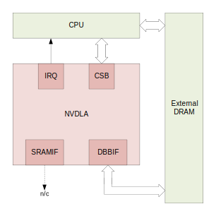

Hardware Architectural Specification
************************************

Introduction
============

The NVIDIA® Deep Learning Accelerator (NVDLA) is a configurable fixed function hardware accelerator targeting inference operations in deep learning applications. It provides full hardware acceleration for a convolutional neural network (CNN) by exposing individual building blocks that accelerate operations associated with each CNN layer (e.g., convolution, deconvolution, fully-connected, activation, pooling, local response normalization, etc.). Maintaining separate and independently configurable blocks means that the NVDLA can be sized appropriatley for many smaller applications where inferencing was previously not feasible due to cost, area, or power constraints. This modular architecture enables a highly configurable solution that readily scales to meet specific inferencing needs.

**About This Document**

This document focuses on the logical organization and control of the NVIDIA Deep Learning Accelerator. It provides information for those blocks and interfaces that control fundamental operations. The blocks detailed in this document include a functional overview, configuration options, and register listings for that block.  All features and functions of all blocks may not be present in every NVDLA implementation.

Functional Description
=======================

NVDLA operation begins with the management processor (either a microcontroller or the main CPU) sending down the configuration of one hardware layer, along with an “activate” command. If data dependencies do not preclude this, multiple hardware layers can be sent down to different blocks and activated at the same time (i.e., if there exists another layer whose inputs do not depend on the output from the previous layer). Because every block has a double-buffer for its configuration registers, it can also capture a second layer’s configuration to begin immediately processing when the active layer has completed. Once a hardware engine finishes its active task, it will issue an interrupt to the management processor to report the completion, and the management processor will then begin the process again. This command-execute-interrupt flow repeats until inference on the entire network is complete.

NVDLA has two modes of operation: independent mode and fused mode. Independent operation refers to each individual block being configured for when and what it executes, with each block working on its assigned task. Independent operation begins and ends with the assigned block performing memory-to-memory operations, in and out of main system memory or dedicated SRAM memory. Fused operation is similar to independent operation, however, some blocks can be assembled as a pipeline; this improves performance by bypassing the round trip through memory, instead having blocks communicate with each other through small FIFOs (i.e., the convolution core can pass data to the Single Data Point Processor, which can pass data to the Planar Data Processor, and in turn to the Cross-channel Data Processor without performing memory-to-memory operations in between).

.. _fig_arch_nvdla_block_diagram:

.. figure:: nvdla-primer-core-diagram.svg
  :alt: "Headless NVDLA core" architectural drawing.  A configuration interface block is connected to the outside world through the CSB/interrupt interface.  The memory interface block is connected outside with a DBB interface and a second, optional, DBB interface.  The memory interface connects to a convolution buffer, which connects to a convolution core; the memory interface also connects to the activation engine, the pooling engine, local response normalization engine, reshape engine, and bridge DMA engine.   The convolution core, activation engine, pooling engine, and local response normalization engine also form a pipeline.
  :align: center

  NVDLA Core Block Diagram.

Each block in the NVDLA architecture exists to support specific operations integral to inference on deep neural networks. Inference operations are divided into five groups:

* Convolution operations (Convolution core and buffer blocks)
* Single Data Point operations (Activation engine block)
* Planar Data operations (Pooling engine block)
* Multi-Plane operations (Local resp. norm block)
* Data Memory and Reshape operations (Reshape and Bridge DMA blocks)

Different deep learning applications require different inference operations. For example, the workload of real image segmentation is very different from that of face-detection. As a result, performance, area, and power requirements for any given NVDLA design will vary. The NVDLA architecture implements a series of hardware parameters that are used to define feature selection and design sizing. These hardware parameters provide the basis for creating an NVDLA hardware design specification. The design specification identifies the supported features and performance characteristics for an NVDLA implementation.

.. note::
  The descriptions in the following sections contain references to or identify various hardware paramters and settings that might influence performance. Refer to the Hardware Paramters sections of this document for more information.

Convolution Operations
---------------------------------------------

Convolution operations work on two sets of data: one set of offline-trained “weights” (which remain constant between each run of inference), and one set of input “feature” data (which varies with the network’s input). The NVDLA Convolution Engine exposes parameters that enable several different modes of operation. Each of these modes include optimizations that improve performance over a naive convolution implementation:

* Direct
* Image-input
* Winograd
* Batching
 
Enabling different modes of operation allows for the ability to map many different sizes of convolutions onto the hardware with higher efficiency. Support for sparse weight compression saves memory bandwidth. Built-in Winograd convolution support improves compute efficiency for certain sizes of filters. Batching convolution, can save additional memory bandwidth by reusing weights when running multiple inferences in parallel. To avoid repeated accesses to system memory, the NVDLA convolution engine has an internal RAM reserved for weight and input feature storage, referred to as the “convolution buffer”.  This design greatly improves memory efficiency over sending a request to the system memory controller for each independent time a weight or feature is needed.

.. _direct_convolution:

Direct Convolution Mode
^^^^^^^^^^^^^^^^^^^^^^^^^^^

Direct convolution mode is the basic mode of operation. NVDLA incorporates a wide multiply–accumulate (MAC) pipeline to support efficient parallel direct convolutional operation. There are two key factors that impact convolution function performance: Memory bandwidth and MAC efficiency.

NVDLA supports two memory bandwidth optimization features that can significantly help to reduce memory bandwidth requirements for CNN layer(s) that require huge data exchange, e.g. fully-connected layers.  

* **Sparse compression.** The sparser the feature data and/or weight data, the less traffic on memory bus.  A 60% sparse network (60% of the data are zero) can almost cut the memory bandwidth requirement to half.

* **Second memory interface.** Provides efficient on-chip buffering, which can increase memory traffic bandwidth and also reduce the memory traffic latency.  Usually an on-chip SRAM can provide 2x~4x of DRAM bandwidth with 1/10 ~ 1/4 latency.

The second key factor that impacts convolution function performance is MAC efficiency.  The number of MAC instances is determined by *(Atomic-C \* Atomic-K)*.  However, if a layer's input feature data channel number is not aligned with the Atomic-C setting or the output feature data kernel number is not aligned with the Atomic-K setting, there will be times that not all MACs are valid which will result in a drop in MAC utilization. For example, if the NVDLA design specification has Atomic-C = 16 and Atomic-K = 64 (which would result in 1024 MAC instances), and one layer of the network has the input feature data channel number = 8 and output feature data kernel number = 16, then the MAC utilization will be only 1/8th (i.e., only 128 MACs will be utilized with the others being idle at all times).

Hardware Parameters:

* Atomic – C sizing
* Atomic – K sizing
* Data type supporting
* Feature supporting – Compression
* Feature supporting – Second Memory Bus

Image-Input Convolution Mode
^^^^^^^^^^^^^^^^^^^^^^^^^^^^^^^^^^

Image-input mode is a special direct convolution mode for the first layer, which contains the input feature data from an image surface. Considering that the image surface format is quite different from the normal feature data format, feature data fetching operations follow a different path from direct convolution operations.  Normally the first layer only has 3 channels for image input, additional logic was added here to enhance MAC utilization. Even though the first layer has 3 (or even 1) channel, a channel extension feature maintains average MAC utilization close to 50%, even if Atomic-C
setting is large (e.g., 16). 

Hardware Parameters:

* All from Direct Convolution mode +
* Image input support

.. _winograd:

Winograd Convolution Mode
^^^^^^^^^^^^^^^^^^^^^^^^^^^^

Winograd convolution refers to an optional algorithm used to optimize the performance of direct convolution. The Winograd convolution reduces the number of
multiplications, while increasing the adders to deal with the additional
transformation. As the number of additions for both pre-calculation and
post-calculation is much less than the number of operations in the MAC
array, the overall number of operations is reduced.  A large number of MAC
operations are avoided for the same convolutional function. For example, a 3x3 filter-sized convolution with winograd, reduces the
number of MAC operations by a factor of 2.25x, improving both performance
and power efficiency. Weight conversion is done offline, so the total weight data size is
expected to increase.  Winograd feature is very useful for the maths-limited
layers; 3x3 or larger filter-sized layers are always maths-limited, so
match well to the winograd feature.

The equation of Winograd convolution used
in convolution core is:

.. math::

  S = A^T \left[ \left( Gg G^T \right) \odot \left( C^T dC \right) \right] A

Here symbol :math:`\odot` indicates element-wise multiplication. That means
the winograd function requires a pre-calculation of fixed matrix operation
before normal direct convolutional MAC array and a post-calculation of
another fixed matrix operation after normal direct convolutional MAC array.

Hardware Parameters:

* Feature supporting – Winograd

.. _batching:

Batching Convolution Mode
^^^^^^^^^^^^^^^^^^^^^^^^^^

The NVDLA batching feature supports processing of multiple sets of input activations (from multiple images) at a time.  This re-uses weights and saves significant memory bandwidth, improving performance and power. The memory bandwidth requirement for fully-connected layers is much larger than the calculation resource. The size of weight data in fully-connected layers is significant and is only used a single time in MAC functions (this is one of the leading causes of bottlenecks in memory bandwidth). Allowing multiple sets of activations to share the same weight data means they can run at the same
time (reducing overall run-time). The run-time for a single batch is close to that for a single-layer; overall performance is close to [batching_size] X [single-layer performance].

.. note::
  Support for large batching sizes means a large area cost for activation buffering. Maximum batching size is limited by the convolution buffer size, so the maximum batching number is a hardware limitation in the design specification.

Hardware Parameters:

* Feature batch support
* Max batch number

Convolution Buffer
^^^^^^^^^^^^^^^^^^^

The Convolution buffer is one pipeline stage of the Convolution core. It
contains both the weight data and the feature data for the convolution
function. The ratio of weight data size to feature data size varies
within different networks and even within a single network (different
layers can have completely different ratios between feature and weight data). To accomodate these differences the convolution buffer
enables a configurable storage strategy for both weight data and
feature data.  

The Convolution buffer requires at least 4 ports for data access:

* Read port for feature data
* Read port for weight data
* Write port for feature data
* Write port for weight data

.. note::
  If compression features are supported, ports for compression tags are required. There are different ways these ports can be shared; refer to the reference design and documentation for more information -- banking with dedicated configuration.

The Convolution buffer size depends on various factors; the primary factor is CNN size (i.e. feature data size and weight data
size). It is preferable if the full size of either weight data or feature data of one hardware layer can be stored in the Convolution buffer (removes need to fetch data multiple times). Convolution read bandwidth determines the width of the read port.  In order to feed the required amount of Atomic-C data in a single cycle,(data_size*Atomic-C) of data width is required.  For example, for an atomic-C of 16 on an INT8 convolution function, a 128-bit width (16 bytes)
is required.

Hardware Parameters:

* BUFF bank #
* BUFF bank size 

Single Data Point Operations
------------------------------

The Single Data Point Processor (SDP) allows for the application of both linear and non-linear functions onto individual data points.  This is commonly used immediately after convolution in CNN systems.  The SDP provides native support for linear functions (e.g., simple bias and scaling) and uses lookup tables (LUTs) to implement non-linear functions. This combination supports most common activation functions as well as other element-wise operations including: ReLU, PReLU, precision scaling, batch normalization, bias addition, or other complex non-linear functions, such as a sigmoid or a hyperbolic tangent.

Hardware Parameters:

* SDP function support
* SDP throughput

Linear Functions
^^^^^^^^^^^^^^^^^^^^^^^^^^^^^

NVDLA supports multiple instances of linear functions (which are mostly scaling functions). There are several methods that can be used for of setting the scaling factor and bias: 1) CNN setting - the scaling factor and bias are the same throughout the whole CNN, this scaling factor are comes from a register configuration; 2) Channel setting - the scaling factor and bias are the same within a single planar (i.e., the same channel value), these scaling factors  come from the memory interface; 3) Per pixel setting - the scaling factor and bias are different for every single feature, the factors and bias will come from the memory interface.

* **Precision Scaling.**  Control memory bandwidth throughout the full inference process; feature data can be scaled to its full range before chunking into lower precision and writing to memory . Scale key resources (e.g., MAC array) to support full range for best inference result (other linear functions may be applied). Revert input data before any of the non-linear functions (i.e., keep input data of non-linear functions as original data).

* **Batch Normalization.** In an inference function batch normalization requires a linear function with a trained scaling factor. SDP can support a per-layer parameter or a per-channel parameter to do the batch normalization operation.

* **Bias Addition.** Some layers require the bias function at the output side, which means that they need to provide an offset (either from a per-layer setting or per-channel memory surface or per-feature memory surface) to the final result.

* **Element-Wise Operation.** The element-wise layer (used in some CNN) refers to a type of operation between two feature data cubes which have the same W, H and C size. These two W x H x C feature data cubes do element-wise addition, multiplication or max/min comparison operation and output one W x H x C feature data cube. NVDLA supports common operations in element-wise operations (e.g., add, sub, multiply, max).

Non-Linear Functions
^^^^^^^^^^^^^^^^^^^^^^^^^^^^^

There are several non-linear functions that are required to support Deep Learning algorithms. Some of these are supported using dedicated hardware logic while more complex functions incorporate the use of a dedicated Look-Up-Table. 

* ReLU, for an input :math:`x`, the output is :math:`\textrm{max}(x, 0)`.
* PReLU, different from ReLU, PReLU still keep a value small linear factor instead of cutting to zero:
  
  :math:`y = \begin{cases} x & x > 0 \\ k * x & x < 0 \end{cases}`

* Sigmoid, for an input :math:`x`, the output is :math:`\frac{1}{1+e^{-x}}`
* Hyperbolic tangent, for an input :math:`x`, the output is
  :math:`\frac{1-e^{-2x}}{1+e^{-2x}}`
* And more...

Planar Data Operations
------------------------------

The Planar Data Processor (PDP) supports specific spatial operations that are common in CNN applications.  It is configurable at runtime to support different pool group sizes, and supports three pooling functions:

* maximum-pooling -- get maximum value from pooling window.
* minimum-pooling -- get minimum value from pooling window.
* average-pooling -- average the feature value in the pooling window.

The PDP unit has a dedicated memory interface to fetch input data from memory and outputs directly to memory.

Hardware Parameters:

* PDP throughput

Multi-Plane Operations
------------------------------

The Cross-channel Data Processor (CDP) is a specialized unit built to apply the local response normalization (LRN) function - a special normalization function that operates on channel dimensions, as opposed to the spatial dimensions.

.. math::

  Result_{w,h,c} =
    \frac
      {Source_{w,h,c}}
      {\left( j +
  \frac{\alpha}{n}\sum\limits_{i=\textrm{max}\left(0,c-\frac{n}{2}\right)}^{\textrm{min}\left(C-1,c+\frac{n}{2}\right)}{Source_{w,h,i}}^2\right)^{\beta}}

Hardware Parameters:

* CDP throughput
  
  
Data Memory and Reshape Operations
-----------------------------------------
  
Bridge DMA
^^^^^^^^^^

The bridge DMA (BDMA) module provides a data copy engine to move data between the system DRAM and a dedicated high-performance memory interface, where present. Provides an accelerated path to move data between these two non-connected memory systems.

Hardware Parameters:

* BDMA function support 
 

.. _rubik:

Data Reshape Engine
^^^^^^^^^^^^^^^^^^^^

The data reshape engine performs data format transformations (e.g., splitting or slicing, merging, contraction, reshape-transpose). Data in memory often needs to be reconfigured or reshaped in the process of performing inferencing on a convolutional network.  For example: “slice” operations may be used to separate out different features or spatial regions of an image; “reshape-transpose” operations (common in deconvolutional networks) create output data with larger dimensions than the input dataset.

The Rubik function transforms data mapping format without any data calculations. It supports three working modes:

* **Contract Mode.** Contract mode in Rubik transforms mapping format are used to de-extend the cube. It's a second hardware layer to support deconvolution. Normally, a software deconvolution layer has deconvolution x stride and y stride that are greater than 1; with these strides the output of phase I hardware-layer is a channel-extended data cube.

* **Split Mode and Merge Mode.** Split and merge are two opposite operation modes in Rubik. Split transforms a data cube into M-planar formats (NCHW). The number of planes is equal to channel size. Merge transforms a serial of planes to a feature data cube.

Hardware Parameters:

* Rubik function support 

.. _scalability:

Hardware Parameters
=====================

Different deep learning applications require different inference operations. For example, the workload of real image segmentation is very different from
that of face-detection.  As a result, performance, area, and power requirements for any given NVDLA design will vary. NVDLA addresses this with a set of configurable hardware parameters that are used to create an implementation that fits the application needs.

Hardware parameters provide the basis for creating an NVDLA hardware design specification. The design specification identifies the supported features and performance characteristics for an NVDLA implementation. There are two categories of hardware parameters: Feature Selection and Design Sizing. A given NVDLA implementation is defined by the parameters and settings selected.

Feature Selection
----------------------

Feature parameters identify which individual features an NVDLA implementation will support. Configurable options include:

Data Type
^^^^^^^^^^^^^^^^^

NVDLA can support one data type for specific network, or support multiple data types for more general purpose. NVDLA hardware architecture can make proper sharing between the different data types for both area cost and power efficiency consideration.
  
* Parameter:  Data type supporting
  
* Values:  Binary/INT4/INT8/INT16/INT32/FP16/FP32/FP64
  
* Affected operations: All
  
  
Winograd
^^^^^^^^^^^^^^^^^

Winograd is an optimization feature for the convolutional function. It can improve performance by increasing MAC efficiency, and it can also help with the overall power efficiency.  See :ref:`winograd` for more information.

* Parameter:  Feature supporting – Winograd
  
* Possible values: Yes/No
  
* Affected operations: Convolution
  
  

Batching
^^^^^^^^^^^^^^^^^

Batching is an optimization feature for convolution. It improves
performance by both increasing MAC efficiency and saving memory traffic. 
See :ref:`batching` for more information.

*  Parameter:  Feature supporting – batch
  
*  Possible values: Yes/No
  
*  Affected operations: Convolution

  
Sparse Compression
^^^^^^^^^^^^^^^^^^^^^^^

Sparse compression is an optimization feature for convolution. It can
reduce the total amount of memory traffic and thus improve performance and
save power. See :ref:`direct_convolution` for more information.
  
* Parameter:  Feature supporting – Sparse Compression

* Possible values: Weight/Feature/Neither/Both
 
* Affected operations: Convolution
  

Second Memory Bus
^^^^^^^^^^^^^^^^^^^^^^^

NVDLA always has a basic interface to external memory over its DBBIF.
Besides that, NVDLA can also support a second memory bus interface names
SRAMIF. This interface can connect to on-chip SRAM or other
high-bandwidth low-latency buses to improve the overall performance.

* Parameter:  Feature supporting – Second Memory Bus

* Possible values: Yes/No
  
* Affected operations: All
  

Image Input
^^^^^^^^^^^^^^^^^

Planar image data is an important input resource to Deep Learning, and there
are a large number of image surface formats.  So, the supported formats for
NVDLA input can be very important for the first hardware layer of NVDLA.

* Parameter:  Image input support
 
* Possible values: combinations of 8-bit/16-bit/both; RGB/YUV/both; non-planar/semi-planar/full-planar
  
* Affected operations: Convolution
  

Single Data Point Support
^^^^^^^^^^^^^^^^^^^^^^^^^^^^^^^^^

There are many nonlinear curves used as activation functions for Deep
Learning, including (P)ReLU, tanh, sigmoid, and more.  Some of these, such
as ReLU, are very simple and can be implemented trivially with scaling
beyond a threshold; others require extra memory to approximate using a
lookup table.

* Parameter:  SDP function support
  
* Possible values:  Scaling/LUT
  
* Affected operations: Single Data Point
  

Bridge DMA Support
^^^^^^^^^^^^^^^^^^^^^^^^^^^^

In case that NVDLA supports second memory interface, the Bridge DMA (BDMA) unit can
do data copy between the main memory interface an second memory
interface.

* Parameter:  BDMA function support
  
* Possible values: Yes/No
  
* Affected operations:  MISC
  

Data Reshape Engine Support
^^^^^^^^^^^^^^^^^^^^^^^^^^^^^^^^^^^^^^

The Rubik function transforms data mapping format without any data calculations. See
:ref:`rubik` for more information.

* Parameter:  Rubik function support
 
* Possible values: Yes/No
  
* Affected operations:  MISC
  

Design Sizing
------------------

Design sizing parameters indicate the parallelism that is supported in the
NVDLA Hardware.  A larger value usually means higher performance but with an
associated higher area and/or power cost.

Atomic–C
^^^^^^^^^^^^^^^^^^^^^^^^^^^^^^^^^^^^^^

This value indicates the parallel MAC operation in input feature channel
dimension. This parameter impacts total MAC number, convolutional buffer
read bandwidth.

* Parameter:  Atomic – C sizing
  
* Values: 16~128

* Affected operations: Convolution

Atomic–K
^^^^^^^^^^^^^^^^^^^^^^^^^^^^^^^^^^^^^^

This value indicates the parallel MAC operation at output feature
channel dimension. This parameter impacts total MAC number, accumulator
instance number, convolutional write-back bandwidth.

As the MAC array has 2 dimensions, so the total MAC number is (Atomic-C
\* Atomic-K).

* Parameter:  Atomic – K sizing
  
* Range of values: 4~16

* Affected scope: Convolutional function

.. note::
  Both Atomic-C and Atomic-K parameters are referring to the lowest precision, the higher precision may be reduced accordingly. For example, if NVDLA supports both INT8 and INT16, then the Atomic-C and Atomic-K parameters are referring to INT8 case, INT16 is expected to have lower parallel.

Single Data Point Throughput
^^^^^^^^^^^^^^^^^^^^^^^^^^^^^^^^^^^^^^

The Single Data Point (SDP) throughput indicates the number of instances of SDP pipelines.
The number of SDP pipelines determines the number of output features
that can be generated each cycle.

* Parameter:  SDP throughput

* Range of values: 1~16

* Affected scope: SDP

Planar Data Processor Throughput
^^^^^^^^^^^^^^^^^^^^^^^^^^^^^^^^^^^^^^

The Planar Data Processor (PDP) throughput indicates the number of output features that can be
generated each cycle. A value of 0 indicates that no PDP blocks will be
included and the planar data processor operation will not be supported.

* Parameter:  PDP throughput

* Range of values: 0~4
  
* Affected operations: PDP

Cross-Channel Data Processor Throughput
^^^^^^^^^^^^^^^^^^^^^^^^^^^^^^^^^^^^^^^^^^^^^^^^^

The CDP throughput indicates the number of output features that can be
generated every cycle. A value of 0 indicates that no CDP block will be
included and multi-plane operations will not be supported by the
resulting implementation

* Parameter:  CDP throughput

* Range of values: 0~4

* Affected operations: CDP

Convolution Buffer Banks
^^^^^^^^^^^^^^^^^^^^^^^^

This value indicates the number of convolutional buffer banks. The
number of banks defines the granularity of CBUF storage allocation
between weights and activations. Together with the bank size parameter,
they determine the size of overall convolutional buffer.

* Parameter:  BUFF bank #

* Range of values: 2~32

* Affected operations: Convolution

Convolution Buffer Bank Size
^^^^^^^^^^^^^^^^^^^^^^^^^^^^

This value indicates the size of a single convolutional buffer bank.
Together with the bank number parameter, they determine the size of
overall convolutional buffer.

* Parameter:  BUFF bank size

* Range of values: 4KB~32KB

* Affected operations: Convolution

Convolution Batching
^^^^^^^^^^^^^^^^^^^^

This value indicates the maximum batching number that convolution
function can support. Usually larger value of this parameter has area
impact as more buffering is required at accumulator side.

* Parameter:  MAX Batch number

* Range of values: 1~32

* Affected operations: Convolution

Data Types and Precision
------------------------

NVDLA supports multiple data type inference based on different workloads. Use of these parameters can be used to improve network accuracy for a given power and performance constraint. Floating point data has a high precision (FP64/FP32/FP16); integer data type (INT16/INT8/INT4), or even single bit binary can be used for lower precision applications.

Precision Scaling Convertor
^^^^^^^^^^^^^^^^^^^^^^^^^^^

The precision scaling convertors are normally used before some very critical limited resources, like before writing data to memory or before entering MAC array.

The formula for convertor is: :math:`y = \textrm{saturation} ((x -
\textrm{offset}) * \textrm{scaling} >> \textrm{shifter})`.

Precision Shifter
^^^^^^^^^^^^^^^^^

A shifter is mostly used at the bits adjustment in the middle of the pipeline. 
For example, the accumulator bit width is far more than the input data, so
before data sent out to SDP, we need to chunk it by a shifter.

Shifter is a simplified convertor, formula as: :math:`y = \textrm{saturate}(x <<
\textrm{shifter})`.

Look Up Table
^^^^^^^^^^^^^

LUT are used to deal with non-linear function in a network such as sigmoid and tanh activation functions or for local response normalization.   

Small NVDLA Implementation Example
-----------------------------------

Small sized NVDLA implementations target smaller workloads, as such, these implementations only need to have very basic support.  Because of the light workload, 64 INT8 MACs with Atomic-C=16 and Atomic-K=4 should be good enough. All other optimization features can be removed to save area.  For image input format, supporting a basic format like A8R8G8B8 is likley good enough.  If pooling and normalization functions are required, it is possible to limit throughput.  As to the convolutional buffer, 4 banks each with 8KB size (totally 32KB size) can support.

**Example hardware parameter settings:**

* Data type supporting = INT8
* Feature supporting - Winograd = No
* Feature supporting - Second Memory Bus = No
* Feature supporting - Compression = No
* Image input support = A8R8G8B8
* SDP function support = Single Scaling
* BDMA function support = No
* Rubik function support = No
* Atomic - C sizing = 8
* Atomic - K sizing = 8
* SDP throughput = 4
* PDP throughput = 2
* CDP throughput = 2
* BUFF bank # = 4
* BUFF bank size = 8KB
 
Large NVDLA Implementation Example
-----------------------------------

Larger NVDLA implementations target heavier workloads. This model serves as a better choice when the primary emphasis is on higher performance and versatility. Increasing the Atomic-C and Atomic-K to 64/16 increases NVDLA performance to a maximum of 2K operations every cycle; enabling all other optimizations increases real operations further.  Other post-processing throughput also needs to increase (e.g., PDP and CDP throughput changed to 4). When targeting a larger CNN, set a larger convolution buffer (e.g., 32KB * 16 = 512KB).

**Example hardware parameter settings:**

* Data type supporting = FP16/INT16
* Feature supporting - Winograd = Yes
* Feature supporting - Second Memory Bus = Yes
* Feature supporting - Compression = Yes
* Image input support = A8R8G8B8/YUV16 Semi-planar
* SDP function support = Scaling/LUT
* BDMA function support = Yes
* Rubik function support = No
* Atomic - C sizing = 64
* Atomic - K sizing = 16
* SDP throughput = 16
* PDP throughput = 4
* CDP throughput = 4
* BUFF bank # = 16
* BUFF bank size = 32KB

.. _external_interfaces:

External Interfaces
===================

The NVDLA has four interfaces to the system as a whole.  These are:

* **Configuration space bus ("CSB").** The host system accesses and
  configures the NVDLA register set with a very simple address/data
  interface.  Some systems may directly connect the host CPU to the CSB
  interface, with a suitable bus bridge; other, potentially larger, systems
  will instead connect a small microcontroller to the CSB interface,
  offloading some of the work of managing the NVDLA to the external core.

* **External interrupt ("IRQ"):**  Certain states in the NVDLA demand
  asynchronous reporting to the processor that is commanding the NVDLA,
  these states include operation completion and error conditions,.  The
  external interrupt interface provides a single output pin that complements
  the CSB interface.

* **Data backbone ("DBBIF"):** The NVDLA contains its own DMA engine to load
  and store values (including parameters and datasets) from the rest of the
  system.  The data backbone is an AMBA AXI4-compliant interface that is
  intended to access large quantities of relatively high-latency memory
  (such as system DRAM).

* **SRAM connection ("SRAMIF"):** Some systems may have the need for more
  throughput and lower latency than the system DRAM can provide, and may
  wish to use a small SRAM as a cache to improve the NVDLA's performance.  A
  secondary AXI4-compliant interface is provided for an optional SRAM to be
  attached to the NVDLA.

Below, we present two examples of platforms that integrate an NVDLA, and how
they attach these external connections to the rest of the system.

.. _fig_small_nvdla:

  Small NVDLA system.

.. _fig_large_nvdla:

.. figure:: nvdla-hwarch-large.svg
  :scale: 55%
  :align: center

  Large NVDLA system.

:numref:`fig_small_nvdla` shows a small system, for which NVDLA is directly
connected to the main CPU.  The small system has no NVDLA-dedicated SRAM,
and all accesses hit the main system memory.  By comparison,
:numref:`fig_large_nvdla` shows a somewhat larger system, in which the NVDLA
connects to a microcontroller, which is responsible for managing the small
details of programming the NVDLA (and, as such, freeing the main CPU from
servicing low-level NVDLA interrupts).  The latter system also integrates a
SRAM, attached to NVDLA.  (Other units on the system may also have
connections to this SRAM, and share it for their own needs; this is not
shown in the diagram.)

Configuration space bus
-----------------------

The CPU uses the CSB (Configuration Space Bus) interface to access NVDLA
registers.  The CSB interface is intentionally extremely simple, and
low-performance; as such, it should be simple to build an adapter between
the CSB and any other system bus that may be supported on a platform.  The
CSB bus consists of three channels: the request channel, the read data
channel, and the write response channel.  These channels are as described
below.

Clock and reset
^^^^^^^^^^^^^^^

The CSB interface uses a single clock domain, shared between NVDLA and the
requester.

Request channel
^^^^^^^^^^^^^^^

The request channel follows a valid/ready protocol; a data transaction
occurs on the request channel when and only when the ``valid`` signal (from
the host) and the ``ready`` signal (from NVDLA) are both asserted in the
same clock cycle.  Each request to CSB has a fixed request size of 32 bits
of data, and has a fixed 16bit address size.  CSB does not support any form
of burst requests; each packet sent down the request channel is independent
from any other packet.

.. _tab_csb_request_channel:
.. list-table:: Request channel signal description
   :header-rows: 1
   :widths: 10 5 5 20
   
   * - Data field
     - # Bits
     - Direction
     - Description
   * - ``csb2nvdla_valid``
     - 1
     - Input
     - Indicates that a request is valid
   * - ``csb2nvdla_ready``
     - 1
     - Output
     - Indicates that the receiver is ready to take a request
   * - ``csb2nvdla_addr``
     - 16
     - Input
     - Address. Aligned to word boundary.
   * - ``csb2nvdla_wdat``
     - 32
     - Input
     - Write data
   * - ``csb2nvdla_write``
     - 1
     - Input
     - Write flag.
     
       ``1'b0``: Request is a read request.
       
       ``1'b1``: Request is a write request.
   * - ``csb2nvdla_nposted``
     - 1
     - Input
     - Non-posted write transaction indicator.
       
       ``1'b0``: Request is a posted write request.
       
       ``1'b1``: Indicates a non-posted write request.
       
       Posted write transactions are writes where the requester does not
       expect to and will not receive a write completion from receiver on
       write ack channel. The requester will not know if the write
       encounters an error.
       
       Non-posted write transactions are writes where the requester expects
       to receive a write completion or write error on write ack channel
       from receiver.

Read data channel
^^^^^^^^^^^^^^^^^

The read data response channel is described in the below table.  NVDLA
returns read-response data to the host in strict request order; that is to
say, each request packet (above) for which "write" is set to 0 will have
exactly one response, and that response cannot jump forward or backwards
relative to other reads.

The read data channel follows a valid-only protocol; as such, the host
cannot apply back-pressure to the NVDLA on this interface.

.. note::
  NVDLA does not support error reporting from the CSB.  Illegal reads (e.g. reads directed at an address hole) will return zeroes.

.. _tab_csb_read_data_channel:
.. list-table:: Read data channel signal description
   :header-rows: 1
   :widths: 10 5 5 20
   
   * - Data field
     - # Bits
     - Direction
     - Description
   * - ``nvdla2csb_valid``
     - 1
     - Output
     - Indicates that read data is valid.
   * - ``nvdla2csb_data``
     - 32
     - Output
     - Data corresponding to a read request, or zero in the event of an
       error.

Write response channel
^^^^^^^^^^^^^^^^^^^^^^

The signals associated with the write response channel are described in the
below table. NVDLA will return write completion to the host in request order
for every non-posted write. 

The write completion channel also follows a valid-only protocol, and as
such, the host cannot back-pressure NVDLA on this interface.

.. _tab_csb_write_response_channel:
.. list-table:: Write completion channel signal description
   :header-rows: 1
   :widths: 10 5 5 20
   
   * - Data field
     - # Bits
     - Direction
     - Description
   * - ``nvdla2csb_wr_complete``
     - 1
     - Output
     - Indicates that a CSB write has completed.

Interface timing
^^^^^^^^^^^^^^^^

The timing diagram in :numref:`fig_timing_diagram` illustrates 4
transactions (2 writes, 2 reads) on the CSB bus between a requester and
NVDLA.

.. _fig_timing_diagram:

.. figure:: nvdla-hwarch-csb-timing.svg
  :scale: 55%
  :align: center

  Interface timing example on the CSB.

Host interrupt
--------------

Along with the configuration space bus, NVDLA provides an asynchronous
(interrupt-driven) return channel to deliver event notifications to the CPU. 
The interrupt signal is a level-driven interrupt that is asserted high as
long as the NVDLA core has interrupts pending.  Interrupts are pending if
any bits are set in GLB's ``INTR_STATUS`` register that are also not masked
out (i.e., set to zero) in the ``INTR_MASK`` register.  The NVDLA interrupt
signal is on the same clock domain as the CSB interface.

.. _tab_host_interrupt_channel:
.. list-table:: Host interrupt interface
   :header-rows: 1
   :widths: 10 5 5 20
   
   * - Data field
     - # Bits
     - Direction
     - Description
   * - ``nvdla2core_interrupt``
     - 1
     - Output
     - Active high while an interrupt is pending from NVDLA.

System interconnect: DBBIF
--------------------------

NVDLA has two major interfaces to interact with the memory system, these are
called the DBBIF (which is referred to as ``core2dbb`` in signal naming) and
the SRAMIF (which is referred to as ``core2sram`` in signal naming).  The
DBBIF interface is intended to be connected to an on-chip network which
connects to the system memory, while SRAMIF is intended to be connected with
an optional on-chip SRAM with lower memory latency and potentially higher
throughput.  Both the DBBIF and SRAMIF interfaces are AXI4 compliant.  This
section describes the DBBIF interface in detail.

The NVDLA data backbone interface supports a configurable data bus width of
32, 64, 128, 256 or 512-bits. To tolerate memory latency, internal buffers
can be configured to support a configurable number of outstanding requests
up to 256.

The data backbone interface follows a AXI-like protocol, but makes
assumptions to simplify the interface protocol.

* Always issues incremental burst request
* Burst size always align with data width
* Request address always aligned to data width
* Writes must always be acknowledged, reads must always get return data
* Writes must be committed to memory when NVDLA gets a write acknowledge
* Reads must always get the actual value from memory

Clock and reset
^^^^^^^^^^^^^^^

The NVDLA DBBIF assumes synchronized data backbone interface with single
clock domain and reset.  Therefore, all NVDLA DBBIF ports are part of the
main NVDLA core clock domain.  Synchronization to the SOC data backbone will
need to be done outside the NVDLA core.

AW (Write request) channel
^^^^^^^^^^^^^^^^^^^^^^^^^^

The table below lists all signals on AW channel, with an implied prefix of
``nvdla_core2dbb_aw_``.

.. _tab_dbbif_aw_channel:
.. list-table:: Data backbone interface signal description -- AW channel
   :header-rows: 1
   :widths: 10 5 5 20
   
   * - Data field
     - # Bits
     - Direction
     - Description
   * - ``awvalid``
     - 1
     - Output
     - Write request ready
   * - ``awready``
     - 1
     - Input
     - Write request ready
   * - ``awlen``
     - 4
     - Output
     - Burst length
   * - ``awaddr``
     - Config
     - Output
     - Write address, can be configured to be 32 or 64bit
   * - ``awid``
     - 8
     - Output
     - Write request ID tag

AR (Read request) channel
^^^^^^^^^^^^^^^^^^^^^^^^^

The table below lists all signals on the AR channel, with an implied prefix
of ``nvdla_core2dbb_ar_``.

.. _tab_dbbif_ar_channel:
.. list-table:: Data backbone interface signal description -- AR channel
   :header-rows: 1
   :widths: 10 5 5 20
   
   * - Data field
     - # Bits
     - Direction
     - Description
   * - ``arvalid``
     - 1
     - Output
     - Read request valid
   * - ``arready``
     - 1
     - Input
     - Read request ready 
   * - ``arlen``
     - 4
     - Output
     - Burst length
   * - ``araddr``
     - Config
     - Output
     - Read address, can be configured to be 32 or 64bit
   * - ``arid``
     - 8
     - Output
     - Read request ID tag

W (Write data) channel
^^^^^^^^^^^^^^^^^^^^^^^^^

The table below lists all signals on the W channel, with an implied prefix
of ``nvdla_core2dbb_w_``.

.. _tab_dbbif_w_channel:
.. list-table:: Data backbone interface signal description -- W channel
   :header-rows: 1
   :widths: 10 5 5 20
   
   * - Data field
     - # Bits
     - Direction
     - Description
   * - ``wvalid``
     - 1
     - Output
     - Write data valid 
   * - ``wready``
     - 1
     - Input
     - Write data ready 
   * - ``wdata``
     - Config
     - Output
     - Write data. Width configurable to 32/64/128/256/512bit
   * - ``wlast``
     - 1
     - Output
     - Last write indicator
   * - ``wstrb``
     - Config
     - Output
     - Write-strobes to specify the byte lanes of the data bus that contain
       valid information.  Each bit in wstrb represents 8bit on data bus;
       ``wstrb[n]`` corresponds to ``wdata[(8*n)+7 : (8*n)]``.
       
       The width of ``wstrb`` can be configured to be 4/8/16/32/64
       corresponding to data width.

B (Write response) channel
^^^^^^^^^^^^^^^^^^^^^^^^^^

The table below lists all signals on the B channel, with an implied prefix
of ``nvdla_core2dbb_b_``.

.. _tab_dbbif_b_channel:
.. list-table:: Data backbone interface signal description -- B channel
   :header-rows: 1
   :widths: 10 5 5 20

   * - Data field
     - # Bits
     - Direction
     - Description
   * - ``bvalid``
     - 1
     - Input
     - Write response valid 
   * - ``bready``
     - 1
     - Output
     - Write response ready 
   * - ``bid``
     - 8
     - Input
     - Write response ID

R (Read data) channel
^^^^^^^^^^^^^^^^^^^^^

The table below lists all signals on the R channel, with an implied prefix
of ``nvdla_core2dbb_r_``.

.. _tab_dbbif_r_channel:
.. list-table:: Data backbone interface signal description -- R channel
   :header-rows: 1
   :widths: 10 5 5 20

   * - Data field
     - # Bits
     - Direction
     - Description
   * - ``rvalid``
     - 1
     - Input
     - Write response valid 
   * - ``rready``
     - 1
     - Output
     - Write response ready 
   * - ``rlast``
     - 1
     - Input
     - Last read data indicator.
   * - ``rdata``
     - Config
     - Input
     - Read data with configurable width of 32/64/128/256/512b
   * - ``rid``
     - 8
     - Input
     - Read response ID

On-Chip SRAM Interface - SRAMIF
-------------------------------

The optional NVDLA SRAM interface is used when there is an on-chip SRAM for
the benefit of lower latency and higher throughput.  The SRAM interface
protocol is exactly the same as DBBIF interface, but signals have been
renamed to the prefixes ``nvdla_core2sram_{aw,ar,w,b,r}_``, for the aw, ar,
w, b and r channels respectively.

Register Interface
==================

This section describes the register address space and register definitions.
For each sub-unit, there are status registers, configuration registers,
command registers and profiling registers.

Ping-pong Synchronization Mechanism
-----------------------------------

One traditional procedure to program hardware is as follows: first, the CPU
configures registers on an engine, then it sets the engine's "enable" bit,
then it waits for the hardware to produce a "done" interrupt, and finally it
starts the process over again with a new set of registers.  This style of
programming model will result in the hardware becoming idle between two
consecutive hardware layers, which reduces system efficiency.

In order to hide the CPU's reprogramming latency, NVDLA introduces the
concept of ping-pong register programming for per-hardware-layer registers. 
For most NVDLA subunits, there are two groups of registers; when the subunit
is executing using the configuration from the first register set, the CPU
can program the second group in the background, setting the second group's
"enable" bit when it is done.  When the hardware has finished processing the
layer described by the first register set, it will clear the "enable" bit of
the first register set, and then switch to the second group if the second
group's "enable" bit has already been set.  (If the second group's "enable"
bit has not yet been set, then the hardware becomes idle until programming
is complete.) The process, then, repeats, with the second group becoming the
active group, and the first group becoming the "shadow" group to which the
CPU writes in the background.  This mechanism allows the hardware to switch
smoothly between active layers, wasting no cycles for CPU configuration.

.. note::
  Unlike a "shadow register" programming model, values written to the inactive
  group in the "ping-pong" programming model do not get copied to a primary
  group on activation.  As such, the CPU should make sure that *all* registers
  in a group have been programmed before enabling the hardware layer to run.

The NVDLA core is built as a series of pipeline stages; each stage is used
to handle hardware layers in whole or in part.  These pipeline stages are:

* CDMA (convolution DMA)
* CBUF (convolution buffer)
* CSC (convolution sequence controller)
* CMAC (convolution MAC array)
* CACC (convolution accumulator)
* SDP (single data processor)
* SDP\_RDMA (single data processor, read DMA)
* PDP (planar data processor)
* PDP\_RDMA (planar data processor, read DMA)
* CDP (channel data processor)
* CDP\_RDMA (channel data processor, read DMA)
* BDMA (bridge DMA)
* RUBIK (reshape engine)

The first five pipeline stages are part of the *convolution core* pipeline;
all of these pipeline stages (except for CBUF and CMAC) use linked ping-pong
buffers in order to work together to form HW layers.

Implementation
^^^^^^^^^^^^^^

.. _fig_regfile:

.. figure:: nvdla-hwarch-regfile.svg
  :align: center

  Implementation overview of ping-pong register file.

Each pipeline stage has the ping-pong mechanism built into its register
file, as shown in :numref:`fig_regfile`.  In detail, each register file
implementation has three register groups; the two ping-pong groups
(duplicated register group 0, and group 1) share the same addresses, and the
third register group is a dedicated non-shadowed group (shown above as the
"single register group").  The ``PRODUCER`` register field in the
``POINTER`` register is used to select which of the ping-pong groups is
to be accessed from the CSB interface; the ``CONSUMER`` register field
indicates which register the datapath is sourcing from.  By default, both
pointers select group 0.  Registers are named according to which register
set they belong to; a register is in a duplicated register group if its name
starts with ``D_``, and otherwise, it is in the single register group.

The registers in the ping-pong groups are parameters to configure hardware
layers.  Each group has an enable register field, which is set by software
and cleared by hardware.  The CPU configured all other fields in the group
before the enable bit; when the enable bit is set, the hardware layer is
ready to execute.  At this point, any writes to register groups that have
the enable bit set will be dropped silently until the hardware layer
completes execution; then, the enable bit is cleared by hardware.

.. note::
  If the enable field is set, the hardware layer may either be running or
  pending.  Even if the hardware layer is not actively running (i.e., it is
  waiting to run), the CPU cannot clear the enable field; any write access to
  a register group for which the enable field is set will be silently dropped.

Most registers in the single-register groups are read-only status registers. 
The ``CONSUMER`` and ``PRODUCER`` pointers, described above, reside in the
single group; the ``CONSUMER`` pointer is a read-only register field that
the CPU can check to determine which ping-pong group the datapath has
selected, and the ``PRODUCER`` pointer is fully controleld by the CPU, and
should be set to the correct group before programming a hardware layer.

Programming sequence
^^^^^^^^^^^^^^^^^^^^

The following is an example sequence for how to program an NVDLA subunit. 
Each NVDLA subunit has the same ping-pong register design; in this sequence,
we choose the CDMA submodule as the example unit that we will program.

#. After reset, both group 0 and group 1 are in an idle state.  The CPU
   should read the ``CDMA_POINTER`` register, and set ``PRODUCER`` to the
   value of ``CONSUMER``.  (After reset, ``CONSUMER`` is expected to be 0.)

#. The CPU programs the parameters for the first hardware layer into register
   group 0.  After configuration completes, the CPU sets the ``enable`` bit in
   the ``D_OP_ENABLE`` register.

#. Hardware begins processing the first hardware layer.

#. The CPU reads the ``S_STATUS`` register to ensure that register group 1
   is idle.

#. The CPU sets ``PRODUCER`` to 1 and begins programming the parameters for
   the second hardware layer into group 1.  After those registers are
   programmed, it sets the enable bit in group 1's ``D_OP_ENABLE``.

#. The CPU checks the status of the register group 0 by reading
   ``S_STATUS``; if it is still executing, the CPU waits for an interrupt.

#. Hardware finishes the processing of the current hardware layer.  Upon
   doing so, it sets the status of the previously active group to idle in
   the ``S_STATUS`` register, and clears the ``enable`` bit of the
   ``D_OP_ENABLE`` register.

#. Hardware advances the ``CONSUMER`` field to the next register group (in
   this case, group 1).  After advancing the ``CONSUMER`` field, it
   determines whether the ``enable`` bit is set on the new group.  If so, it
   begins processing the next hardware layer immediately; if not, hardware
   waits until the ``enable`` bit is set.

#. Hardware asserts the "done" interrupt for the previous hardware layer.  If
   the CPU was blocked waiting for a "done" interrupt, it now proceeds
   programming, as above.

#. Repeat, as needed.

.. note::
  The NVDLA hardware does not have intrinsic support for dependency tracking;
  that is to say, hardware layers that are running or pending do not have any
  mechanism of blocking each other, if one depends on the output of the other. 
  As such, the CPU is responsible for ensuring that if a layer depends on the
  output of a previous layer, the consuming layer is not scheduled until the
  producing layer has finished executing.

Address space layout
--------------------

.. warning::
  This address space layout is not final, and should be expected to change
  in revisions of the NVDLA design leading up to version 1.0.

The NVDLA requires 256 KiB of MMIO address space for its registers. 
Although the base address will vary from system to system, all registers on
the CSB interface start at a base address of ``0x0000_0000``.  Each subunit
inside of NVDLA is assigned 4 KiB of address space.  (The CBUF subunit does
not have any registers.)  The address mapping inside of NVDLA's address
space is as shown in table :numref:`tab_address_space`.

Some hardware configurations may not have certain subunits enabled; for
instance, smaller implementations of NVDLA may disable SDP, PDP, or CDP.  In
such a case, the address space of those subunits is reserved, and their
registers are not accessible.

.. note::
  Capability registers will be added to determine the configuration of 
  each NVDLA implementation.

.. list-table:: NVDLA address space.
 :name: tab_address_space
 :header-rows: 1

 * - DLA sub-unit
   - Start Address
   - End Address
   - Size (KiB)
 * - GLB
   - ``0x0000_0000``
   - ``0x0000_0FFF``
   - 4
 * - Reserved
   - ``0x0000_1000``
   - ``0x0000_1FFF``
   - 4
 * - MCIF
   - ``0x0000_2000``
   - ``0x0000_2FFF``
   - 4
 * - SRAMIF
   - ``0x0000_3000``
   - ``0x0000_3FFF``
   - 4
 * - BDMA
   - ``0x0000_4000``
   - ``0x0000_4FFF``
   - 4
 * - CDMA
   - ``0x0000_5000``
   - ``0x0000_5FFF``
   - 4
 * - CSC
   - ``0x0000_6000``
   - ``0x0000_6FFF``
   - 4
 * - CMAC_A
   - ``0x0000_7000``
   - ``0x0000_7FFF``
   - 4
 * - CMAC_B
   - ``0x0000_8000``
   - ``0x0000_8FFF``
   - 4
 * - CACC
   - ``0x0000_9000``
   - ``0x0000_9FFF``
   - 4
 * - SDP (RDMA)
   - ``0x0000_A000``
   - ``0x0000_AFFF``
   - 4
 * - SDP
   - ``0x0000_B000``
   - ``0x0000_BFFF``
   - 4
 * - PDP (RDMA)
   - ``0x0000_C000``
   - ``0x0000_CFFF``
   - 4
 * - PDP
   - ``0x0000_D000``
   - ``0x0000_DFFF``
   - 4
 * - CDP (RDMA)
   - ``0x0000_E000``
   - ``0x0000_EFFF``
   - 4
 * - CDP
   - ``0x0000_F000``
   - ``0x0000_FFFF``
   - 4
 * - RUBIK
   - ``0x0001_0000``
   - ``0x0001_0FFF``
   - 4
 * - Reserved
   - ``0x0001_1000``
   - ``0x0003_FFFF``
   - 188

GLB
^^^

.. table:: GLB registers.
 :name: tab_glb_registers

 +-----------------+--------------+--------------------------------------------------------+
 | Name            | Address      | Description                                            |
 +=================+==============+========================================================+
 | ``HW_VERSION``  | ``0x0000``   | HW version of NVDLA                                    |
 +-----------------+--------------+--------------------------------------------------------+
 | ``INTR_MASK``   | ``0x0004``   | Interrupt mask control                                 |
 +-----------------+--------------+--------------------------------------------------------+
 | ``INTR_SET``    | ``0x0008``   | Interrupt set control                                  |
 +-----------------+--------------+--------------------------------------------------------+
 | ``INTR_STATUS`` | ``0x000c``   | Interrupt status                                       |
 +-----------------+--------------+--------------------------------------------------------+

MCIF
^^^^

.. table:: MCIF registers.
 :name: tab_mcif_registers

 +-------------------------+----------------+------------------------------------------------------------+
 | Name                    | Address        | Description                                                |
 +=========================+================+============================================================+
 | ``CFG_RD_WEIGHT_0``     | ``0x2000``     | Register0 to control the read weight of clients in MCIF    |
 +-------------------------+----------------+------------------------------------------------------------+
 | ``CFG_RD_WEIGHT_1``     | ``0x2004``     | Register1 to control the read weight of clients in MCIF    |
 +-------------------------+----------------+------------------------------------------------------------+
 | ``CFG_RD_WEIGHT_2``     | ``0x2008``     | Register2 to control the read weight of clients in MCIF    |
 +-------------------------+----------------+------------------------------------------------------------+
 | ``CFG_WR_WEIGHT_0``     | ``0x200c``     | Register0 to control the write weight of clients in MCIF   |
 +-------------------------+----------------+------------------------------------------------------------+
 | ``CFG_WR_WEIGHT_1``     | ``0x2010``     | Register1 to control the write weight of clients in MCIF   |
 +-------------------------+----------------+------------------------------------------------------------+
 | ``CFG_OUTSTANDING_CNT`` | ``0x2014``     | Outstanding AXI transactions in unit of 64Byte             |
 +-------------------------+----------------+------------------------------------------------------------+
 | ``STATUS``              | ``0x2018``     | Idle status of MCIF                                        |
 +-------------------------+----------------+------------------------------------------------------------+

SRAMIF
^^^^^^

.. table:: SRAMIF registers.
 :name: tab_cvif_registers

 +-------------------------+----------------+------------------------------------------------------------+
 | Name                    | Address        | Description                                                |
 +=========================+================+============================================================+
 | ``CFG_RD_WEIGHT_0``     | ``0x3000``     | Register0 to control the read weight of clients in MCIF    |
 +-------------------------+----------------+------------------------------------------------------------+
 | ``CFG_RD_WEIGHT_1``     | ``0x3004``     | Register1 to control the read weight of clients in MCIF    |
 +-------------------------+----------------+------------------------------------------------------------+
 | ``CFG_RD_WEIGHT_2``     | ``0x3008``     | Register2 to control the read weight of clients in MCIF    |
 +-------------------------+----------------+------------------------------------------------------------+
 | ``CFG_WR_WEIGHT_0``     | ``0x300c``     | Register0 to control the write weight of clients in MCIF   |
 +-------------------------+----------------+------------------------------------------------------------+
 | ``CFG_WR_WEIGHT_1``     | ``0x3010``     | Register1 to control the write weight of clients in MCIF   |
 +-------------------------+----------------+------------------------------------------------------------+
 | ``CFG_OUTSTANDING_CNT`` | ``0x3014``     | Outstanding AXI transactions in unit of 64Byte             |
 +-------------------------+----------------+------------------------------------------------------------+
 | ``STATUS``              | ``0x3018``     | Idle status of SRAMIF                                      |
 +-------------------------+----------------+------------------------------------------------------------+

BDMA
^^^^

.. table:: BDMA registers.
 :name: tab_bdma_registers

 +------------------------------+----------------+-----------------------------------------------------------+
 | Name                         | Address        | Description                                               |
 +==============================+================+===========================================================+
 | ``CFG_SRC_ADDR_LOW``         | ``0x4000``     | Lower 32bits of source address                            |
 +------------------------------+----------------+-----------------------------------------------------------+
 | ``CFG_SRC_ADDR_HIGH``        | ``0x4004``     | Higher 32bits of source address when axi araddr is 64bits |
 +------------------------------+----------------+-----------------------------------------------------------+
 | ``CFG_DST_ADDR_LOW``         | ``0x4008``     | Lower 32bits of dest address                              |
 +------------------------------+----------------+-----------------------------------------------------------+
 | ``CFG_DST_ADDR_HIGH``        | ``0x400c``     | Higher 32bits of dest address when axi awaddr is 64bits   |
 +------------------------------+----------------+-----------------------------------------------------------+
 | ``CFG_LINE``                 | ``0x4010``     | Size of one line                                          |
 +------------------------------+----------------+-----------------------------------------------------------+
 | ``CFG_CMD``                  | ``0x4014``     | Ram type of source and destination                        |
 +------------------------------+----------------+-----------------------------------------------------------+
 | ``CFG_LINE_REPEAT``          | ``0x4018``     | Number of lines to be moved in one surface                |
 +------------------------------+----------------+-----------------------------------------------------------+
 | ``CFG_SRC_LINE``             | ``0x401c``     | Source line stride                                        |
 +------------------------------+----------------+-----------------------------------------------------------+
 | ``CFG_DST_LINE``             | ``0x4020``     | Destination line stride                                   |
 +------------------------------+----------------+-----------------------------------------------------------+
 | ``CFG_SURF_REPEAT``          | ``0x4024``     | Number of surfaces to be moved in one operation           |
 +------------------------------+----------------+-----------------------------------------------------------+
 | ``CFG_SRC_SURF``             | ``0x4028``     | Source surface stride                                     |
 +------------------------------+----------------+-----------------------------------------------------------+
 | ``CFG_DST_SURF``             | ``0x402c``     | Destination surface stride                                |
 +------------------------------+----------------+-----------------------------------------------------------+
 | ``CFG_OP``                   | ``0x4030``     | This register is not used in NVDLA 1.0                    |
 +------------------------------+----------------+-----------------------------------------------------------+
 | ``CFG_LAUNCH0``              | ``0x4034``     | Set it to 1 to kick off operations in group0              |
 +------------------------------+----------------+-----------------------------------------------------------+
 | ``CFG_LAUNCH1``              | ``0x4038``     | Set it to 1 to kick off operations in group1              |
 +------------------------------+----------------+-----------------------------------------------------------+
 | ``CFG_STATUS``               | ``0x403c``     | Enable/Disable of counting stalls                         |
 +------------------------------+----------------+-----------------------------------------------------------+
 | ``STATUS``                   | ``0x4040``     | Status register: idle status of bdma, group0 and group1   |
 +------------------------------+----------------+-----------------------------------------------------------+
 | ``STAUS_GRP0_READ_STALL``    | ``0x4044``     | Counting register of group0 read stall                    |
 +------------------------------+----------------+-----------------------------------------------------------+
 | ``STATUS_GRP0_WRITE_STALL``  | ``0x4048``     | Counting register of group0 write stall                   |
 +------------------------------+----------------+-----------------------------------------------------------+
 | ``STAUS_GRP1_READ_STALL``    | ``0x404c``     | Counting register of group1 read stall                    |
 +------------------------------+----------------+-----------------------------------------------------------+
 | ``STATUS_GRP1_WRITE_STALL``  | ``0x4050``     | Counting register of group1 write stall                   |
 +------------------------------+----------------+-----------------------------------------------------------+

CDMA
^^^^

.. table:: CDMA registers.
 :name: tab_cdma_registers

 +-------------------------------+----------------+--------------------------------------------------------------------------------------------------------------------+
 | Name                          | Address        | Description                                                                                                        |
 +===============================+================+====================================================================================================================+
 | ``S_STATUS``                  | ``0x5000``     | Idle status of two register groups                                                                                 |
 +-------------------------------+----------------+--------------------------------------------------------------------------------------------------------------------+
 | ``S_POINTER``                 | ``0x5004``     | Pointer for CSB master and data path to access groups                                                              |
 +-------------------------------+----------------+--------------------------------------------------------------------------------------------------------------------+
 | ``S_ARBITER``                 | ``0x5008``     | WMB and Weight share same port to access external memory.                                                          |
 |                               |                |                                                                                                                    |
 |                               |                | This register controls the weight factor in the arbiter.                                                           |
 +-------------------------------+----------------+--------------------------------------------------------------------------------------------------------------------+
 | ``S_CBUF_FLUSH_STATUS``       | ``0x500c``     | Indicates whether CBUF flush is finished after reset.                                                              |
 +-------------------------------+----------------+--------------------------------------------------------------------------------------------------------------------+
 | ``D_OP_ENABLE``               | ``0x5010``     | Set it to 1 to kick off operation for current register group                                                       |
 +-------------------------------+----------------+--------------------------------------------------------------------------------------------------------------------+
 | ``D_MISC_CFG``                | ``0x5014``     | Configuration of operation: convolution mode, precision, weight reuse, data reuse.                                 |
 +-------------------------------+----------------+--------------------------------------------------------------------------------------------------------------------+
 | ``D_DATAIN_FORMAT``           | ``0x5018``     | Input data format and pixel format                                                                                 |
 +-------------------------------+----------------+--------------------------------------------------------------------------------------------------------------------+
 | ``D_DATAIN_SIZE_0``           | ``0x501c``     | Input cube’s width and height                                                                                      |
 +-------------------------------+----------------+--------------------------------------------------------------------------------------------------------------------+
 | ``D_DATAIN_SIZE_1``           | ``0x5020``     | Input cube’s channel                                                                                               |
 +-------------------------------+----------------+--------------------------------------------------------------------------------------------------------------------+
 | ``D_DATAIN_SIZE_EXT_0``       | ``0x5024``     | Input cube’s width and height after extension                                                                      |
 +-------------------------------+----------------+--------------------------------------------------------------------------------------------------------------------+
 | ``D_PIXEL_OFFSET``            | ``0x5028``     | For image-in mode, horizontal offset and vertical offset of the 1 :sup:`st` pixel.                                 |
 +-------------------------------+----------------+--------------------------------------------------------------------------------------------------------------------+
 | ``D_DAIN_RAM_TYPE``           | ``0x502c``     | Ram type of input RAM                                                                                              |
 +-------------------------------+----------------+--------------------------------------------------------------------------------------------------------------------+
 | ``D_DAIN_ADDR_HIGH_0``        | ``0x5030``     | Higher 32bits of input data address when axi araddr is 64bits                                                      |
 +-------------------------------+----------------+--------------------------------------------------------------------------------------------------------------------+
 | ``D_DAIN_ADDR_LOW_0``         | ``0x5034``     | Lower 32bits of input data address                                                                                 |
 +-------------------------------+----------------+--------------------------------------------------------------------------------------------------------------------+
 | ``D_DAIN_ADDR_HIGH_1``        | ``0x5038``     | Higher 32bits of input data address of UV plane when axi araddr is 64bits                                          |
 +-------------------------------+----------------+--------------------------------------------------------------------------------------------------------------------+
 | ``D_DAIN_ADDR_LOW_1``         | ``0x503c``     | Lower 32bits of input data address of UV plane                                                                     |
 +-------------------------------+----------------+--------------------------------------------------------------------------------------------------------------------+
 | ``D_LINE_STRIDE``             | ``0x5040``     | Line stride of input cube                                                                                          |
 +-------------------------------+----------------+--------------------------------------------------------------------------------------------------------------------+
 | ``D_LINE_UV_STRIDE``          | ``0x5044``     | Line stride of input cube’s UV plane                                                                               |
 +-------------------------------+----------------+--------------------------------------------------------------------------------------------------------------------+
 | ``D_SURF_STRIDE``             | ``0x5048``     | Surface stride of input cube                                                                                       |
 +-------------------------------+----------------+--------------------------------------------------------------------------------------------------------------------+
 | ``D_DAIN_MAP``                | ``0x504c``     | Whether input cube is line packed or surface packed                                                                |
 +-------------------------------+----------------+--------------------------------------------------------------------------------------------------------------------+
 | ``RESERVED``                  | ``0x5050``     | This address is reserved                                                                                           |
 +-------------------------------+----------------+--------------------------------------------------------------------------------------------------------------------+
 | ``RESERVED``                  | ``0x5054``     | This address is reserved                                                                                           |
 +-------------------------------+----------------+--------------------------------------------------------------------------------------------------------------------+
 | ``D_BATCH_NUMBER``            | ``0x5058``     | Number of batches                                                                                                  |
 +-------------------------------+----------------+--------------------------------------------------------------------------------------------------------------------+
 | ``D_BATCH_STRIDE``            | ``0x505c``     | The stride of input data cubes when batches > 1                                                                    |
 +-------------------------------+----------------+--------------------------------------------------------------------------------------------------------------------+
 | ``D_ENTRY_PER_SLICE``         | ``0x5060``     | Number of CBUF entries used for one input slice                                                                    |
 +-------------------------------+----------------+--------------------------------------------------------------------------------------------------------------------+
 | ``D_FETCH_GRAIN``             | ``0x5064``     | Number of slices to be fetched before sending update information to CSC                                            |
 +-------------------------------+----------------+--------------------------------------------------------------------------------------------------------------------+
 | ``D_WEIGHT_FORMAT``           | ``0x5068``     | Whether weight is compressed or not                                                                                |
 +-------------------------------+----------------+--------------------------------------------------------------------------------------------------------------------+
 | ``D_WEIGHT_SIZE_0``           | ``0x506c``     | The size of one kernel in bytes                                                                                    |
 +-------------------------------+----------------+--------------------------------------------------------------------------------------------------------------------+
 | ``D_WEIGHT_SIZE_1``           | ``0x5070``     | Number of kernels                                                                                                  |
 +-------------------------------+----------------+--------------------------------------------------------------------------------------------------------------------+
 | ``D_WEIGHT_RAM_TYPE``         | ``0x5074``     | Ram type of weight                                                                                                 |
 +-------------------------------+----------------+--------------------------------------------------------------------------------------------------------------------+
 | ``D_WEIGHT_ADDR_HIGH``        | ``0x5078``     | Higher 32bits of weight address when axi araddr is 64bits                                                          |
 +-------------------------------+----------------+--------------------------------------------------------------------------------------------------------------------+
 | ``D_WEIGHT_ADDR_LOW``         | ``0x507c``     | Lower 32bits of weight address                                                                                     |
 +-------------------------------+----------------+--------------------------------------------------------------------------------------------------------------------+
 | ``D_WEIGHT_BYTES``            | ``0x5080``     | Total bytes of Weight                                                                                              |
 +-------------------------------+----------------+--------------------------------------------------------------------------------------------------------------------+
 | ``D_WGS_ADDR_HIGH``           | ``0x5084``     | Higher 32bits of wgs address when axi araddr is 64bits                                                             |
 +-------------------------------+----------------+--------------------------------------------------------------------------------------------------------------------+
 | ``D_WGS_ADDR_LOW``            | ``0x5088``     | Lower 32bits of wgs address                                                                                        |
 +-------------------------------+----------------+--------------------------------------------------------------------------------------------------------------------+
 | ``D_WMB_ADDR_HIGH``           | ``0x508c``     | Higher 32bits of wmb address when axi araddr is 64bits                                                             |
 +-------------------------------+----------------+--------------------------------------------------------------------------------------------------------------------+
 | ``D_WMB_ADDR_LOW``            | ``0x5090``     | Lower 32bits of wmb address                                                                                        |
 +-------------------------------+----------------+--------------------------------------------------------------------------------------------------------------------+
 | ``D_WMB_BYTES``               | ``0x5094``     | Total bytes of WMB                                                                                                 |
 +-------------------------------+----------------+--------------------------------------------------------------------------------------------------------------------+
 | ``D_MEAN_FORMAT``             | ``0x5098``     | Whether mean registers are used or not                                                                             |
 +-------------------------------+----------------+--------------------------------------------------------------------------------------------------------------------+
 | ``D_MEAN_GLOBAL_0``           | ``0x509c``     | Global mean value for red in RGB or Y in YUV                                                                       |
 |                               |                |                                                                                                                    |
 |                               |                | Global mean value for green in RGB or U in YUV                                                                     |
 +-------------------------------+----------------+--------------------------------------------------------------------------------------------------------------------+
 | ``D_MEAN_GLOBAL_1``           | ``0x50a0``     | Global mean value for blue in RGB or V in YUV                                                                      |
 |                               |                |                                                                                                                    |
 |                               |                | Global mean value for alpha in ARGB/AYUV or X in XRGB                                                              |
 +-------------------------------+----------------+--------------------------------------------------------------------------------------------------------------------+
 | ``D_CVT_CFG``                 | ``0x50a4``     | Enable/disable input data converter in CDMA and number of bits to be truncated in the input data converter         |
 +-------------------------------+----------------+--------------------------------------------------------------------------------------------------------------------+
 | ``D_CVT_OFFSET``              | ``0x50a8``     | Offset of input data convertor                                                                                     |
 +-------------------------------+----------------+--------------------------------------------------------------------------------------------------------------------+
 | ``D_CVT_SCALE``               | ``0x50ac``     | Scale of input data convertor                                                                                      |
 +-------------------------------+----------------+--------------------------------------------------------------------------------------------------------------------+
 | ``D_CONV_STRIDE``             | ``0x50b0``     | Convolution x stride and convolution y stride                                                                      |
 +-------------------------------+----------------+--------------------------------------------------------------------------------------------------------------------+
 | ``D_ZERO_PADDING``            | ``0x50b4``     | Left/right/top/bottom padding size                                                                                 |
 +-------------------------------+----------------+--------------------------------------------------------------------------------------------------------------------+
 | ``D_ZERO_PADDING_VALUE``      | ``0x50b8``     | Padding value                                                                                                      |
 +-------------------------------+----------------+--------------------------------------------------------------------------------------------------------------------+
 | ``D_BANK``                    | ``0x50bc``     | Number of data banks and weight banks in CBUF                                                                      |
 +-------------------------------+----------------+--------------------------------------------------------------------------------------------------------------------+
 | ``D_NAN_FLUSH_TO_ZERO``       | ``0x50c0``     | Enable/Disable flushing input NaN to zero                                                                          |
 +-------------------------------+----------------+--------------------------------------------------------------------------------------------------------------------+
 | ``D_NAN_INPUT_DATA_NUM``      | ``0x50c4``     | Count NaN number in input data cube, update per layer                                                              |
 +-------------------------------+----------------+--------------------------------------------------------------------------------------------------------------------+
 | ``D_NAN_INPUT_WEIGHT_NUM``    | ``0x50c8``     | Count NaN number in weight kernels, update per layer                                                               |
 +-------------------------------+----------------+--------------------------------------------------------------------------------------------------------------------+
 | ``D_INF_INPUT_DATA_NUM``      | ``0x50cc``     | Count infinity number in input data cube, update per layer                                                         |
 +-------------------------------+----------------+--------------------------------------------------------------------------------------------------------------------+
 | ``D_INF_INPUT_WEIGHT_NUM``    | ``0x50d0``     | Count infinity number in weight kernels, update per layer                                                          |
 +-------------------------------+----------------+--------------------------------------------------------------------------------------------------------------------+
 | ``D_PERF_ENABLE``             | ``0x50d4``     | Enable/disable performance counter                                                                                 |
 +-------------------------------+----------------+--------------------------------------------------------------------------------------------------------------------+
 | ``D_PERF_DAT_READ_STALL``     | ``0x50d8``     | Count blocking cycles of read request of input data, update per layer                                              |
 +-------------------------------+----------------+--------------------------------------------------------------------------------------------------------------------+
 | ``D_PERF_WT_READ_STALL``      | ``0x50dc``     | Count blocking cycles of read request of weight data, update per layer                                             |
 +-------------------------------+----------------+--------------------------------------------------------------------------------------------------------------------+
 | ``D_PERF_DAT_READ_LATENCY``   | ``0x50e0``     | Count total latency cycles of read response of input data, update per layer                                        |
 +-------------------------------+----------------+--------------------------------------------------------------------------------------------------------------------+
 | ``D_PERF_WT_READ_LATENCY``    | ``0x50e4``     | Count total latency cycles of read request of weight data, update per layer                                        |
 +-------------------------------+----------------+--------------------------------------------------------------------------------------------------------------------+

Note that some registers in the CDMA unit are only used in certain modes; if
these modes are not shown as available in the hardware capability registers,
their registers are not available either.  These registers are as noted below:

.. list-table:: CDMA registers that are feature-specific.
 :name: tab_cdma_feature_registers
 :header-rows: 1
 :widths: auto
 
 * - Feature
   - Registers
 * - Image-in mode
   - ``D_PIXEL_OFFSET``, ``D_DAIN_ADDR_HIGH_1``, ``D_DAIN_ADDR_LOW_1``, ``D_MEAN_FORMAT``, ``D_MEAN_GLOBAL_0``, ``D_MEAN_GLOBAL_1``
 * - FP16 data format
   - ``D_NAN_FLUSH_TO_ZERO``, ``D_NAN_INPUT_DATA_NUM``, ``D_NAN_INPUT_WEIGHT_NUM``, ``D_INF_INPUT_DATA_NUM``, ``D_INF_INPUT_WEIGHT_NUM``
 * - Weight compression
   - ``D_WGS_ADDR_HIGH``, ``D_WGS_ADDR_LOW``, ``D_WMB_ADDR_HIGH``, ``D_WMB_ADDR_LOW``, ``D_WMB_BYTES``

CSC
^^^

.. list-table:: CSC registers.
 :name: tab_csc_registers
 :header-rows: 1
 :widths: auto

 * - Name
   - Address
   - Description
 * - ``S_STATUS``
   - ``0x6000``
   - Idle status of two register groups
 * - ``S_POINTER``
   - ``0x6004``
   - Pointer for CSB master and data path to access groups
 * - ``D_OP_ENABLE``
   - ``0x6008``
   - Set it to 1 to kick off operation for current register group
 * - ``D_MISC_CFG``
   - ``0x600c``
   - Configuration of operation: convolution mode, precision, weight reuse, data reuse.
 * - ``D_DATAIN_FORMAT``
   - ``0x6010``
   - Input data format and pixel format
 * - ``D_DATAIN_SIZE_EXT_0``
   - ``0x6014``
   - Input cube’s width and height after extension
 * - ``D_DATAIN_SIZE_EXT_1``
   - ``0x6018``
   - Input cube’s channel after extension
 * - ``D_BATCH_NUMBER``
   - ``0x601c``
   - Number of batches
 * - ``D_POST_Y_EXTENSION``
   - ``0x6020``
   - Post extension parameter for image-in
 * - ``D_ENTRY_PER_SLICE``
   - ``0x6024``
   - Number of CBUF entries used for one input slice
 * - ``D_WEIGHT_FORMAT``
   - ``0x6028``
   - Whether weight is compressed or not
 * - ``D_WEIGHT_SIZE_EXT_0``
   - ``0x602c``
   - Weight’s width and height after extension
 * - ``D_WEIGHT_SIZE_EXT_1``
   - ``0x6030``
   - Weight’s channel after extension and number of weight kernels
 * - ``D_WEIGHT_BYTES``
   - ``0x6034``
   - Total bytes of Weight
 * - ``D_WMB_BYTES``
   - ``0x6038``
   - Total bytes of WMB
 * - ``D_DATAOUT_SIZE_0``
   - ``0x603c``
   - Output cube’s width and height
 * - ``D_DATAOUT_SIZE_1``
   - ``0x6040``
   - Output cube’s channel
 * - ``D_ATOMICS``
   - ``0x6044``
   - Equals to output\_data\_cube\_width \* output\_data\_cube\_height - 1
 * - ``D_RELEASE``
   - ``0x6048``
   - Slices of CBUF to be released at the end of current layer
 * - ``D_CONV_STRIDE_EXT``
   - ``0x604c``
   - Convolution x stride and convolution y stride after extension
 * - ``D_DILATION_EXT``
   - ``0x6050``
   - Dilation parameter
 * - ``D_ZERO_PADDING``
   - ``0x6054``
   - Left/right/top/bottom padding size
 * - ``D_ZERO_PADDING_VALUE``
   - ``0x6058``
   - Padding value
 * - ``D_BANK``
   - ``0x605c``
   - Number of data banks and weight banks in CBUF
 * - ``D_PRA_CFG``
   - ``0x6060``
   - PRA truncate in Winograd mode, range: 0~2

Note that some registers in the CSC unit are only used in certain modes; if
these modes are not shown as available in the hardware capability registers,
their registers are not available either.  These registers are as noted below:

.. list-table:: CSC registers that are feature-specific.
 :name: tab_csc_feature_registers
 :header-rows: 1
 :widths: auto
 
 * - Feature
   - Registers
 * - Image-in mode
   - ``D_POST_Y_EXTENSION``
 * - Weight compression
   - ``D_WMB_BYTES``

CMAC\_A
^^^^^^^

.. list-table:: CMAC\_A registers.
 :name: tab_cmac_a_registers
 :header-rows: 1
 :widths: auto

 * - Name
   - Address
   - Description
 * - ``S_STATUS``
   - ``0x7000``
   - Idle status of two register groups
 * - ``S_POINTER``
   - ``0x7004``
   - Pointer for CSB master and data path to access groups
 * - ``D_OP_ENABLE``
   - ``0x7008``
   - Set it to 1 to kick off operation for current register group
 * - ``D_MISC_CFG``
   - ``0x700c``
   - Configuration of operation: convolution mode, precision, etc.

CMAC\_B
^^^^^^^

.. list-table:: CMAC\_B registers.
 :name: tab_cmac_b_registers
 :header-rows: 1
 :widths: auto

 * - Name
   - Address
   - Description
 * - ``S_STATUS``
   - ``0x8000``
   - Idle status of two register groups
 * - ``S_POINTER``
   - ``0x8004``
   - Pointer for CSB master and data path to access groups
 * - ``D_OP_ENABLE``
   - ``0x8008``
   - Set it to 1 to kick off operation for current register group
 * - ``D_MISC_CFG``
   - ``0x800c``
   - Configuration of operation: convolution mode, precision, etc.

CACC
^^^^

.. list-table:: CACC registers.
 :name: tab_cacc_registers
 :header-rows: 1
 :widths: auto

 * - Name
   - Address
   - Description
 * - ``S_STATUS``
   - ``0x9000``
   - Idle status of two register groups
 * - ``S_POINTER``
   - ``0x9004``
   - Pointer for CSB master and data path to access groups
 * - ``D_OP_ENABLE``
   - ``0x9008``
   - Set it to 1 to kick off operation for current register group
 * - ``D_MISC_CFG``
   - ``0x900c``
   - Configuration of operation: convolution mode, precision, etc.
 * - ``D_DATAOUT_SIZE_0``
   - ``0x9010``
   - Input cube’s width and height after extension
 * - ``D_DATAOUT_SIZE_1``
   - ``0x9014``
   - Input cube’s channel after extension
 * - ``D_DATAOUT_ADDR``
   - ``0x9018``
   - Address of output cube
 * - ``D_BATCH_NUMBER``
   - ``0x901c``
   - Number of batches
 * - ``D_LINE_STRIDE``
   - ``0x9020``
   - Line stride of output cube
 * - ``D_SURF_STRIDE``
   - ``0x9024``
   - Line stride of surface cube
 * - ``D_DATAOUT_MAP``
   - ``0x9028``
   - Whether output cube is line packed or surface packed
 * - ``D_CLIP_CFG``
   - ``0x902c``
   - Number of bits to be truncated before sending to SDP
 * - ``D_OUT_SATURATION``
   - ``0x9030``
   - Output saturation count

SDP\_RDMA
^^^^^^^^^

.. list-table:: SDP\_RDMA registers.
 :name: tab_sdp_rdma_registers
 :header-rows: 1
 :widths: auto

 * - Name
   - Address
   - Description
 * - ``S_STATUS``
   - ``0xa000``
   - Idle status of two register groups
 * - ``S_POINTER``
   - ``0xa004``
   - Pointer for CSB master and data path to access groups
 * - ``D_OP_ENABLE``
   - ``0xa008``
   - Set it to 1 to kick off operation for current register group
 * - ``D_DATA_CUBE_WIDTH``
   - ``0xa00c``
   - Input cube’s width
 * - ``D_DATA_CUBE_HEIGHT``
   - ``0xa010``
   - Input cube’s height
 * - ``D_DATA_CUBE_CHANNEL``
   - ``0xa014``
   - Input cube’s channel
 * - ``D_SRC_BASE_ADDR_LOW``
   - ``0xa018``
   - Lower 32bits of input data address
 * - ``D_SRC_BASE_ADDR_HIGH``
   - ``0xa01c``
   - Higher 32bits of input data address when axi araddr is 64bits
 * - ``D_SRC_LINE_STRIDE``
   - ``0xa020``
   - Line stride of input cube
 * - ``D_SRC_SURFACE_STRIDE``
   - ``0xa024``
   - Surface stride of input cube
 * - ``D_BRDMA_CFG``
   - ``0xa028``
   - Configuration of BRDMA: enable/disable, data size, Ram type, etc.
 * - ``D_BS_BASE_ADDR_LOW``
   - ``0xa02c``
   - Lower 32bits address of the bias data cube
 * - ``D_BS_BASE_ADDR_HIGH``
   - ``0xa030``
   - Higher 32bits address of the bias data cube when axi araddr is 64bits
 * - ``D_BS_LINE_STRIDE``
   - ``0xa034``
   - Line stride of bias data cube
 * - ``D_BS_SURFACE_STRIDE``
   - ``0xa038``
   - Surface stride of bias data cube
 * - ``D_BS_BATCH_STRIDE``
   - ``0xa03c``
   - Stride of bias data cube in batch mode
 * - ``D_NRDMA_CFG``
   - ``0xa040``
   - Configuration of NRDMA: enable/disable, data size, Ram type, etc.
 * - ``D_BN_BASE_ADDR_LOW``
   - ``0xa044``
   - Lower 32bits address of the bias data cube
 * - ``D_BN_BASE_ADDR_HIGH``
   - ``0xa048``
   - Higher 32bits address of the bias data cube when axi araddr is 64bits
 * - ``D_BN_LINE_STRIDE``
   - ``0xa04c``
   - Line stride of bias data cube
 * - ``D_BN_SURFACE_STRIDE``
   - ``0xa050``
   - Surface stride of bias data cube
 * - ``D_BN_BATCH_STRIDE``
   - ``0xa054``
   - Stride of bias data cube in batch mode
 * - ``D_ERDMA_CFG``
   - ``0xa058``
   - Configuration of ERDMA: enable/disable, data size, Ram type, etc.
 * - ``D_EW_BASE_ADDR_LOW``
   - ``0xa05c``
   - Lower 32bits address of the bias data cube
 * - ``D_EW_BASE_ADDR_HIGH``
   - ``0xa060``
   - Higher 32bits address of the bias data cube when axi araddr is 64bits
 * - ``D_EW_LINE_STRIDE``
   - ``0xa064``
   - Line stride of bias data cube
 * - ``D_EW_SURFACE_STRIDE``
   - ``0xa068``
   - Surface stride of bias data cube
 * - ``D_EW_BATCH_STRIDE``
   - ``0xa06c``
   - Stride of bias data cube in batch mode
 * - ``D_FEATURE_MODE_CFG``
   - ``0xa070``
   - Operation configuration: flying mode, output destination, Direct or Winograd mode, flush NaN to zero, batch number.
 * - ``D_SRC_DMA_CFG``
   - ``0xa074``
   - RAM type of input data cube
 * - ``D_STATUS_NAN_INPUT_NUM``
   - ``0xa078``
   - Input NaN element number
 * - ``D_STATUS_INF_INPUT_NUM``
   - ``0xa07c``
   - Input Infinity element number
 * - ``D_PERF_ENABLE``
   - ``0xa080``
   - Enable/Disable performance counting
 * - ``D_PERF_MRDMA_READ_STALL``
   - ``0xa084``
   - Count stall cycles of M read DMA for one layer
 * - ``D_PERF_BRDMA_READ_STALL``
   - ``0xa088``
   - Count stall cycles of B read DMA for one layer
 * - ``D_PERF_NRDMA_READ_STALL``
   - ``0xa08c``
   - Count stall cycles of N read DMA for one layer
 * - ``D_PERF_ERDMA_READ_STALL``
   - ``0xa090``
   - Count stall cycles of E read DMA for one layer

SDP
^^^

.. list-table:: SDP registers.
 :name: tab_sdp_registers
 :header-rows: 1
 :widths: auto

 * - Name
   - Address
   - Description
 * - ``S_STATUS``
   - ``0xb000``
   - Idle status of two register groups
 * - ``S_POINTER``
   - ``0xb004``
   - Pointer for CSB master and data path to access groups
 * - ``S_LUT_ACCESS_CFG``
   - ``0xb008``
   - LUT access address and type
 * - ``S_LUT_ACCESS_DATA``
   - ``0xb00c``
   - Data register of read or write LUT
 * - ``S_LUT_CFG``
   - ``0xb010``
   - LUT’s type: exponent or linear. And the selection between LE and LO tables.
 * - ``S_LUT_INFO``
   - ``0xb014``
   - LE and LO LUT index offset and selection
 * - ``S_LUT_LE_START``
   - ``0xb018``
   - Start of LE LUT’s range
 * - ``S_LUT_LE_END``
   - ``0xb01c``
   - End of LE LUT’s range
 * - ``S_LUT_LO_START``
   - ``0xb020``
   - Start of LO LUT’s range
 * - ``S_LUT_LO_END``
   - ``0xb024``
   - End of LO LUT’s range
 * - ``S_LUT_LE_SLOPE_SCALE``
   - ``0xb028``
   - Slope scale parameter for LE LUT underflow and overflow, signed value
 * - ``S_LUT_LE_SLOPE_SHIFT``
   - ``0xb02c``
   - Slope shift parameter for LE\_LUT underflow and overflow, signed value
 * - ``S_LUT_LO_SLOPE_SCALE``
   - ``0xb030``
   - Slope scale parameter for LO LUT underflow and overflow, signed value
 * - ``S_LUT_LO_SLOPE_SHIFT``
   - ``0xb034``
   - Slope shift parameter for LO\_LUT underflow and overflow, signed value
 * - ``D_OP_ENABLE``
   - ``0xb038``
   - Set it to 1 to kick off operation for current register group
 * - ``D_DATA_CUBE_WIDTH``
   - ``0xb03c``
   - Input cube’s width
 * - ``D_DATA_CUBE_HEIGHT``
   - ``0xb040``
   - Input cube’s height
 * - ``D_DATA_CUBE_CHANNEL``
   - ``0xb044``
   - Input cube’s channel
 * - ``D_DST_BASE_ADDR_LOW``
   - ``0xb048``
   - Lower 32bits of output data address
 * - ``D_DST_BASE_ADDR_HIGH``
   - ``0xb04c``
   - Higher 32bits of output data address when axi awaddr is 64bits
 * - ``D_DST_LINE_STRIDE``
   - ``0xb050``
   - Line stride of output data cube
 * - ``D_DST_SURFACE_STRIDE``
   - ``0xb054``
   - Surface stride of output data cube
 * - ``D_DP_BS_CFG``
   - ``0xb058``
   - Configurations of BS module: bypass, algorithm, etc.
 * - ``D_DP_BS_ALU_CFG``
   - ``0xb05c``
   - Source type and shifter value of BS ALU
 * - ``D_DP_BS_ALU_SRC_VALUE``
   - ``0xb060``
   - Operand value of BS ALU
 * - ``D_DP_BS_MUL_CFG``
   - ``0xb064``
   - Source type and shifter value of BS MUL
 * - ``D_DP_BS_MUL_SRC_VALUE``
   - ``0xb068``
   - Operand value of BS MUL
 * - ``D_DP_BN_CFG``
   - ``0xb06c``
   - Configurations of BN module: bypass, algorithm, etc.
 * - ``D_DP_BN_ALU_CFG``
   - ``0xb070``
   - Source type and shifter value of BN ALU
 * - ``D_DP_BN_ALU_SRC_VALUE``
   - ``0xb074``
   - Operand value of BN ALU
 * - ``D_DP_BN_MUL_CFG``
   - ``0xb078``
   - Source type and shifter value of BN MUL
 * - ``D_DP_BN_MUL_SRC_VALUE``
   - ``0xb07c``
   - Operand value of BN MUL
 * - ``D_DP_EW_CFG``
   - ``0xb080``
   - Configurations of EW module: bypass, algorithm, etc.
 * - ``D_DP_EW_ALU_CFG``
   - ``0xb084``
   - Source type and bypass control of EW ALU
 * - ``D_DP_EW_ALU_SRC_VALUE``
   - ``0xb088``
   - Operand value of EW ALU
 * - ``D_DP_EW_ALU_CVT_OFFSET_VALUE``
   - ``0xb08c``
   - Converter offset of EW ALU
 * - ``D_DP_EW_ALU_CVT_SCALE_VALUE``
   - ``0xb090``
   - Converter scale of EW ALU
 * - ``D_DP_EW_ALU_CVT_TRUNCATE_VALUE``
   - ``0xb094``
   - Converter truncate of EW ALU
 * - ``D_DP_EW_MUL_CFG``
   - ``0xb098``
   - Source type and bypass control of EW MUL
 * - ``D_DP_EW_MUL_SRC_VALUE``
   - ``0xb09c``
   - Operand value of EW MUL
 * - ``D_DP_EW_MUL_CVT_OFFSET_VALUE``
   - ``0xb0a0``
   - Converter offset of EW MUL
 * - ``D_DP_EW_MUL_CVT_SCALE_VALUE``
   - ``0xb0a4``
   - Converter scale of EW MUL
 * - ``D_DP_EW_MUL_CVT_TRUNCATE_VALUE``
   - ``0xb0a8``
   - Converter truncate of EW MUL
 * - ``D_DP_EW_TRUNCATE_VALUE``
   - ``0xb0ac``
   - Truncate of EW
 * - ``D_FEATURE_MODE_CFG``
   - ``0xb0b0``
   - Operation configuration: flying mode, output destination, Direct or Winograd mode, flush NaN to zero, batch number.
 * - ``D_DST_DMA_CFG``
   - ``0xb0b4``
   - Destination RAM type
 * - ``D_DST_BATCH_STRIDE``
   - ``0xb0b8``
   - Stride of output cubes in batch mode
 * - ``D_DATA_FORMAT``
   - ``0xb0bc``
   - Data precision
 * - ``D_CVT_OFFSET``
   - ``0xb0c0``
   - Output converter offset
 * - ``D_CVT_SCALE``
   - ``0xb0c4``
   - Output converter scale
 * - ``D_CVT_SHIFT``
   - ``0xb0c8``
   - Output converter shifter value
 * - ``D_STATUS``
   - ``0xb0cc``
   - Output of equal mode
 * - ``D_STATUS_NAN_INPUT_NUM``
   - ``0xb0d0``
   - Input NaN element number
 * - ``D_STATUS_INF_INPUT_NUM``
   - ``0xb0d4``
   - Input Infinity element number
 * - ``D_STATUS_NAN_OUTPUT_NUM``
   - ``0xb0d8``
   - Output NaN element number
 * - ``D_PERF_ENABLE``
   - ``0xb0dc``
   - Enable/Disable performance counting
 * - ``D_PERF_WDMA_WRITE_STALL``
   - ``0xb0e0``
   - Count stall cycles of write DMA for one layer
 * - ``D_PERF_LUT_UFLOW``
   - ``0xb0e4``
   - Element number of both table underflow
 * - ``D_PERF_LUT_OFLOW``
   - ``0xb0e8``
   - Element number of both table overflow
 * - ``D_PERF_OUT_SATURATION``
   - ``0xb0ec``
   - Element number of both table saturation
 * - ``D_PERF_LUT_HYBRID``
   - ``0xb0f0``
   - Element number of both hit, or both miss situation that element underflow one table and at the same time overflow the other.
 * - ``D_PERF_LUT_LE_HIT``
   - ``0xb0f4``
   - Element number of only LE table hit
 * - ``D_PERF_LUT_LO_HIT``
   - ``0xb0f8``
   - Element number of only LO table hit

PDP_RDMA
^^^^^^^^

.. list-table:: PDP_RDMA registers.
 :name: tab_pdp_rdma_registers
 :header-rows: 1
 :widths: auto

 * - Name
   - Address
   - Description
 * - ``S_STATUS``
   - ``0xc000``
   - Idle status of two register groups
 * - ``S_POINTER``
   - ``0xc004``
   - Pointer for CSB master and data path to access groups
 * - ``D_OP_ENABLE``
   - ``0xc008``
   - Set it to 1 to kick off operation for current register group
 * - ``D_DATA_CUBE_IN_WIDTH``
   - ``0xc00c``
   - Input data cube’s width
 * - ``D_DATA_CUBE_IN_HEIGHT``
   - ``0xc010``
   - Input data cube’s height
 * - ``D_DATA_CUBE_IN_CHANNEL``
   - ``0xc014``
   - Input data cube’s channel
 * - ``D_FLYING_MODE``
   - ``0xc018``
   - Indicate source is SDP or external memory
 * - ``D_SRC_BASE_ADDR_LOW``
   - ``0xc01c``
   - Lower 32bits of input data address
 * - ``D_SRC_BASE_ADDR_HIGH``
   - ``0xc020``
   - Higher 32bits of input data address when axi araddr is 64bits
 * - ``D_SRC_LINE_STRIDE``
   - ``0xc024``
   - Line stride of input cube
 * - ``D_SRC_SURFACE_STRIDE``
   - ``0xc028``
   - Surface stride of input cube
 * - ``D_SRC_RAM_CFG``
   - ``0xc02c``
   - RAM type of input data cube
 * - ``D_DATA_FORMAT``
   - ``0xc030``
   - Input data cube
 * - ``D_OPERATION_MODE_CFG``
   - ``0xc034``
   - Split number
 * - ``D_POOLING_KERNEL_CFG``
   - ``0xc038``
   - Kernel width and kernel stride
 * - ``D_POOLING_PADDING_CFG``
   - ``0xc03c``
   - Padding width
 * - ``D_PARTIAL_WIDTH_IN``
   - ``0xc040``
   - Partial width for first, last and middle partitions
 * - ``D_PERF_ENABLE``
   - ``0xc044``
   - Enable/Disable performance counting
 * - ``D_PERF_READ_STALL``
   - ``0xc048``
   - Element number that for both LUT underflow.

PDP
^^^

.. list-table:: PDP registers.
 :name: tab_pdp_registers
 :header-rows: 1
 :widths: auto

 * - Name
   - Address
   - Description
 * - ``S_STATUS``
   - ``0xd000``
   - Idle status of two register groups
 * - ``S_POINTER``
   - ``0xd004``
   - Pointer for CSB master and data path to access groups
 * - ``D_OP_ENABLE``
   - ``0xd008``
   - Set it to 1 to kick off operation for current register group
 * - ``D_DATA_CUBE_IN_WIDTH``
   - ``0xd00c``
   - Input data cube’s width
 * - ``D_DATA_CUBE_IN_HEIGHT``
   - ``0xd010``
   - Input data cube’s height
 * - ``D_DATA_CUBE_IN_CHANNEL``
   - ``0xd014``
   - Input data cube’s channel
 * - ``D_DATA_CUBE_OUT_WIDTH``
   - ``0xd018``
   - Output data cube’s width
 * - ``D_DATA_CUBE_OUT_HEIGHT``
   - ``0xd01c``
   - Output data cube’s height
 * - ``D_DATA_CUBE_OUT_CHANNEL``
   - ``0xd020``
   - Output data cube’s channel
 * - ``D_OPERATION_MODE_CFG``
   - ``0xd024``
   - Split number
 * - ``D_NAN_FLUSH_TO_ZERO``
   - ``0xd028``
   - Option to flush input NaN to zero
 * - ``D_PARTIAL_WIDTH_IN``
   - ``0xd02c``
   - Partial width for first, last and middle partitions of input cube
 * - ``D_PARTIAL_WIDTH_OUT``
   - ``0xd030``
   - Partial width for first, last and middle partitions of output cube
 * - ``D_POOLING_KERNEL_CFG``
   - ``0xd034``
   - Kernel width and kernel stride
 * - ``D_RECIP_KERNEL_WIDTH``
   - ``0xd038``
   - Reciprocal of pooling kernel width, set to actual value \* (2^16) when INT8/INT16 format enabled. and set to actual value for fp16 precision mode with fp17 data format.
 * - ``D_RECIP_KERNEL_HEIGHT``
   - ``0xd03c``
   - Reciprocal of pooling kernel height, set to actual value \* (2^16) when INT8/INT16 format enabled. and set to actual value for fp16 precision mode with fp17 data format.
 * - ``D_POOLING_PADDING_CFG``
   - ``0xd040``
   - Left/right/top/bottom padding size
 * - ``D_POOLING_PADDING_VALUE_1_CFG``
   - ``0xd044``
   - Padding\_value\*1
 * - ``D_POOLING_PADDING_VALUE_2_CFG``
   - ``0xd048``
   - Padding\_value\*2
 * - ``D_POOLING_PADDING_VALUE_3_CFG``
   - ``0xd04c``
   - Padding\_value\*3
 * - ``D_POOLING_PADDING_VALUE_4_CFG``
   - ``0xd050``
   - Padding\_value\*4
 * - ``D_POOLING_PADDING_VALUE_5_CFG``
   - ``0xd054``
   - Padding\_value\*5
 * - ``D_POOLING_PADDING_VALUE_6_CFG``
   - ``0xd058``
   - Padding\_value\*6
 * - ``D_POOLING_PADDING_VALUE_7_CFG``
   - ``0xd05c``
   - Padding\_value\*7
 * - ``D_SRC_BASE_ADDR_LOW``
   - ``0xd060``
   - Lower 32bits of input data address
 * - ``D_SRC_BASE_ADDR_HIGH``
   - ``0xd064``
   - Higher 32bits of input data address when axi araddr is 64bits
 * - ``D_SRC_LINE_STRIDE``
   - ``0xd068``
   - Line stride of input cube
 * - ``D_SRC_SURFACE_STRIDE``
   - ``0xd06c``
   - Surface stride of input cube
 * - ``D_DST_BASE_ADDR_LOW``
   - ``0xd070``
   - Lower 32bits of output data address
 * - ``D_DST_BASE_ADDR_HIGH``
   - ``0xd074``
   - Higher 32bits of output data address when axi awaddr is 64bits
 * - ``D_DST_LINE_STRIDE``
   - ``0xd078``
   - Line stride of output cube
 * - ``D_DST_SURFACE_STRIDE``
   - ``0xd07c``
   - Surface stride of output cube
 * - ``D_DST_RAM_CFG``
   - ``0xd080``
   - RAM type of destination cube
 * - ``D_DATA_FORMAT``
   - ``0xd084``
   - Precision of input data
 * - ``D_INF_INPUT_NUM``
   - ``0xd088``
   - Input infinity element number
 * - ``D_NAN_INPUT_NUM``
   - ``0xd08c``
   - Input NaN element number
 * - ``D_NAN_OUTPUT_NUM``
   - ``0xd090``
   - Output NaN element number
 * - ``D_PERF_ENABLE``
   - ``0xd094``
   - Enable/disable performance counting
 * - ``D_PERF_WRITE_STALL``
   - ``0xd098``
   - Counting stalls of write requests

CDP_RDMA
^^^^^^^^

.. list-table:: CDP_RDMA registers.
 :name: tab_cdp_rdma_registers
 :header-rows: 1
 :widths: auto

 * - Name
   - Address
   - Description
 * - ``S_STATUS``
   - ``0xe000``
   - Idle status of two register groups
 * - ``S_POINTER``
   - ``0xe004``
   - Pointer for CSB master and data path to access groups
 * - ``D_OP_ENABLE``
   - ``0xe008``
   - Set it to 1 to kick off operation for current register group
 * - ``D_DATA_CUBE_WIDTH``
   - ``0xe00c``
   - Input data cube’s width
 * - ``D_DATA_CUBE_HEIGHT``
   - ``0xe010``
   - Input data cube’s height
 * - ``D_DATA_CUBE_CHANNEL``
   - ``0xe014``
   - Input data cube’s channel
 * - ``D_SRC_BASE_ADDR_LOW``
   - ``0xe018``
   - Lower 32bits of input data address
 * - ``D_SRC_BASE_ADDR_HIGH``
   - ``0xe01c``
   - Higher 32bits of input data address when axi araddr is 64bits
 * - ``D_SRC_LINE_STRIDE``
   - ``0xe020``
   - Line stride of input cube
 * - ``D_SRC_SURFACE_STRIDE``
   - ``0xe024``
   - Surface stride of input cube
 * - ``D_SRC_DMA_CFG``
   - ``0xe028``
   - RAM type of input data cube
 * - ``D_SRC_COMPRESSION_EN``
   - ``0xe02c``
   - This register is not used in OpenDLA 1.0
 * - ``D_OPERATION_MODE``
   - ``0xe030``
   - Split number
 * - ``D_DATA_FORMAT``
   - ``0xe034``
   - Input data cube
 * - ``D_PERF_ENABLE``
   - ``0xe038``
   - Enable/Disable performance counting
 * - ``D_PERF_READ_STALL``
   - ``0xe03c``
   - Counting stalls of read requests

CDP
^^^

.. list-table:: CDP registers.
 :name: tab_cdp_registers
 :header-rows: 1
 :widths: auto

 * - Name
   - Address
   - Description
 * - ``S_STATUS``
   - ``0xf000``
   - Idle status of two register groups
 * - ``S_POINTER``
   - ``0xf004``
   - Pointer for CSB master and data path to access groups
 * - ``S_LUT_ACCESS_CFG``
   - ``0xf008``
   - LUT access address and type
 * - ``S_LUT_ACCESS_DATA``
   - ``0xf00c``
   - Data register of read or write LUT
 * - ``S_LUT_CFG``
   - ``0xf010``
   - LUT’s type: exponent or linear. And the selection between LE and LO tables.
 * - ``S_LUT_INFO``
   - ``0xf014``
   - LE and LO LUT index offset and selection
 * - ``S_LUT_LE_START_LOW``
   - ``0xf018``
   - Lower 32bits of start of LE LUT’s range
 * - ``S_LUT_LE_START_HIGH``
   - ``0xf01c``
   - Higher 6bits of start of LE LUT’s range
 * - ``S_LUT_LE_END_LOW``
   - ``0xf020``
   - Lower 32bits of end of LE LUT’s range
 * - ``S_LUT_LE_END_HIGH``
   - ``0xf024``
   - Higher 6bits of end of LE LUT’s range
 * - ``S_LUT_LO_START_LOW``
   - ``0xf028``
   - Lower 32bits of start of LO LUT’s range
 * - ``S_LUT_LO_START_HIGH``
   - ``0xf02c``
   - Higher 6bits of start of LO LUT’s range
 * - ``S_LUT_LO_END_LOW``
   - ``0xf030``
   - Lower 32bits of end of LO LUT’s range
 * - ``S_LUT_LO_END_HIGH``
   - ``0xf034``
   - Higher 6bits of end of LO LUT’s range
 * - ``S_LUT_LE_SLOPE_SCALE``
   - ``0xf038``
   - Slope scale parameter for LE LUT underflow and overflow, signed value
 * - ``S_LUT_LE_SLOPE_SHIFT``
   - ``0xf03c``
   - Slope shift parameter for LE\_LUT underflow and overflow, signed value
 * - ``S_LUT_LO_SLOPE_SCALE``
   - ``0xf040``
   - Slope scale parameter for LO LUT underflow and overflow, signed value
 * - ``S_LUT_LO_SLOPE_SHIFT``
   - ``0xf044``
   - Slope shift parameter for LO\_LUT underflow and overflow, signed value
 * - ``D_OP_ENABLE``
   - ``0xf048``
   - Set it to 1 to kick off operation for current register group
 * - ``D_FUNC_BYPASS``
   - ``0xf04c``
   - Square sum process bypass control and multiplier after interpolator bypass control
 * - ``D_DST_BASE_ADDR_LOW``
   - ``0xf050``
   - Lower 32bits of output data address
 * - ``D_DST_BASE_ADDR_HIGH``
   - ``0xf054``
   - Higher 32bits of output data address when axi awaddr is 64bits
 * - ``D_DST_LINE_STRIDE``
   - ``0xf058``
   - Line stride of output cube
 * - ``D_DST_SURFACE_STRIDE``
   - ``0xf05c``
   - Surface stride of output cube
 * - ``D_DST_DMA_CFG``
   - ``0xf060``
   - RAM type of output data cube
 * - ``D_DST_COMPRESSION_EN``
   - ``0xf064``
   - This register is not used in OpenDLA 1.0
 * - ``D_DATA_FORMAT``
   - ``0xf068``
   - Precision of input data
 * - ``D_NAN_FLUSH_TO_ZERO``
   - ``0xf06c``
   - Option to flush input NaN to zero
 * - ``D_LRN_CFG``
   - ``0xf070``
   - Normalization length
 * - ``D_DATIN_OFFSET``
   - ``0xf074``
   - Input data convertor offset
 * - ``D_DATIN_SCALE``
   - ``0xf078``
   - Input data convertor scale
 * - ``D_DATIN_SHIFTER``
   - ``0xf07c``
   - Input data convertor shifter value
 * - ``D_DATOUT_OFFSET``
   - ``0xf080``
   - Output data convertor offset
 * - ``D_DATOUT_SCALE``
   - ``0xf084``
   - Output data convertor scale
 * - ``D_DATOUT_SHIFTER``
   - ``0xf088``
   - Output data convertor shifter value
 * - ``D_NAN_INPUT_NUM``
   - ``0xf08c``
   - input NaN element number
 * - ``D_INF_INPUT_NUM``
   - ``0xf090``
   - input Infinity element number
 * - ``D_NAN_OUTPUT_NUM``
   - ``0xf094``
   - output NaN element number
 * - ``D_OUT_SATURATION``
   - ``0xf098``
   - saturated element number.
 * - ``D_PERF_ENABLE``
   - ``0xf09c``
   - Enable/Disable performance counting
 * - ``D_PERF_WRITE_STALL``
   - ``0xf0a0``
   - Element number that for both LUT under-flow
 * - ``D_PERF_LUT_UFLOW``
   - ``0xf0a4``
   - Element number that for both LUT under-flow
 * - ``D_PERF_LUT_OFLOW``
   - ``0xf0a8``
   - Element number that for both LUT over-flow
 * - ``D_PERF_LUT_HYBRID``
   - ``0xf0ac``
   - Element number that for both LUT miss, one is over-flow and the other is overflow
 * - ``D_PERF_LUT_LE_HIT``
   - ``0xf0b0``
   - Element number that for LE\_lut hit only
 * - ``D_PERF_LUT_LO_HIT``
   - ``0xf0b4``
   - Element number that for LO\_lut hit only

RUBIK
^^^^^

.. list-table:: RUBIK registers.
 :name: tab_rubik_registers
 :header-rows: 1
 :widths: auto

 * - Name
   - Address
   - Description
 * - ``S_STATUS``
   - ``0x10000``
   - Idle status of two register groups
 * - ``S_POINTER``
   - ``0x10004``
   - Pointer for CSB master and data path to access groups
 * - ``D_OP_ENABLE``
   - ``0x10008``
   - Set it to 1 to kick off operation for current register group
 * - ``D_MISC_CFG``
   - ``0x1000c``
   - Operation mode and precision
 * - ``D_DAIN_RAM_TYPE``
   - ``0x10010``
   - RAM type of input cube
 * - ``D_DATAIN_SIZE_0``
   - ``0x10014``
   - Input data cube’s width and height
 * - ``D_DATAIN_SIZE_1``
   - ``0x10018``
   - Input data cube’s channel
 * - ``D_DAIN_ADDR_HIGH``
   - ``0x1001c``
   - Higher 32bits of input data address when axi araddr is 64bits
 * - ``D_DAIN_ADDR_LOW``
   - ``0x10020``
   - Lower 32bits of input data address
 * - ``D_DAIN_LINE_STRIDE``
   - ``0x10024``
   - Line stride of input data cube
 * - ``D_DAIN_SURF_STRIDE``
   - ``0x10028``
   - Surface stride of input data cube
 * - ``D_DAIN_PLANAR_STRIDE``
   - ``0x1002c``
   - Input data planar stride, for merge mode only
 * - ``D_DAOUT_RAM_TYPE``
   - ``0x10030``
   - RAM type of output cube
 * - ``D_DATAOUT_SIZE_1``
   - ``0x10034``
   - Output data cube’s channel
 * - ``D_DAOUT_ADDR_HIGH``
   - ``0x10038``
   - Higher 32bits of output data address when axi awaddr is 64bits
 * - ``D_DAOUT_ADDR_LOW``
   - ``0x1003c``
   - Lower 32bits of output data address
 * - ``D_DAOUT_LINE_STRIDE``
   - ``0x10040``
   - Line stride of output data cube
 * - ``D_CONTRACT_STRIDE_0``
   - ``0x10044``
   - Input stride for each X step.
     
     Equals to (DATAOUT\_CHANNEL+1) \* BPE / 32 \* DAIN\_SURF\_STRIDE
     
     (BPE = (IN\_PRECISION == INT8) ? 1 : 2;)
 * - ``D_CONTRACT_STRIDE_1``
   - ``0x10048``
   - Output stride corresponding to each line in input cube.
   
     equals to (DECONV\_Y\_STRIDE+1) \* DAOUT\_LINE\_STRIDE
 * - ``D_DAOUT_SURF_STRIDE``
   - ``0x1004c``
   - Surface stride of output data cube
 * - ``D_DAOUT_PLANAR_STRIDE``
   - ``0x10050``
   - Output data planar stride, for split mode only
 * - ``D_DECONV_STRIDE``
   - ``0x10054``
   - Deconvolution x stride and y stride
 * - ``D_PERF_ENABLE``
   - ``0x10058``
   - Enable/Disable performance counting
 * - ``D_PERF_READ_STALL``
   - ``0x1005c``
   - RD\_STALL Count stall cycles of read DMA for one layer
 * - ``D_PERF_WRITE_STALL``
   - ``0x10060``
   - WR\_STALL Count stall cycles of write DMA for one layer
