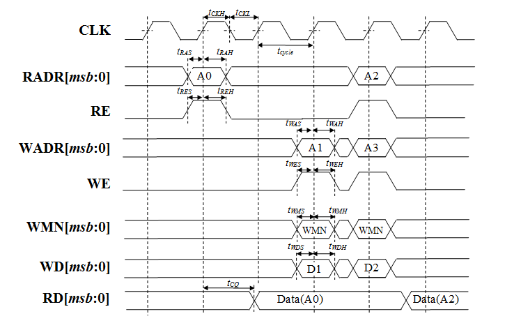

Integrator's Manual
*******************

Introduction
============

This document introduces essential knowledge for how to integrate NVDLA into
an SoC.  It includes detail on bus interfaces, power on sequence, address
map, cell requirements, testbench, and synthesis.

The open source repository contains the NVDLA design RTL, a testbench with 
a set of sanity tests, a performance estimation spreadheet, and a set of 
synthesis scripts.  

Quick-Start
===========

After downloading, to understand more about the NVDLA design, you can try out the following:

1) Set up the Linux environment with required tools.  Review :ref:`env_setup`

2) Select a configuration and build the hardware tree.  Review :ref:`tree_build`

3) Run a simulation using the included testbench.  A number of sanity 
   tests are included in the repository.  See :ref:`simulation_testbench`
 
4) Synthesize the design to review area and timing in your 
   library.  See :ref:`synthesis`.  You will need to map RAM's 
   to your RAM library.  See :ref:`memories_sram`.  And update timing contraints 
   as appropriate for your technology.

5) Open up the :ref:`performance_model` spreadsheet to look at 
   performance with different NVDLA configurations.  Configurable RTL
   is on the :doc:`roadmap`.

6) Integrate the NVDLA RTL into your SoC.  The sanity tests that are run in the stand-alone NVDLA 
   testbench can also be run at the SoC level and used to validate the integration.  
   See :ref:`test_format`.

Hardware System Interface
=========================

Overview
--------

NVDLA is a fixed function accelerator engine which is targeted towards deep
learning.  This section introduces the NVDLA external interface and
recommended connections.

System Diagram
--------------
The following diagram shows the NVDLA connections to an SoC.

.. _fig_system_interfaces:
.. figure:: ig_system_interfaces.png
  :alt: System Interface Diagram
  :scale: 50%
  :align: center

NVDLA receives commands from the host processor via the CSB interface.  The two
independent memory interfaces provide access to storage for
data feeding NVDLA and output data from NVDLA.  The interrupt provides a notification
to a controlling CPU that NVDLA has completed a task.

Interfaces
----------
NVDLA's external pins are grouped into the following interfaces:

#. Clock and Reset interface
#. System Data interface
#. Configure interface
#. Interrupt interface
#. Power control
#. DFT interface

Clock and reset interface
^^^^^^^^^^^^^^^^^^^^^^^^^
There are two clock domains in NVDLA, dla_core_clk and dla_csb_clk. They are 
asynchronous with respect to each other, and have no required frequency relationship.
Most of the sub-units 
are in dla_core_clk domain. The Csb_master sub-unit which translates configuration 
commands from host clock domain to dla_core_clk domain. To reduce power consumptions, 
clock gating technology has been deployed in NVDLA. 

The main reset signal of NVDLA is dla_reset_rstn. Internal to NVDLA it's synchronized to 
one of the two clock domains before use.  The NVDLA design utilizaes asynchronous reset
flops, so only the deassertion edge of the dla_reset_rstn signal is synchronized.  The 
assertion edge is passed through.
The other reset signal, direct_reset\_, is 
useful for ATPG testing since it bypasses the internal synchronization.

.. list-table:: Clock and Reset Signals
   :widths: 10 20 20
   :header-rows: 1

   * - Signal Name
     - Description
     - Recommended Connection
   * - dla_core_clk
     - Functional clock for NVDLA
     - Always ticking clock
   * - dla_csb_clk
     - CSB bus clock for NVDLA configuration, same clock domain as host
     - Clock of the configurable interface
   * - global_clk_ovr_on
     - Can be used to disable all non-inferred clock gates.  Typically not used.
     - Connect to a register in system controller which is reset to 0.
       You can also tie to low.
   * - tmc2slcg_disable_clock_gating
     - Disable clock gating during DFT operations.
     - Connect system DFT controller, should be 0 in normal function mode.
   * - direct_reset\_
     - DFT reset to allow for direct reset controllability during ATPG testing.
     - Typically routed to a chip level port.
   * - dla_reset_rstn
     - Main functional reset for DLA block.
     - System reset controller, can be hard-wired control logic or connect to register if SW reset is desired.

System Data Interfaces (DBBIF and SRAMIF)
^^^^^^^^^^^^^^^^^^^^^^^^^^^^^^^^^^^^^^^^^
NVDLA accesses external data through two data master interfaces: DBBIF and SRAMIF
In the RTL these are are sometimes referred to as dbb and cvsram.  Later version will 
likely all references to dbbif and sramif.
DBBIF typically is connected to off chip DRAM and provides high bandwidth with longer latency. SRAMIF 
is typically connected to an on-chip SRAM and provides high bandwidth with low.
In current release the bus interfaces are designed to run optimally with max latency on DBBIF of up to 
1440 cycles and an SRAMIF latency of up to 128 cycles. 
To support the two different memory subsystem characteristics there are some minor difference in 
implementation between the NVDLA's bus interface logic between DBBIF and SRAMIF. 

More information on the DBBIF and SRAMIF interfaces, including signal naming, can be found
in the NVDLA Hardware Architecture Guide.

Configuration Interface
^^^^^^^^^^^^^^^^^^^^^^^

The host uses the CSB (Config Space Bus) interface to access NVDLA registers. Each request to 
CSB has a fixed request size of 32 bits of data, and has a fixed 16-bit address size.  
CSB does not support any form of burst requests; each packet sent down the request channel 
is independent from any other packet.

A detailed interface description of the configuration interface can be found in NVDLA Architecture document.

Power control
^^^^^^^^^^^^^

Depending on the target library the RAM cells in NVDLA could be gated to reduce power 
consumption when NVDLA is inactive. Each layout partition has one ram power control bus, allowing
power to be ramped up/down one or more partitions at a time.  If a user is using RAM cells 
without power controls, those signals can be tied to 0.

.. list-table:: Power Control Signals
   :widths: 10 20 20
   :header-rows: 1

   * - Signal Name
     - Description
     - Recommended Connection
   * - nvdla_pwrbus_ram_*_pd[7:0]
     - RAM power gate.  These signals are routed to the SLEEP_EN bus on the RAM macro wrappers. 
       They can be used for controlling low power modes of the target RAMs.
     - SoC power management unit or tie to 0
   * - nvdla_pwrbus_ram_*_pd[8]
     - RAM retention control.  This signal is routed to the RET_EN signal on the RAM macro wrappers. 
       It can be used for controlling retention control, or any other semi-static RAM configuration bit.
     - SoC power management unit or tie to 0
   * - nvdla_pwrbus_ram_*_pd[31:9]
     - Not used
     - Tie to 0

DFT
^^^

In current release, NVDLA has implemented one signal named test_mode to enable DFT. 

.. list-table:: DFT Signals
   :widths: 10 20 20
   :header-rows: 1

   * - Signal Name
     - Description
     - Recommended Connection
   * - test_mode
     - Enable test mode.  The only use of this signal currently is to select between
       the functional and DFT reset signals.
     - Should connect to the system DFT controller as needed.  Otherwise, tie to 0.

.. _env_setup:

Environment Setup
=================
The Verilog code included in this release is parameterized such that multiple configurations
can be generated from a single source.  A hardware tree build is needed to generate the final
Verilog RTL code for a given configuration.  The tools required for this build are outlined 
below.  The versions listed are used for testing.

* Java - jdk1.7
* Perl - perl-5.10
    - XML::Simple
    - Capture::Tiny
* CPP - gcc-4.9.3
* Python - python2.6
* SystemC - systemc-2.3.0
* (for Verilator builds) Verilator - Verilator 3.912
* (for Verilator builds) clang - clang 3.4

.. warning::
  NVDLA requires the exact SystemC version specified (2.3.0).  Despite the
  subminor version change, 2.3.1 and 2.3.2 have compatibility issues with
  NVDLA, including issues with hierarchical binding, and the NVDLA Cmodel
  will fail at runtime when compiled with those versions.

.. _tree_build:

Tree Build
==========

The NVDLA repository supports the build of multiple configurations based on a feature
specification file.  Each configuration of the NVDLA is defined by a spec file in
he hw/spec/defs directory.  The filename is the name of the configuration with a ".spec"
exension.  For the configurable release, there are currently two spec files included: "nv_large" which has 2048 INT8 MAC's,
and "nv_small" which has 64 INT8 MAC's plus some other reductions; the non-configurable
release has a single spec file, "nv_full", which has 2048 multi-precision MAC units.

The file hw/tree.make specifies a list of configurations to build, as well as paths to tools
required for building the configured RTL.  To create an initial version of this file, run the
following command::

 cd hw
 make

This command will prompt for the configuration and tool locations.  It will create a tree.make
file in the hw directory containing the appropriate configuration and tool setup.  
For subsequent changes the tree.make file can be edited directory with a text editor.  Once
tree.make setup is complete, the RTL can be built::

 cd hw
 ./tools/bin/tmake -build vmod

The tmake program can also be used to launch a set of short sanity simulations.  Once you've
set up the simulation environment according to the testbench section of this 
document :ref:`testbench`, the following command can be used to launch the short sanity 
regression::

 ./tools/bin/tmake -build verif_sim

Additionally, there is a tmake target for the Cmodel of NVDLA, which lives
in the ``cmod/`` directory.  If building the Virtual Platform, or another
application that uses the NVDLA Cmodel, the following command will build it
and install it into ``outdir/nv_full/cmod/release``:

 ./tools/bin/tmake -build cmod_top

Version control usage
---------------------

NVDLA is developed in Git, on multiple branches.  It is important to use the
correct branch to track the development work that is desired.  Currently,
the following two branches exist:

* ``nvdlav1``: This is the default branch for any new clones of the NVDLA
  repository from November 21st, 2017, on.  The ``nvdlav1`` branch contains
  sustaining support work around the non-configurable, full-precision
  version of NVDLAv1 ("nv_full").  New RTL features will not be added to the
  ``nvdlav1`` branch, though bug fixes may appear, as may new verification
  features.  Users who desire a stable version of NVDLA may prefer to choose
  the ``nvdlav1`` branch.

* ``master``: This branch contains ongoing development work on the NVDLA
  RTL, including work towards multiple configurations and additional feature
  development.  This branch is expected to pass "sanity" tests, but may not
  always be tapeout-quality.  Infrastructure in this branch may change
  rapidly.  Users who desire the most up-to-date view of NVDLA development
  may prefer to choose the ``master`` branch.  The ``master`` branch was the
  default for clones made before November 21st, 2017.

Note that the ``nvdlav1`` branch's history will diverge from the ``master``
branch; the ``master`` branch will not be a strict superset of the
``nvdlav1`` branch.

.. _performance_model:

Performance Model
=================

Included in the repository is a spreadsheet based performance model.  This spreadsheet models the
performance for three popular convolutional networks: AlexNet, GoogleNet, and ResNet50.  Additional
networks could be added by following the structure of the three provided.  Performance calculated
is ideal performance as it doesn't account for some software overhead.  The spreadsheet is located
in the repository at hw/perf/DLA_OpenSource_Performance.xlsx.  The first tab in the spreadsheet, named
"Readme", describes how the model works.  It calculates the following metrics.

* Average run time for a frame
* Frames per second
* Hardware MAC utilization
* Network MAC utilization

The tool can be used to look at the affect of different hardware configurations on network performance.

Designware Components
=====================

The NVDLA design utilize the following Designware components.

* DW02_tree
* DW_lsd
* DW_minmax

For best QOR, the EDA vendor supplied versions should be used for both synthesis 
and simulation if possible.  They can be obtained directly from the EDA vendors.

If no designware implementation is available, the NVDLA repository contains
an implementation with an NV\_ prefix to the filename and module name. 
These files are in the hw/vlib directory.  The design can be switched to
using the NV\_ version of the files by setting the Verilog define macro
DESIGNWARE_NOEXIST to 1; similarly, the environment variable
DESIGNWARE_NOEXIST will enable this in the simulation build environment. 
However, these NV\_ versions should not be used currently for any tapeout.

.. warning::
  Be careful to set the DESIGNWARE_NOEXIST variable the same way for
  simulation as for synthesis.  The NV\_ variations are believed to be
  correct, but are not verified to the same degree as DesignWare components
  are; simulating different RTL than is synthesized can result in unexpected
  defects in a tapeout netlist.

Library Cells
=============

There are a few library cells which the NVDLA design requires.  These cells are instantiated 
by the design, but only behavioral models are provided.  The integrator will need to provide 
a mapping to a technology library.  Typically, the effort would be to create a Verilog 
wrapper module which has the same ports as the RTL version provided in the release, and 
which instantiates a standard cell or memory from a local library.

Synchronizers
-------------

The NVDLA design instantes four types of clock domain crossing synchronizers.  These cells
are modelled with RTL Verilog so they are synthesizable.  However, like all synchronizers, 
they should be replaced with a standard cell designed to reduce MTBF.  To replace, the
RTL impelemtnation of the cells below can be removed (keeping the port list), and replaced
with an instantiation of a standard cell synchronizer as appropriate.

* p_SSYNC2DO_C_PP

  Two flop stage deep synchronizer with an active low asynchronous reset/clear pin.  

* p_SSYNC3DO

  Three flop stage deep synchronizer.

* p_SSYNC3DO_C_PPP

  Three flop stage deep synchronizer with an active low asynchronous reset/clear pin.

* p_SSYNC3DO_S_PPP

  Three flop stage deep synchronizer with an active low asynchronous set pin.

.. _memories_sram:

Memories (SRAM)
---------------

The memories instantiated in the NVDLA design have a logical interface which is fairly common 
across RAM compilers.  The release contains a behavioral model for these RAMS which can be 
used for simulation.  For synthesis, these behavioral models will need to be replaced with 
a Verilog wrapper which maps to RAM cells from a local library.

All functionality for a RAM can be inferred from the RAM name::

  RAM<Arch>_<Depth>X<Width>[_Options]<_Mux-Option>_<Rev>

  Arch        required, physical implementation of the cell:
                -PDP  pseudo-dual port SRAM.  Created by double clocking 
                      a single port RAM.
                -DP   true dual port SRAM.  Always has independent read 
                      and write ports.
  Depth       required, number of words in the RAM
  Width       required, number of bits in the RAM
  Options     GL for all RAMs
  Mux-Option  Required, fixed width field describing column mux options
                - Mn  Column mux specification. 
  Rev         Revision: E2 for DP RAMS, D2 for PDP RAMs

RAMDP: Dual-Port SRAM
^^^^^^^^^^^^^^^^^^^^^
 
This section describes a dual-port SRAM design. The macro is designed to perform 
read and write operations independently. 

+---------------+--------------+---------+-----------------------+
| Pin           | Type         | Presence| Description           |
+===============+==============+=========+=======================+
| Read/Write Pins                                                |
+---------------+--------------+---------+-----------------------+
| CLK_R         | Input; Clock | Default | Memory read clock     |
+---------------+--------------+---------+-----------------------+
| CLK_W         | Input; Clock | Default | Memory write clock    |
+---------------+--------------+---------+-----------------------+
| RADR_[msb:0]  | Input        | Default | Synchronous read      |
|               |              |         | address input         |
+---------------+--------------+---------+-----------------------+
| RD_[msb:0]    | Output       | Default | Memory read data      |
|               |              |         | output                |
+---------------+--------------+---------+-----------------------+
| RE            | Input        | Default | Synchronous read      |
|               |              |         | enable                |
+---------------+--------------+---------+-----------------------+
| WADR_[msb:0]  | Input        | Default | Synchronous write     |
|               |              |         | address input         |
+---------------+--------------+---------+-----------------------+
| WD_[msb:0]    | Input        | Default | Synchronous write     |
|               |              |         | data input            |
+---------------+--------------+---------+-----------------------+
| WE            | Input        | Default | Synchronous write     |
|               |              |         | enable                |
+---------------+--------------+---------+-----------------------+
| Misc. Pins.  These will depend on the target RAM library for   |
| whether they’re necessary.                                     |
+---------------+--------------+---------+-----------------------+
| IDDQ          | Input        | Default | Asynchronous stand-by |
|               |              |         | mode enable pin       |
+---------------+--------------+---------+-----------------------+
|SLEEP_EN_[7:0] | Input        | Default | Power gating controls |
+---------------+--------------+---------+-----------------------+
| RET_EN        | Input        | Default | Retention enable      |
+---------------+--------------+---------+-----------------------+
| RET_SVOP[1:0] | Input        | Default | Timing margin control |
|               |              |         | pins                  |
+---------------+--------------+---------+-----------------------+

|

RAMDP is a true dual port high density SRAM, which allows read and write to operate at the same time.
 
All write operations are synchronized to the rising edge of write memory clock, CLK_W. The SRAM core is written when WE = ‘1’.  
 
Read operation is synchronized to the rising edge of the read memory clock, CLK_R.  The SRAM core is read when RE = ‘1’.  
A latch holds the read data whenever RE = ‘0’. There is no write through capability.  
If the read address matches the write address, read out data may be corrupted.

.. _fig_ram_dp_read_timing:
.. figure:: ig_sram_dp_read_timing.png
  :alt: Dual Port RAM Read Timing
  :scale: 50%
  :align: center

  Dual Port RAM Read Timing

.. _fig_ram_dp_write_timing:
.. figure:: ig_sram_dp_write_timing.png
  :alt: Dual Port RAM Write Timing
  :scale: 50%
  :align: center

  Dual Port RAM Write Timing

|
|
|

RAMPDP: Pseudo-Dual Port SRAM
^^^^^^^^^^^^^^^^^^^^^^^^^^^^^
 
This section describes an embedded pseudo-dual port SRAM macro. The RAMPDP macro behaves like a dual 
port RAM, but is created by double clocking a single port RAM. 

The following enumerates the RAMPDP pins and corresponding functions. 
 
Note that:
* All pin power is referenced to VDD.
* All enables are active high.

+---------------+--------------+---------+-----------------------+
| Pin           | Type         | Presence| Description           |
+===============+==============+=========+=======================+
| Read/Write Pins                                                |
+---------------+--------------+---------+-----------------------+
| CLK           | Input; Clock | Default | Memory clock          |
+---------------+--------------+---------+-----------------------+
| RADR_[msb:0]  | Input        | Default | Synchronous read      |
|               |              |         | address input         |
+---------------+--------------+---------+-----------------------+
| RD_[msb:0]    | Output       | Default | Memory read data      |
|               |              |         | output                |
+---------------+--------------+---------+-----------------------+
| RE            | Input        | Default | Synchronous read      |
|               |              |         | enable                |
+---------------+--------------+---------+-----------------------+
| WADR_[msb:0]  | Input        | Default | Synchronous write     |
|               |              |         | address input         |
+---------------+--------------+---------+-----------------------+
| WD_[msb:0]    | Input        | Default | Synchronous write     |
|               |              |         | data input            |
+---------------+--------------+---------+-----------------------+
| WE            | Input        | Default | Synchronous write     |
|               |              |         | enable                |
+---------------+--------------+---------+-----------------------+
| Misc. Pins.  These will depend on the target RAM library for   |
| whether they are necessary.                                    |
+---------------+--------------+---------+-----------------------+
| IDDQ          | Input        | Default | Asynchronous stand-by |
|               |              |         | mode enable pin       |
+---------------+--------------+---------+-----------------------+
|SLEEP_EN_[7:0] | Input        | Default | Power gating controls |
+---------------+--------------+---------+-----------------------+
| RET_EN        | Input        | Default | Retention enable      |
+---------------+--------------+---------+-----------------------+
| RET_SVOP[1:0] | Input        | Default | Timing margin control |
|               |              |         | pins                  |
+---------------+--------------+---------+-----------------------+

.. _fig_ram_pdp_timing:

  Pseudo Dual Port RAM Timing

The RAMPDP behaves like a dual port RAM, but is created by double clocking a single port RAM. 
It can perform a ‘single read’ (1R), a ‘single write’ (1W) or a ‘read followed by write’ (1R+1W) 
operation in any given clock cycle.
A read operation is performed when the signal RE is active high (RE= ‘1’). The output data 
will be driven to the output port RD in the same cycle read commands are issued.
A latch holds the read data when ‘RE’=0. A write operation is performed when WE is high (WE= ‘1’). 
The input data must be put on the input data bus WD at the same time with the write command.  
Note that if the read and write address match during a (1R+1W) operation, i.e. RE=WE=’1’, the 
read data will contain the previous contents of the RAM (read occurs before write).

.. _synthesis:

Synthesis
=========

Overview
--------
This release contains reference synthesis setup for the NVDLA design with Design Compiler (Wireload Model/Topographical).

Directory structure
-------------------

The release directory structure for synthesis is shown below::

 <NVDLA_RELEASE>
    |--- syn
    |--- scripts
    |       |--- syn_launch.sh
    |       |--- default_config.sh
    |       |--- dc_run.tcl
    |       |--- dc_interactive.tcl
    |       `--- dc_app_vars.tcl
    |--- templates
    |       |--- config.sh
    |       `--- cg_latency_lut.tcl
    `--- cons
           |--- NV_NVDLA_partition_a.sdc
           |--- NV_NVDLA_partition_c.sdc
           |--- NV_NVDLA_partition_m.sdc
           |--- NV_NVDLA_partition_o.sdc
           `--- NV_NVDLA_partition_p.sdc          

``NV_NVDLA_partition_*`` are synthesis **“TOP_NAMES”** - The designs will be compiled at this 
hierarchy, and netlists will be generated for these designs. These are independent 
sub-designs for synthesis, which are instantiated in a top-level wrapper. 

Requirements
------------

You will need a \*NIX machine able to run Design Compiler. 
The scripts have been tested with Design Compiler version 2016.12 and newer. 
Memory and CPU requirements vary. 

Synthesis Configuration
-----------------------
To be able to run synthesis, you will need a config file - You can use 
the “<NVDLA_ROOT>/syn/dc/templates/config.sh” file  as reference. This file is in “bash” syntax. 

There are many required and optional variables. Table below lists the supported 
variables, meanings and defaults. 

|
|

.. list-table:: Design Related Options
   :widths: 10 30
   :header-rows: 1

   * - Variable
     - Comments
   * - ``NVDLA_ROOT``
     - Location on disk for the NVDLA source "hw" directory.  
   * - ``TOP_NAMES``
     - Space separated list of TOP_NAMES to synthesize. You may choose to synthesize all or a subset of TOP_NAMES. 
       Defaults to  
       “NV_NVDLA_partition_a NV_NVDLA_partition_c NV_NVDLA_partition_o NV_NVDLA_partition_m NV_NVDLA_partition_p”
   * - ``RTL_SEARCH_PATH``
     - Space separated list of search paths (directories) for locating all the pieces of RTL. 
       Defaults to an empty string.
       Please do not include paths to non synthesizable (behavioral) RAM models, like the ones in ``${NVDLA_ROOT}/vmod/rams/model``
   * - ``RTL_INCLUDE_SEARCH_PATH``
     - Space separated list of search paths (directories) for locating all the supplementary Verilog include files. 
       Defaults to an empty string. 
   * - ``EXTRA_RTL``
     - List of files to read in, apart from the modules that can be found in the search paths. 
       Defaults to an empty string. 
   * - ``RTL_EXTENSIONS``
     - List of extensions for the source RTL files.
       Defaults to “.v .sv .gv”
   * - ``RTL_INCLUDE_EXTENSIONS``
     - List of extensions for supplementary Verilog include files. Defaults to “.vh .svh”
   * - ``DEF``
     - Path to directory containing floorplans in the “DEF” format. Files should be named by the TOP_NAMES, with the extension “.def”
       This variable defaults to a directory called  “def” in the current directory
       
       We do not provide templates, because it depends on the process node, and the memory compiler being used. 
   * - ``CONS``
     - Path to directory containing constraints in the “SDC” format. 
       Files should be named by the TOP_NAMES, with the extension “.sdc”
       This directory may also contain “<TOP_NAME>.tcl” to specify any non-SDC constraints to guide synthesis. 
       All of these constraints are sourced before compiling the design. 
       This variable defaults to a directory called “cons” in the current directory.
      
       We provide template SDCs for all logical partitions in the `${NVDLA_ROOT}/syn/cons` directory including
       clock constraints etc. You may provide your own constraints, based on the process node you are targeting. 

|
|
|

.. list-table:: Tool Related Options
   :widths: 10 30
   :header-rows: 1

   * - Variable
     - Comments
   * - ``DC_PATH``
     - Location of the Design Compiler installation. 
       Defaults to an empty string

|
|
|

.. list-table:: Library Related Options
   :widths: 10 30
   :header-rows: 1

   * - Variable
     - Comments
   * - ``TARGET_LIB``
     - Path to a single standard cell library that will be used to map the design to (the “target” library). 
       Defaults to an empty string. 
   * - ``LINK_LIB``
     - Path to all the libraries that are required to link the design. 
       This should include the target library as well.
       Include any RAM compiler timing libraries here. 
       Defaults to an empty string. 
   * - ``TF_FILE``
     - Path to the “Milkyway Technology File” that is used to create the Milkyway models for the physical library.
       Please check with your standard cell library vendor for the right file to use.
       Defaults to an empty string. 
       Required for DC-Topographical
   * - ``TLUPLUS_FILE``
     - Path to the “TLUPlus” files that will be used for RC extraction
       Please check with your standard cell library vendor for the right file to use.
       Defaults to an empty string. 
       Required for DC-Topographical
   * - ``TLUPLUS_MAPPING_FILE``
     - Path to the “Tech2ITF” mapping file, that maps layer names from between the Milkyway Tech file and the interconnect technology format file. 
       Please check with your standard cell library vendor for the right file to use. 
       Defaults to an empty string. 
       Required for DC-Topographical
   * - ``MIN_ROUTING_LAYER``
     - Bottom routing layer for signal nets. 
       Please check with place-and-route methodology for the right value. 
       Defaults to an empty string. 
       Required for DC-Topographical
   * - ``MAX_ROUTING_LAYER``
     - Top routing layer for signal nets.
       Please check with place-and-route methodology for the right value. 
       Defaults to an empty string. 
       Required for DC-Topographical
   * - ``HORIZONTAL_LAYERS``
     - Space separated list of layers with preferred horizontal routing.
       Defaults to an empty string. 
   * - ``VERTICAL_LAYERS``
     - Space separated list of layers with preferred vertical routing.
       Defaults to an empty string. 
   * - ``DONT_USE_LIST``
     - Space separated list of regular expressions for cells that you do not wish to map your design to. 
       A “dont_use” will be applied on these cells in Design Compiler. 
       Defaults to an empty string. 
   * - ``WIRELOAD_MODEL_FILE``
     - A file containing a “wireload model” - a lookup table for resistance and capacitance calculation based on fanout. 
       Refer to the lcug16_Defining_Wire_Load_Groups.htm on the Synopsys Solvnet site
       for more information regarding wire load modeling. 
       Not required if your standard cell library contains the wireload models built in. 
       Not required for DC-Topographical. 
       Defaults to an empty string.
   * - ``WIRELOAD_MODEL_NAME``
     - Name of the wireload model lookup table (if you have multiple tables) 
       Not required for DC-Topographical.
       Defaults to an empty string. 

|
|
|

.. warning::
  We do not supply timing models or synthesizable RTL for the RAMs in the design. 
  These need to be provided by the user for the process node/ memory compiler being used. 
  
  Please DO NOT include ``${NVDLA_ROOT}/vmod/rams/model`` in the RTL_SEARCH_PATH - They are simulation models, not synthesizable.

.. list-table:: Miscellaneous Options
   :widths: 10 30
   :header-rows: 1

   * - Variable
     - Comments
   * - ``TIGHTEN_CGE``
     - Boolean, “1” to enable over constraining the CG-Enable paths. See section 5.5.2 below
       Default is set to “0”
   * - ``CGLUT_FILE``
     - File containing the fanout-based CG over constraint lookup table to pessimize the CG enable paths. See section 5.5.2 below.
       Please see “${NVDLA_ROOT}/syn/templates/cg_latency_lut.tcl” for an example.
       Defaults to an empty string. 
   * - ``DC_NUM_CORES``
     - The number of CPU cores available for Design Compiler.
       Defaults to ‘1’ 
       Note: Single CPU core synthesis may see a long overall runtime. 
   * - ``AREA_RECOVERY``
     - Boolean, “1” to Run quick area optimization by undoing some optimizations on paths with positive slack. 
       Defaults to “1”.
   * - ``INCREMENTAL_RECOMPILE_COUNT``
     - Number of rounds of incremental compiles  to run in Design Compiler. 
       Defaults to “1” - This amounts to 2 rounds of compile, one for mapping - the “main” compile 
       and one for incremental optimization - the “incremental” compile.
   * - ``COMMAND_PREFIX``
     - String. 
       Defaults to an empty string. 
       This will be pre-fixed to the dc_shell command . 
       Use this to manage job submission  on LSF farm or grid, as appropriate. 
       Use literal strings “<MODULE>” and “<LOG>” to substitute module name and log directory for each TOP_NAMES. 
       In the absence of a command prefix, the synthesis  jobs for each TOP_NAMES will run serially. 
       If you do provide a command prefix, make sure that it is non-blocking, so that all synthesis jobs 
       can be parallelized. Otherwise, the jobs are run serially. 
       Example::

         export COMMAND_PREFIX="bsub -q some_queue -o <LOG>/<MODULE>.lsf.log"

Synthesis constraints
---------------------

Clock Constraints
^^^^^^^^^^^^^^^^^

The clock constraints are provided through an SDC file. 
You will find reference constraints in “${NVDLA_ROOT}/syn/cons/NV_NVDLA_partition*.sdc”. 
These contain clock targets for the 16nm process. You will need to scale the clock 
constraints to the target process/synthesis corner as appropriate. 
The SDC files also contain some timing exceptions (false paths) as well.
Please populate the SDC files for all TOP_NAMES in a single directory, and set the CONS variable 
in the configuration file described in the previous section.

You can also add additional non-SDC constraints, like, for example, specific clock gating styles, etc. in <CONS>/NV_NVDLA_partition*.tcl

Clock Gate Enable Path Over constraining
^^^^^^^^^^^^^^^^^^^^^^^^^^^^^^^^^^^^^^^^

The flow allows for over constraining the CG enable paths to pessimize synthesis to take into account post-CTS latencies. 
This is achieved through a fanout-based lookup table in TCL syntax. See “${NVDLA_ROOT}/syn/templates/cg_latency_lut.tcl” for an example. 
Provide the path to this file as the CGLUT_FILE variable in the configuration file.
To enable the over constraining, please set TIGHTEN_CGE variable to 1 in the configuration file.

Physical Constraints
^^^^^^^^^^^^^^^^^^^^

If you are running physical synthesis, you can provide floorplans in DEF syntax for 
RAM/IO placement as input, depending on your physical implementation. 
Populate the DEF files for all TOP_NAMES in a single directory, and provide the path 
to the directory as the DEF variable. 

You can also provide constraints in TCL syntax, through “<CONS>/NV_NVDLA_partition*.tcl” files. 

Running synthesis
-----------------

You can run synthesis using the “${NVDLA_ROOT}/syn/dc/scripts/syn_launch.sh” bash script. 
The supported arguments to the scripts are in table below.

|

.. list-table:: Miscellaneous Options
   :widths: 10 30
   :header-rows: 1

   * - Argument
     - Explanation
   * - ``-config``
     - Path to the synthesis configuration file (see section 5.4)
       If not provided, the flow will look for a file called “config.sh” in the current directory. 
   * - ``-mode``
     - Specifies which tool to use for synthesis. Use one of the following::

        “wlm” => Use Design Compiler (non-topographical) for wireload model based synthesis (non-physical)
        “dct” => Use DC-Topographical
        “dcg” => Use DC-Graphical along with “-spg” in the compile command. 
        “de”  => Use DC Explorer for synthesis.
   * - ``-build``
     - Sandbox of synthesis. Optional. 
       Defaults to “``nvdla_syn_<timestamp>``”
   * - ``-modules``
     - Space separated list of modules to run synthesis on / restore database for. 
       If not specified, the TOP_NAMES must be populated in the configuration file.
   * - ``-restore``
     - Path to design database (in DDC format) to restore.
       

| 

Running Non-physical synthesis (Wireload Models)
^^^^^^^^^^^^^^^^^^^^^^^^^^^^^^^^^^^^^^^^^^^^^^^^

You can run::

    ${NVDLA_ROOT}/syn/dc/scripts/syn_launch.sh -mode wlm -config /path/to/config.sh

You will need to have a wire load model defined in your standard cell library, or in a 
separate file (in liberty syntax, as described in the lcug16_Defining_Wire_Load_Groups.htm 
on Synopsys solvnet)

In the configuration file the following variables are required to be defined::

  WIRELOAD_MODEL_NAME 
  TARGET_LIB 
  LINK_LIB 
  DC_PATH 

The following variables are optional::

 WIRELOAD_MODEL_FILE

Running physical synthesis
^^^^^^^^^^^^^^^^^^^^^^^^^^

You can run one of the following, To pick DC-Topographical/DC-Graphical/DC Explorer::

    ${NVDLA_ROOT}/syn/dc/scripts/syn_launch.sh -mode dct -config /path/to/config.sh
    ${NVDLA_ROOT}/syn/dc/scripts/syn_launch.sh -mode dcg -config /path/to/config.sh
    ${NVDLA_ROOT}/syn/dc/scripts/syn_launch.sh -mode de -config /path/to/config.sh

In the configuration file, the following variables are required to be defined::

  TARGET_LIB
  LINK_LIB
  MW_LIB
  DC_PATH
  TF_FILE
  TLUPLUS_FILE
  TLUPLUS_MAPPING_FILE
  MIN_ROUTING_LAYER
  MAX_ROUTING_LAYER

Additionally, you may require the following variables depending on how your physical library views were built::

  HORIZONTAL_LAYERS
  VERTICAL_LAYERS

Restoring a design database
^^^^^^^^^^^^^^^^^^^^^^^^^^^

You can run one of the following, To restore a design database from a previous synthesis run with the reference methodology::

    ${NVDLA_ROOT}/syn/dc/scripts/syn_launch.sh -mode <mode_used_for_synthesis> -config /path/to/config.sh -build <build_tag_used_for_synthesis> -restore /path/to/build/db/<module>.ddc -modules <module>

Synthesis outputs
-----------------

In the synthesis sandbox, the following outputs are generated::

  <BUILD>
     |--- fv
     |     `--- NV_NVDLA_parition*
     |              `--- NV_NVDLA_parition*.svf
     |--- net
     |     |--- NV_NVDLA_partition*.gv (Mapped Netlist)
     |     |--- NV_NVDLA_partition*.full.def (complete output DEF)
     |     `--- NV_NVDLA_partition*.sdc (Output SDC)
     |--- db
     |     `--- NV_NVDLA_partition*.ddc (Synthesis design Database)
     |           (There are also a few intermediate design databases here)
     `--- report
             |--- NV_NVDLA_partition*.check_design
             |--- NV_NVDLA_partition*.check_timing
             `--- NV_NVDLA_partition*.final.report
                        (Detailed timing/QoR information)
                        (There are also reports generated at intermediate stages)

.. _testbench:

Testbench & Traces
==================

This section describes the trace-player testbench and traces supplied with the release.  The 
testbench is intended to be used
to validate basic RTL functionality, and to provide a reference for RTL integration efforts. 
The tests themselves are inteded to work either in the included testbench or within an SoC 
simulation.  When used within an SoC simulation, it is expected that the SoC's processor will
playing back the trace and responding to NVDLA interrupts.  The trace format is documented below.

Tests
-----

The NVDLA repository contains seven basic sanity tests, and two layer tests.  Additional tests will be added periodically.

Basic sanity tests
------------------

* sanity0 - basic register write and compare read-back value
* sanity1 - memory copy test using bdma (dbb to dbb), test ends using register polling
* sanity2 - sanity1 waiting on interrupts instead of register polling
* sanity3 - convolution test, test ends using register polling and compares output mem region to determine passing
* sanity3_cvsram - convolution test, uses cvsram path instead of dbb, test ends using register polling and compares output mem region to determine passing

Short single function tests using dbb
-------------------------------------

* conv_8x8_fc_int16
* pdp_max_pooling_int16
* sdp_relu_int16

Long layer tests
----------------

* googlenet_conv2_3x3_int16 - uses cvsram, 30 min runtime
* cc_alexnet_conv5_relu5_int16_dtest_cvsram - uses cvsram, 156 min runtime
 
The long layer tests are not in the regress target. Run using

* make run TESTDIR=../traces/traceplayer/googlenet_conv2_3x3_int16
* make run TESTDIR=../traces/traceplayer/cc_alexnet_conv5_relu5_int16_dtest_cvsram

.. _test_format:

Test Format
-----------

Tests will be in trace form and will support seven commands:  cpu read/write, memory read/write, 
memory load/dump, and interrupt wait. 

Tests read in input.txn in what we call "trace" format which is a file containing a list of 
register and memory accesses that will be used by the test before finishing the simulation. The script in synth_tb/sim_scripts/inp_txn_to_hexdump.pl reads input.txn and outputs input.txn.raw containing encodings for the csb master sequencer to read and execute from.

Hardware Config Read/Write Commands
^^^^^^^^^^^^^^^^^^^^^^^^^^^^^^^^^^^

The main test trace performs register reads/writes to the NVDLA IP.  These commands
will cause reads and write commands to the CSB programming bus.

Reg read and write Commands are listed in the following table.

.. list-table::
   :widths: 20 30
   :header-rows: 1

   * - Command
     - Description
   * - write_reg <misc:16><addr:16> <data:32> 
     - Execute a 32b data write to a 16b addr.

       addr is calculated from 
       (documented register address - NVDLA_GLB.S_NVDLA_HW_VERSION_0.offset) >> 2.
       Left shift by 2 because hardware expects the word address.

       Bit 1 of misc (bit 17 of 32b field) means CSB master will wait for wr_complete or error
       before sending next read or write.
       Bit 0 of misc (bit 16 of 32b field) is 1 for writes and 0 for reads.

       inp_txn_to_hexdump.pl will correct the rd/wr bit based on read_reg/write_reg cmd.
       Examples::

         write_reg 0x00030200 0x1234c0de //Wait for wr_complete or error
         write_reg 0x00010200 0x1234da7a //Don't wait for wr_complete or error
   * - read_reg <misc:16><addr:16> <bitmask:32> <expectedData:32>
     - Execute a polling read to 16b addr and poll until (returnData & bitmask) == expectedData.
       Number of polls will be equal to  +read_reg_poll_retries (default 50).
       Examples::

         read_reg  0x00000200 0xffffffff 0x1234da7a //0x0020 read back should be 0x1234da7a

Memory Read/Write Commands
^^^^^^^^^^^^^^^^^^^^^^^^^^

To accelerate simulation these trace commands perform reads/writes directly to the memory model.

Memory read and write Commands are listed in the following table.

.. list-table::
   :widths: 20 30
   :header-rows: 1

   * - Command
     - Description
   * - write_mem <addr:64> <bytemask:16> <wdata:128>
     - Execute a 128b data write with corresponding 16 byte mask to 64b addr.
   * - read_mem <addr:64> <bitmask:128> <expectedData:128>
     - Execute a polling read to 64b addr and poll until 128b expectedData is met.  
       Number of polls will be equal to  +read_mem_poll_retries (default 50).
       Example::

         read_mem 0x41000000 0xffffffffffffffffffffffffffffffffffffffffffffffff 
                             0x00000000000000000000000000080000

Memory Load/Dump Command
^^^^^^^^^^^^^^^^^^^^^^^^

To further accelerate simulation, the trace supports loading and dumping of memory directly to/from a file.

.. list-table::
   :widths: 20 30
   :header-rows: 1

   * - Command
     - Description
   * - load_mem <addr:64> <num_bytes:32> <string>
     - Use Verilog $readmemh() to load memory with 32b num_bytes at 64b addr from file, “string”.
   * - dump_mem <addr:64> <num_bytes:32> <string>
     - Use Verilog $writememh() to dump 32b num_bytes at 64b addr of memory to file, “string”.

Interrupt Wait Command
^^^^^^^^^^^^^^^^^^^^^^

This command allows for trace replay to pause while NVDLA completes a task.  An interrupt from NVDLA 
will resume trace execution.

.. list-table::
   :widths: 20 30
   :header-rows: 1

   * - Command
     - Description
   * - wait <level/edge> <irq#>
     - Block the current trace until either an interrupt level or edge is detected::

           wait high dla_intr     // Wait for high level on dla_intr
           wait low dla_intr      // Wait for low level on dla_intr
           wait posedge dla_intr  // Wait for posedge on dla_intr
           wait negedge dla_intr  // Wait for negedge on dla_intr

.. _simulation_testbench:

Reference Simulation Testbench
------------------------------

CSB Master Trace Player
^^^^^^^^^^^^^^^^^^^^^^^

The trace player is an master agent that reads a test vector file, typically input.txn, in the format as described in the Tests section.  It parses and supports seven operations:  polling read and write to/from NVDLA; polling read and write directly to/from memory;   file load and dump directly to/from memory; and wait for interrupt.
The memory write, load, and dump commands occur in zero simulation time.  The polling memory read function retries after 100 clocks up to 100 times, by default.  The read_mem retry and delay counts are configurable with the +read_mem_poll_retries and +read_mem_poll_interval_clocks plusargs, respectively.  The polling reg read functions retries after 100 clocks upto 100 times, by default.  The read_reg retry and delay counts are configurable with the +read_reg_poll_retries and +read_reg_poll_interval_clocks plusargs, respectively.  The reg write functions blocks until the write transaction is accepted by the NVDLA.   The wait blocks until the interrupt event occurs.

DBBIF Slave Agent
^^^^^^^^^^^^^^^^^

The DBBIF slave agent captures DBBIF memory transactions and issues reads and writes to memory.  The NVDLA and environment supports one slave agent per memory region, 16B/clk.

CVSRAM Slave Agent
^^^^^^^^^^^^^^^^^^

The CVSRAM slave agent captures CVSRAM memory transactions and issues reads and writes to a section of memory logically separate from DBB.  The NVDLA and environment supports one slave agent per memory region, 16B/clk.

Memory Stub
^^^^^^^^^^^

The memory stub is a large, linear addressable Verilog memory array.  It’s accessed by the NVDLA via the 
DBBIF slave agent.  It can also be triggered by the CSB Master agent to load or store contents to/from 
memory via files to reduce overall run time.
The memory stub file access is trigged by load/dump_mem calls within the trace.

Running a Test (using make)
^^^^^^^^^^^^^^^^^^^^^^^^^^^

The user should “cd” into the ‘export_top/verif/sim’ directory to execute the Makefile 
targets described in the sections below.
Note that the Makefile can run multiple tests in parallel by supplying the batch 
launch command in the export_top/verif/sim/Makefile ‘LSF_COMMAND’ variable.  E.g, if the user
launches jobs to LSF with ‘bsub –q <LSF queue name>’, the user can set the LSF_COMMAND 
variable to this string in the Makefile::

 LSF_COMMAND := bsub –q <LSF queue name>

Now when the user runs a multi-test regression, the tests will run in parallel via LSF.

The make targets are described below.

* make sanity

  This target will build everything that is needed for any simulation.  It is the first thing that should be done. This make target will also run one test.  With this target, the user can determine if there are any compile or runtime issues with the installation and/or environment in a reasonably short period of time. 

* make all

  This target will build everything that is needed for any simulation.  This make target will also run the regression set of tests.  See make regress for more details.  

* make build

  This target will just generate and execute the VCS compile command line.  If test bench code is changed, this target is used to recompile and generated the VCS based simulation executable.

* make run

  This target will run a test. Default is the same test that was run with the make all target.  Additional arguments for this target are::

   DUMP=[0|1]  (specifies if waves are to be dumped or not.  0 is default, which 
                indicates that waves will not be dumped out).
   TESTDIR=<testDirectory>  (pass a different test that the default which 
                             is ../traces/traceplayer/sanity0)

  Examples command lines::
   make run DUMP=1 TESTDIR=../traces/traceplayer/sanity0
   make run DUMP=0 TESTDIR=../traces/traceplayer/conv_8x8_fc_int16

  All packaged tests will be found in the verif/traces/* directories.  Within each test directory there is 
  an ‘input.txn’ file which is a list of the input transactions executed against the DUT.
  During simulation an overall log file and also a master transaction and slave transaction log will be 
  generated to help debug or view what is happening during the simulation. These logs will be found after the 
  simulation in the same directory as the location of the test input file.  The VCS log will be 
  named <TESTDIR>/test.log.

* make regress

  This will run the entire regression serially. At the end of the regression a message will be displayed 
  to user to check the results of the regression by issuing make check_regress.  
  The make check_regress will display the results of each test run.
  Before running a large regression run a mini regression to make sure there are no environment or 
  build issues.  A mini regression can be kicked off with::

   make regress MINIREGRESS=1

  One can also run regressions in parallel by using the ``-j<NUM>`` make option.  For example, to run a full 
  regression where 3 tests are running simultaneously, but only from the functional set of traces use::

   make -j3 regress

* make show_plusargs

  This target will display test plus args to be used at run time as well as vcs build args to be used at compile time.

* make check

  This target runs the ‘export_top/verif/sim/checktest[_synthtb].pl’ script that reports status for a specified test.  
  For a performance test with a local perf_regs file, it will report the performance score of the test.  
  For tests with backdoor data, it will also compare the final test memory image with the expected 
  image and report results of the comparison.

* make check_regress

  This target is similar to make check but operates on the entire regression.

* make dve

  This target will bring up the synopsys Discovery Visual Environment  (DVE) waveform viewer so that 
  input and output signals to the NVDLA can be observed.

* make dumper

  This target will build the necessary targets if you want to generate verdi or siloti waveform formats.  
  This target can be kicked off in parallel with the make build target.  It is not added to the 
  make all target, since not all users have the verdi environment.

* make verdi

  This target will bring up the verdi design browser and waveform viewer, so that the input and output 
  signals and transactions can be graphically viewed over time.

* make siloti

  This target will bring up the siloti design browser and waveform viewer , so that the input and 
  output signals and transactions can be graphically viewed over time.  This dumping format 
  is smaller/faster and more efficient.

Makefile Run Options
^^^^^^^^^^^^^^^^^^^^
The user can specify one or more of the following options during the execution of the make targets.

.. list-table::
   :widths: 20 15 30
   :header-rows: 1

   * - Macro Option
     - Default
     - Description
   * - DUMP=[0|1]
     - 0
     - Controls whether or not waveforms are dumped during the simulation.  1=Dump waveforms.
       0=no waveforms dumped.
   * - MINIREGRESS=[0|1]
     - 0
     - Control whether to run a mini sanity regression with make regress:: 
     
         1=Run mini-sanity regression.
         0=Don’t run mini-sanity regression.
   * - PLUSARGS=[“listOfUserPlusOptions”]
     - “”
     - See options described in the runtime configuration options section later in this document.   
       The user can supply one or more arguments for run time control of the tests.  This option can 
       be used with the following make targets:  sanity, all, run, and regress.  For example::
       
           PLUSARGS=”+mem_read_latency=80 +read_reg_poll_retries=10000”

   * - REGRESSTYPE=[FUNC|PERF|APP|ALL]
     - ALL
     - Guides make regress to run FUNCtional, PERFormance, APPlication, or ALL tests.
   * - TESTDIR=[pathToTestDirectory]
     - ../traces/traceplayer/sanity0
     - Specify the test to run.

Makefile Config
^^^^^^^^^^^^^^^

The Makefile uses the following major variables to for tool setup.  They should set appropriately based on the environment.

.. list-table::
   :widths: 20 20 20
   :header-rows: 1

   * - Macro
     - Default
     - Description
   * - VCS_HOME
     - /home/tools/vcs/mx-2015.09-SP2-9-T0426
     - Path to VCS, including version.
   * - VCS_CC
     - /home/utils/gcc-4.7.2/bin/g++
     - C compiler used by VCS.
   * - LM_LICENSE_FILE
     - /home/tools/admin/license_files
     - License file for VCS.
   * - VERDI_HOME
     - /home/tools/debussy/verdi3_2015.09-SP2-11
     - Path to verdi waveform viewer.
   * - NOVAS_HOME
     - /home/tools/debussy/verdi3_2015.09-SP2-11
     - Path to verdi waveform viewer.
   * - DUMP
     - 0
     - Control whether or not waveforms are dumped during the simulation.  1=Dump waveforms. 0=No waveforms dumped.
   * - DUMPER
     - DVE
     - Format of the waveform file will by default be in dve format.  To put in Novas’ verdi format use 
       DUMPER=VERDI . To use Novas essential signal list format use DUMPER=SILOTI
   * - IMAGEVIEWER
     - gimp
     - Path to bit map image viewing tool.
   * - VERDI_DUMP_NAME
     - debussy
     - Name of the verdi dump files
   * - SILOTI_DUMP_NAME
     - siloti
     - Name of the siloti (esa enhanced) dump files
   * - VCS_EXECUTABLE
     - simv
     - Used to specify the name of the generated simulation executable.
   * - TESTDIR
     - ../traces/traceplayer/sanity0
     - Used to specify the test that user wants to run.
   * - REGRESS_LIST
     - see Makefile
     - Used to specify the list of tests via directory names that should be run in a regression
   * - DEFAULT_PLUSARGS
     - +continue_on_fail +read_reg_poll_retries=100 +read_reg_poll_interval_clocks=100 +read_reg_timeout_clocks=100000
     - Default simulator run time arguments.  See simulator runtime options described later in this document.

There are other tools that the Makefile uses and these may need to be adjusted to the customer 
Linux environment.  The following table lists these variables.

.. list-table::
   :widths: 20 20 20
   :header-rows: 1

   * - Macro
     - Default
     - Description
   * - AWK
     - /usr/bin/awk
     - Standard awk. Used as a  pattern scanning and processing language
   * - CAT
     - /bin/cat
     - Path to default cat for concatenating files and printing to standard output.
   * - CSH
     - /bin/csh
     - Path to the environment C shell executable.
   * - EGREP
     - /bin/egrep
     - Standard egrep. Used to print lines matching a pattern when passed regexpressions.
   * - GREP
     - /bin/grep
     - Standard grep. Used to print lines matching a pattern.
   * - LS
     - /bin/ls                    	
     - Standard ls for listing what is in a direcotory.
   * - MD5SUM
     - /usr/bin/md5sum
     - compute and check MD5 message digest
   * - PERL
     - /home/utils/perl-5.14/5.14.1-nothreads-64/bin/perl
     - Standard perl installation, for executing perl scripts.
   * - RM
     - /bin/rm
     - Path to the environment rm executable. Used to remove files and directories.
   * - TAR
     - /bin/tar
     - The GNU version of the tar archiving utility
   * - TEE
     - /bin/cp
     - Standard tee for reading from standard input and writing to standard output and files.

Test Success
^^^^^^^^^^^^

Initial Test success can be seen at the bottom of the standard output after running a test (i.e. after make run) 
or by using the make check TESTDIR=<testDirectory>  target.   After a full regression, the user can also use 
the make check_regress target to see the results of all tests that have been run.

The following shows an example of the make check output::

  Checking sanity0 test.log
  checktest : PASSED : sanity0

The following shows an example of the make check_regress output (the user’s specific results may look different depending on which test directories were released in the delivered package)::

  checktest : PASSED : sanity0
  checktest : PASSED : sanity1
  checktest : PASSED : sanity2
  checktest : okPASS : conv_8x8_fc_int16: all transactions completed : with 2 non fatal errors

The above output would indicate that all tests passed except the conv_8x8_fc_int16 test which had some non-fatal error message that should be looked at.   
If the user has done a clean install and not changed any code, the user should expect to see 
all regression tests passing. 
If the test is a performance test, then make check will also print an additional line 
called ‘checkperf’ which will report the performance score of the test, and highlight the delta versus expected.

Success Via Looking At Logfile
^^^^^^^^^^^^^^^^^^^^^^^^^^^^^^

In addition, the user can go look at the log file.  At the bottom of the test log one would see text that typically follows the following format::

  4020.50ns MSEQ: Backdoor mem_dump of file            0.chiplib_replay.raw2 at address 0x80400000 for length 0x00000020.
  $finish called from file "/home/scratch.stephenh_t194/nvdla_git/hw/verif/synth_tb/csb_master_seq.v", line 271.
  $finish at simulation time       4520.90ns
             V C S   S i m u l a t i o n   R e p o r t
  Time: 4520900 ps
  CPU Time:      4.410 seconds;       Data structure size: 430.9Mb
  Mon Sep 25 13:28:44 2017
  $finish called.

As long as the user sees that there are zero ERRORs and zero FATAL errors, then the test executed successfully. The user should still check the output of checktest_synthtb.pl to verify that mem_dump matches the reference output.

Runtime Configuration
^^^^^^^^^^^^^^^^^^^^^

* CSB Master Trace Player

  At runtime, the user can specify various run time control and debug options in the trace player.   By default, no change is required to pass provided tests.

  .. list-table::
   :widths: 20 20 
   :header-rows: 1

   * - Plusarg
     - Description
   * - +ignore_poll
     - Don’t retry if poll mismatches.  Just continue running.
   * - +continue_on_fail
     - Retry polls if they mismatch but continue running instead of dying if the limit is hit.
   * - +ignore_badf
     - If a register read returns badf, continue instead of polling.  (Used to ignore bad registers in the trace.)
   * - +read_reg_poll_retries=<cnt>
     - Number of retries on reg read.
   * - +read_mem_poll_retries=<cnt>
     - Number of retries on mem read.
   * - +read_reg_poll_interval_clocks=<clks>
     - Number of clocks to wait after a bad reg match, before retrying
   * - +read_mem_poll_interval_clocks=<clks>
     - Number of clocks to wait after a bad mem match, before retrying
   * - +intr_timeout_clocks=<clks>
     - Number of clocks to wait after a bad interrupt wait, before fatal error.

* DBBIF Interface To Memory Subsystem

  At runtime, the behavior of the DBBIF interface to the memory subsystem can be altered with Verilog plusargs. The user can specify the following.

  .. list-table::
   :widths: 10 40
   :header-rows: 1

   * - Plusarg
     - Description
   * - +mem_bandwidth_pct=<pct> and +mem_bandwidth_window=<clks>
     - Bandwidth: Memory bandwidth can be configured with the plusargs +mem_bandwidth_pct, and +mem_bandwidth_window.  mem_bandwidth_pct (default 50) is a percentage which says how often a data beat can be transferred across the interface.  mem_bandwidth_window is the number of clocks to use as the averaging window for computing the utilization percentage (default 100). This percentage reflects the combined read/write bandwidth of both memory interfaces. As an example, 100% bandwidth utilization would imply that for every clock cycle, write data was being written on both mem0/mem1, and read data was being returned on both mem0/mem1. At 400MHz * 16 bytes * 4 lanes. 100% utilization implies a combined bandwidth of 25.6GB/sec. To limit bandwidth to 12.8GB/sec, a mem_bandwidth_pct of 50 would be used (at most 2 of 4 bidirectional lanes active per clock, on average).
   * - +mem_read_latency=<clks>
     - Read latency:  The read latency of the memory can be configured with the plusarg +mem_read_latency. The value of the parameter determines the number of clock cycles between when the read is accepted and when the read return valid signal is asserted. The default value is 180 (450ns @ 400MHz), and the maximum value is 1000.
   * - +mem_write_latency=<clks>
     - Write to write ack latency: The write latency of the memory can be configured with the plusarg +mem_write_latency. The value of the parameter determines the number of clock cycles between when the last beat of write data is finished, and when the write response valid signal is asserted. The default value is 30 (75ns @ 400MHz), and the maximum value is 1000.
   * - +max_txn_outstanding_per_channel=<txn>
     - Outstanding transaction count:  +max_txn_outstanding_per_channel specifies the total combined read + write transactions that are allowed to be outstanding per channel at any moment of time.  The default value is 128.
   * - +max_rd_outstanding_per_channel=<txn>
     - Outstanding read transaction count:
       +max_rd_outstanding_per_channel limits the number of read transactions that are allowed to be outstanding per channel at any moment of time.  The default value is 128.
   * - +max_wr_outstanding_per_channel=<txn>
     - Outstanding write transaction count:
       +max_wr_outstanding_per_channel limits the number of write transactions that are allowed to be outstanding per channel at any moment of time.  The default value is 128.

.. _verilator_testbench:

Verilator Testbench
-------------------

On an experimental basis, the NVDLA release now contains a limited
Verilator-based testbench, enabling the NVDLA RTL to be built and tested
entirely without non-commercial software.  The Verilator testbench is
expected to work, and is validated against the existing traces, but does not
carry the same level of testing as the SystemVerilog testbench does when
simulated by VCS.

Setting up
^^^^^^^^^^

The ``tree.make`` file needs some changes to build with Verilator; in
particular, the ``VERILATOR`` and ``CLANG`` environment variables need to be
set.  (The Verilated testbench cannot be built with GCC, because the
generated C++ source is too big.)  Additionally, ensure that your system has
enough memory to build the testbench; depending on your version of
Verilator, you will need a 64-bit system with up to 20GB of RAM (some cases
have been noted in which the requirements are even higher).

Once the ``tree.make`` file has been updated, you can use ``tmake`` to build
the simulator::

  ./tools/bin/tmake -build verilator

The ``verif/verilator`` directory contains a Makefile that contains
additional options for building the simulator.  For instance, if you need to
dump a ``.vcd`` waveform from the Verilated simulator, you may wish to
uncomment the line that enables tracing; such traces can be viewed using
``gtkwave`` (or with more advanced EDA tools of your choice, including
Verdi).

Running a test
^^^^^^^^^^^^^^

The Verilated simulation can be run by ``cd``ing into ``verif/verilator``,
and running a command like::

  make run TEST=sanity0

This will build the simulator (if it has not already been built), compile a
test to the binary test format needed for the Verilator simulator
infrastructure, and then finally run the test through the compiled NVDLA
model.  On an Intel Core i5-6500, the ``googlenet_conv2_3x3_int16`` test
runs about 98,000 cycles in about 8 minutes.

The Verilated testbench is compatible with all of the traces that are in the
``traceplayer`` directory.

Testbench design
^^^^^^^^^^^^^^^^

The Verilator testbench is implemented in the ``verif/verilator/nvdla.cpp``
file.  It instantiates one instance of the ``VNV_nvdla`` module, and wires
up the CSB interface to a simulated stimulus, and each of the memory
interfaces to simulated responders.  The timing of the trace is managed by
the simulated CSB master, and the main loop handles "external events" (i.e.,
non-CSB events, such as waiting for an interrupt, or loading data into or
checking data from a simulated AXI memory).  
