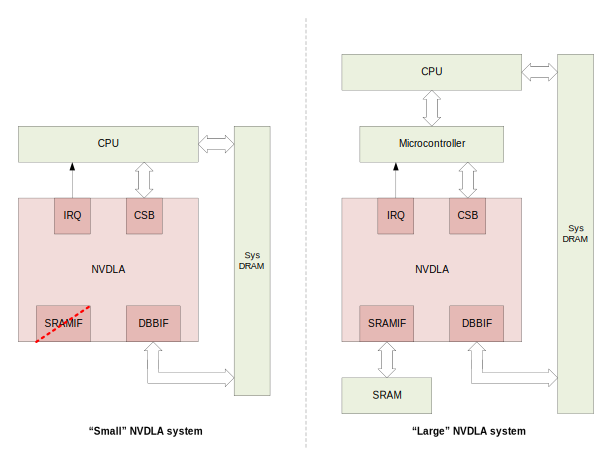
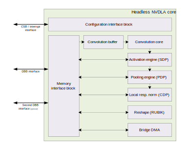
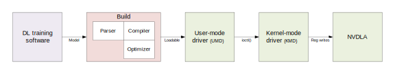
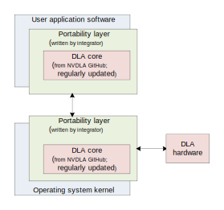

NVDLA Primer
************

Abstract
========

The majority of compute effort for Deep Learning inference is based on
mathematical operations that can mostly be grouped into four parts:
convolutions; activations; pooling; and normalization.  These operations
share a few characteristics that make them particularly well suited for
special-purpose hardware implementation: their memory access patterns are
extremely predictable, and they are readily parallelized.  The NVIDIA® Deep
Learning Accelerator (NVDLA) project promotes a standardized, open
architecture to address the computational demands of inference.  The NVDLA
architecture is both scalable and highly configurable; the modular design
maintains flexibility and simplifies integration.  Standardizing Deep
Learning acceleration promotes interoperability with the majority of modern
Deep Learning networks and contributes to a unified growth of machine
learning at scale.

NVDLA hardware provides a simple, flexible, robust inference acceleration
solution.  It supports a wide range of performance levels and readily scales
for applications ranging from smaller, cost-sensitive Internet of Things (IoT)
devices to larger performance oriented IoT devices.  NVDLA is
provided as a set of IP-core models based on open industry standards: the
Verilog model is a synthesis and simulation model in RTL form, and the TLM
SystemC simulation model can be used for software development, system
integration, and testing.  The NVDLA software ecosystem includes an
on-device software stack (part of the open source release), a full training
infrastructure to build new models that incorporate Deep Learning, and
parsers that convert existing models to a form that is usable by the
on-device software.

The open source NVDLA project is managed as an open, directed community. 
NVIDIA welcomes contributions to NVDLA, and will maintain an open process
for external users and developers who wish to submit changes back. 
Contributors are expected to agree to a Contributor License Agreement,
ensuring that any IP rights from a contributor are granted to all NVDLA
users; users who do not wish to contribute back to NVDLA are under no
obligation to do so.  After the initial release, development will take place
in the open.  NVDLA software, hardware, and documentation will be made
available through GitHub.

NVDLA hardware and software are available under the :doc:`NVIDIA Open NVDLA
License <license>`, which is a permissive license that includes a FRAND-RF
patent grant.  Additionally, for users who build “NVDLA-compatible”
implementations which interact well with the greater NVDLA ecosystem, NVIDIA
may grant the right to use the “NVDLA” name, or other NVIDIA trademarks. 
(This licensing description is meant to be informative, not normative; where
this information conflicts with the NVDLA license, the NVDLA license
supersedes.)

Accelerating Deep Learning Inference using NVDLA
================================================

NVDLA introduces a modular architecture designed to simplify configuration,
integration and portability; it exposes the building blocks used to
accelerate core Deep Learning inference operations.  NVDLA hardware is
comprised of the following components:

* Convolution Core – optimized high-performance convolution engine.

* Single Data Processor – single-point lookup engine for activation functions.

* Planar Data Processor – planar averaging engine for pooling.

* Channel Data Processor – multi-channel averaging engine for advanced
  normalization functions.

* Dedicated Memory and Data Reshape Engines – memory-to-memory
  transformation acceleration for tensor reshape and copy operations.

Each of these blocks are separate and independently configurable. A system
that has no need for pooling, for instance, can remove the planar averaging
engine entirely; or, a system that needs additional convolutional
performance can scale up the performance of the convolution unit without
modifying other units in the accelerator.  Scheduling operations for each
unit are delegated to a co-processor or CPU; they operate on extremely
fine-grained scheduling boundaries with each unit operating independently. 
This requirement for closely-managed scheduling can be made part of the
NVDLA sub-system with the addition of a dedicated management coprocessor
(“headed” implementation), or this functionality can be fused with the
higher-level driver implementation on the main system processor (“headless”
implementation).  This enables the same NVDLA hardware architecture to serve
a variety of implementation sizes.

NVDLA hardware utilizes standard practices to interface with the rest of the
system: a control channel implements a register file and interrupt
interface, and a pair of standard AXI bus interfaces are used to interface
with memory.  The primary memory interface is intended to connect to the
system’s wider memory system, including system DRAM; this memory interface
should be shared with the system’s CPU and I/O peripherals.  The second
memory interface is optional, and allows for a connection to
higher-bandwidth memory that may be dedicated to NVDLA or to a computer
vision subsystem in general.  This option for a heterogeneous memory
interface enables additional flexibility for scaling between different types
of host systems.

The typical flow for inferencing begins with the NVDLA management processor
(either a microcontroller in a "headed" implementation, or the main CPU in a
"headless" implementation) sending down the configuration of one hardware
layer, along with an “activate” command.  If data dependencies do not
preclude this, multiple hardware layers can be sent down to different
engines and activated at the same time (i.e., if there exists another layer
whose inputs do not depend on the output from the previous layer).  Because
every engine has a double-buffer for its configuration registers, it can
also capture a second layer’s configuration to begin immediately processing
when the active layer has completed.  Once a hardware engine finishes its
active task, it will issue an interrupt to the management processor to
report the completion, and the management processor will then begin the
process again.  This kind of command-execute-interrupt flow repeats until
inference on the entire network is complete.

NVDLA implementations generally fall into two categories: 

* Headless – unit-by-unit management of the NVDLA hardware happens on the main
  system processor.

* Headed – delegates the high-interrupt-frequency tasks to a companion
  microcontroller that is tightly coupled to the NVDLA sub-system.

.. note::
  The initial open source release of NVDLA will provide only a software
  solution for “headless” mode, with “headed” mode drivers to come at a
  later time.

The Small system model in :numref:`fig_system_comparison`, below, shows an
example of a headless NVDLA implementation while the Large System model
shows a headed implementation.  The Small model represents an NVDLA
implementation for a more cost-sensitive purpose built device.  The Large System
model is characterized by the addition of a dedicated control coprocessor
and high-bandwidth SRAM to support the NVDLA sub-system.  The Large System model is
geared more toward high-performance IoT devices that may run many tasks at once.

.. _fig_system_comparison:

  Comparison of two possible NVDLA systems.

Small NVDLA Model
-----------------

The small-NVDLA model opens up Deep Learning technologies in areas where it
was previously not feasible. This model is a good fit for cost-sensitive connected 
Internet of Things (IoT) class devices, AI and automation oriented systems that have
well-defined tasks for which cost, area, and power are the primary drivers.
Savings (in terms of cost, area, and power) are achieved through NVDLA
configurable resources. Neural network models can be pre-compiled and performance 
optimized, allowing larger models to be “cut down” and reduced in load complexity;
this, in turn, enables a scaled down NVDLA implementation where models
consume less storage and take less time for system software to load and
process.

These purpose-built systems typically execute only one task at a time, and
as such, sacrificing system performance while NVDLA is operating is
generally not a strong concern. The relatively inexpensive context switches
associated with these systems -- sometimes, as a result of processor
architectural choices, and sometimes, as a result of using a system like
FreeRTOS for task management – result in the main processor not being overly
burdened by servicing a large number of NVDLA interrupts. This removes the
need for an additional microcontroller, and the main processor performs both
the coarse-grained scheduling and memory allocation, as well as the
fine-grained NVDLA management.

Typically, systems following the small-NVDLA model will not include the
optional second memory interface. When overall system performance is less of
a priority, the impact of not having a high-speed memory path is unlikely to
be critical. In such systems, the system memory (usually DRAM) is likely to
consume less power than an SRAM, making it more power-efficient to use the
system memory as a computation cache.

Large NVDLA Model
-----------------

The large-NVDLA model serves as a better choice when the primary emphasis is
on high performance and versatility. Performance oriented IoT systems may
perform inference on many different network topologies; as a result, it is
important that these systems maintain a high degree of flexibility.
Additionally, these systems may be performing many tasks at once, rather
than serializing inference operations, so inference operations must not
consume too much processing power on the host. To address these needs, the
NVDLA hardware included a second (optional) memory interface for a dedicated
high-bandwidth SRAM, and enables the ability to interface with a dedicated
control coprocessor (microcontroller) to limit the interrupt load on the
main processor.

When included in the implementation, a high-bandwidth SRAM is connected to a
fast-memory bus interface port on NVDLA. This SRAM is used as a cache by NVDLA;
optionally, it may be shared by other high-performance
computer-vision-related components on the system to further reduce traffic
to the main system memory (Sys DRAM). 

Requirements for the NVDLA coprocessor are fairly typical; as such, there
are many general purpose processors that would be appropriate (e.g.,
RISC-V-based PicoRV32 processors, ARM Cortex-M or Cortex-R processors, or
even in-house microcontroller designs).  When using a dedicated coprocessor,
the host processor still handles some tasks associated with managing NVDLA. 
For instance, although the coprocessor becomes responsible for scheduling
and fine-grained programming of the NVDLA hardware, the host will remain
responsible for coarse-grained scheduling on the NVDLA hardware, for IOMMU
mapping of NVDLA memory access (as necessary), for memory allocation of
input data and fixed weight arrays on NVDLA, and for synchronization between
other system components and tasks that run on NVDLA.

Hardware Architecture
=====================

The NVDLA architecture can be programmed in two modes of operation:
independent mode, and fused mode.

* **Independent.** When operating independently, each functional block is
  configured for when and what it executes, with each block working on its
  assigned task (akin to independent layers in a Deep Learning framework). 
  Independent operation begins and ends with the assigned block performing
  memory-to-memory operations, in and out of main system memory or dedicated
  SRAM memory.

* **Fused.** Fused operation is similar to independent operation, however, some
  blocks can be assembled as a pipeline.  This improves performance by
  bypassing the round trip through memory, instead having blocks communicate
  with each other through small FIFOs (i.e., the convolution core can pass
  data to the Single Data Point Processor, which can pass data to the Planar
  Data Processor, and in turn to the Cross-channel Data Processor).

.. _fig_core_diagram:
e.  The memory interface connects to a convolution buffer, which connects to a convolution core; the memory interface also connects to the activation engine, the pooling engine, local response normalization engine, reshape engine, and bridge DMA engine.   The convolution core, activation engine, pooling engine, and local response normalization engine also form a pipeline.
  :align: center

  Internal architecture of NVDLA core.

Connections
-----------

NVDLA implements three major connections to the rest of the system:  

* **Configuration Space Bus (CSB) interface.** This interface is a
  synchronous, low-bandwidth, low-power, 32-bit control bus designed to be
  used by a CPU to access the NVDLA configuration registers.  NVDLA
  functions as a slave on the CSB interface.  CSB implements a very simple
  interface protocol so it can be easily converted to AMBA, OCP or any other
  system bus with a simple shim layer.

* **Interrupt interface.**  NVDLA hardware includes a 1-bit level-driven
  interrupt.  The interrupt line is asserted when a task has been
  completed or when an error occurs.

* **Data Backbone (DBB) interface.**  The DBB interface connects NVDLA and
  the main system memory subsystems.  It is a synchronous, high-speed, and
  highly configurable data bus.  It can be specified to have different
  address sizes, different data sizes, and to issue different sizes of
  requests depending upon the requirements of the system.  The data backbone
  interface is a simple interface protocol that is similar to AXI (and can
  be readily used in AXI-compliant systems).

The DBB interface has an optional second connection which can be used when
there is a second memory path available.  This connection is identical in
design to the primary DBB interface and is intended for use with an on-chip
SRAM that can provide higher throughput and lower access latency.  The
second DBB interface is not necessary for NVDLA to function, systems that do
not require this memory interface can save area by removing it.

Components
----------

Each component in the NVDLA architecture exists to support specific
operations integral to inference on deep neural networks.  The following
descriptions provide a brief functional overview of each block, including
the TensorFlow operations that map onto them.  While TensorFlow operations
were provided as examples, NVDLA hardware supports other Deep Learning
frameworks.

Convolution
^^^^^^^^^^^

Convolution operations work on two sets of data: one set of offline-trained
“weights” (which remain constant between each run of inference), and one set
of input “feature” data (which varies with the network’s input).  The
convolutional engine exposes parameters to map many different sizes of
convolutions onto the hardware with high efficiency.  The NVDLA convolution
engine includes optimizations to improve performance over a naive
convolution implementation.  Support for sparse weight compression saves
memory bandwidth.  Built-in Winograd convolution support improves compute
efficiency for certain sizes of filters.  Batch convolution, can save
additional memory bandwidth by reusing weights when running multiple
inferences in parallel.

To avoid repeated accesses to system memory, the NVDLA convolution engine
has an internal RAM reserved for weight and input feature storage, referred
to as the “convolution buffer”.  This design greatly improves memory
efficiency over sending a request to the system memory controller for each
independent time a weight or feature is needed.

The convolution unit maps onto TensorFlow operations such as
``tf.nn.conv2d``.

Single Data Point Processor
^^^^^^^^^^^^^^^^^^^^^^^^^^^

The Single Data Point Processor (SDP) allows for the application of both
linear and non-linear functions onto individual data points.  This is
commonly used immediately after convolution in CNN systems.  The SDP has a
lookup table to implement non-linear functions, or for linear functions it
supports simple bias and scaling.  This combination can support most common
activation functions, as well as other element-wise operations, including
ReLU, PReLU, precision scaling, batch normalization, bias addition, or other
complex non-linear functions, such as a sigmoid or a hyperbolic tangent.

The SDP maps onto TensorFlow operations including
``tf.nn.batch_normalization``, ``tf.nn.bias_add``, ``tf.nn.elu``,
``tf.nn.relu``, ``tf.sigmoid``, ``tf.tanh``, and more.

Planar Data Processor
^^^^^^^^^^^^^^^^^^^^^

The Planar Data Processor (PDP) supports specific spatial operations that
are common in CNN applications.  It is configurable at runtime to support
different pool group sizes, and supports three pooling functions:
maximum-pooling, minimum-pooling, and average-pooling.

The PDP maps onto the the ``tf.nn.avg_pool``, ``tf.nn.max_pool``, and
``tf.nn.pool`` operations.

Cross-channel Data Processor
^^^^^^^^^^^^^^^^^^^^^^^^^^^^

The Cross-channel Data Processor (CDP) is a specialized unit built to apply
the local response normalization (LRN) function -- a special normalization
function that operates on channel dimensions, as opposed to the spatial
dimensions.

The CDP maps onto the ``tf.nn.local_response_normalization`` function.

Data Reshape Engine
^^^^^^^^^^^^^^^^^^^

The data reshape engine performs data format transformations (e.g.,
splitting or slicing, merging, contraction, reshape-transpose).  Data in
memory often needs to be reconfigured or reshaped in the process of
performing inferencing on a convolutional network.  For example, “slice”
operations may be used to separate out different features or spatial regions
of an image, and “reshape-transpose” operations (common in deconvolutional
networks) create output data with larger dimensions than the input dataset.

The data reshape engine maps onto TensorFlow operations such as
``tf.nn.conv2d_transpose``, ``tf.concat``, ``tf.slice``, and
``tf.transpose``.

Bridge DMA
^^^^^^^^^^

The bridge DMA (BDMA) module provides a data copy engine to move data
between the system DRAM and the dedicated high-performance memory interface,
where present; this is an accelerated path to move data between these two
otherwise non-connected memory systems.

Configurability
---------------

NVDLA has a wide array of hardware parameters that can be configured to
balance area, power, and performance.  The following is a short list of
these options.

* **Data types.**  NVDLA natively supports a wide array of data types across its
  various functional units; a subset of these can be chosen to save area. 
  Data types that can be selected include binary; int4; int8; int16; int32;
  fp16; fp32; and fp64.

* **Input image memory formats.**  NVDLA can support planar images, semi-planar
  images, or other packed memory formats.  These different modes can be
  enabled or disabled to save area.

* **Weight compression.**  NVDLA has a mechanism to reduce memory bandwidth
  by sparsely storing convolution weights.  This feature can be disabled to
  save area.

* **Winograd convolution.**  The Winograd algorithm is an optimization for
  certain dimensions of convolution.  NVDLA can be built with or without
  support for it.

* **Batched convolution.**  Batching is a feature that saves memory
  bandwidth.  NVDLA can be built with or without support for it.

* **Convolution buffer size.**  The convolution buffer is formed of a number
  of banks.  It is possible to adjust the quantity of banks (from 2 to 32)
  and the size of each bank (from 4 KiB to 8 KiB).  (By multiplying these
  together, it is possible to determine the total amount of convolution
  buffer memory that will be instantiated.)

* **MAC array size.**  The multiply-accumulate engine is formed in two
  dimensions.  The width (the “C” dimension) can be adjusted from 8 to 64,
  and the depth (the “K” dimension) can be adjusted from 4 to 64.  (The
  total number of multiply-accumulates that are created can be determined by
  multiplying these two together.)

* **Second memory interface.**  NVDLA can have support for a second memory
  interface for high-speed accesses, or it can be built with only one memory
  interface.

* **Non-linear activation functions.**  To save area, the lookup table that
  supports nonlinear activation functions (like sigmoid or tanh) can be
  removed.

* **Activation engine size.**  The number of activation outputs produced per
  cycle can be adjusted from 1 through 16.

* **Bridge DMA engine.**  The bridge DMA engine can be removed to save area.

* **Data reshape engine.**  The data reshape engine can be removed to save
  area.

* **Pooling engine presence.**  The pooling engine can be removed to save
  area.

* **Pooling engine size.**  The pooling engine can be adjusted to produce
  between 1 and 4 outputs per cycle.

* **Local response normalization engine presence.**  The local response
  normalization engine can be removed to save area.

* **Local response normalization engine size.**  The local response
  normalization engine can be adjusted to produce between 1 and 4 outputs
  per cycle.

* **Memory interface bit width.**  The memory interface bit width can be
  adjusted according to the width of the external memory interface to
  appropriately size internal buffers.

* **Memory read latency tolerance.**  Memory latency time is defined as the number
  of cycles from read request to read data return.  The tolerance for this
  can be adjusted, which impacts the internal latency buffer size of each
  read DMA engine.

Software Design
===============

NVDLA has a full software ecosystem supporting it.  Part of this ecosystem
includes the on-device software stack, a part of the NVDLA open source
release; additionally, NVIDIA will provide a full training infrastructure to
build new models that incorporate Deep Learning, and to convert existing
models to a form that is usable by NVDLA software.  In general, the software
associated with NVDLA is grouped into two groups: the *compilation tools* (model
conversion), and the *runtime environment* (run-time software to load and execute
networks on NVDLA).  The general flow of this is as shown in the figure
below; and each of these is described below.

.. _fig_sw_flow:

  Dataflow diagram inside of NVDLA system software.

Compilation Tools: Model Creation and Compilation
-------------------------------------------------

Compilation tools include compiler and parser. Compiler is responsible for creating a sequence of hardware
layers that are optimized for a given NVDLA configuration; having an
optimized network of hardware layers increases performance by reducing model
size, load and run times. Compilation is a compartmentalized multi-step
process that can be broken down into two basic components: parsing and
compiling. The parser can be relatively simple; in its most basic
incarnation, it can read a pre-trained Caffe model and create an
“intermediate representation” of a network to pass to the next step of
compilation. The compiler takes the parsed intermediate representation and
the hardware configuration of an NVDLA implementation as its inputs, and
generates a network of hardware layers. These steps are performed offline
and might be performed on the device that contains the NVDLA
implementation.
 
Knowing about the specific hardware configuration of an NVDLA implementation
is important, it enables the compiler to generate appropriate layers for the
features that are available. For example, this might include selecting
between different convolution operation modes (such as Winograd convolution,
or basic convolution), or splitting convolution operations into multiple
smaller mini-operations depending on the available convolution buffer size. 
This phase is also responsible for quantizing models to lower precision,
such as 8-bit or 16-bit integer, or 16-bit floating point, and for
allocating memory regions for weights.  The same compiler tool can be used
to generate a list of operations for multiple different NVDLA
configurations.

Runtime Environment: Model Inference on Device
----------------------------------------------

The runtime environment involves running a model on compatible NVDLA hardware. It
is effectively divided into two layers:
 
* **User Mode Driver.** The main interface with user-mode programs.
  After parsing the neural network compiler compiles network layer by layer and converts it
  into a file format called :term:`NVDLA Loadable`. User mode runtime driver loads this
  loadable and submits inference job to :ref:`kernel_mode_driver`

* **Kernel Mode Driver.** Consists of drivers and firmware that do the work of
  scheduling layer operations on NVDLA and programming the NVDLA registers
  to configure each functional block.

The runtime execution starts with a stored representation of the network; this
stored format is called an “NVDLA loadable” image. In the view of a
loadable, each functional block in the NVDLA implementation is represented
by a “layer” in software; each layer includes information about its
dependencies, the tensors that it uses in as inputs and outputs in memory,
and the specific configuration of each block for an operation. Layers are
linked together through a dependency graph, which KMD uses to
schedule each operation. The format of an NVDLA loadable is standardized
across compiler implementations and UMD implementations. All
implementations that comply with the NVDLA standard should be able to at
least understand any NVDLA loadable image, even if the implementation may
not have some features that are required to run inference using that
loadable image.

UMD has a standard application programming interface (API) for processing
loadable images, binding input and output tensors to memory locations, and
running inference. This layer loads the network into memory in a defined
set of data structures, and passes it to the KMD in an implementation-defined
fashion. On Linux, for instance, this could be an ``ioctl()``, passing data
from the user-mode driver to the kernel-mode driver; on a single-process system
in which the KMD runs in the same environment as the UMD, this could be a simple function call.

KMD's main entry point receives an inference job in memory, selects from multiple
available jobs for scheduling (if on a multi-process system), and submits it to the
core engine scheduler. This core engine scheduler is responsible for handling interrupts from NVDLA,
scheduling layers on each individual functional block, and updating any
dependencies for that layer based upon the completion of a task from a
previous layer. The scheduler uses information from the dependency graph to
determine when subsequent layers are ready to be scheduled; this allows the
compiler to decide scheduling of layers in an optimized way, and avoids
performance differences from different implementations of KMD.

.. _fig_portability_layer:

  Portability layers in the NVDLA system.

Both the UMD stack and the KMD stack exist as
defined APIs, and are expected to be wrapped with a system portability
layer.  Maintaining core implementations within a portability layer is
expected to require relatively few changes and expedite any effort where it
may be necessary to run an NVDLA software-stack on multiple platforms; with
the appropriate portability layers in place, the same core implementations
should compile as readily on both Linux and FreeRTOS. Similarly, on “headed”
implementations that have a microcontroller closely coupled to NVDLA, the
existence of the portability layer makes it possible to run the same
low-level software on the microcontroller as would run on the main CPU in a
“headless” implementations that has no such companion processor.

NVDLA System Integration
========================

NVDLA can be configured for a wide range of performance levels; choosing
these parameters depends on the requirements for Convolutional Neural
Network(s) (CNN) that will be executed.  This section describes some of the
factors that will influence the choice of these parameters, and some
considerations of their impact on system area and performance. The time
required to run each layer is the maximum amount of the time required for
data input, output, and the time required to perform the multiply-accumulate
(MAC) operations.  The time required to run the whole network is equal to
the sum of times for all the layers.  Choosing the correct number of MAC
units, the convolutional buffer size, and the on-chip SRAM size for the
desired performance are the most critical steps in sizing.  NVDLA has many
more configuration parameters for additional performance tuning that require
careful consideration, these will have less impact on the total area; they
should be configured to not become unnecessary bottlenecks. 

Tuning Questions
----------------

What math precision is required for the workloads expected for any given instantiation?
^^^^^^^^^^^^^^^^^^^^^^^^^^^^^^^^^^^^^^^^^^^^^^^^^^^^^^^^^^^^^^^^^^^^^^^^^^^^^^^^^^^^^^^

The bulk of the NVDLA area in larger configurations is used by convolution
buffers and by MAC units, and so it stands to reason that these parameters
are the most important in an initial performance / area tradeoff analysis.
Deep Learning training is usually done at 32-bit floating point precision,
but the resulting networks can often be reduced to 8-bit integers without
significant loss of inference quality; in some cases, however, it may still
be desirable to use 16-bit integers or floating point numbers. 

What are the number of MAC units, and the required memory bandwidth?
^^^^^^^^^^^^^^^^^^^^^^^^^^^^^^^^^^^^^^^^^^^^^^^^^^^^^^^^^^^^^^^^^^^^

After precision, the next two critical parameters for performance and area
are the number of MAC units, and the required memory bandwidth.  When
configuring NVDLA, these should be carefully considered.  Processing happens
layer-by-layer, and so performance estimation is best done layer-by-layer,
as well.  For any given layer, it is usually the case that either MAC
throughput or memory bandwidth will be the bottleneck. 

The number of MAC units required is relatively easy to determine.  For
example, a convolutional layer has a known input and output resolution, and
a known number of input and output features; the convolution kernel size is
also known.  Multiplying these together gives the total number of MAC
operations to process the layer.  The hardware can be defined to have a
certain number of MAC units; dividing the number of operations required by
the number of MAC units gives a lower bound for the number of clock cycles
that a layer can be processed in. 

Calculating required memory bandwidth is less trivial.  In the ideal case,
it should only be necessary to read the input image once, the output image
once, and the weights once, and the minimum number of cycles will be the sum
of those divided by the number of samples that can be read or written per
clock.  However, if the convolutional buffer is too small to hold the
support region for the input and the set of weights, multiple passes are
required.  For example, if the convolutional buffer can only hold a fourth
of the weight data, then the calculation must be split into four steps,
multiplying the input bandwidth (i.e., 10MB of input memory traffic would
multiply to 40MB).  Similarly, if the buffers cannot hold enough lines for a
support region for the convolution, the convolution must also be broken up
into horizontal strips.  This effect is important to consider when choosing
the convolutional buffer size, and when sizing the memory interface.

Is there a need for on-chip SRAM?
^^^^^^^^^^^^^^^^^^^^^^^^^^^^^^^^^

If external memory bandwidth is at a premium for power or performance
reasons, then adding on-chip SRAM can help.  Such SRAM can be thought of as
a second-level cache; it can have higher bandwidth than the main memory, and
that bandwidth is additive to the main memory bandwidth.  An on-chip SRAM is
less expensive to implement than a larger convolutional buffer, which needs
wide ports and has very stringent timing requirements, but does not have as
greatly multiplicative of a factor in applications that are
convolutional-buffer-limited.  (For instance, if a layer is bandwidth
limited, adding a SRAM that is sufficient to hold the entire input image
that runs at twice the speed of the system’s DRAM can double the
performance.  However, if the layer is also limited by convolutional buffer
size, the same amount of memory could produce a much greater multiplier to
system throughput.)  The simplest way to consider this tradeoff is that
adding convolutional buffer size will help to reduce the bandwidth
requirement, while adding an on-chip SRAM can improve the total available
bandwidth. 

Example Area and Performance with NVDLA
---------------------------------------

The following table provides estimates for NVDLA configurations optimized
for the popular ResNet-50 neural network.  The area figures given are
estimated synthesis area, and include all memories required; real area
results will vary based on foundry and libraries.  In this example, no
on-chip SRAM is used.  On-chip SRAM would be beneficial if available SDRAM
bandwidth is low.  The open-source release of NVDLA has an estimator tool
available to explore the space of NVDLA designs, and their impact on
performance.

+--------+--------------+------------------+--------------+----------------+
| # MACs | Conv. buffer | SDRAM            | Silicon area | Int8 ResNet-50 |
|        | size (KB)    | bandwidth (GB/s) | (mm^2, 28nm) | frames/second  |
+========+==============+==================+==============+================+
| 2048   | 512          | 20               | 5.5          | 269            |
+--------+--------------+------------------+--------------+----------------+
| 1024   | 256          | 15               | 3.0          | 153            |
+--------+--------------+------------------+--------------+----------------+
| 512    | 256          | 10               | 2.3          | 93             |
+--------+--------------+------------------+--------------+----------------+
| 256    | 256          | 5                | 1.7          | 46             |
+--------+--------------+------------------+--------------+----------------+
| 128    | 256          | 2                | 1.4          | 20             |
+--------+--------------+------------------+--------------+----------------+
| 64     | 128          | 1                | .91          | 7.3            |
+--------+--------------+------------------+--------------+----------------+
| 32     | 128          | 0.5              | .85          | 3.6            |
+--------+--------------+------------------+--------------+----------------+

Sample Platforms
----------------

Sample platforms are provided which allow users to observe, evaluate, and
test NVDLA in a minimal SoC environment.  A minimum SoC system configuration
consists of a CPU, an NVDLA instance, an interconnect, and memories.  These
platforms can be used for software development, or as a starting point for
integrating NVDLA into an industrial-strength SoC.

Simulation
^^^^^^^^^^

The NVDLA open source release includes a simulation platform based on
GreenSocs QBox.  In this platform, a QEMU CPU model (x86 or ARMv8) is
combined with the NVDLA SystemC model, providing a register-accurate system
on which software can be quickly developed and debugged.  The Linux
kernel-mode driver and a user-mode test utility are provided to run on this
simulation platform.

FPGA 
^^^^

This sample platform maps the NVDLA Verilog model onto an FPGA, it provides
a synthesizable example of instantiating NVDLA in a real design.  In this
platform, the NVDLA SystemC model is not used, software register reads and
writes execute directly on the real RTL environment.  This allows for
limited cycle-counting performance evaluation, and also allows for even
faster testing of software against larger, more complex networks.  The FPGA
model is intended for validation only, no effort has been made to optimize
cycle time, design size, or power for the FPGA platform, performance of the
FPGA model is not directly comparable against other FPGA-based Deep Learning
accelerators

The FPGA system model uses the Amazon EC2 “F1” environment, which is a
publicly available standardized FPGA system that can be leased by the hour. 
No up-front purchase of specialized hardware or software is necessary to use
this model; the synthesis software is available for only the cost of compute
time on the Amazon EC2 environment, and the hardware requires no commitment
to gain access to.  Because the FPGA platform is Xilinx-based, migration to
other Virtex-family devices should be relatively straightforward.

Models
------

NVDLA IP-core models are based on open industry standards.  The simplistic
design and use of basic constructs are expected to easily integrate in
typical SoC design flows.

Verilog model
^^^^^^^^^^^^^

The Verilog model provides a synthesis and simulation model in RTL form. It
has four functional interfaces: a slave host interface, an interrupt line,
and two master interfaces for internal and external memory access.  The host
and memory interfaces are very simple, but require external bus adapters to
connect to an existing SoC design; for convenience, sample adapters for AXI4
and TileLink are included as part of the NVDLA open source release. The
NVDLA open source release contains example synthesis scripts. To facilitate
physical design on more complex systems or larger instantiations of NVDLA,
the design is split into partitions that each can be handled independently
in the SoC backend flow.  The interfaces between the partitions can be
retimed as needed to meet routing requirements.

The NVDLA core operates in a single clock domain; bus adapters allow for
clock domain crossing from the internal NVDLA clock to the bus clocks. 
Similarly, NVDLA also operates in a single power domain; the design applies
both fine- and coarse-grain power gating. If added to implementation, SRAMs
are modelled by behavioral models and must be replaced by compiled RAMs in a
full SoC design. The NVDLA design requires implementations of both
single-ported and dual-ported (one read port plus one write port) SRAMs.

Simulation model and verification suite
^^^^^^^^^^^^^^^^^^^^^^^^^^^^^^^^^^^^^^^

NVDLA includes a TLM2 SystemC simulation model for software development,
system integration, and testing. This model enables much faster simulation
than would otherwise be available by running the RTL in conjunction with
signal-stimulus models.  This SystemC model is intended to be used in
full-SoC simulation environments, such as Synopsys VDK or the provided
GreenSocs QBox platform.  The included model is parameterizable on the same
axes as is the RTL model, for direct comparison and simulation.

The simulation model can also be used with the NVDLA testbench and
verification suite. The light-weight trace-player-based testbench is
suitable for simple synthesis and build health verification (this will be
available with the initial NVDLA release). A full verification environment
with extensive unit-by-unit testing will become available in subsequent
release. The verification suite can be used to provide design assurance
before tape-out, including verifying changes for compiled RAMs,
clock-gating, and scan-chain insertion. This environment will be suitable
for making more substantial changes (e.g., verify new NVDLA configurations
or modifications made to an existing NVDLA design).

Software
--------

The initial NVDLA open-source release includes software for a “headless”
implementation, compatible with Linux.  Both a kernel-mode driver and a
user-mode test utility are provided in source form, and can run on top of
otherwise-unmodified Linux systems.

Appendix: Deep Learning references
==================================

This document assumes some amount of familiarity with general concepts
pertaining to Deep Learning and Convolutional Neural Networks. The following
links have been provided as a means to begin or further an individual's
investigation into these topics, as needed.

* `NVIDIA Webinar Series: Deep Learning Demystified <http://info.nvidia.com/deep-learning-demystified.html>`_
* A Beginner's Guide to Understanding Convolutional Neural Networks

  * `Part 1 <https://adeshpande3.github.io/adeshpande3.github.io/A-Beginner's-Guide-To-Understanding-Convolutional-Neural-Networks/>`_
  * `Part 2 <https://adeshpande3.github.io/adeshpande3.github.io/A-Beginner's-Guide-To-Understanding-Convolutional-Neural-Networks-Part-2/>`_

* `Inference: The Next Step in GPU-Accelerated Deep Learning <https://devblogs.nvidia.com/parallelforall/inference-next-step-gpu-accelerated-deep-learning/>`_
* `NVIDIA Whitepaper: GPU-Based Deep Learning Inference: A performance and Power Analysis <http://www.nvidia.com/content/tegra/embedded-systems/pdf/jetson_tx1_whitepaper.pdf>`_
* `Fundamentals of Deep Learning: What’s the Difference between Deep Learning Training and Inference? <https://blogs.nvidia.com/blog/2016/08/22/difference-deep-learning-training-inference-ai/>`_
* `Inception (GoogLeNet): Going Deeper with Convolutions <http://www.cv-foundation.org/openaccess/content_cvpr_2015/papers/Szegedy_Going_Deeper_With_2015_CVPR_paper.pdf>`_
* `Microsoft ResNet: Deep Residual Learning for Image Recognition <https://arxiv.org/pdf/1512.03385v1.pdf>`_
* `AlexNet: ImageNet Classification with Deep Convolutional Neural Networks <https://papers.nips.cc/paper/4824-imagenet-classification-with-deep-convolutional-neural-networks.pdf>`_
* `VGG Net: Very Deep Convolutional Networks for Large-Scale Image Recognition <https://arxiv.org/pdf/1409.1556v6.pdf>`_

