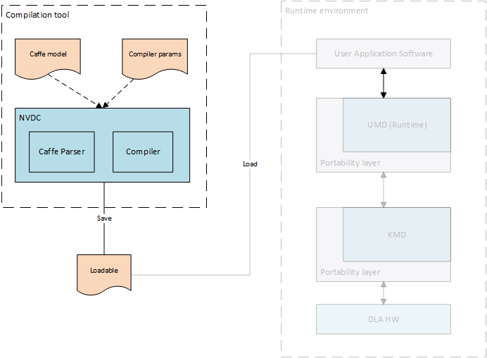

.. _compilation_tools:

=================
Compilation tools
=================

The Compilation phase is responsible for converting (aka compiling) a deep neural network into a sequence of hardware layers that are optimized for a given NVDLA configuration. Having a compiled network optimized for specific hardware configuration improves performance by reducing model size, load and run times. Compilation is a 2-step process that consists of: Parsing and Compiling.

------
Parser
------

Parser is a relatively simple tool to parse pre-trained models. In its most basic incarnation, it reads a pre-trained Caffe model and creates a suitable representation of the network as a set of layers and pass it down to the next step of Compilation. An advanced parser would allow translating pre-trained models on other frameworks like TensorFlow, Theano, etc into the same standard representation suitable for the compiler. Although the Compiler is the one who fully understands the underlying hardware configuration, the Parser is smart enough to pro-actively recognize those neural network operations that are not suitable for the NVDLA implmentation and report back to the application. Parser can also detect malformed networks with breaks/loops in the topology or corrupt trained data whose layout doesn't fit well for the associated network operation.

--------
Compiler
--------

Compiler takes the Parser's output as its input, and converts (i.e. compiles) it into a set of hardware layers using the understanding of underlying hardware specification for NVDLA implementation. The Compiler can interpret the parsed network as a directed graph with nodes representing the network operations and the edges representing the intermediate tensors between the operations. The main job of the Compiler is to effectively map each network operation onto the targetted functional block of the NVDLA implementation, keeping in mind the specifications of the hardware. Knowing the hardware configuration allows the Compiler to generate appropriate operations for the features that are available. For example, this might include selecting between different convolution operation modes (such as Winograd convolution, or Basic convolution), or splitting certain operations into multiple smaller units depending on the available hardware buffer sizes, etc. Optimizations or features in compiler can be controlled through input parameters to compiler.

In order to effectively execute the hardware layer, the Compiler is responsible to determine memory requirements for that layer. The choice of memory management can be flexible to the software implementation choice. This phase is also responsible for quantizing higher precision trained models (like 32-bit floating point) into lower precisions, such as 8-bit or 16-bit integer, or 16-bit floating point, and for determining memory allocations for the quantized weights during inferencing jobs. The output of the compiler is stored in a standardized file format called the :term:`NVDLA Loadable`.

The same Compiler tool can be used to generate a list of hardware layers for multiple different NVDLA configurations. These steps are performed offline and might also be performed on the device that contains the NVDLA implementation.
