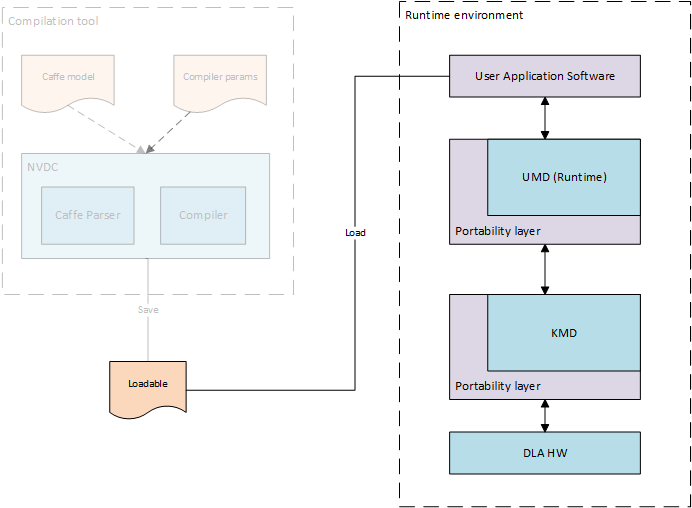
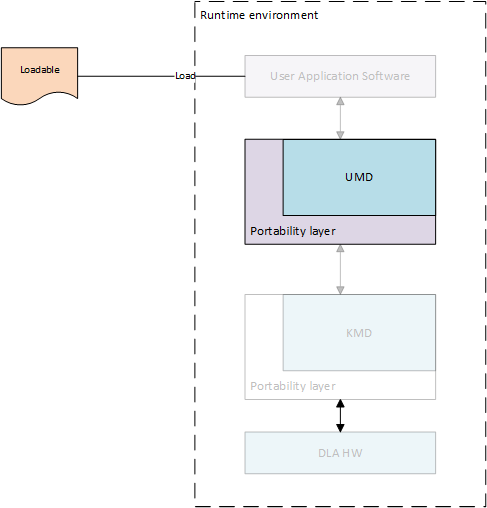
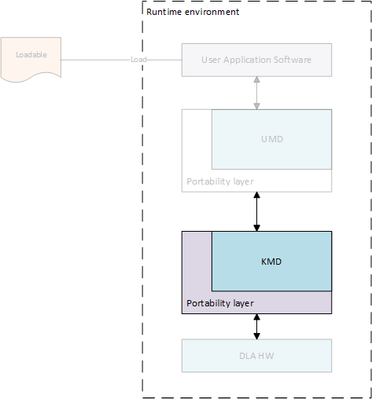
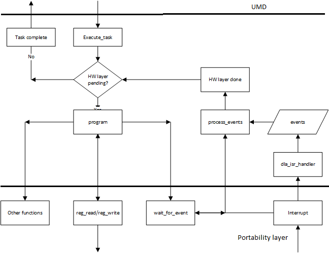

.. _runtime_environment:

===================
Runtime environment
===================

The runtime envionment includes software to run a compiled neural network on compatible :term:`NVDLA` hardware. It consists of 2 parts:

* :ref:`user_mode_driver` - This is the main interface to the application. As detailed in the :ref:`compilation_tools`, after parsing and compiling the neural network layer by layer, the compiled output is stored in a file format called :term:`NVDLA Loadable`. User mode runtime driver loads this loadable and submits inference jobs to the :ref:`kernel_mode_driver`.

* :ref:`kernel_mode_driver` - Consists of kernel mode driver and engine scheduler that does the work of scheduling the compiled network on :term:`NVDLA` and programming the :term:`NVDLA` registers to configure each functional block.

The runtime environment uses the stored representation of the network saved as :term:`NVDLA Loadable` image. From point of view of the :term:`NVDLA Loadable`, each compiled "layer" in software is loadable on a functional block in the :term:`NVDLA` implementation. Each layer includes information about its dependencies on other layers, the buffers that it uses for inputs and outputs in memory, and the specific configuration of each functional block used for its execution. Layers are linked together through a dependency graph, which the engine scheduler uses for scheduling layers. The format of an :term:`NVDLA Loadable` is standardized across compiler implementations and UMD implementations. All implementations that comply with the :term:`NVDLA` standard should be able to at least interpret any :term:`NVDLA Loadable` image, even if the implementation may not have some features that are required to run inferencing using that loadable image.

Both the :ref:`user_mode_driver` stack and the :ref:`kernel_mode_driver` stack exist as defined APIs, and are expected to be wrapped with a system portability layer. Maintaining core implementations within a portability layer is expected to require relatively few changes. This expedites any effort that may be necessary to run the :term:`NVDLA` software-stack on multiple platforms. With the appropriate portability layers in place, the same core implementations should compile as readily on both Linux and FreeRTOS. Similarly, on “headed” implementations that have a microcontroller closely coupled to :term:`NVDLA`, the existence of the portability layer makes it possible to run the same kernel mode driver on that microcontroller as would have run on the main CPU in a “headless” implementation that had no such companion microcontroller.

.. _user_mode_driver:

----------------
User Mode Driver
----------------

UMD provides standard :ref:`umd_api` (API) for processing loadable images, binding input and output tensors to memory locations, and submitting inference jobs to KMD. This layer loads the network into memory in a defined set of data structures, and passes it to the KMD in an implementation-defined fashion. On Linux, for instance, this could be an ``ioctl()``, passing data from the user-mode driver to the kernel-mode driver; on a single-process system in which the KMD runs in the same environment as the UMD, this could be a simple function call. Low-level functions are implemented in :ref:`user_mode_driver`

^^^^^

.. _umd_api:

^^^^^^^^^^^^^^^^^^^^^^^^^^^^^^^^^
Application Programming Interface
^^^^^^^^^^^^^^^^^^^^^^^^^^^^^^^^^
|

Runtime Interface
-----------------

    This is the interface for runtime library. It implements functions to process loadable buffer passed from application after reding it from file, allocate memory for tensors and intermediate buffers, prepare synchronization points and finally submit inference job to KMD. Inference job submitted to KMD is referred as DLA task.

.. cpp:namespace:: nvdla

.. cpp:class:: nvdla::IRuntime

Submitting task for inference using runtime interface includes below steps

#. :ref:`create_runtime_instance`
#. :ref:`device_information`
#. :ref:`load_network`
#. :ref:`tensor_information`
#. :ref:`update_tensors`
#. :ref:`allocate_memory`
#. :ref:`bind_tensor`
#. :ref:`submit_task`
#. :ref:`unload_network`

|

.. _create_runtime_instance:

Create NVDLA runtime instance
-----------------------------

.. cpp:function:: IRuntime* nvdla::createRuntime()

:returns: IRuntime object

|

.. _device_information:

Get NVDLA device information
----------------------------

.. cpp:function:: NvU16 nvdla::IRuntime::getMaxDevices()

   Get maximum number of device supported by HW configuration. Runtime driver supports submitting inference jobs to  multiple DLA devices. User application can select device to use. One task can't splitted across devices but one task can be submitted to only one devices.

   :returns: Maximum number of devices supported

.. cpp:function:: NvU16 nvdla::IRuntime::getNumDevices()

   Get number of available devices from the maximum number of devices supported by HW configuration.

   :returns: Number of available devices

|

.. _load_network:

Load network data
-----------------

.. cpp:function:: NvError nvdla::IRuntime::load(const NvU8 *buf, int instance)

   Parse loadable from buffer and update ILoadable with information required to create task

   :param buf: Loadable image buffer
   :param instance: Device instance to load this network
   :returns: :cpp:type:`NvError`

|

.. _tensor_information:

Get input and output tensors information
----------------------------------------

.. cpp:function:: NvError nvdla::IRuntime::getNumInputTensors(int *input_tensors)

   Get number of network's input tensors from loadable

   :param input_tensors: Pointer to update number of input tensors value
   :returns: :cpp:type:`NvError`

.. cpp:function:: NvError nvdla::IRuntime::getInputTensorDesc(int id, NvDlaTensor *tensors)

   Get network's input tensor descriptor

   :param id: Tensor ID
   :param tensors: Tensor descriptor
   :returns: :cpp:type:`NvError`

.. cpp:function:: NvError nvdla::IRuntime::getNumOutputTensors(int *output_tensors)

   Get number of network's output tensors from loadable

   :param output_tensors: Pointer to update number of output tensors value
   :returns: :cpp:type:`NvError`

.. cpp:function:: NvError nvdla::IRuntime::getOutputTensorDesc(int id, NvDlaTensor *tensors)

   Get network's output tensor descriptor

   :param id: Tensor ID
   :param tensors: Tensor descriptor
   :returns: :cpp:type:`NvError`

|

.. _update_tensors:

Update input and output tensors information
-------------------------------------------

.. note:: Required only if tensor information is changed, not all parameters can be changed

.. cpp:function:: NvError nvdla::IRuntime::setInputTensorDesc(int id, const NvDlaTensor *tensors)

   Set network's input tensor descriptor

   :param id: Tensor ID
   :param tensors: Tensor descriptor
   :returns: :cpp:type:`NvError`

.. cpp:function:: NvError nvdla::IRuntime::setOutputTensorDesc(int id, const NvDlaTensor *tensors)

   Set network's output tensor descriptor

   :param id: Tensor ID
   :param tensors: Tensor descriptor
   :returns: :cpp:type:`NvError`

|

.. _allocate_memory:

Allocate memory for input and output tensors
--------------------------------------------

.. cpp:function:: NvDlaError allocateSystemMemory(void **h_mem, NvU64 size, void **pData)

    Allocate DMA memory accessible by NVDLA for input and output tensors.

    :param h_mem: void pointer to store memory handle address
    :param size: Size of memory to allocate
    :param pData: Virtual address for allocated memory
    :returns: :cpp:type:`NvError`

|

.. _bind_tensor:

Bind memory handle with tensor
------------------------------

.. cpp:function:: NvError nvdla::IRuntime::bindInputTensor(int id, void *hMem)

   Bind network's input tensor to memory handle

   :param id: Tensor ID
   :param hMem: DLA memory handle returned by :c:func:`allocateSystemMemory`
   :returns: :cpp:type:`NvError`

.. cpp:function:: NvError nvdla::IRuntime::bindOutputTensor(int id, void *hMem)

   Bind network's output tensor to memory handle

   :param id: Tensor ID
   :param hMem: DLA memory handle returned by :c:func:`allocateSystemMemory`
   :returns: :cpp:type:`NvError`

|

.. _submit_task:

Submit task for inference
-------------------------

.. cpp:function:: NvError nvdla::IRuntime::submit()

   Submit task for inference, it is blocking call

   :returns: :cpp:type:`NvError`

.. _unload_network:

Unload network resources
------------------------

.. cpp:function:: NvError nvdla::IRuntime::unload(int instance)

   Unload network data, free all resourced used for network if no plan to submit inference using same network

   :param instance: Device instance from where to unload
   :returns: :cpp:type:`NvError`

|

-------------

.. _umd_layer:

^^^^^^^^^^^^^^^^^
Portability layer
^^^^^^^^^^^^^^^^^

    Portability layer for UMD implements functions to access NVDLA device, allocate DMA memory and submit task to low level driver. For this functionality UMD has to communicate with KMD and the communication interface is OS dependent. Portability layer abstracts this OS dependent interface.

.. c:type:: NvError

   Enum for error codes

.. c:type:: NvDlaHeap

   Memory heap to allocate memory, NVDLA supports two memory interfaces. Generally these interfaces are connected to DRAM (System memory) and internal SRAM. KMD can maintain separate heaps for allocation depending on memory type.

.. c:type:: NvDlaMemDesc

   Memory descriptor, it includes memory handle and buffer size.

.. c:type:: NvDlaTask

   DLA task structure. Runtime driver populates it using information from loadable and is used by portability layer to submit inference task to KMD in an implementation define manner.

.. c:function:: NvError NvDlaInitialize(void **session_handle)

   This API should initialize session for portability layer which may include allocating some structure required to maintain information such such device context, file descriptors. This function can be empty.

   :param [out] session_handle: Pointer to update session handle address. This address is passed in any APIs called after this which can be used by portability layer to recover session information.
   :returns: :c:type:`NvError`

.. c:function:: void NvDlaDestroy(void *session_handle)

   Release all session resources

   :param session_handle: Session handle address obtained from :c:func:`NvDlaInitialize`

.. c:function:: NvError NvDlaOpen(void *session_handle, NvU32 instance, void **device_handle)

   This API should open DLA device instance. .

   :param session_handle: Session handle address obtained from :c:func:`NvDlaInitialize`
   :param instance: NVDLA instance to use if there are more than one instances in SoC
   :param [out] device_handle: Pointer to update device context. It is used to obtain device information required for further callbacks which need device context.
   :returns: :c:type:`NvError`

.. c:function:: void NvDlaClose(void *session_handle, void *device_handle)

   Close DLA device instance

   :param session_handle: Session handle address obtained from :c:func:`NvDlaInitialize`
   :param device_handle: Device handle address obtained from :c:func:`NvDlaOpen`

.. c:function:: NvError NvDlaSubmit(void *session_handle, void *device_handle, NvDlaTask *tasks, NvU32 num_tasks)

   Submit inference task to KMD

   :param session_handle: Session handle address obtained from :c:func:`NvDlaInitialize`
   :param device_handle: Device handle address obtained from :c:func:`NvDlaOpen`
   :param tasks: Lists of tasks to submit for inferencing
   :param num_tasks: Number of tasks to submit
   :returns: :c:type:`NvError`

.. c:function:: NvError NvDlaAllocMem(void *session_handle, void *device_handle, void **mem_handle, void **pData, NvU32 size, NvDlaHeap heap)

   Allocate, pin and map DLA engine accessible memory. For example, in case of systems where DLA is behind IOMMU then this call should ensure that IOMMU mappings are created for this memory. In case of Linux, internal implementation can use readily available frameworks such as ION for this.

   :param session_handle: Session handle address obtained from :c:func:`NvDlaInitialize`
   :param device_handle: Device handle address obtained from :c:func:`NvDlaOpen`
   :param [out] mem_handle: Memory handle updated by this function
   :param size: Size of buffer to allocate
   :param pData: If the allocation and mapping is successful, provides a virtual address through which the memory buffer can be accessed.
   :param heap: Implementation defined memory heap selection
   :returns: :c:type:`NvError`

.. c:function:: NvError NvDlaFreeMem(void *session_handle, void *device_handle, void *mem_handle, void *pData, NvU32 size)

   Free DMA memory allocated using :c:func:`NvDlaAllocMem`

   :param session_handle: Session handle address obtained from :c:func:`NvDlaInitialize`
   :param device_handle: Device handle address obtained from :c:func:`NvDlaOpen`
   :param mem_handle: Memory handle address obtained from :c:func:`NvDlaAllocMem`
   :param pData: Virtual address returned by :c:func:`NvDlaAllocMem`
   :param size: Size of the buffer allocated
   :returns: :c:type:`NvError`

.. c:function:: void NvDlaDebugPrintf(const char *format, ...)

   Outputs a message to the debugging console, if present.

   :param format: A pointer to the format string

|

.. _kernel_mode_driver:

------------------
Kernel Mode Driver
------------------

The KMD main entry point receives an inference job in memory, selects from multiple available jobs for execution (if on a multi-process system), and submits it to the core engine scheduler. This core engine scheduler is responsible for handling interrupts from :term:`NVDLA`, scheduling layers on each individual functional block, and updating any dependencies based upon the completion of the layer. The scheduler uses information from the dependency graph to determine when subsequent layers are ready to be scheduled; this allows the compiler to decide scheduling of layers in an optimized way, and avoids performance differences from different implementations of the KMD.

.. _kmd_interface:

^^^^^^^^^^^^^^^^^^^^^
Core Engine Interface
^^^^^^^^^^^^^^^^^^^^^

   Neural networks are converted to hardware layers for execution on DLA hardware. These layers are connected to each other using dependency graph and executed on DLA by module known as engine scheduler. This scheduler is responsible for updating dependency counts, handling events and programming hardware layers. It is the core module of DLA software and portable across different OS. Portability layer should use below interfaces to enable core engine module. Core engine module is also referenced as firmware as same source code would be used in firmware of companion controller for headed configs.

General sequence of execution in KMD is as below

#. :ref:`register_driver`
#. :ref:`task_execute`
#. :ref:`driver_interface`
#. :ref:`isr_handler`
#. :ref:`bottom_half`
#. :ref:`clean_task`

|

.. _register_driver:

Register driver with firmware during probe
------------------------------------------

.. c:function:: int32_t dla_register_driver(void **engine_context, void *driver_context)

    This function must be called once during boot to initialize DLA engine scheduler and register driver with firmware before submitting any task. Pass pointer to driver context in @param driver_context which is passed as param when firmware calls any function of portability layer. It also updates pointer to engine context which must be passed in any function call to firmware after this point.

    :param engine_context: Pointer to engine specific data
    :param driver_context: Pointer to driver specific data
    :returns: 0 on success and negative on error

.. _task_execute:

Driver submits task information for execution
---------------------------------------------

.. c:type:: dla_task_descriptor

   Task descriptor structure. This structure includes all the information required to execute a network such as number of layers, dependency graph address etc.

.. c:function:: int32_t dla_execute_task(void *engine_context, void *task_data)

    This function initializes sub-engines and starts task execution. Further programming and layer scheduling is triggered by events received from hardware.

    :param engine_context: Engine specific data received in :c:func:`dla_register_driver`
    :param task_data: Task specific data to be passed when reading task info
    :returns: 0 on success and negative on error

.. _isr_handler:

Interrupt received from hardware
--------------------------------

.. c:function:: int32_t dla_isr_handler(void *engine_context)

    This function is called when DLA interrupt is received. Portability layer should register it's own handler using the mechanism supported by that platform and call this function from the handler. Call to this function must be protected by lock to prevent handling interrupt when firmware is programming layers in process context.

    :param engine_context: Engine specific data received in :c:func:`dla_register_driver`
    :returns: 0 on success and negative on error

.. _bottom_half:

Bottom half caller to process events after interrupt
----------------------------------------------------

.. c:function:: int32_t dla_process_events(void *engine_context, uint32_t *task_complete)

    Interrupt handler just records events and does not process those events. Portability layer must call this function in thread/process context after interrupt handler is done.

    :param engine_context: Engine specific data received in :c:func:`dla_register_driver`
    :param task_complete: Pointer to parameter to indicate task complete, firmare writes 1 to it if all layers are processed.
    :returns: 0 on success and negative on error

.. _clean_task:

Clean task and engine state
---------------------------

.. c:function:: void dla_clear_task(void *engine_context)

    This function resets engine scheduler state including op descriptor cache, error values, sub-engine status, events etc and clears previous task state from firmware. This function can be called by portability layer after task completion. It is not mandatory to call it but calling it will ensure clean state before next task execution.

    :param engine_context: Engine specific data received in :c:func:`dla_register_driver`
    :returns: 0 on success and negative on error

.. _kmd_layer:

^^^^^^^^^^^^^^^^^
Portability layer
^^^^^^^^^^^^^^^^^

    Core engine module (firmware) is OS independent but it still needs some OS services such as memory allocation, read/write IO registers, interrupt notifications. Portability layer implemented in KMD should provide implementation for below interfaces to core engine module.

.. _driver_interface:

Firmware programs hardware layer
--------------------------------

.. c:function:: uint32_t dla_reg_read(void *driver_context, uint32_t addr)

    Read DLA HW register. Portability layer is responsible to use correct base address and for any IO mapping if required.

    :param driver_context: Driver specific data received in :c:func:`dla_register_driver`
    :param addr: Register offset
    :returns: Register value

.. c:function:: void dla_reg_write(void *driver_context, uint32_t addr, uint32_t reg)

    Write DLA HW registr. Portability layer is responsible to use correct base address and for any IO mapping if required.

    :param driver_context: Driver specific data received in :c:func:`dla_register_driver`
    :param addr: Register offset
    :param reg: Value to write

.. c:function:: int32_t dla_read_dma_address(struct dla_task_desc *task_desc, int16_t index, void *dst)

   Read DMA address from address list at index specified. This function is used by functional block programming operations to read address for DMA engines in functional blocks.

   :param task_desc: Task descriptor for in execution task
   :param index: Index in address list
   :param dst: Destination pointer to update address
   :returns: 0 in case success, error code in case of failure

.. c:function:: int32_t dla_read_cpu_address(struct dla_task_desc *task_desc, int16_t index, void *dst)

   Read CPU accessible address from address list at index specified. This function is used by engine scheduler to read data from memory buffer. Address returned by this function must be accessible by processor running engine scheduler.

   :param task_desc: Task descriptor for in execution task
   :param index: Index in address list
   :param dst: Destination pointer to update address
   :returns: 0 in case success, error code in case of failure

.. c:function:: int32_t dla_data_read(void *driver_context, void *task_data, uint64_t src, void *dst, uint32_t size, uint64_t offset)

    This function reads data from buffers passed by UMD in local memory. Addresses for buffers passed by are shared in address list and network descriptor contains index in address list for those buffers. Firmware reads this data from buffer shared by UMD into local buffer to consume the information.

    :param driver_context: Driver specific data received in :c:func:`dla_register_driver`
    :param task_data: Task specific data received in :c:func:`dla_execute_task`
    :param src: Index in address list
    :param dst: Local memory address
    :param size: Data size
    :param offset: Offset from start of UMD buffer
    :returns: 0 in case success, error code in case of failure

.. c:function:: int32_t dla_data_write(void *driver_context, void *task_data, void *src, uint64_t dst, uint32_t size, uint64_t offset)

    This function writes data from local buffer to buffer passed by UMD. Addresses for buffers passed by are shared in address list and network descriptor contains index in address list for those buffers. Firmware writes this data to buffer shared by UMD from local buffer to update the information.

    :param driver_context: Driver specific data received in :c:func:`dla_register_driver`
    :param task_data: Task specific data received in :c:func:`dla_execute_task`
    :param src: Local memory address
    :param dst: Index in address list
    :param size: Data size
    :param offset: Offset from start of UMD buffer
    :returns: 0 in case success, error code in case of failure

.. c:macro:: DESTINATION_PROCESSOR

    Memory will be accessed by processor running firmware.

.. c:macro:: DESTINATION_DMA

    Memory will be accessed by NVDLA DMA engines

.. c:function:: int32_t dla_get_dma_address(void *driver_context, void *task_data, int16_t index, void *dst_ptr, uint32_t destination)

    Some buffers shared by UMD are accessed by processor responsible for programming DLA HW. It would be companion micro-controller in case of headed config while main CPU in case of headless config. Also, some buffers are accessed by DLA DMA engines inside sub-engines. This function should return proper address accessible by destination user depending on config.

    :param driver_context: Driver specific data received in :c:func:`dla_register_driver`
    :param task_data: Task specific data received in :c:func:`dla_execute_task`
    :param index: Index in address list
    :param dst_ptr: Pointer to update address
    :param destination: Destination user for DMA address, :c:macro:`DESTINATION_PROCESSOR` or :c:macro:`DESTINATION_DMA`

.. c:function:: int64_t dla_get_time_us(void)

    Read system time in micro-seconds

    :returns: Time value in micro-seconds

.. c:function:: void *dla_memset(void *src, int ch, uint64_t len)

    Fills the first len bytes of the memory area pointed to by src with the constant byte ch.

    :param src: Memory area address
    :param ch: Byte to fill
    :param len: Length of memory area to fill
    :returns: Memory area address

.. c:function:: void *dla_memcpy(void *dest, const void *src, uint64_t len)

    :param dest: Destination memory area address
    :param src: Source memory area address
    :param len: Length of memory area to copy
    :returns: Destination memory area address

.. c:function:: void dla_debug(const char *str, ...)

    Print debug message to console

    :param str: Format string and variable arguments

.. c:function:: void dla_info(const char *str, ...)

    Print information message to console

    :param str: Format string and variable arguments

.. c:function:: void dla_warn(const char *str, ...)

    Print warning message to console

    :param str: Format string and variable arguments

.. c:function:: void dla_error(const char *str, ...)

    Print error message to console

    :param str: Format string and variable arguments
