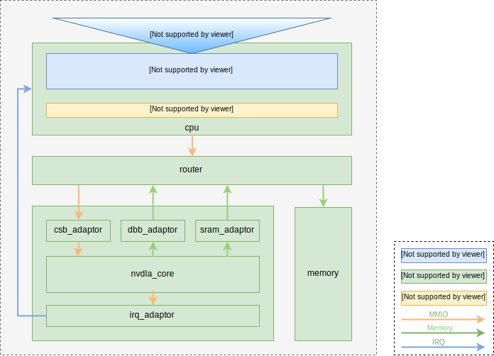

Virtual Platform
****************

Overview
========

The NVDLA virtual platform provides a register-accurate system on which software can be quickly developed and debugged. The virtual platform is based on GreenSocs QBOX_, a solution for co-simulation with QEMU and SystemC. :numref:`fig_vp_top` below shows the top level diagram of the NVDLA virtual simulator. A QEMU emulator of ARMv8 'virt' SoC board is included to provide high performance CPU emulation and generic devices. The emulator is wrapped inside a standard SystemC module with a set of TLM-2.0 interfaces to interact with other SystemC modules. 

.. _QBOX: https://git.greensocs.com/qemu/qbox

.. _fig_vp_top:

  NVDLA Virtual Platform.

Using the Virtual Simulator
===========================

It is recommended that you use the pre-built virtual simulator binary included in the docker_ image. The `Running the Virtual Simulator From Docker`_ section describes the detail. You are also welcome to build the virtual simulator from source code and use that.

.. _docker: https://hub.docker.com/r/nvdla

Building the Virtual Simulator
------------------------------

System Requirements
+++++++++++++++++++

It is recommended to build the virtual simulator in a system that meets the following requirements:

* OS: Ubuntu 14.04
* g++ 4.8.4
* git > 1.8.2
* systemc 2.3.0
* cmake > 2.8
* libboost > 1.34
* python dev
* glib2 dev
* pixman dev
* lua 5.2 dev
* swig
* libcap dev
* libattr1 dev

Several tools like Java and Perl are also required to build the NVDLA hardware tree. Please refer to :ref:`env_setup` for details.

Download the Virtual Simulator
++++++++++++++++++++++++++++++

The NVDLA virtual simulator source code can be downloaded from github_.

.. code-block:: console

   $ git clone https://github.com/nvdla/vp.git
   $ cd vp
   $ git submodule update --init --recursive

.. _github: https://github.com/nvdla/vp

Install Dependencies
++++++++++++++++++++

Install required tools and libraries:

.. code-block:: console

   $ sudo apt-get install g++ cmake libboost-dev python-dev libglib2.0-dev libpixman-1-dev liblua5.2-dev swig libcap-dev libattr1-dev

Download and install SystemC 2.3.0 (Please be noted that SystemC 2.3.1/2.3.2 is currently not supported):

.. code-block:: console

   $ wget -O systemc-2.3.0a.tar.gz http://www.accellera.org/images/downloads/standards/systemc/systemc-2.3.0a.tar.gz
   $ tar -xzvf systemc-2.3.0a.tar.gz
   $ cd systemc-2.3.0a
   $ sudo mkdir -p /usr/local/systemc-2.3.0/
   $ mkdir objdir
   $ cd objdir
   $ ../configure --prefix=/usr/local/systemc-2.3.0
   $ make
   $ sudo make install

Download and build NVDLA CMOD. Please refer to :ref:`tree_build` for details on building the NVDLA hardware tree, and make sure the required tools listed in :ref:`env_setup` are installed first.

.. code-block:: console

   $ git clone https://github.com/nvdla/hw.git
   $ cd hw
   $ make
   $ tools/bin/tmake -build cmod_top
 
The header files and library will be generated in *hw/outdir/<project>/cmod/release*.

Build and Install the Virtual Simulator
+++++++++++++++++++++++++++++++++++++++

Cmake build under the vp repository directory:

.. code-block:: console

   $ cmake -DCMAKE_INSTALL_PREFIX=[install dir] -DSYSTEMC_PREFIX=[systemc prefix] -DNVDLA_HW_PREFIX=[nvdla_hw prefix] -DNVDLA_HW_PROJECT=[nvdla_hw project name]

*install dir* is where you would like to install the virtual simulator, *systemc prefix* is the SystemC installation directory, *nvdla_hw prefix* is the local NVDLA HW repository, and *nvdla_hw project name* is the NVDLA HW project name. Example:

.. code-block:: console

   $ cmake -DCMAKE_INSTALL_PREFIX=build -DSYSTEMC_PREFIX=/usr/local/systemc-2.3.0/ -DNVDLA_HW_PREFIX=/usr/local/nvdla/hw -DNVDLA_HW_PROJECT=nv_full

Compile and install:

.. code-block:: console

   $ make
   $ make install

Running the Virtual Simulator
-----------------------------

Prepare Kernel Image
++++++++++++++++++++

A demo linux kernel image is provided in the github release. You can run this image in the virtual simulator, and run the NVDLA KMD/UMD inside it. 

If you would like to build a linux kernel on your own, please refer to `Building Linux Kernel for NVDLA Virtual Simulator`_.

After the image is ready, modify the *conf/aarch64_nvdla.lua* for the image and rootfs file location.

Standard QEMU Arguments
+++++++++++++++++++++++

The configuration of the virtual simulator is defined in *conf/aarch64_nvdla.lua*. You can change the standard QEMU arguments in *extra_arguments* inside the lua file. 

Running Kernel Image In the Virtual Simulator
+++++++++++++++++++++++++++++++++++++++++++++

Start the virtual simulator:

.. code-block:: console

   $ export SC_SIGNAL_WRITE_CHECK=DISABLE
   $ ./build/bin/aarch64_toplevel -c conf/aarch64_nvdla.lua
   Login the kernel. The demo image uses account 'root' and password 'nvdla'.

Some demo tests are provided in the *tests* directory, you can run them after login as root:

.. code-block:: console

   # mount -t 9p -o trans=virtio r /mnt
   # cd /mnt/tests/hello
   # ./aarch64_hello 

You should be able to see 'Hello World!' printed in the screen. You are now ready to try out the NVDLA software in the virtual simulator! Please refer to :doc:`sw/contents` for details.

If you want to exit the virtual simulator, press 'ctrl+a x'.

Running the Virtual Simulator From Docker
-----------------------------------------

.. code-block:: console

   $ docker pull nvdla/vp
   $ docker run -it -v /home:/home nvdla/vp
   $ cd /usr/local/nvdla
   $ aarch64_toplevel -c aarch64_nvdla.lua
   Login the kernel with account 'root' and password 'nvdla'

The NVDLA software is also provided in the docker image, please refer to :doc:`sw/contents` on how to run the NVDLA software.

Debugging the Virtual Simulator
-------------------------------

Before debugging the virtual simulator, you need to build the debug version of the simulator:

.. code-block:: console

   $ cmake -DCMAKE_INSTALL_PREFIX=[install dir] -DSYSTEMC_PREFIX=[systemc prefix] -DNVDLA_HW_PREFIX=[nvdla_hw prefix] -DNVDLA_HW_PROJECT=[nvdla_hw project name] -DCMAKE_BUILD_TYPE=Debug
   $ make
   $ make install

Log Output Control
++++++++++++++++++

The log output of SystemC simulator is controled by a configuration string that can be set in two ways:

* The command line option '-s *control_string*' or '--sc_log *control_string*'
* The environment variable 'export SC_LOG=\ *control_string*'

If both control strings are set, the simulator will pick the one set by environment variable *SC_LOG*.
 
The format of the control string is:

.. code-block:: console

   "outfile:<log_file>;verbosity_level:<info_level>;<msg_string>:<report_level>"
   <log_file>: log output file name
   <info_level>: info verbosity -- sc_none/sc_low/sc_medium/sc_high/sc_full/sc_debug
   <msg_string>: message string specified in sc_report.
   <report_level>: sc report level -- info/warning/error/fatal/enable/disable

Here are some useful control string examples:

.. code-block:: console

   export SC_LOG="outfile:sc.log;verbosity_level:sc_debug;csb_adaptor:enable" -- print the register access transaction from QEMU to NVDLA
   export SC_LOG="outfile:sc.log;verbosity_level:sc_debug;dbb_adaptor:enable;sram_adaptor:enable" -- print the memory access from NVDLA to external memory

You should be able to see logs like:

.. code-block:: console

   Info: nvdla.csb_adaptor: GP: iswrite=0 addr=0x300c len=4 data=0x 00000000 resp=TLM_OK_RESPONSE
   Info: nvdla.dbb_adaptor: GP: iswrite=1 addr=0xc0001e80 len=64 data=0x abcd01b0 abcd01b1 abcd01b2 abcd01b3 abcd01b4 abcd01b5 abcd01b6 abcd01b7 abcd01b8 abcd01b9 abcd01ba abcd01bb abcd01bc abcd01bd abcd01be abcd01bf resp=TLM_OK_RESPONSE
 
GDB
+++
You can also use GDB to debug the virtual simulator. First run the simulator, then get the PID of the process and use GDB to attach to it.

.. code-block:: console

   $ ps -ef | grep aarch64_toplevel
   $ gdb attach <PID>

Building Linux Kernel for NVDLA Virtual Simulator
=================================================

The NVDLA virtual platform is based on QEMU aarch64 virt machine, so building a linux kernel is the same as building one for QEMU aarch64 virt machine. Here's an example of using buildroot to build a linux kernel for NVDLA virtual platform.

Download
--------
Download the buildroot from https://buildroot.org/download.html. This example uses the version buildroot-2017.11-rc1.

Configure
---------

Use *qemu_aarch64_virt_defconfig* as base config, then set the customized configurations:

.. code-block:: console

   $ make qemu_aarch64_virt_defconfig
   $ make menuconfig
   * Target Options -> Target Architecture -> AArch64 (little endian)
   * Target Options -> Target Architecture Variant -> cortex-A57
   * Toolchain -> Custom kernel headers series -> 4.13.x
   * Toolchain -> Toolchain type -> External toolchain
   * Toolchain -> Toolchain -> Linaro AArch64 2017.08
   * Toolchain -> Toolchain origin -> Toolchain to be downloaded and installed
   * Kernel -> () Kernel version -> 4.13.3
   * Kernel -> Kernel configuration -> Use the architecture default configuration
   * System configuration -> Enable root login with password -> Y
   * System configuration -> Root password -> nvdla
   * Target Packages -> Show packages that are also provided by busybox -> Y
   * Target Packages -> Networking applications -> openssh -> Y

Build
-----

.. code-block:: console

   $ make -j4

When it's done, you can find the kernel image and rootfs in *output/image*.
